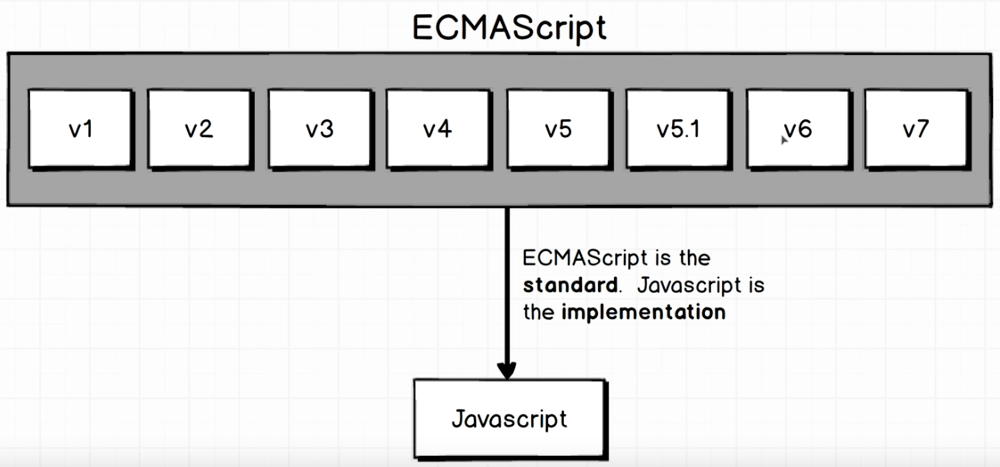
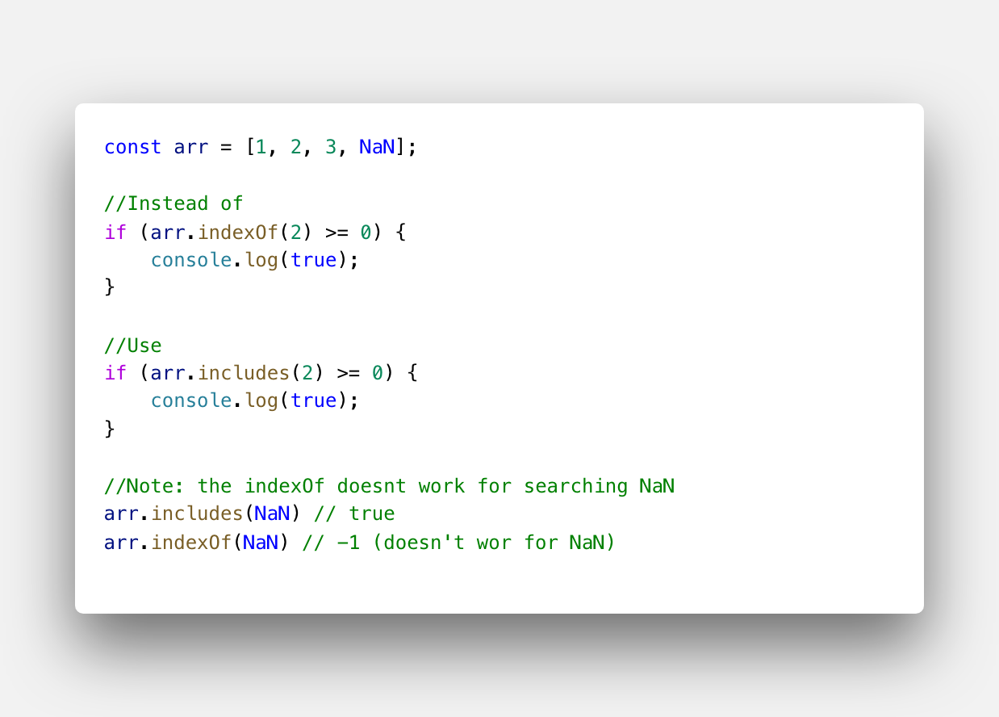
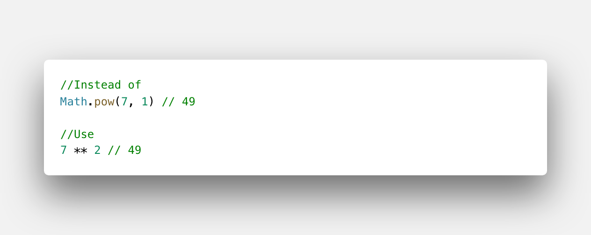

# Pengenalan Modern JS

## Apa Itu ES6

_EcmaScript6_ atau ES6 adalah topik perbincangan yang selalu hangat di kalangan _programmer_ JS kebanyakan dan banyak _programmer_ bingung dari mana harus memulai belajar ES6 dengan mudah karena banyak sekali bertebaran tutorial dan reading tentang ES6 di internet, apalagi mengingat pentingnya belajar ES6 ini. Tenang saja, kalian memilih tempat belajar yang tepat!

ES6 adalah sebuah singkatan dari _ECMAScript versi 6_. ES6 release pada tahun 2015, jadi ES6 sama ES 2015 sama aja ya. Lalu apa itu ECMAScript? ECMAScript adalah sebuah standarisasi scripting language _Javascript_ yang dibuat oleh _European Computer Manufacturers Association (ECMA)_. Bahasa gampangnya ECMAScript itu standarnya, _Javascript_ itu implementasinya.



Jadi apa ya bedanya _javascript_ dengan ES6? Bedanya terletak pada:

1. Sintaks dan fiturnya
2. Urusan _class, module, object_ dan _array_ serta manipulasinya

### Fitur pada ES6

1. _Array.prototype.includes_

   _Includes_ adalah *instance method* di sebuah Array untuk membantu mencari **apakah sebuah item ada di dalam Array tersebut (termasuk NaN seperti *method* `indexOf`)**.

   

2. _Exponentiation infix operator_

   Operasi matematika seperti penjumlahan dan pengurangan memiliki operator infix yaitu + (tambah), - (kurang), dsb. Sama seperti ke dua operator tersebut, operator infix **juga sering dipakai untuk melakukan operasi pangkat. Di ECMAScript 2016,** pangkat yang tadinya menggunakan ** (bintang 2x) diganti menjadi **math.pow** seperti di bawah.

   

Fitur-fitur lain yang ditambahkan oleh *standard* ini diantaranya:

1. arrows
2. classes
3. enhanced object literals
4. template strings
5. destructuring
6. default + rest + spread
7. let + const
8. iterators + for..of
9. generators
10. unicode
11. modules
12. module loaders
13. map + set + weakmap + weakset
14. proxies
15. symbols
16. subclassable built-ins
17. promises
18. math + number + string + array + object APIs
19. binary and octal literals
20. reflect api
21. tail calls

ES6 bisa dibilang merupakan tonggak bagi dunia JS. Karena begitu banyak fitur-fitur bagus yang ditambahkan oleh standard ini. Diantaranya adalah *class*. Sebuah fitur yang dinanti oleh banyak programmer.

Sebelum ES6 kita tentu membuat *class* dengan menggunakan *prototype*. Bentuknya sangat tidak “rapi” dan sulit dikenali sebagai *class*. Ini contoh ketika kita membuat *class* dengan menggunakan *Javascript*:

```js
function Orang(nama, umur){
    this.nama = nama;
    this.umur = umur;
}

var dega = new Orang('Dega', '23');
```

lalu lihat lah kode di bawah ini bagaimana ES6 dapat membuat *class* yang layaknya kita lakukan pada bahasa pemrograman lainnya seperti java, yang sangat mudah dikenali.

```js
class Orang {
    constructor(nama, umur){
        this.nama = nama;
        this.umur = umur;
    }
}

var dega = new Orang('dega', '23');
```

### Browser-browser apakah yang mendukung ES6

Jadi, kita sudah tau, bahwa JS itu adalah implementasi dari suatu standard yang diberi nama _EcmaScript (ES)_ dan dikeluarkan oleh sebuah _committee Ecma TC39_.

*Browser-browser* yang sudah mendukung ES6 pada saat tulisan ini dibuat diantaranya adalah:

1. iOS 10 dan Safari 10 **mendukung 100% ES6**
2. Chrome v55 **mendukung 97% ES6**
3. Microsoft Edge **mendukung 95% ES6**
4. Firefox v50 **mendukung 92% ES6**

Mungkin saat ini adalah saat yang tepat bagi kita untuk mengadopsi fitur-fitur baru dari JS karena kedepannya akan semakin banyak JS *Engine* yang mengimplementasikan standard-standard tersebut.
