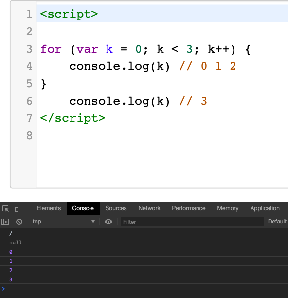
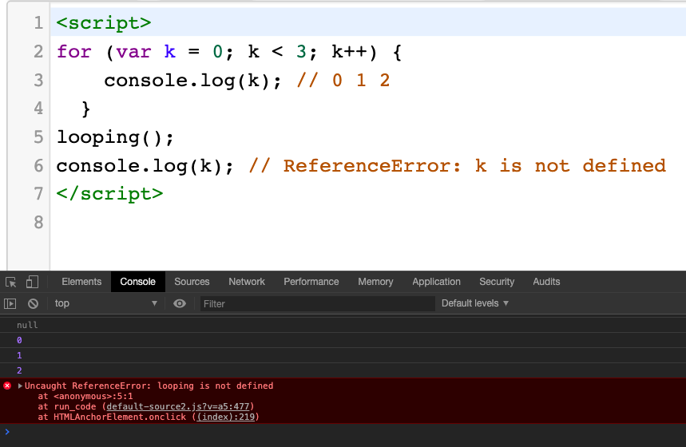
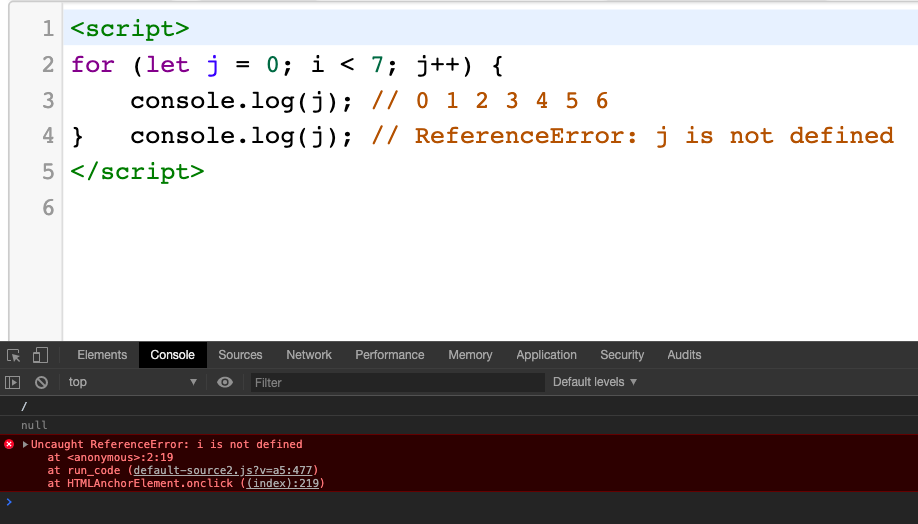

# Pengenalan Variabel

## Variabel

Secara sederhana, **variabel adalah “penampung”** dari sebuah data. Disebut variabel karena data yang kita simpan bisa berubah-ubah sepanjang kode program (isinya tidak tetap). Agar bisa diakses, setiap variabel harus memiliki “nama”.

Di dalam *Javascript* kita tidak perlu mendeklarasikan jenis tipe data. Seluruh Variabel di dalam *Javascript* dapat berisi nilai apapun (tipe data apapun), dan dapat diubah menjadi tipe lain sepanjang program. Untuk mendeklrasikan sebuah Variabel ada 3 cara yaitu menggunakan const, let, dan var.

### Aturan Penamaan Variabel (Identifier)

Nama variabel di dalam *Javascript* harus mengikuti aturan dari identifier. Identifier adalah sebutan untuk nama dari sesuatu di dalam sebuah bahasa pemrograman (tidak hanya *Javascript* saja).
Seperti yang sudah dipraktekkan, kita bisa memberi nama apa saja untuk variabel, apakah itu angka, foo, bar, andi, atau username. Selain variabel, kita juga bebas untuk membuat nama konstanta, *function*, maupun object. Semua inilah yang termasuk kedalam kelompok identifier.
Identifier di dalam *Javascript* memiliki aturan sebagai berikut:

1. Bisa terdiri dari huruf, angka, garisbawah “\_” (underscore), dan tanda dollar“\$“ (dollar sign).
   Selain itu, dianggap sebagai karakter ilegal (tidak boleh digunakan)
2. Karakter pertama dari identifier tidak boleh berupa angka. Angka hanya bisa digunakan sebagai karakter kedua dan seterusnya.
3. Bersifat case sensitive, dimana huruf besar dan kecil dianggap berbeda.
4. Harus selain dari reserved keyword, yakni kata khusus yang berfungsi sebagai perintah di dalam pemrograman JavaScript, seperti _var_, _while_, _function_, dll.

Karena variabel juga termasuk ke dalam identifier, nama variabel harus mengikuti aturan-aturan diatas.

Berikut contoh penulisan **variabel yang salah**:

```js
1. var 9naga; // diawali dengan angka
2. var satu-satu; // terdapat karakter "-"
3. var satu satu; // terdapat spasi
4. var satu%lima; // terdapat karakter "%"
5. var continue; // merupakan reserved keyword
```

Berikut contoh penulisan **variabel yang benar**:

```js
1. var aa123;
2. var belajar_bahasa_javascript;
3. var jumlahTotal;
4. var \$box;
5. var \_begin;
```

### Let dan Var

Fungsi dari _let_ dan _var_ sebenarnya sama untuk mendeklarasikan variabel yang nilainya dapat diubah. Namun perbedaanya adalah _var_ mempunyai cakupan dalam sebuah fungsi (*function* scope) dan let mempunyai cakupan dalam sebuah block (block scope). Bingung apa maksudnya? oke saya akan memberikan sebuah contoh melalui kode.

```js
var (function scope)

for (var k = 0; k < 3; k++) {
    console.log(k) // 0 1 2
}
    console.log(k) // 3
```

jika kode tersebut dijalankan maka hasilnya adalah seperti ini:



```js
function looping() {
  for (var k = 0; k < 3; k++) {
    console.log(k); // 0 1 2
  }
looping();
console.log(k); // ReferenceError: k is not defined
```

Jika kode tersebut dijalankan maka hasilnya adalah:



program tersebut menghasilkan ReferenceError: k is not defined.

Kenapa? karena variabel k di deklarasikan menggunakan var di dalam *function* looping(). Sedangkan pada baris 7 kita memanggi variabel k di luar *function* looping(). Hal ini menunjukan jika var berjalan pada cakupan *function* (*function* scope).

```js
let (block scope)

for (let j = 0; i < 7; j++) {
    console.log(j); // 0 1 2 3 4 5 6
}   console.log(j); // ReferenceError: j is not defined
```

Jika kode tersebut dijalankan maka hasilnya adalah :

**ReferenceError: i is not defined.**



kenapa? karena batas sebuah _block_ adalah sebuah kurung kurawal { *some code here* }. Jika kalian lihat pada kode terdapat _block_ scope (baris 1–3). variabel i dideklarasikan menggunakan _let_ di dalam _block scope_ tersebut, namun variabel i dipanggil dari luar _block scope_ (baris 4).

```js
for (let j = 0; j < 7; j++) {
  console.log(j); // 0 1 2 3 4 5 6
}
if (true) {
  let j = "100";
  console.log("j = ", j); // j = 100
}
```

Jika kode tersebut dijalankan maka hasilnya adalah 0, 1, 2, 3, 4, 5, 6, j = 100


Hal ini dikarenakan variabel yang dideklarasikan menggunakan _let_ dipanggil dalam block scope masing-masing. Terdapat dua block scope pada baris 1–3 dan baris 4–7.

### Perbedaan Var dan Let

Variabel yang dideklarasikan menggunakan _let_ hanya dapat dipanggil dalam sebuah block scope yang sama. Sebuah block scope dapat ditandai dengan sebuah kurung kurawal { ….. *some code here* ….. }

## Const (variabel konstanta)

Sifat _const_ sama seperti _let_, namun perbedaanya variabel yang dideklarasikan menggunakan _const_ tidak dapat diubah nilainya atau **immutable variables**.

```js
const phi = 3.14;
phi = 3.147;

console.log(phi);
```

Jika kode **const-1.js** dijalankan maka akan mengeluarkan output **_error TypeError : Assignment to constant variable_**. Ini menandakan sebuah variabel yang dideklarasikan menggunakan const nilainya tidak dapat diubah atau di-reassign.

## Arrow Function (=>)

**Arrow fungsi juga disebut “Fat Arrow”** adalah sintaksis yang dapat menyederhanakan kode dan menulis ekspresi fungsi. _Arrow Function_ disimbolkan dengan **=>**. _Arrow Function_ bersifat anonim dan mengubah cara mengikat sebuah fungsi

_Arrow Function_ dapat membuat kode kita menjadi lebih ringkas dan menyederhanakan lingkup fungsi.

```js
//contoh 1
const func1 = function(a, b) {
  return a + b;
};
console.log(func1(3, 3)); //6

//contoh 2
const func2 = (a, b) => {
  return a + b;
};
console.log(func2(3, 3)); //6

//contoh 3
const func3 = (a, b) => a + b;
console.log(func3(3, 3)); //6

//contoh 4
const func4 = dobel => dobel + dobel;
console.log(func4(5)); //10

//contoh 5
const func5 = dobel => dobel + dobel;
console.log(func5(5)); //10

//contoh 6
const numbers = [1, 2, 3, 4, 5];
const kalidua1 = numbers.map(function(number) {
  return 2 * number;
});
console.log(kalidua1); //[ 2, 4, 6, 8, 10 ]

//contoh 7
const kalidua2 = numbers.map(number => 2 * number);
console.log(kalidua2); //[ 2, 4, 6, 8, 10 ]
```

Gimana bisa kalian lihat kan? perbedaan tulisan pada contoh kode 1–3. Namun outputan dari ketiga potongan kode tersebut adalah sama. Perbedaan dari contoh kode 1 dan contoh kode 2 hanyalah dipenulisan yaitu menghilangkan kata _function_ sebelum paramater dan menambahkan => setelah parameter. Begitu juga perbedaan dari contoh kode 2 dan kode 3, karena pada body fungsi tersebut hanya mempunyai single *javascript expressio*n maka kita dapat menghilangkan kata return dan kurung kurawalnya.

Sedangkan pada contoh kode 4 dan 5, karena _function_ tersebut hanya mempunyai satu argument maka kita dapat menghilangkan kurung buka dan tutupnya. Bagaimana dengan contoh kode 6 dan 7? buat yang belum paham dengan _array helper_ mungkin akan merasa bingung.
