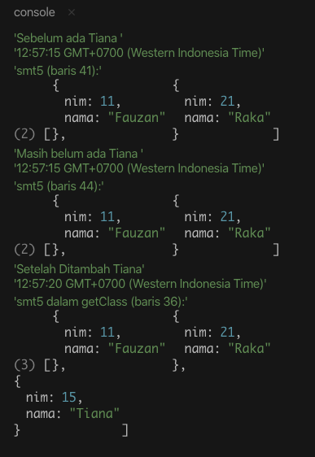

# Callback, Promise, Async / Await

Di *Javascript*, ada 2 macam operasi yaitu operasi yang _synchronous_ dan _asynchronous_.

- Definisi _synchronous_ adalah sebuah operasi akan dijalankan setelah operasi sebelumnya selesai dijalankan alias berurutan.

- Sedangkan _asynchronous_ sebaliknya, _asynchronous_ tidak perlu menunggu operasi sebelumnya selesai untuk mengeksekusi operasi setelahnya.

Sebagian besar eksekusi di *Javascript* itu _synchronous_, namun beberapa operasi seperti akses ke *database*, akses ke *file*, atau melakukan ***AJAX call*** adalah operasi yang _asynchronous_.

```js
const fs = require('fs');

let content;
fs.readFile('text.txt', 'utf-8', (err, data) => {
  if (err) {
    throw new Error('Error in reading source');
  }

  content = data;
});

console.log(content);
```

Pada contoh di atas, kita melakukan akses membaca *file* yang merupakan operasi yang _asynchronous_, **sehingga ketika *compiler* mulai membaca *file*, *compiler* tidak menunggu sampai *file* itu selesai dibaca, melainkan langsung mengeksekusi kode setelahnya**. Sehingga `console.log(content);` akan mengembalikan nilai `undefined` karena pada saat *file* `text.txt` mulai dibaca, *Javascript* langsung mengeksekusi `console.log(content);` yang pada saat itu nilainya memang masih `undefined`. Ketika `content = data;` selesai dilakukan, *compiler* menganggap semua baris kode sudah selesai dieksekusi, sehingga tidak melakukan apapun lagi.

Lalu bagaimana cara kita meng-*handle* hasil dari operasi yang _asynchronous_ tersebut? Pada saat *Javascript* masih dikenal sebagai *script* untuk *frontend*, kita mengenal *event* seperti `onload`, `onclick` , `onhover` dan sebagainya. Namun ketika kita menggunakan *Javascript* di sisi *backend*, tentu penggunaan *event* tidak efektif karena kita harus mendefinisikan *event* untuk tiap-tiap operasi yang _asynchronous_. Pada saat *Javascript* digunakan untuk *server side language*, ada beberapa cara bagi *Javascript* untuk meng-*handle* `return value` dari operasi yang _asynchronous_ tersebut. Kita dapat menggunakan **callback, promise, dan async/await**.

## Callback

*Callback function* atau *callback* adalah salah satu metode yang paling umum yang digunakan untuk meng-*handle* `return value` dari operasi *asynchoronous*.

> Konsep *callback* dapat dianalogikan seperti kita memanggil penjual untuk membeli sesuatu dan sembari menunggu penjual mempersiapkan barangnya, kita pergi melakukan hal lain. Lalu, ketika barangnya sudah siap, penjual akan **memanggil balik** *(callback)* untuk memberitahu kita bahwa barang sudah siap dan kita dapat menentukan tindakan selanjutnya dari pembelian barang tadi.

*Callback* sendiri adalah sebuah *regular function* (yang biasanya *anonymous*) dan ditaruh di argumen paling belakang dari sebuah *asynchronous function*. Layaknya *function* biasa, *callback* juga dapat menerima parameter dan mengembalikan *value*.

Penggunaan *callback* pada *Javascript* ini terutama jika berkaitan dengan *function* yang *asynchronous* misalnya `setTimeout` contohnya seperti sintaks di bawah ini:

```js
let smt5 = [
  { nim: 11, nama: "Fauzan" },
  { nim: 21, nama: "Raka" }
];

function getNow() {
  d = new Date();
  return d.toTimeString();
}

function tambahMhs(mahasiswa, callback) {
  setTimeout(function() {
    smt5.push(mahasiswa);
    console.log("Setelah Ditambah Tiana", getNow());
    callback();
  }, 5000);
}

function getSmt() {
  console.log("smt5 dalam getClass (baris 36):", smt5);
  //return smt5;
}

console.log("Sebelum ada Tiana ", getNow());
console.log("smt5 (baris 41):", smt5);

tambahMhs({ nim: 15, nama: "Tiana" }, getSmt);

console.log("Masih belum ada Tiana ", getNow());
console.log("smt5 (baris 44):", smt5);
```

Hasilnya adalah:



## Promise

Setelah kita belajar mengenai `callback` pada *Javascript* sekarang kita belajar `Promise` pada *Javascript*. `Promise` ini merupakan pengembangan lebih lanjut dari `callback`, di mana pada `Promise` ini ada dua buah `callback` yaitu ***resolve* dan *reject***. Pemanggil akan memberikan informasi kepada `Promise` mengenai *function* apa yang harus dijalankan jika ternyata `Promise` memberikan hasil yang valid. Pemanggil juga memberikan informasi mengenai *function* apa yang harus dijalankan jika `Promise` menyatakan ada ketidakberesan.

`Promise` hadir secara *native* di *Javascript* semenjak ES6. `Promise`, seperti namanya merupakan janji atau kontrak.

> Analoginya sama seperti pembelian barang tadi, bedanya adalah pembeli sudah menyiapkan kontrak yang berlaku apabila barang sudah siap. Kontrak tersebut berisi ketentuan yang yang mengatur apa yang harus dilakukan apabila kondisi terpenuhi *(resolved)* atau tertolak *(rejected)*.

Contoh, fungsi pembagian yang memberikan informasi *function* `berhasil()` harus dijalankan jika *resolve*, dan *function* `gagal()` harus dijalankan jika terjadi *reject*. Sintaks nya adalah seperti berikut ini:

```js
function bagi(x, y) {
  return new Promise(function(resolve, reject) {
    if (y != 2) {
      let hasil = x / y;
      let kembali = { x: x, y: y, hasil: hasil };
      resolve(kembali);
    } else {
      let alasan = "Gak boleh dibagi dengan 2";
      reject(alasan);
    }
  });
}

function berhasil(objhasil) {
  let x = objhasil.x;
  let y = objhasil.y;
  let hasil = objhasil.hasil;
  console.log("Ternyata ", x, " dibagi ", y, " hasilnya ", hasil);
}

function gagal(alasan) {
  console.log(alasan);
}

bagi(20, 4)
  .then(berhasil)
  .catch(gagal);
bagi(5, 3)
  .then(berhasil)
  .catch(gagal);
```

Hasilnya adalah:


## Async / Await

Pembelajaran *Javascript* kita saat ini adalah penggunaan `async` dan `await` untuk penanganan `Promise`. Secara sederhana kita mengerti adanya proses asinkron pada async dan tunggu pada *await*. Kita akan menggunakan sintaks `promise`, karena memang `async` dan `await` ini berhubungan dengan `Promise`.

Contoh *source code* `async` dan `await` adalah:

```js
function opBagi(x, y) {
  return x / y;
}

async function bagi(x, y) {
  if (y != 0) {
    let hasil = await opBagi(x, y);
    let kembali = { x: x, y: y, hasil: hasil };
    return kembali;
  } else {
    let alasan = "Jangan 0, cari angka yang lain";
    await Promise.reject(alasan);
  }
}

function berhasil(objhasil) {
  let x = objhasil.x;
  let y = objhasil.y;
  let hasil = objhasil.hasil;
  console.log("Ternyata ", x, " dibagi ", y, " hasilnya ", hasil);
}

function gagal(alasan) {
  console.log(alasan);
}

bagi(20, 5)
  .then(berhasil)
  .catch(gagal);
bagi(7, 0)
  .then(berhasil)
  .catch(gagal);
```

Hasilnya adalah:


