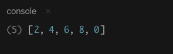

# Map, Reduce, dan Filter

Pada tahun 2011, *Javascript* memperkenalkan beberapa fitur yang di ambil dari _functional programming_ yaitu _map_, _reduce_, dan _filter_ sebagai alternatif dalam merubah elemen di dalam _array_, mencari akumulasi nilai, atau membuat *array* baru berdasarkan kondisi yang sudah ditetapkan. Metode ini cukup membantu _software developer_ menulis kode yang lebih sim*ple dan juga membuat kode lebih mudah dibaca.

## map()

`map` biasa digunakan untuk merubah semua elemen di dalam suatu _array_ menjadi elemen dengan nilai yang baru. Ini didefinisikan pada `Array.prototype`, sehingga kita dapat menggunakannya di _array_ apapun, dan ia menerima *callback* sebagai parameter pertamanya.

Ketika kita memanggil `map` pada suatu _array_, ia akan menjalankan *callback* tersebut pada setiap elemen di dalamnya, mengembalikan sebuah _array_ baru dengan semua nilai yang dikembalikan oleh *callback*.

Struktur dasar `map()`:

```js
array.map((element, index, array) => {
  ...
}, thisparametert);
```

Parameter:

1. _Element_ (nilai atau item)
2. _Index_ (index dari tiap lintasan, dari kiri ke kanan ( 0 ke N ))
3. *Array* yang mau kita *filter*
4. _thisparametert_ (opsional, objek yang akan diarahkan sebagai `this` di dalam fungsi *callback*)

Contoh: Mengalikan semua bilang dengan angka 10, menggunakan *arrow function*.

```js
var bilangan = [1, 2, 3, 4, 5];

var hasil = bilangan.map(element => {
  return element * 10;
});

console.log(hasil);
```

Hasilnya adalah:


> `map()` melintasi *array* dari kiri ke kanan dan memanggil fungsi *callback* ke setiap elemen. Setelah semua elemen berhasil dilintasi, fungsi `map()` mengembalikan *array* baru dengan elemen-elemen yang baru.

## filter()

Selanjutnya dari operasi *array* kita adalah `filter`. `filter` biasanya **dibutuhkan suatu *array* untuk menyaring elemen yang tidak diinginkan**.

Seperti `map`, `filter` didefinisikan pada `Array.prototype`. Ini tersedia di berbagai *array*, dan kita memberikannya *callback* sebagai parameter pertama. `filter` mengeksekusi *callback* itu pada setiap elemen dari *array*, dan memunculkan *array* baru yang hanya berisi elemen-elemen di mana *callback* itu mengembalikan nilai **true** (jika sesuai dengan kriteria yaitu bernilai *true*, maka item tersebut ditampilkan).

Struktur data `filter()`:

```js
array.filter((element, index, array) => {
  ...
});
```

`filter` menggunakan tiga parameter sama seperti `map`:

1. _Element_ (nilai atau item)
2. _Index_ (index dari tiap lintasan, dari kiri ke kanan ( 0 ke N ))
3. *Array* yang mau kita *filter*

Contohnya kita akan mengambil hanya angka genap saja dari *array* yang kita buat, sintaksnya sebagai berikut:

```js
let array = [1, 2, 3, 4, 5, 6, 7, 8, 9, 0];

var arrayBaru = array.filter(element => {
  return element % 2 === 0;
});

console.log(arrayBaru);
```

Hasilnya adalah:



> `filter()` mirip seperti `map()`, fungsi ini melintasi *array* dari kiri ke kanan dan memanggil fungsi *callback* ke setiap elemen. Setelah semua elemen dilintasi, `filter()` akan mengembalikan *array* baru dengan semua elemen yang sesuai dengan kondisi saja atau bernilai *true*, dalam kasus ini mengembalikan nilai genap saja.

## reduce()

`map` membuat *array* baru dengan mengubah setiap elemen dalam *array*, secara terpisah. `filter` membuat *array* baru dengan menghilangkan elemen yang bukan miliknya. Sedangkan `reduce`, di sisi lain, **mengambil semua elemen dalam *array*, dan merangkumnya menjadi satu nilai saat dikembalikan**.

Sama seperti `map` dan `filter`, `reduce` didefinisikan pada `Array.prototype` dan tersedia di *array* apa pun. Seperti biasa `reduce` menggunakan *callback* sebagai parameter pertama. Tetapi `reduce` juga bisa menggunakan parameter ke dua yang opsional, yaitu nilai untuk menggabungkan semua elemen *array* ke dalamnya.

Akhirnya, ingatlah bahwa **`reduce` mengembalikan nilai tunggal, bukan *array* yang berisi satu item.** ini penting, dan kita akan kembali ke contohnya.

Struktur `reduce()`:

```js
array.reduce((total, currentValue, currentIndex, array) => {
  ...
}, initialValue);
```

Parameter :

1. `total` (nilai yang di akumulasikan pada tiap *callback*)
2. `currentValue` (nilai dari element sekarang)
3. `currentIndex` (indeks dari tiap lintasan, dari kiri ke kanan ( 0 ke N ), sifatnya opsional)
4. `array` (*array* semula yang memanggil fungsi ini, sifatnya opsional)
5. `initialValue` (opsional, nilai yang digunakan sebagai penanda di *callback* yang pertama (indeks 0) )

Biar lebih jelas kita lihat pada contoh.

Contoh: Kita akan menjumlahkan semua *key* jumlah Mahasiswa Ilmu Komputer sebuah Universitas dari tiap jurusan pada tahun 2019:

```js
var fasilkom = [
  { jurusan: "Teknik-Informatika", jumlah: 397 },
  { jurusan: "Sistem-Infomasi", jumlah: 419 },
  { jurusan: "Teknik-Komputer", jumlah: 186 }
];

var sum = fasilkom.reduce((total, currentValue) => {
  return total + currentValue.jumlah;
}, 0);

console.log(sum);
```

Hasilnya adalah:


