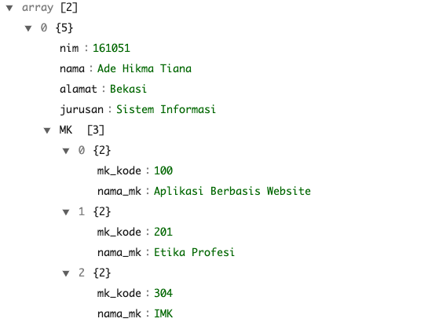

# AJAX

## Pengertian AJAX

**AJAX** adalah singkatan dari ***Asynchronous *Javascript* And XML***. Diberi nama seperti itu, karena pada awalnya AJAX digunakan untuk mengirim dan menerima data XML dari *web server*. Sekarang, data yang dikirim tidak hanya XML saja, tapi juga bisa berupa *file* teks maupun **JSON** (_*Javascript* Object Notation_).

Secara sederhana, AJAX digunakan untuk membuat HTML dan *Javascript* bisa berkomunikasi dengan *web server*, tanpa harus *reload* atau *refresh* *browser*.

Saat mengetik beberapa huruf di google, akan keluar saran pencarian (_search suggestion_). Data ini berasal dari *database* google dan ditampilkan menggunakan AJAX. Situs *modern* seperti Dropbox, Facebook, dan Twitter juga banyak menggunakan AJAX.

AJAX membuka banyak hal yang sebelumnya tidak bisa dilakukan. *Online word precessor* seperti **Google Doc** atau peta interaktif seperti **Google Map** juga contoh *website* yang secara penuh menggunakan AJAX.

## XMLHttpRequest Object

Untuk membuat AJAX, kita menggunakan **XMLHttpRequest** *Object*. *Object* ini merupakan bagian dari **DOM** *(Document Object Model)*, dan sudah didukung oleh mayoritas *web browser* modern.

Agar bisa menggunakan **XMLHttpRequest Object**, kita harus membuat _instance_ dari *object* ini:

```js
let request = new XMLHttpRequest();
```

Variabel request berisi instance dari **XMLHttpRequest Object**. Kita boleh menggunakan nama variabel lain, tidak harus bernama `request`. Sebagaimana layaknya *object* di dalam *Javascript*, **XMLHttpRequest Object** memiliki berbagai _method_ dan _property_.

Selanjutnya, kita perlu memanggil *method* `XMLHttpRequest.open()` untuk membuat pengaturan bagaimana cara meminta data ke *web server*.

*Method* `XMLHttpRequest.open()` membutuhkan 3 buah parameter:

- **Parameter pertama:** mengatur cara mengirim data ke *web server*, apakah menggunakan metode "GET" atau "POST". Makna GET dan POST ini sama seperti cara mengirim form HTML ke *web server*.
- **Parameter kedua**: berisi alamat *file* yang akan memproses data di *web server*. Ini sama seperti isi atribut *action* di dalam tag `<form>` HTML.
- **Parameter ketiga:** berisi *boolean true* atau *false*. Jika diset sebagai *true*, data akan dikirim secara *asynchronous* (pilihan *default*). Jika di set sebagai *false*, data akan dikirim secara *synchronous*.

## Parsing Data JSON

```js
JSON.parse();
```

*Method* ini digunakan untuk mem-*parse* (_parse_ = mengurai) string JSON dan mengubah nya menjadi *Javascript object*, hasilnya bisa berupa objek dengan tipe data objek maupun tipe data array (dalam *Javascript* tipe data array juga berbentuk objek,  misal: `var arr = new Array;`

```js
JSON.parse(text[, reviver]);
```

Contoh:

```js
[
  {
    nim: "161051",
    nama: "Ade Hikma Tiana",
    alamat: "Bekasi",
    jurusan: "Sistem Informasi",
    MK: [
      {
        mk_kode: "100",
        nama_mk: "Aplikasi Berbasis Website"
      },
      {
        mk_kode: "201",
        nama_mk: "Etika Profesi"
      },
      {
        mk_kode: "304",
        nama_mk: "IMK"
      }
    ]
  },
  {
    nim: "131056",
    nama: "Fauzan Affan",
    alamat: "Jakarta",
    jurusan: "Sistem Informasi",
    MK: [
      {
        mk_kode: "303",
        nama_mk: "ETIKA PROFESI"
      },
      {
        mk_kode: "304",
        nama_mk: "REKAYASA WEB"
      },
      {
        mk_kode: "305",
        nama_mk: "AUDIT SISTEM INFORMASI"
      }
    ]
  }
];
```

Akses data JSON dengan menggunakan **XMLHttpRequest**

Hasilnya seperti ini:




