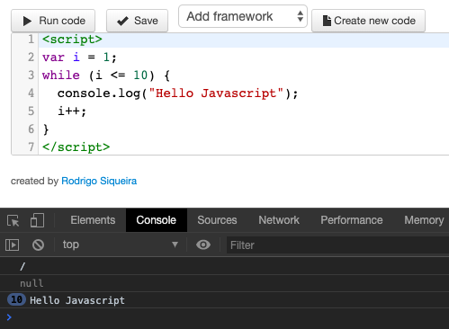
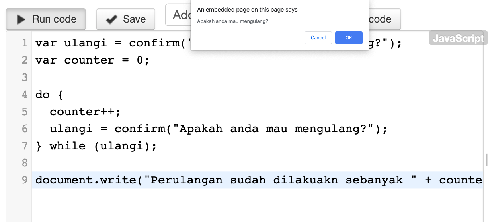
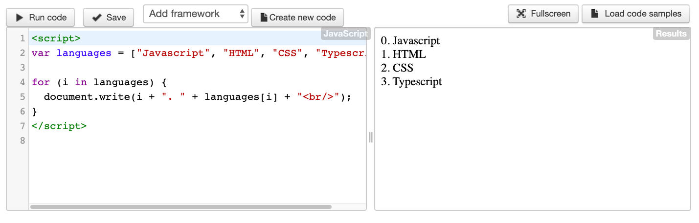

# Pengenalan Perulangan di Javascript

**Perulangan** atau dalam bahasa inggris disebut sebagai **looping**, adalah struktur kode program yang digunakan untuk mengulang beberapa baris perintah. Dengan menggunakan perulangan, sangat memudahkan kita dalam menjalankan perintah yang sama secara terus menerus.

Ada **lima macam** bentuk perulangan di _Javascript_. Secara umum, perulangan ini dibagi dua, Yaitu:

1. **Counted loop**

   ***Counted Loop*** **merupakan perulangan yang jelas dan sudah tentu banyak perulangannya**. Perulangan yang termasuk dalam Counted Loop:

   - Perulangan For
   - Perulangan Foreach
   - Perulangan Repeat

2. **Uncounted loop**

   **Uncounted Loop**, **merupakan perulangan yang tidak jelas berapa kali ia harus mengulang**. Perulangan yang termasuk dalam Uncounted Loop:

   - Perulangan While
   - Perulangan Do While

Untuk pembahasan nya, mari kita bahas satu-persatu :

## Perulangan For di Javascript

Perulangan for merupakan perulangan yang termasuk dalam *couted loop*, karena sudah jelas berapa kali ia akan mengulang.

Berikut format dasar perulangan **for** dalam _Javascript_:

```js
for (start; condition; increment) {
  statement;
}
```

- **Start** diisi dengan kondisi awal dari perulangan. Biasanya kita mendefinisikan sebuah variabel counter yang berfungsi untuk mengontrol perulangan.

  Sebagai contohnya, kita bisa menuis `var i = 1`. variabel disini berperan sebagai **variabel counter** namanya.

- **Condition** biasanya diisi dengan operasi perbandingan, selama operasi ini menghasilkan **nilai true**, perulangan akan dijalankan terus.

  Sebagai contoh nya, jika kita menulis `i < 10`, artinya perulangan akan terus dijalankan selama nilai variabel `i` kurang dari `10` atau sama dengan `9`.

- **Increment** diisi dengan instruksi untuk menaikkan nilai *variabel counter*. Dalam setiap perulangan, baris ini akan dieksekusi.

  Sebagai contohnya, kita bisa membuat `i++` , yang artinya nilai variabel `i` akan naik 1 angka dalam setiap perulangan.

Mari kita lihat contoh prakteknya:

```js
for (var i = 1; i < 10; i++) {
  console.log("Hello Javascript");
}
```

Hasilnya adalah:


Pada hasil di console di atas, kita bisa melihat `9 Hello Javascript`, artinya kalimat Hello Javascript diulang sebanyak 9x.

## Perulangan While di Javascript

Perulangan ke dua yang akan kita bahas adalah **while**. Perulangan ini mirip seperti perulangan **for**, tapi dengan memecah bagian **start, condition,** dan **increment**.

Berikut format dasar perulangan **while** di Javascript:

```js
counter_variabel;
while (condition) {
  statement;
  increment;
}
```

Langsung saja kita lihat contohnya:

```js
var i = 1;
while (i <= 10) {
  console.log("Hello Javascript");
  i++;
}
```

Hasilnya adalah:


Di sini kita membuat perulangan **while** sebanyak 10 kali, dimulai dari `i = 1`, sampai dengan `i <= 10`. Setiap perulangan di-_increment_ sebanyak 1 angka (`i++`). Hasilnya "Hello Javascript" tampil sebanyak 10 kali.

## Perulangan Do While di Javascript

Perulangan do while sama seperti perulangan while.

**Perbedaanya**:

Perulangan do while akan melakukan perulangan sebanyak 1 kali terlebih dahulu, lalu mengecek kondisi yang ada di dalam kurung while.

Bentuknya seperti ini:

```js
do {
  // blok kode yang akan diulang
} while (kondisi);
```

> Perulangan do while akan mengecek kondisi di belakang (sesudah mengulang), sedangkan while akan mencek kondisi di depan atau awal (sebelum mengulang)

Langsung saja kita lihat contohnya pada program ini:

```js
var ulangi = confirm("Apakah anda mau mengulang?");
var counter = 0;

do {
  counter++;
  ulangi = confirm("Apakah anda mau mengulang?");
} while (ulangi);

document.write("Perulangan sudah dilakuakn sebanyak " + counter + " kali");
```

Hasilnya adalah:


Hasil ketika 1x konfirmasi:


Pada kode di atas, kita memasukan fungsi `confirm()` ke dalam variabel `ulangi`. Jadi setiap kita mengklik konfirmasi `ok` artinya perulangan dilakukan. Karena kita menggunakan do while, maka minimal perulangan yang kita lakukan adalah 1x jika kita klik `cancel` saat konfirmasi pertanyaan. Karena, perulangan sudah dilakukan sekali.

## Perulangan Foreach di Javascript

Perulangan **foreach** biasanya digunakan untuk mencetak item di dalam array.

Perulangan ini termasuk dalam perulangan _counted loop_, karena jumlah perulangannya akan ditentukan oleh panjang dari array.

Ada dua cara menggunakan perulangan **foreach** di Javascript:

1. Menggunakan *method* `forEach()`

    Sintaks:

    ```js
    array.forEach(function(currentValue, index, arr), thisValue)
    ```

    Method `forEach()` memiliki 3 parameter di dalamnya, yaitu:
    - `currentValue` (harus ada), yaitu *value* dari element saat ini
    - `index` (opsional), yaitu indeks dari element saat ini
    - `arr` (opsional), yaitu objek punya element saat ini

2. Menggunakan `for` dengan operator `in`

    Sintaks:

    ```js
    for(varibael in array){
      // jalankan perintah
    }
    ```

    `for` dengan `in` mempunyai variabel sebagai alias dari seatiap item yang ada di dalam array.

Berikut ini bentuk perulangan `forEach()` tanpa menggunakan operator **in**:

```js
var languages = ["Javascript", "HTML", "CSS", "Typescript"];

languages.forEach((item, index) => {
  document.write(index + " - " + item + "<br/>");
})
```

Hasilnya adalah:

.png)

Pada `forEach()` di atas kita hanya menggunakan 2 parameter, `item` untuk mengambil "Javascript", "HTML", dll dan `index` untuk mengambil indeks dari masing-masing `item`. Setelah itu menampilkannya ke browser diikuti dengan baris baru (`<br>`).

Perulangan ini dapat dibuat lebih sederhana lagi dengan menggunakan operator **in**, seperti ini:

```js
var languages = ["Javascript", "HTML", "CSS", "Typescript"];

for (i in languages) {
  document.write(i + ". " + languages[i] + "<br/>");
}
```

Hasilnya adalah:



Setelah kita mengetahui macam-macam perulangan yang ada pada Javascript, saat ini kita akan memahami lebih lanjut mengenai perulangan yang paling sering dipakai, yaitu **For Loop** dan **While Loop**

## Loop

_Loop_ berguna ketika Anda harus mengeksekusi baris kode yang sama berulang kali, untuk jumlah waktu tertentu atau selama kondisi tertentu benar.

Misalkan Anda ingin mengetik pesan 'Halo' 100 kali di halaman web Anda. Tentu saja, Anda harus menyalin dan menempelkan baris yang sama 100 kali. Sebaliknya, jika Anda menggunakan _loop_, Anda dapat menyelesaikan tugas ini hanya dalam 3 atau 4 baris.

Ada empat jenis _loop_ dalam _JavaScript_:

1. for loop = loop melalui blok kode beberapa kali
2. for/in a loop = loop melalui properti dari suatu objek
3. while loop = loop melalui blok kode sementara kondisi yang ditentukan benar
4. do…while loop = loop melalui blok kode sementara kondisi yang ditentukan benar

## For Loop

Sintax :

```js
for (statement 1; statement 2; statement 3) {
  // code block to be executed
}
```

Statement 1 dieksekusi (satu kali) sebelum eksekusi blok kode.

Statement 2 mendefinisikan kondisi untuk mengeksekusi blok kode.

Statement 3 dieksekusi (setiap kali) setelah blok kode dieksekusi.

Contoh

```js
for (j = 0; j < 3; j++) {
  text += "Nomor kamu adalah " + j + "<br>";
}
```

Statement 1 menetapkan variabel sebelum loop dimulai (var j = 0).

Statement 2 mendefinisikan kondisi untuk menjalankan loop (saya harus kurang dari 3).

Statement 3 meningkatkan nilai (j ++) setiap kali blok kode dalam loop telah dieksekusi.

1. **Statement 1**

   Biasanya kita dapat menggunakan Statement 1 untuk menginisialisasi variabel yang digunakan dalam loop (j = 0).

   Ini tidak selalu terjadi, _JavaScript_ tidak peduli. Statement 1 adalah opsional.

   Anda dapat menginisiasi banyak nilai dalam Statement 1 (dipisahkan dengan koma)

   Contoh:

   ```js
   for (j = 0, len = cars.length, text = ""; j < len; j++) {
     text += cars[j] + "<br>";
   }
   ```

2. **Statement 2**

   Seringkali Statement 2 digunakan untuk mengevaluasi kondisi variabel awal.

   Ini tidak selalu terjadi, _JavaScript_ tidak peduli. Statement 2 juga opsional.

   Jika Statement 2 mengembalikan _true_, loop akan memulai lagi,jika itu mengembalikan false, loop akan berakhir.

   > Jika Anda menghilangkan pernyataan 2, Anda harus memberikan jeda di dalam loop. Kalau tidak, loop tidak akan pernah berakhir. Ini akan membuat browser kita terkadang error.

3. **Statement 3**

   Seringkali statement 3 menambah nilai variabel awal.

   Ini tidak selalu terjadi, JavaScript tidak peduli, dan statement 3 adalah opsional.

   Statement 3 dapat melakukan hal-hal seperti kenaikan negatif (i--), kenaikan positif (i = i + 15), atau apa pun.

   Statement 3 juga dapat dihilangkan (seperti ketika Anda menambah nilai Anda di dalam loop):

   Contoh :

   ```js
   <script>
   var i = 0;
   var len = cars.length;
   for (; i < len; ) {
   text += cars[i] + "<br>";
   i++;
   }
   </script>
   ```

## While Loop

**While Loop** akan dijalankan selama kondisi yang ditentukan benar. Di dalam loop sementara, kita harus menyertakan pernyataan yang akan mengakhiri loop pada suatu titik waktu. Jika tidak, loop kita tidak akan pernah berakhir dan browser kita mungkin macet.

Sintax :

```js
while (condition) {
  // code block to be executed
}
```

Contoh :

kode dalam loop akan berjalan, berulang-ulang, selama variabel (j) kurang dari 5:

```js
while (j < 5) {
  text += "The number is " + j;
  j++;
}
```

> Jika kita lupa menambah variabel yang digunakan dalam kondisi tersebut, loop tidak akan pernah berakhir. Ini akan membuat browser kita loading terus-menerus.

### Do / while loop

**Do While** adalah varian dari _while loop_. _Loop_ ini akan mengeksekusi blok kode sekali, sebelum memeriksa apakah kondisinya benar, maka itu akan mengulang loop selama kondisinya benar.

Sintax :

```js
do {
  // code block to be executed
} while (condition);
```

Contoh :

di bawah ini menggunakan _do / while loop_. _Loop_ akan selalu dieksekusi setidaknya sekali, walaupun kondisinya salah, karena blok kode dieksekusi sebelum kondisi diuji:

```js
do {
  text += "Urutan anda adalah ke- " + j;
  j++;
} while (j < 10);
```

> Jangan lupa untuk menambah variabel yang digunakan dalam kondisi tersebut, jika tidak, loop tidak akan pernah berakhir!
