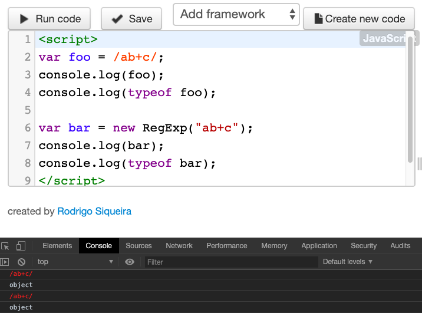

# Memahami Regex

**Regular expression** merupakan fitur pencocokan pola yang tersedia di hampir semua bahasa pemrograman. Di dalam Javascript, regular expression disimpan ke dalam object tersendiri yakni **RegExp Object**.

Apabila anda sudah pernah menggunakan Regular Expression di bahasa pemrograman lain seperti PHP, regular expression di _Javascript_ terasa sangat mirip. Bahkan sebenarnya regular expression ini juga sama dengan yang dipakai di bahasa pemrograman lainnya.

## Pengertian Regular Expression

Regular Expression atau sering disingkat sebagai **RegExp** atau **RE**, adalah suatu mekanisme pencocokan pola (pattern matching), yang dibuat menggunakan karakter-karakter khusus. Fungsinya sangat beragam, mulai dari memeriksa apakah sebuah inputan sudah sesuai atau belum (test), untuk membuat fitur pencarian (search), atau penggantian string (replace).

Penggunaan paling banyak dari **RegExp** adalah untuk proses validasi form.

## Cara Membuat RegExp Object

Di dalam _Javascript_, _regular expression_ ditempatkan ke dalam object tersendiri, yakni RegExp Object. Sama seperti mayoritas object bawaan Javascript lain, kita memiliki 2 cara penulisan: menggunakan **object constructor** atau cara langsung (**literal**).

Berikut contoh pembuatan **RegExp** di dalam Javascript:

```js
// literal
var foo = /ab+c/;
console.log(foo);
console.log(typeof foo);

// menggunakan object construct
var bar = new RegExp("ab+c");
console.log(bar);
console.log(typeof bar);
```

Hasilnya adalah:



Menggunakan penulisan literal, kita tinggal membuat pola karakter diantara tanda _forward slash: /_ dan _/_--. Ini merupakan cara membuat regexp yang paling disarankan.

Menggunakan _object constructor_, perintahnya adalah `new RegExp()`. Dimana pola regular expression diiput sebagai argumen dari `RexExp()`. Cara ini tidak sering dipakai karena kurang efisien jika dibandingkan penulisan literal. Namun apabila pola _regular expression_ diinput secara realtime (misalnya kode regexp diinput langsung dari form). Penulisan object constructor bisa dipakai.

## RegExp Object Method

**RexExp** Object memiliki beberapa method dan property. Sebagian besar dari method ini merupakan fitur lanjutan yang relatif jarang dipakai. Kita hanya akan membahas 2 diantaranya: method `test()` dan `exec()`.

1. Method RegExp.prototype.test()

   _Method **test()**_ digunakan untuk memeriksa apakah sebuah string lolos dari pola _regular expression_ yang diinput. Jika lolos, hasilnya **true**. Jika tidak, hasilnya **false**.

   Method ini mirip seperti _includes()_ dari **String** Object. Bedanya, pada method _test()_ pengecekan string menggunakan pola regular expression. Berikut contoh penggunaannya:

   ```js
   var foo = "Belajar Javascript dari buku Javascript Uncover";
   var pola = /Javascript/;
   console.log(pola.test(foo));
   console.log(/buku/.test(foo));
   console.log(/Buku/.test(foo));
   ```

   Disini saya membuat 2 buah variabel: _foo_ dan _pola_. Variabel _foo_ berisi string, sedangkan variabel _pola_ berisi pola regular expression _/Javascript/_.

   Perintah `pola.test(foo)` artinya saya ingin memeriksa apakah pola _/Javascript/_ terdapat di dalam string _foo_ atau tidak. Pola _/Javascript/_ maksudnya sama dengan sebuah kata “Javascript”. Kata ini tentunya ada di dalam variabel _foo_ dan hasil method _test()_ adalah **true**.

   Begitu juga dengan perintah `/buku/.test(foo)` yang artinya saya ingin memeriksa apakah kata "buku" ada di dalam string _foo_. Terlihat bahwa kita bisa langsung memanggil method **RexExp** dari penulisan literal, tanpa harus menyimpannya ke dalam variabel terlebih dahulu.

   Perintah terakhir `/Buku/.test(foo)` hasilnya **false** karena perbedaan huruf besar di karakter "B". Artinya kata "Buku" tidak ditemukan (bersifat _case sensitif_ ).

2. Method RegExp.prototype.exec()

   _Method `exec()`_ berfungsi untuk mencari karakter atau kata yang cocok dengan pola *regular expression*, kemudian meyimpan hasilnya ke dalam array.

   Berikut contoh penggunaan method `exec()`:

   ```js
   var foo = "1 jam sama dengan 60 menit, juga sama dengan 3600 detik";
   var pola = /\d+/;
   console.log(pola.exec(foo)); // Array [ "1" ]
   ```

   Pola \d+ artinya cari karakter angka dengan jumlah digit 1 atau lebih. Sehingga perintah `pola.exec(foo)` digunakan mencari karakter angka dari string foo. Hasilnya adalah angka 1 yang menjadi element array. Ini merupakan fitur default dari method `exec()`, yakni ketika sebuah pola yang cocok sudah ketemu, method akan langsung berhenti.

   Bagaimana cara mencari “semua” digit? Kita bisa menambahkan sebuah **flag** g atau penanda di dalam pola _regular expression_. Pola tersebut menjadi seperti ini:

   ```js
   var foo = "1 jam sama dengan 60 menit, juga sama dengan 3600 detik";
   var pola = /\d+/g;
   console.log(pola.exec(foo)); // Array [ "1" ]
   ```

   Tapi, kenapa hasilnya tetap cuma 1 element array? Ternyata method `exec()` harus dipanggil beberapa kali. Pada setiap pemanggilan, method ini akan lanjut ke posisi berikutnya:

   ```js
   var foo = "1 jam sama dengan 60 menit, juga sama dengan 3600 detik";
   var pola = /\d+/g;
   console.log(pola.exec(foo));
   console.log(pola.exec(foo));
   console.log(pola.exec(foo));
   console.log(pola.exec(foo));
   ```

   Setiap kali method `exec()` dipanggil, pencarian pola akan lanjut ke posisi berikutnya. Jika tidak ada lagi pola yang cocok, method ini akan mengembalikan nilai **null**.

   Oleh karena fitur method `exec()` yang seperti ini, untuk mencari seluruh pola, kita harus menggunakan perulangan. Konsepnya, selama method _pola.exec(foo)_ belum mengembalikan nilai **null**, lakukan terus pencarian pola.
