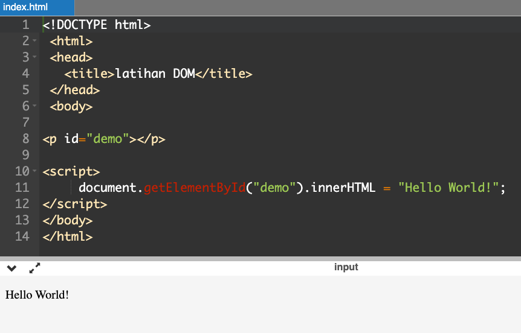
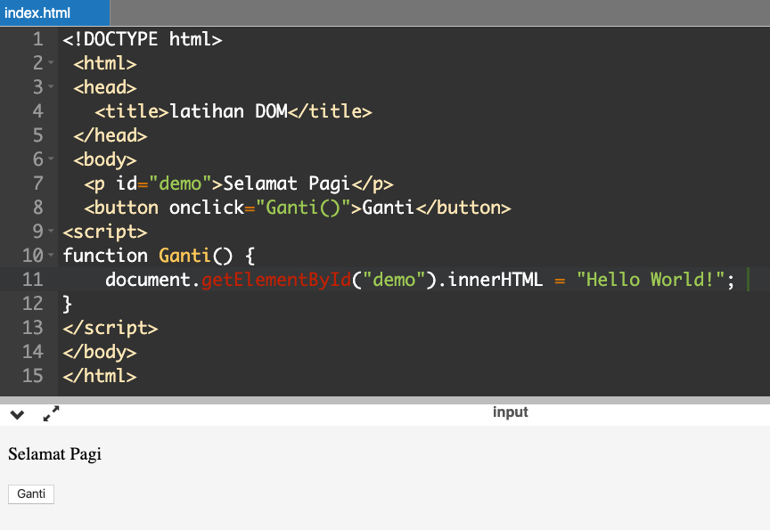
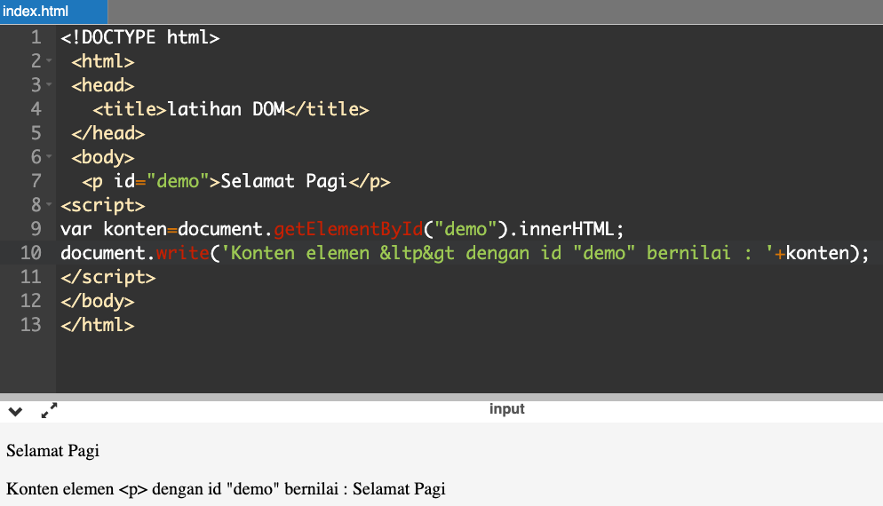

# Memahami DOM dan Event pada Javascript

## Pengertian DOM (Document Object Model)

DOM (Document Object Model) adalah representasi kode HTML ke dalam bentuk object agar bisa diproses oleh bahasa pemrograman, seperti JavaScript.

Jika dihubungkan dengan kepanjangannya, DOM merupakan pemodelan dokumen HTML ke dalam bentuk object. Artinya, setiap tag-tag HTML seperti `<h1>`, `<p>`, atau `<form>` dimodelkan atau dibentuk menjadi sebuah object.

Sebagaimana layaknya object, tag-tag HTML ini nantinya memiliki property dan method yang bisa digunakan untuk mengatur tampilan. “Model” yang dipakai di dalam DOM adalah dengan “memetakan” seluruh object HTML layaknya sebuah pohon (tree). Mari, perhatikan kode HTML berikut:

```html
<!DOCTYPE html>
<html>
  <head>
    <meta charset="utf-8" />
    <title>Belajar JavaScript</title>
  </head>
  <body>
    <h1>Belajar JavaScript</h1>
    <p>Sedang belajar <em>JavaScript</em><b> dari Kode.id</b></p>
  </body>
</html>
```

Kode HTML ini cukup sederhana. Di dalam tag `<head>` terdapat 2 tag lain: `<meta>` dan `<title>`. Di dalam tag `<body>` juga ada 2 tag: `<h1>` dan `<p>`. Untuk tag `<p>`, didalamnya saya menambahkan tag `<em>` dan `<b>`.

Jika digambarkan ke dalam pohon DOM (DOM tree), hasilnya adalah sebagai berikut:


Diagram pohon diatas bisa dibaca sebagai pohon keluarga. Paling puncak terdapat tag `<html>`.
Tag `<html>` disebut juga sebagai root element, yakni akar dari seluruh element HTML lain.

Tag `<html>` memiliki 2 anak (child) yakni `<head>` dan `<body>`. Dengan kata lain, tag `<html>` adalah induk (parent) dari tag `<head>` dan `<body>`. Tag `<head>` dan `<body>` merupakan saudara kandung (sibling).

Urutan dari tag ini juga memiliki sebutan tersendiri. Tag `<head>` merupakan anak pertama (first child) dari tag `<html>`, sedangkan tag `<body>` merupakan anak terakhir (last child) dari tag `<html>`.

Berdasarkan diagram pohon diatas, berikut beberapa fakta yang bisa kita ambil:

- Tag`<head>` memiliki 2 child : tag`<meta>`dan`<title>`.
- Tag`<body>` memiliki 2 child : tag`<h1>`dan`<title>`.
- Tag`<h1>` merupakan firstchild dari tag`<body>`.
- Tag`<p>` merupakan lastchild dari tag`<body>`.
- Tag`<body>` merupakan parent dari tag`<h1>`dan`<p>`.
- Tag`<p>` merupakan sibling dari tag`<h1>`.
- Tag`<h1>` merupakan sibling dari tag`<p>`.
- Tag`<b>` merupakan lastchild dari tag`<p>`.

## Pengertian Event

Di dalam DOM, event adalah segala sesuatu yang bisa kita lakukan dengan halaman web, seperti men-klik sebuah tombol, klik kanan paragraf, menggeser cursor mouse ke atas sebuah menu, menginput sesuatu ke dalam form, menekan tombol tab, menekan tombol enter, dll.

Ketika event terjadi, kita bisa menyiapkan kode JavaScript untuk melakukan sesuatu, yakni sebagai respon dari event tersebut. Misalnya saat sebuah tombol di klik,tampilkan pesan alert(), atau ketika cursor mouse berada di atas menu, ubah warna background menu tersebut.
DOM Event tidak hanya terbatas untuk mouse dan keyboard saja, tapi juga bisa berbentuk sesuatu yang berasal dari proses DOM itu sendiri, seperti ketika halaman di tampilkan, atau saat sebuah DOM berubah.

Jumlah DOM event yang tersedia sangat banyak, lebih dari 200 dan terus bertambah. Secara garis besar dalam di kelompokkan dalam beberapa tipe:

- Mouseevents: Event yang terjadi ketika menggunakan mouse,seperti diklik,doubleklik, klik kanan, seret (drag), dll.
- Keyboard events: Event yang terjadi saat mengetik sesuatu menggunakan keyboard (biasanya sebagai sarana input ke dalam form). Contohnya ketika sebuah tombol ditekan, saat sebuah tombol dilepaskan, dll.
- Progression events: Event yang terjadi pada “siklus hidup” DOM, seperti saat halaman di tampilkan atau ketika halaman ditutup.
- Form events: Event yang terjadi saat suatu hal terjadi pada form, contohnya ketika mengubah pilihan menu dari list, atau ketika sebuah checkbox dipilih.
- Mutation events: Event yang terjadi saat struktur DOM diubah, misalnya ketika ditam- bahkan sebuah paragraf baru.
- Touch events: Event yang terjadi saat menyentuh layar, ini biasanya untuk perangkat smartphone atau tablet yang memiliki fitur touchscreen.
- Error events: Event yang akan dijalankan ketika terjadi error.

Dari semua event ini, yang paling banyak dipakai adalah event mouse, keyboard, dan form. Dalam bab ini saya akan membahas event event mouse terlebih dahulu. Untuk event keyboard dan form akan dibahas dalam bab berikutnya. Namun jika anda sudah paham prinsip penulisan event, untuk event-event yang lain akan sangat mudah diikuti.
Kita ambil contoh event mouse, apa saja yang bisa dilakukan dengan menggunakan mouse? Berikut diantaranya:

- click: Event ketika tombol kiri mouse di klik 1 kali.
- dblclick: Event ketika tombol kiri mouse di klik 2 kali dengan cepat (double click).
- contextmenu: Event ketika tombol kanan mouse di klik 1 kali.
- mouseenter: Event ketika cursor mouse masuk ke sebuah element.
- mouseover: Event ketika cursor mouse berada diatas sebuah element.
- mouseleave: Event ketika cursor mouse keluar dari sebuah element.

Selanjutnya, bagaimana cara menjalankan event-event ini? Terdapat 3 cara menginput event ke
dalam Element HTML:

- Diinput sebagai atribut HTML.
- Diinput sebagai property khusus dari Element node.
- Memanggil sebuah method khusus dari Element node.

### Event Handler dari Atribut HTML

Cara paling mudah dan paling singkat untuk menginput event adalah dengan menulisnya langsung sebagai atribut dari sebuah element HTML.

Nama event ditulis dengan tambahan awalan “on”. Sebagai contoh, event click ditulis sebagai "onclick", event mouseover ditulis sebagai "onmouseover". Nilai dari atribut ini berupa kode JavaScript yang akan dijalankan.

### Event Handler dari Property Element

Cara kedua untuk “memasang” event adalah dengan menginputnya ke dalam property khusus dari Element Node

### Event Handler dari Method Element

Cara ketiga untuk menginput event adalah dengan menggunakan method khusus yang bernama _addEventListener()_. Ini merupakan metode yang paling disarankan dan menjadi standar DOM W3C.

Menginput event melalui atribut dan property element seperti yang sudah kita pelajari sebelumnya, bukanlah berasal dari _W3C_, melainkan dari era IE vs Netscape (sebelum W3C didirikan). Namun kedua cara itu masih di dukung web browser modern.

Membuat event handler menggunakan method _addEventListener()_ tidak sulit, cukup menulis method ini dengan 2 argument. Argumen pertama berupa nama event tanpa awalan on, seperti **"click"**, **"dblclick"** dan **"mouseover"**. Dan argumen kedua diisi dengan nama function yang akan dijalankan saat event terjadi.

## Metode - Metode JavaScript Untuk Manipulasi DOM

1. `querySelector()`

   Metode `querySelector()` merupakan metode yang akan mengembalikan elemen pertama yang cocok dengan satu atau lebih selector pada CSS. Jika tidak ditemukan selector yang cocok maka akan mengembalikan nol.

   Sebelum `querySelector()` diperkenalkan, pengembang banyak menggunakan metode `getElementById()` yang mengambil elemen dengan nilai id yang telah ditentukan.

   Meskipun `getElementById()` masih merupakan metode yang bermanfaat, akan tetapi dengan adanya metode `querySelector()` dan `querySelectorAll()` yang lebih baru, maka kita bisa bebas untuk menargetkan elemen berdasarkan selector CSS apa pun, sehingga lebih flexibel dalam penggunaan nya.

   Contoh Kode:
   Dalam contoh ini, `<div>` pertama dipilih dengan metode `querySelector()` dan warnanya berubah menjadi hijau.

   ```html
   <p>line pertama paragraf</p>
   <div>line div pertama</div>
   <p>line paragraf ketiga</p>
   <div>line div kedua</div>

   <script>
    var divWarna = document.querySelector('div');
    divWarna.style.color = 'green';
   </script>
   ```

2. `querySelectorAll()`
   Selanjutnya adalah `querySelectorAll()`, tidak seperti `querySelector()` yang hanya mengembalikan instance pertama dari semua elemen yang cocok, `querySelectorAll()` akan mengembalikan semua elemen yang cocok dengan selector CSS yang telah ditentukan. Elemen yang cocok akan dikembalikan sebagai objek NodeList yang akan menjadi objek kosong jika tidak ada elemen yang cocok ditemukan.

   Contoh Kode:
   Semua paragraf dipilih dengan `querySelectorAll()`, dan berwarna kuning.

   ```html
   <p>line pertama paragraf</p>
   <div>line div pertama</div>
   <p>line paragraf ketiga</p>
   <div>line div kedua</div>

   <script>
   var para = document.querySelectorAll('p'); for(var p of para) p.style.color = 'pink';
   </script>
   ```

3. `addEventListener()`

   Event ini merujuk pada apa yang akan terjadi pada elemen HTML, misalnya mengklik, memfokuskan, atau meload. dengan event ini kita dapat menetapkan fungsi JS untuk melakukan sesuatu ketika Event tersebut terjadi.

   Metode `addEventListener()` mempunyai beberapa kelebihan, salah satunya adalah standar terbaru - memungkinkan penugasan lebih dari satu fungsi dan dilengkapi dengan serangkaian opsi yang bermanfaat.

   Contoh Kode

    ```html
    <button>Click !</button>

    <script>
      var btn = document.querySelector('button');
      btn.addEventListener('click', test); function test() { alert('hellow'); }
    </script>
    ```

## Praktik Manipulasi HTML DOM

Pada bagian ini kita akan praktik langsung mencoba memanipulasi HTML DOM dengan sintaks Javascript. Melalui praktik ini, diharapkan pembaca akan mampu untuk:

1. Merubah konten dari elemen HTML

2. Merubah Style CSS dari elemen HTML

3. Menanggapi event

4. Menambah atau Menghilangkan elemen HTML

### Mengubah konten dari elemen HTML

Saat ini kita akan melakukan latihan manipulasi dom untuk mengubah konten dari elemen HTML
silahkan teman-teman bisa langsung membuka text editor nya (kalau saya pakai VS Code), lalu buat `index.html` dan tuliskan sintax seperti di bawah ini:

```html
<!DOCTYPE html>
<html>
  <head>
    <title>latihan DOM</title>
  </head>
  <body>
    <p id="demo"></p>
    <script>
      document.getElementById("demo").innerHTML = "Hello World!";
    </script>
  </body>
</html>
```

Setelah itu, _save_ dan buka di _browser_ sesuai dengan nama dan _path_ file tersebut.



Keterangan:

- Sintaks document.getElementById(“demo”) sudah mengacu kepada elemen `<p>` dengan id “demo”.
- innerHTML adalah property yang digunakan untuk memperoleh atau merubah konten dari elemen itu sendiri (kasusnya disini elemen `<p>` dengan id “demo” atau `<p id=”demo”></p>`.
- Sintaks document.getElementById("demo").innerHTML sudah mengacu kepada konten dari elemen `<p>` dengan id “demo”.
- Sintaks document.getElementById("demo").innerHTML = "Hello World!"; artinya konten dari elemen yang diacu (elemen `<p>` dengan id “demo”) diisikan nilai “Hello World!”.

Misalkan kita akan merubah konten elemen `<p id=”demo”>` Selamat Pagi`</p>` dengan nilai baru “Hello World” ketika user menekan tombol. Tuliskan sintaksnya sebagai berikut:



### Memperoleh Konten dari Elemen HTML

Hampir sama dengan merubah konten, yang perlu dilakukan ialah mengakses konten dari elemen yang dimaksud menggunakan property innerHTML.

Misalkan akan memperoleh konten yang diinginkan kemudian menampilkannya. Modifikasi sintaks sebelumnya :

```html
<body>
  <p id="demo">Selamat Pagi</p>
  <script>
    var konten = document.getElementById("demo").innerHTML;
    document.write(
      'Konten elemen &ltp&gt dengan id "demo" bernilai : ' + konten
    );
  </script>
</body>
```

Setelah itu, _save_ dan buka di _browser_ sesuai dengan nama dan _path_ file tersebut.



Apa yang dapat dipelajari?

Nilai atau konten dari elemen yakni “Selamat Pagi” dimasukkan ke variabel konten, kemudian nilai dari variabel konten tersebut ditampilkan bersamaan dengan string `Konten elemen &ltp&gt dengan id "demo" bernilai :` dengan menggunakan *method* dari object document yakni `write()` yang menampilkan nilai dalam string pada halaman html.

### Merubah Nilai dari Suatu Atribut

Selain merubah konten elemen, kita juga dapat merubah nilai dari suatu atribut.

Modifikasi code sebelumnya menjadi seperti ini :

```html
<body>
  <p style="font-size:12pt;">Paragraf 1.</p>
  <p style="font-size:12pt;">Paragraf 2.</p>
  <p style="font-size:12pt;">Paragraf 3.</p>
  <p id="demo"></p>
  <script>
    var x = document.getElementsByTagName("p");
    document.getElementById("demo").innerHTML =
      "Paragraf pertama (indeks 0) adalah: " + x[0].innerHTML;

    x[0].style = "font-size:72pt";
  </script>
</body>
```

Simpan dengan ekstensi .html dan jalankan di browser.
Hasilnya sebagai berikut :


Apa yang dapat dipelajari?

Kita dapat merubah nilai atribut dari sebuah elemen html. Seperti pada contoh, sintaks `x[0].style="font-size:72pt";` akan merubah atribut dari elemen pertama yang sebelumnya di set dengan nilai “`font-size:12pt`”. Secara umum aturan penulisannya sebagai berikut `element.attribute = new value`.

Jika melihat pada contoh, maka yang menjadi elemen ialah `x[0]` dan atribut nya adalah *style*, sehingga ditulis `x[0].style` (ingat bahwa `x[0]` mengacu pada elemen yang memiliki konten “`Paragraf 1`”.
