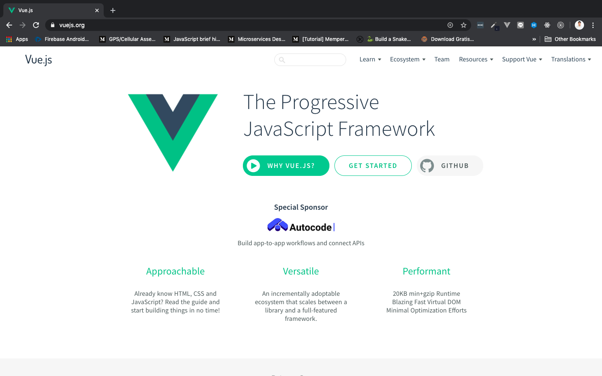

# Frontend Javascript Framework

Vue adalah Frontend Javascript Framework yang sangat populer, dan salah satu yang mengalami pertumbuhan pesat. Vue *simple*, *tiny (~24kb)*, dan performanya sangat bagus. Vue terasa berbeda dengan Frontend Javasript Framework lainnya, mari kita cari tahu kenapa bisa seperti itu 😎

## Berkenalan dengan Frontend Javascript Framework

Jika teman-teman belum mengetahui tentang Javascript Framework, berikut ini kita akan mengupas tuntas apa itu Javascript Framework.

Javascript Framework membantu kita untuk membuat ***modern application.*** Modern Javascipr aplication bisanya digunakan untuk website, tetapi tidak menutup kemungkinan digunakan juga untuk Desktop ataupun mobile application.

Sampai di pertengahan tahun 2000-an, browser tidak mempunyai kapabilitas yang harusnya mereka miliki. Maksudnya gimana? Jadi banyak yang beranggapan browser pada era itu kurang powerful. Membuat aplikasi yang kompleks di dalam browser, menjadikan aplikasi tersebut terasa berat di sisi performanya, dan tidak ada tools atau alat-alat yang memadai untuk memfasilitasi itu semua.

Semuanya berubah ketika raksasa Google meresmikan [Gmaps](https://www.google.com/maps) dan [Gmail](mail.google.com). Dua aplikasi besar ini berjalan di browser. [***Ajax***](https://www.hostinger.co.id/tutorial/apa-itu-ajax/) membuat [asynchronous](https://medium.com/coderupa/panduan-komplit-asynchronous-programming-pada-javascript-part-1-fca22279c056) network request bisa dilakukan, dan semakin ke sini developers mulai mengembangkan Web Platform ke arah yang lebih canggih. Mereka mengembangkan mulai dari browsernya itu sendiri, standar website, browser API, dan bahasa pemrograman Javascript.

Library seperti [jQuery](https://jquery.com/) dan [Mootools](https://mootools.net/), merupakan project besar pertama yang dibuat menggunakan Javascript dan menjadi populer dalam beberapa saat. [JQuery](https://jquery.com/) dan [Mootools](https://mootools.net/) pada dasarnya menyediakan API yang lebih mudah dipahami untuk berinteraksi dengan browser dan menyediakan cara mengatasi bugs dan ketidakkonsitenan antar browser.

Framework seperti [Ember](https://emberjs.com/), [Knockout](https://knockoutjs.com/), dan [AngularJs](https://angular.io/) adalah gelombang pertama Javascript Framework. Gelombang ke dua-nya dan yang saat ini banyak digunakan adalah [React](https://reactjs.org/), [Angular: n Version](https://angular.io/features), dan [Vue](https://vuejs.org/).

> ***Tips & trick:*** JQuery, Ember, dan semua old librarys yang saya sebutkan di atas masih banyak juga digunakan, diupdate secara berkala, dan jutaan website mengandalkannya. Tetapi, teknik dan tools berkembang pesat. Sebagai Frontend Javascript Framework, kita lebih dianjurkan mempelajari modern framework sperti React, Angular, dan Vue ketimbang old framework yang sudah saya jelaskan sebelumnya

Framework seperti ***magic.*** Framework membuat interaksi ke browser dan DOM menjadi tidak terlihat dan mudah tentunya. Kita bisa membuat DOM kita sendiri dan berinteraksi dengan DOM lewat framework. Jika diibaratkan, menggunakan framework seperti menggunakan komputer untuk menulis suatu dokumen ketimbang mesin tik. Lebih cepat? Tentu! Lebih efisien? Sangat!

***This is tools built by very smart people that make our life easier.*** Thank you! 🙏🏻

