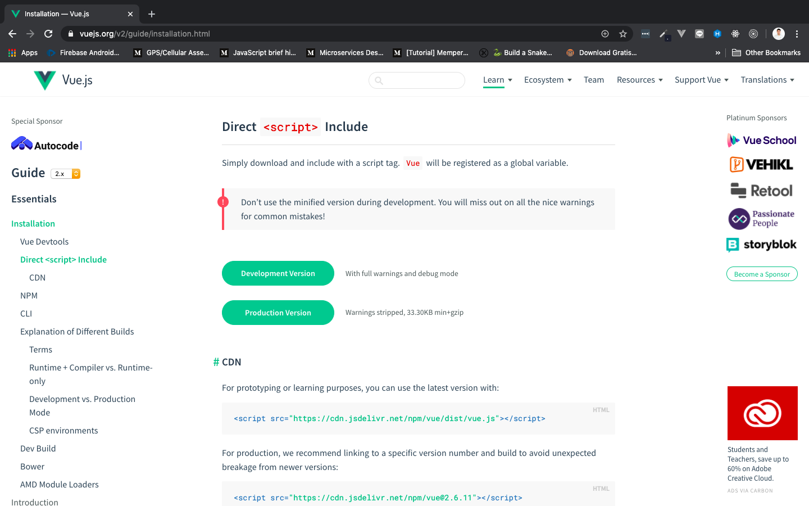

# Why Developers Love Vue

Vue disebut juga dengan ***progressive framework.*** Itu artinya, vue menyesuaikan dengan kebutuhan developers. Ketika framework lain **membutuhkan se-paket lengkap untuk menjalankan suatu framework,** Vue dengan mudahnya hanya membutuhkan a simple `<script>` tag untuk memulai developmentnya. Developers bisa menambah-nambah yang mereka butuhkan di dalam paket Vue, sesuai dengan aplikasi yang sedang mereka kembangkan. Jadi tidak sekaligus menggunakan isi paket yang mengakibatkan lemot dan lain sebagainya.

> ***Tips & trick:*** Kita tidak harus mengetahui tentang [Webpack](https://webpack.js.org/), [Babel](https://babeljs.io/), [npm](https://www.npmjs.com/) atau yang lainnya untuk mulai menggunakan Vue.

Beberapa orang menyebut Vue, ***the new jQuery.*** Karena sangat mudah untuk digunakan dengan hanya `<script>` tag. Dan dari sana mulai mendapatkan tempat perlahan-lahan di hati para developers.

***Vue is the best idea.*** Vue dibuat dari banyak ide cemerlang yang di terapkan di framework-framework lain seperti Angular, React, dan Knockout. Vue mengambil ***tools terbaik*** yang dibuat pada framework-framework tersebut, dan mengimplementasikannya pada Vue. Artinya, Vue sama seperti kumpulan dari tools terbaik dari Frontend Javascript Framework yang ada.

