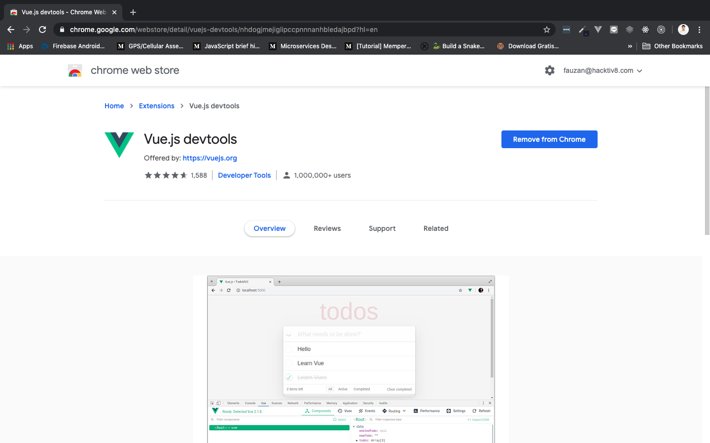
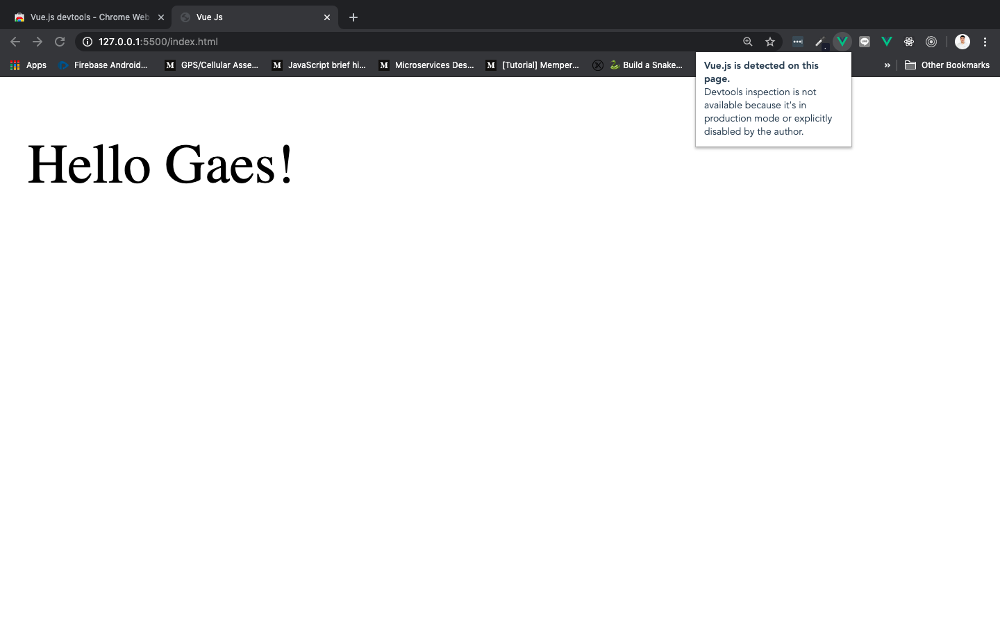
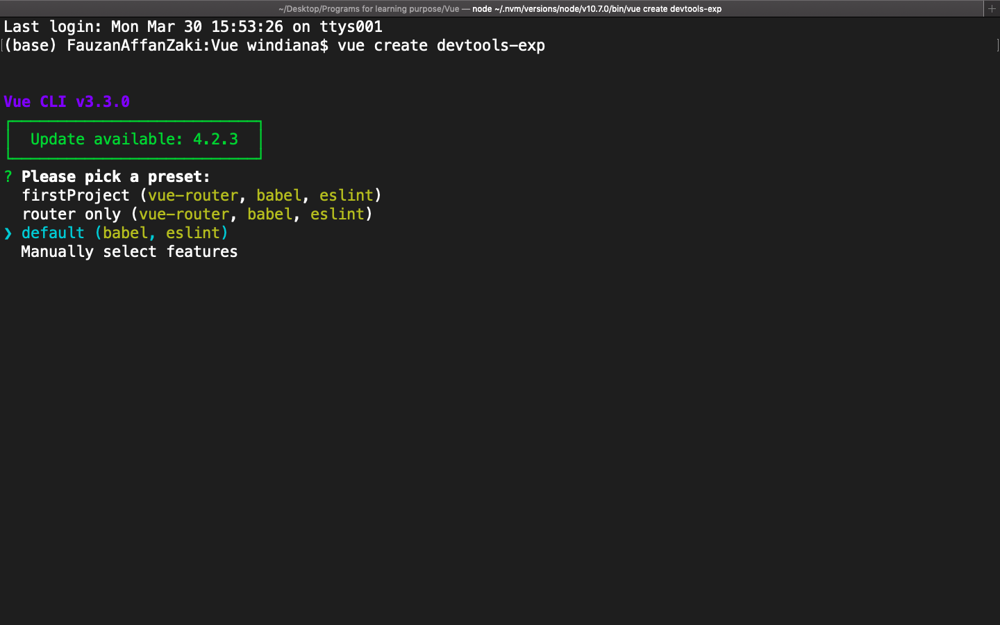
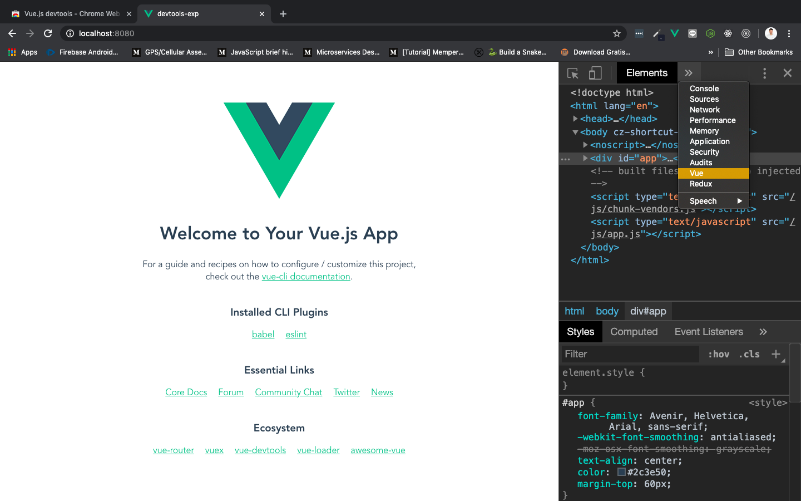

# Vue Developer Tools

Vue memiliki extension yang terintegrasi dengan ***Browser Development Tools,*** yang memungkinkan kita untuk meng-***inspect*** element di Vue project, supaya mudah untuk debugging.

## Instalasi

Jika kita pertama kali menjalankan Vue, ketika membuka tab ***console*** di browser, akan muncul tulisan ***"Download the Vue DevTools Extension for a Better Development Experience: [http://github.com/vuejs/vue-devtools](http://github.com/vuejs/vue-devtools)"***

> ***Tips & trick:*** Lebih dalam tentang [DevTools menggunakan Vuex](https://www.youtube.com/watch?v=VpRwE4yoBmc) atau [simple debugging](https://www.youtube.com/watch?v=4HHhaDySn-Y)

Ayo kita instal!

* Jika teman-teman menggunakan chrome (recommended), silahkan buka browser dan ketikkan keyword: ***vue devtools chrome***. Atau kunjungi [https://chrome.google.com/webstore/detail/vuejs-devtools/nhdogjmejiglipccpnnnanhbledajbpd?hl=en](https://chrome.google.com/webstore/detail/vuejs-devtools/nhdogjmejiglipccpnnnanhbledajbpd?hl=en).

    Klik button **+ ADD TO CHROME**, lalu **add extension**

    Jika sudah diinstal button **+ ADD TO CHROME** akan berubah menjadi seperti ini:

    

* Jika teman-teman menggunakan browser yang lain, silahkan buka browser dan ganti keyword "chrome" denagn browser yang digunakan. Contoh firefox: ***vue devtools firefox***

* DevTools hanya akan bekerja jika website menggunakan Vue. Coba buka project Vue teman-teman, atau save sintaks di bawah ini dengan nama index.html:

    ```html
    <!DOCTYPE html>
    <html lang="en">
        <head>
            <meta charset="UTF-8">
            <meta name="viewport" content="width=device-width, initial-scale=1.0">
            <title>Vue Js</title>
        </head>
        <body>
            <div id="app">
                <p>{{ greeting }}</p>
            </div>

            <script src="https://cdn.jsdelivr.net/npm/vue@2.6.11"></script>
            <script>
                new Vue({
                    el: '#app',
                    data: {
                        greeting: "Hello Gaes!"
                    }
                })
            </script>
        </body>
    </html>
    ```

    Jalankan di browser dengan [**live server extension di vscode**](https://marketplace.visualstudio.com/items?itemName=ritwickdey.LiveServer) (`ctr` + `L`, lalu `ctrl` + `O`) atau dengan cara **klik kanan file index.html > open with browser** dan lihat dibagian pojok kanan atas pada browser:

    

    Logo Vue di bagian kanan atas browser menandakan kita sedang membuka website yang menggunakan Vue. Selain Vue, logo tersebut akan berwarna abu-abu.

## How to Use Developer Tools

Untuk menggunkan DevTools, teman-teman harus mempunyai project **vue yang dibuat menggunakan Vue CLI.** jalankan project tersebut dengan `npm run serve`:

1. Buat project dengan nama `devtools-exp` dan pilih ***default*** configuration

    

2. Masuk ke dalam folder devtools-exp menggunakan `cd devtools-exp/` dan jalankan

    

    

3. Buka browser dan ketikkan url ***localhost:8080***, lalu ***klik kanan > inspect***

    

4. Ganti console menjadi ***Vue***

    

    
