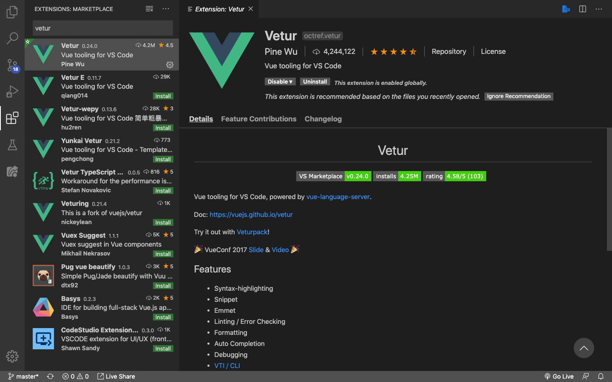

# Vue VSCode

Saya sangat menyarankan teman-teman menggunakan text editor [Visual Studio Code](https://code.visualstudio.com/). Karena, semua tutorial akan selalu menggunakan vscode pada Frontend Framework Specialization ini.

## Installing Extension

Jika kita bermain dengan Vue di vscode, ada extension wajib yang harus tema-teman instal, namanya adalah [Vetur](https://marketplace.visualstudio.com/items?itemName=octref.vetur). Selain sudah banyak yang menggunakan, Vetur mempunyai banyak fitur yang memudahkan kita dalam tahap development Vue project.

1. Klik icon *extensions* atau tekan `shift` + `command/ctrl` + `x`

2. Ketikkan Vetur

3. Klik Vetur dan install

Fitur dari Vetur ada banyak diantaranya **highlight sintaks, snippets, intelliSense, scaffolding, dll** yang memudahkan kita mengembangkan Vue Project di vscode.
