# Git & Github

Apakah teman-teman sudah familiar dengan Git & Github? Sederhananya Git & Github adalah tools yang biasa digunakan para developers untuk menyimpan perubahan pada project yang sedang mereka kerjakan. Developer juga bisa berkolaborasi dengan menggunakan tools ini. Lebih spesifik lagi Git & Github adalah:

* Github adalah **sebuah website yang menyimpan project kita di cloud**

* Git adalah **aplikasi yang digunakan untuk mengatur singkronisasi antara project di komputer kita dengan project di website Github**

## Instalasi

Download [Git untuk MacOs](https://git-scm.com/download/mac), atau download [Git untuk Windows](https://github.com/git-for-windows/git/releases/tag/v2.26.0.windows.1), pilih versi yang paling baru.

Jika sudah, buat satu buah folder lalu:

* MacOs: Klik kanan > New Terminal at Folder

* Windows: Klik kanan > Git Bash Here

Ketikkan perintah `git init`. Karena saya menggunakan MacOs, ini adalah tampilan terminal di dalam folder `demo git & github`:

> ***Tips & trick:*** `git init` membuat folder kita yang tadinya folder biasa, menjadi **repositori lokal Github** namanya. Repositori lokal adalah **semua berkas yang masih ada di komputer kita, dan belum diupload ke website Github**.

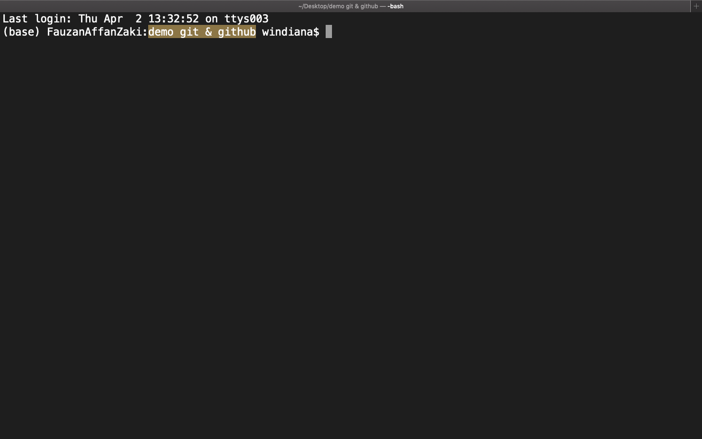


Jika sudah, buat akun di [Github.com](github.com):


Pada pojok kanan atas **click icon `+`**, untuk membuat **repositori online Github** baru. Masukkan ***Repository name*** dan ***description*** lalu klik ***create repository.*** Berikut ini adalah langkah-langkahnya, jika sudah mempunyai banyak repositori tampilannya akan seperti di bawah:


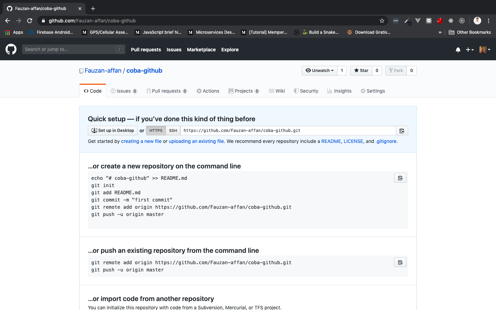

> ***Tips & trick:*** Repository onlie Github berbeda dengan repositori lokal. Lokal di komputer kita, sedangkan online di cloud atau website Github

Selanjutnya lakukan konfigurasi pada `git config` menggunakan sintaks di bawah ini. Ganti `John Smith` dan `example@email.com` dengan username dan email di Github yang baru saja dibuat:

```js
git config --global user.name "John Smith"
git config --global user.email "example@email.com"
```

## Workflow

Alur kerja dari Git cukup ribet buat pemula. Tapi tenang semuanya akan kita buat mudah! Repositori lokal terdiri dari **3 bagian pokok** yang disebut ***"trees"***, dan dikelola oleh git. Dimulai dari ***Working Dir*** terus di-`add` ke ***index*** dan di-`commit` ke ***HEAD***. Memang tidak kelihatan di folder kita, tetapi akan terasa nanti ketika kita bermain dengan terminal:


1. Pertama adalah **Direktori Kerja (*Working Dir*)** yang menyimpan berkas aktual, artinya menyimpan berkas setiap kali kita memeperbarui project kita tanpa melakukan `git add` di terminal.

2. Kedua adalah **Indeks (Index)** yang berperan sebagai pengolah data, artinya indeks menyimpan berkas setelah kita melakukan `git add` di termial.

3. Terakhir **HEAD** yang berperan sebagai lokasi akhir penyimpanan berkas, yang siap di `push` ke website github. Berkas akan berada di **HEAD** jika kita lakukan `git commit` di terminal.

## How to use `git remote`

`git remote` digunakan untuk **menyambungkan repository online Github dengan repositori lokal di komputer.**

Kita balik ke terminal dan ketikkan `git remote` dan akan muncul `origin`:

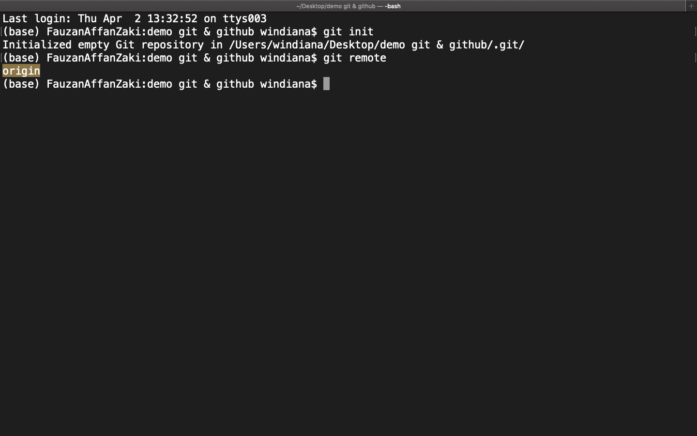

Apa itu `origin`? Okay, `origin` sama seperti **nama variabel yang menampung repositori online Github kita di lokal**. Sederhananya, kita bisa memasukkan link repositori online kita ke `origin`, dan ini menyebabkan repositori lokal kita terkoneksi dengan repositori online Github. Untuk saat ini `origin` isinya masih kosong karena kita belum mengisikannya. Untuk melihat isi `origin` silahkan ketikkan `git remote show origin`, dan terminal akan menampilan warning seperti berikut karena kita belum mengisikan apa-apa ke dalam `origin`:

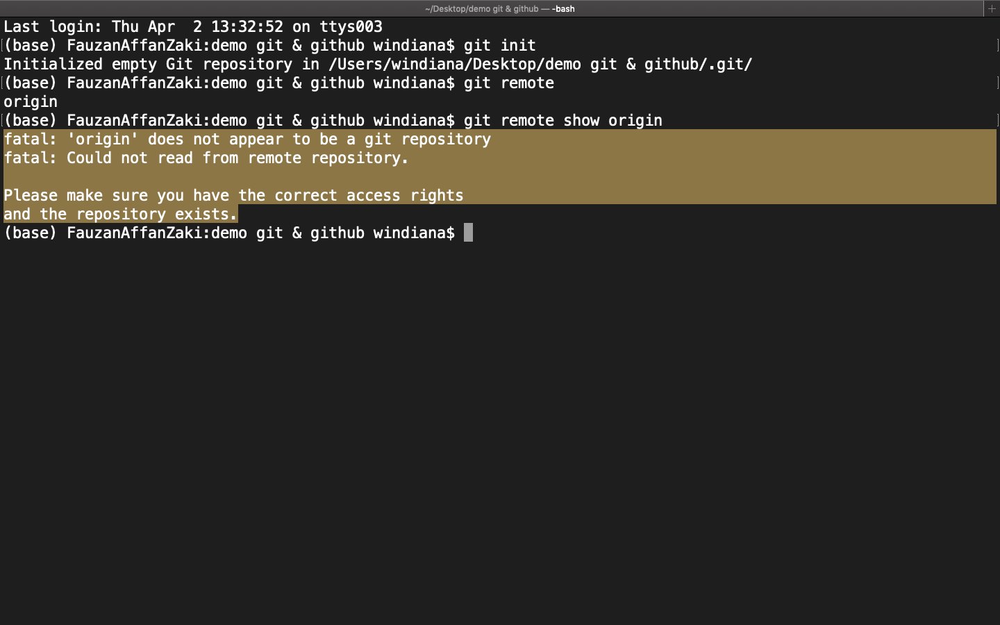

Okay, sekarang kita akan mengisikan `origin` menggunakan `git remote add origin link-repo-online`. Copy link repositori online Github terlebih dahulu, yang sudah saya block warna kuning:


Kemudian balik ke terminal, ganti `link-repo-onlie` dengan link dari repositori online Github:

```js
git remote add origin https://github.com/Fauzan-affan/coba-github.git
```

Kenapa ada embel-embel `add origin`-nya? Perintah `add origin` pada `git remote` akan memasukkan link repositori online ke dalam `origin`. Sekarang coba ketikkan `git remote show origin` kembali:


## How to Use `git add`

Di repositori lokal, `git add` digunakan untuk memindahkan berkas aktual kita dari ***working dir*** ke ***index***, supaya bisa kita `commit` ke ***HEAD***. Okay sekarang saya akan membuat satu buah file `index.html` di dalam folder `git & github` dan mengisikan:

```html
<!DOCTYPE html>
<html lang="en">
    <head>
        <meta charset="UTF-8">
        <meta name="viewport" content="width=device-width, initial-scale=1.0">
        <title>Git & Github</title>
    </head>
    <body>
        <h1>Hello, World!</h1>
    </body>
</html>
```

Posisi file `index.html` sekarang masih ada di working dir (workdir), jika teman-teman menggunakan vscode, akan ada tanda `U` disamping `index.html`. `U` singkatan dari `unchange` yang artinya file `index.html` kita masih ada di workdir:

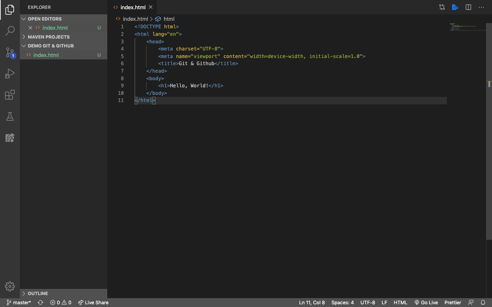

Untuk memindahkannya ke dalam index, kita gunakan `git add .`. Tanda `.` (titik) digunakan untuk memindahkan semua yang ada di workdir ke dalam index. Jika teman-teman ingin memindahkan satu file saja, bisa ganti titik dengan file yang kita inginkan saja:

```js
git add .

git add index.html
```

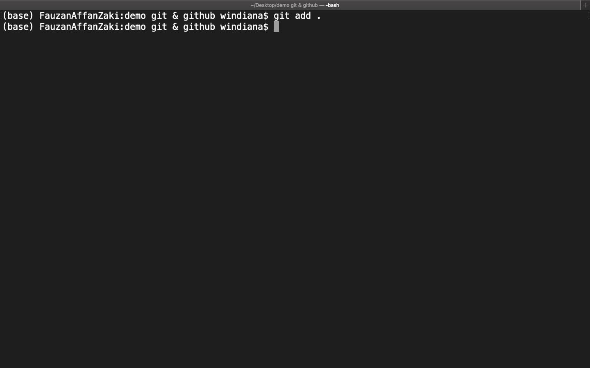

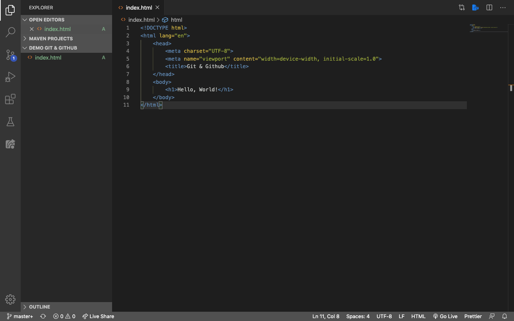

Sekarang `U` sudah berubah menjadi `A` kependekan dari `Added`, artinya kita sudah berhasil memindahkan `index.html` ke dalam index.

## How to use `git commit`

Tahap selanjutnya masih di dalam repositori lokal, kita akan memindahkan `index.html` dari index ke dalam HEAD supaya bisa di upload ke Github. Satu hal yang harus kita perhatikan ketika menggunakan `git commit` adalah, kita harus memberikan komentar terhadap berkas yang mau kita pindahkan ke HEAD. Ini bisa dilakukan dengan cara menambahkan `-m` ke dalam `git commit`, contohnya seperti berikut:

```js
git commit -m "Komentar yang mau diberikan terhadap berkas (index.html)"
```

Komentar ini berguna untuk memberikan keterangan dari perubahan yang kita lakukan di dalam berkas kita. Tetapi karena kita hanya menambahkan html biasa saja, kita bisa tulis komentarnya dengan ***upload new file*** saja:

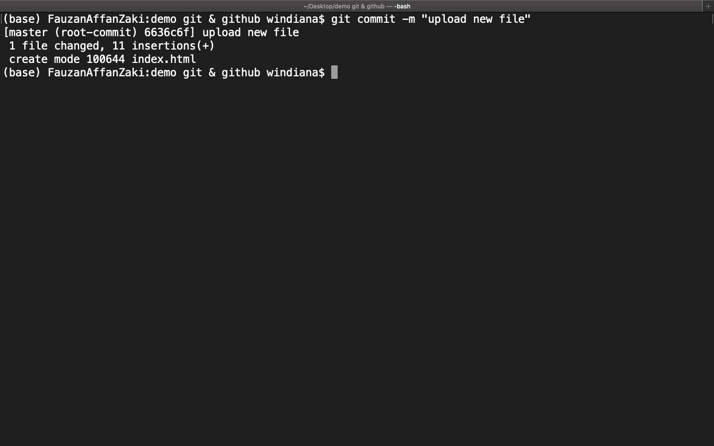

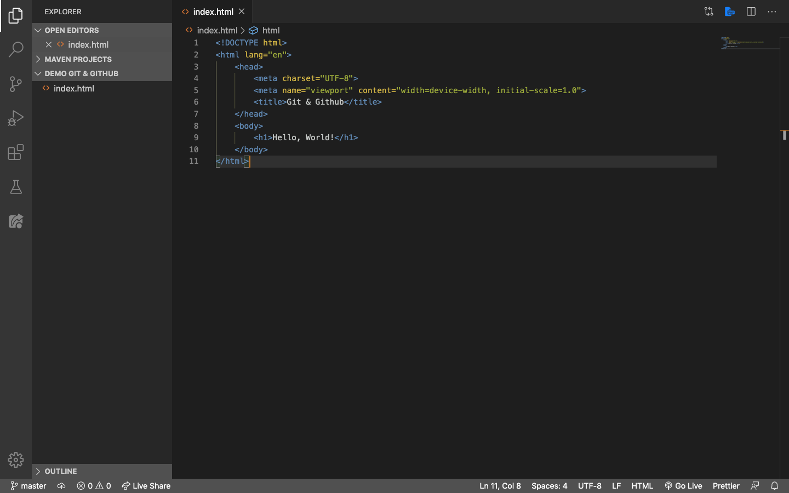

Dengan begitu, tanda di vscode akan hilang yang artinya `index.html` sekarang sudah berada di HEAD.

## How to Use `git push`

Sekarang file `index.html` kita sudah berada di HEAD, satu tahap lagi kita bisa membuat file kita terupload ke Github. Caranya tentu menggunakan `git push`. Sintaksnya seperti berikut:

```js
git push origin master
```

`master` di sini adalah `branch` yang terdapat di repositori online Github kita nanti. Secara default, hanya ada 1 `branch`, yaitu `master`. Oleh karena itu, kita akan upload file `index.html` ke dalam `branch master` menggunakan `git push origin master`. Selanjutnya reload repositori online Github (website Github), tahapannya seperti berikut:

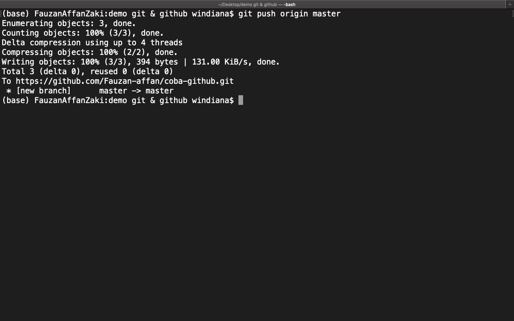


Klik `index.html` isinya akan sama seperti berikut:

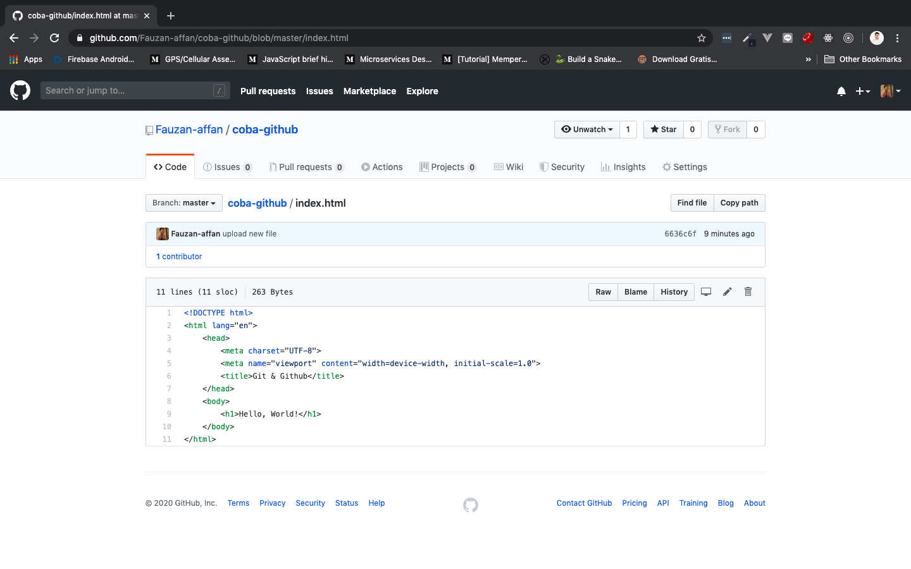

## How to Use `git status`

Jika kita tadi sudah berhasil melakukan `push` atau upload project ke github, selanjutnya bagaimana kalau suatu saat kita rubah isi dari `index.html`? Nah, `git status` **digunakan untuk melihat perubah yang terjadi di dalam workdir**. Buka index.html dan tambahkan element `<p>` di dalamnya:

```html
<!DOCTYPE html>
<html lang="en">
    <head>
        <meta charset="UTF-8">
        <meta name="viewport" content="width=device-width, initial-scale=1.0">
        <title>Git & Github</title>
    </head>
    <body>
        <h1>Hello, World!</h1>
        <p>Nama Saya fauzan</p>
    </body>
</html>
```

Karena kita telah melakukan perubahan di berkas atau project kita, maka vscode akan mendeteksi itu sebagai `modified` atau perubahan yang tandanya dalah `M`:


Untuk melihat **di mana saja perubahan yang terjadi di dalam project kita**, kita gunakan `git status` seperti berikut:


Pada gambar di atas, `git` memberitahukan bahwasannya ada perubahan di dalam file `index.html`. Dan memang benar kita telah menambahkan element `<p>` di dalamnya. Selanjutnya pindahkan `index.html` ke dalam index (stage) dengan `git add .`, lalu lakukan lagi `git status`:

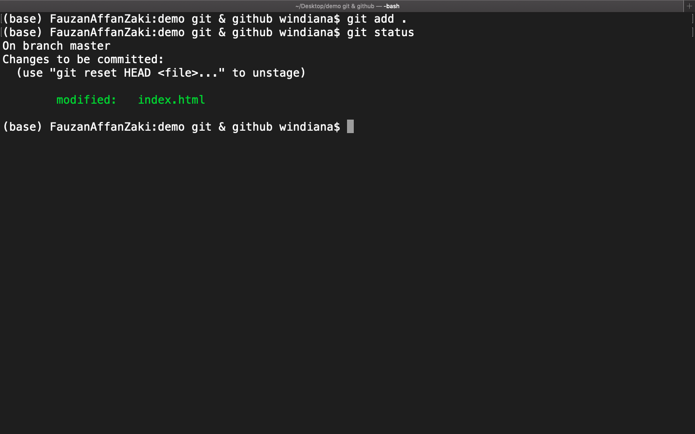

Yang tadinya ***modified*** berwarna merah, sekarang berwarna hijau yang artinya kita sudah berhasil memindahkan perubahan `index.html` ke dalam *stagging area*. Selanjutnya `git commit -m "Update index.html"`, lalu `git status`:

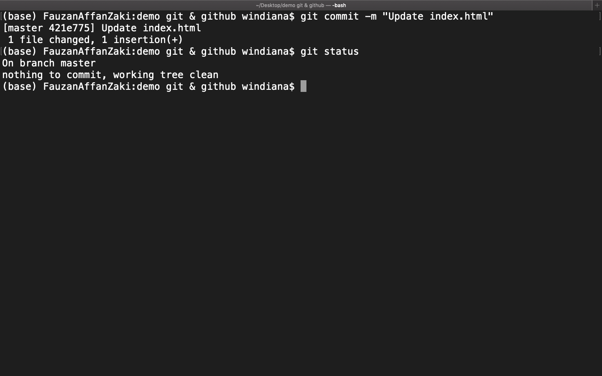

Pada gambar di atas setelah kita *commit*. `git status` memberitahukan tidak ada lagi yang perlu kita commit. Dan tahap terakhir adalah mengupload perubahan `index.html` yang sudah berada di ***HEAD*** ke repositori online Github kita menggunakan `git push origin master`:


> ***Tips & trick:*** Index juga sering disebut dengan ***stage*** atau ***stagging area***

Reload repositori online Github dan klik `index.html` lagi. Sekarang isinya sudah sama persis seperti repositori lokal yang ada di komputer kita:


## How to Use `git pull` & `git fetch`

Okay sekarang kita sudah tersambung antara repositori lokal dengan repositori online Github, tetapi kita harus mengambil berkas-berkas yang ada di dalam repositori online Github juga, supaya tidak terjadi **konflik**. Ini akan terasa setiap kali kita melakukan kolaborasi antar developer. Contohnya, kita bekerja sama dengan beberapa orang dan mensubmit project kita ke repositori online Github yang sama. Suatu ketika, repositori online Github kita diperbarui oleh developer lain tanpa sepengetahuan kita. Nah, untuk menghindari terjadinya **konflik** dengan repositori kita di lokal. Kita harus mengambil repositori online Githubnya terlebih dahulu, sebelum kita mulai memperbarui berkas kita di repositori lokal. Caranya bisa menggunakan `git pull` atau `git fetch`.

`git pull` **mengambil berkas kita di repositori online Github dan langsung menggabungkannya (`merge`) dengan repositori lokal**. Sintaks dari `git pull`:

```js
git pull origin master
```

Setelah itu, `git checkout master` (untuk berpindah branch `master`) untuk bisa menggunakan repositori yang diambil dari online Github. Nanti kita akan belajar lebih dalam tentang *branching*.

`git fetch` **mengambil berkas kita di repositori online Github tetapi tidak menggabungkannya (`merge`) dengan repositori lokal**. Kita bisa menggabungkannya nanti menggunakan `git merge` Sintaks dari `git fetch`:

```js
git fetch origin master
```

Setelah itu, `git checkout master` (untuk berpindah branch `master`) untuk bisa menggunakan repositori yang diambil dari online Github. Nanti kita akan belajar lebih dalam tentang *branching*.
