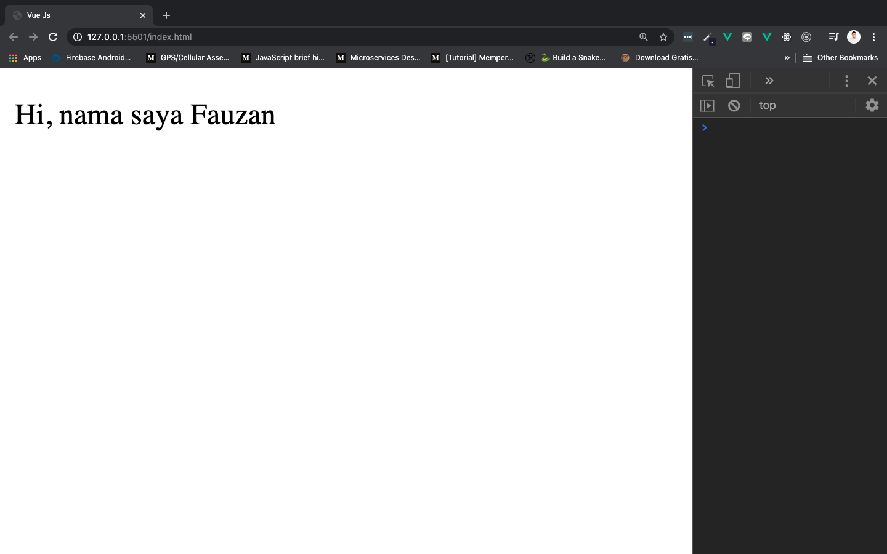
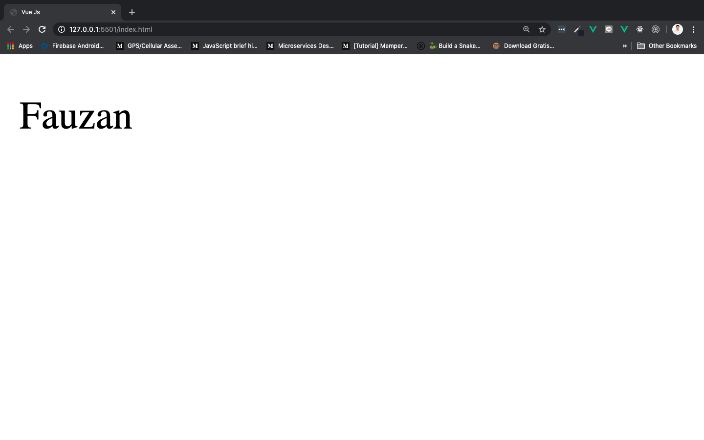
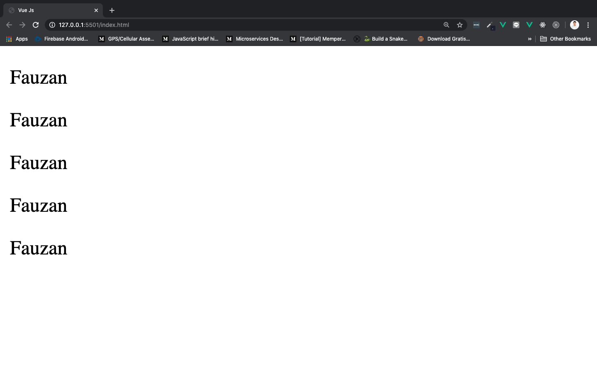

# Component Intro

Pernah belajar HTML? Pernah kepikiran ga untuk membuat element sendiri? Vue adalah framework yang menggunakan sistem component. Artinya, kita bisa membuat element HTML sendiri yang bisa kita gunakan berulang-ulang. Di dalam component terdapat tampilan website kita, yang ketika dipanggil nama componentnya, akan menghasilkan sesuatu yang dibuat menggunakan HTML dan sintak-sintak Vue.

## How to Use

Component bisa dibuat menggunakan 4 cara:

1. Cara pertama, menggunakan `new Vue()`. Tuliskan sintak berikut di dalam tag `<script>`:

    ```js
    new Vue ({
        /* option */
    })
    ```

2. Cara ke dua, menggunakan `Vue.Component()`. Tuliskan sintak berikut di dalam tag `<script>`:

    ```js
    Vue.component('Nama-Component', {
        /* option */
    })
    ```

3. Cara ke tiga, menggunakan ***local component.*** Component yang dibuat dengan cara seperti ini hanya bisa digunakan oleh component lain.

4. Cara ke empat, menggunakan `.vue`. Cara ini sama seperti ***Single File Component.*** Cara ini akan kita bahas terpisah

Mari kita bahas cara 1 - 3 terlebih dahulu.

### Cara Pertama, `new Vue()`

Dengan cara ini, kita menembak element di HTML yang sebelumnya sudah ditandai dengan `.` (class) atau `#` (id). Contohnya jika kita mempunyai element `<div>` dengan id app di HTML:

```html
<div id="app"></div>
```

Maka kita tembak element `<div>` dengan id app tersebut menggunakan `el`. Bungkus sintak di bawah ini dengan tag `<script>`:

```js
new Vue({
    el: '#app'
})
```

`new Vue()` biasanya dijadikan sebagai root component karena tidak mempunyai nama. Tetapi cara ini tidak berlaku untuk SPA (Single Page Application). Dan ketika dijalankan juga tidak menghasilkan apa-apa, karena kita tidak melakukan apa-apa terhadap element `<div>` dengan id app tersebut. Jika tidak ada *error* di console, berarti kita berhasil membuat component. Contohnya seperti berikut:

```html
<!DOCTYPE html>
<html lang="en">
    <head>
        <meta charset="UTF-8">
        <meta name="viewport" content="width=device-width, initial-scale=1.0">
        <title>Vue Js</title>
    </head>
    <body>
        <div id="app"></div>

        <script src="https://cdn.jsdelivr.net/npm/vue@2.6.11"></script>
        <script>
            new Vue({
                el: '#app'
            })
        </script>
    </body>
</html>
```

### Cara ke dua, `Vue.Component()`

Kita juga bisa membuat component yang ada namanya menggunakan `Vue.Component()`. Ini yang mirip seperti membuat element baru di dalam HTML, sehingga kita bisa memanggilnya berulang kali, dan spesifik output component-nya dimasukkan ke dalam `template`. Contoh pembuatan element dengan nama `<user-name />`:

```html
<!DOCTYPE html>
<html lang="en">
    <head>
        <meta charset="UTF-8">
        <meta name="viewport" content="width=device-width, initial-scale=1.0">
        <title>Vue Js</title>
    </head>
    <body>
        <div id="app">
            <user-name></user-name> <!-- Pemanggilan component -->
        </div>

        <script src="https://cdn.jsdelivr.net/npm/vue@2.6.11"></script>
        <script>
            Vue.component("UserName", {
                template: "<p>Hi, nama saya Fauzan</p>"
            })

            new Vue({
                el: '#app'
            })
        </script>
    </body>
</html>
```

Yang perlu diperhatikan dari sintaks di atas adalah:

* Pemanggilan component **harus di dalam div dengan id app**
* Tulisan Vue, `V` - nya **harus huruf besar**
* `UserName` juga bisa dituliskan dengan format `user-name`

Run dan lihat di browser:



Tetapi cara ini tidak berlaku untuk SPA (Single Page Application) juga.

### Cara ke tiga, Local Component

Semua component yang dibuat menggunakan `Vue.component()` sifatnya adalah **global**. Nah, untuk membuat **lokal** component, kita bisa memasukkannya ke dalam sebuah viabel:

```js
const Nama = {
    template: "<p>Fauzan</p>"
}
```

Supaya dia bisa dipakai di component yang lain, kita daftarkan ke dalam `components` seperti berikut ini:

```js
new Vue({
    el: "#app",
    components: {
        Nama
    }
})
```

Contoh sintaks lengkapnya:

```html
<!DOCTYPE html>
<html lang="en">
    <head>
        <meta charset="UTF-8">
        <meta name="viewport" content="width=device-width, initial-scale=1.0">
        <title>Vue Js</title>
    </head>
    <body>
        <div id="app">
            <Nama />
        </div>

        <script src="https://cdn.jsdelivr.net/npm/vue@2.6.11"></script>
        <script>
            const nama = {
                template: '<p>Fauzan</p>'
            }

            new Vue ({
                el: '#app',
                components: {
                    nama
                }
            })
        </script>
    </body>
</html>
```

Kita bisa saja menggunakan lokal component di file yang sama, tetapi biasanya developers lebih suka memisahkannya, dan memasukkan ke dalam component yang lain menggunakan **Javascript module.**

Run dan lihat di browser:



## Reusable Component

Massih menggunakan sintak yang mirip dengan lokal component sbelumnya. Yang membedakan hanya pemanggilan component sebanyak 5x:

```html
<!DOCTYPE html>
<html lang="en">
    <head>
        <meta charset="UTF-8">
        <meta name="viewport" content="width=device-width, initial-scale=1.0">
        <title>Vue Js</title>
    </head>
    <body>
        <div id="app">
            <Nama></Nama>
            <Nama></Nama>
            <Nama></Nama>
            <Nama></Nama>
            <Nama></Nama>
        </div>

        <script src="https://cdn.jsdelivr.net/npm/vue@2.6.11"></script>
        <script>
            const nama = {
                template: '<p>Fauzan</p>'
            }

            new Vue ({
                el: '#app',
                components: {
                    nama
                }
            })
        </script>
    </body>
</html>
```

Yang harus diperhatikan adalah:

* Untuk memmanggil component lebih dari 1x gunakan format `<Nama></Nama>`. Tidak bisa hanya menggunakan `<Nama />`

Run dan lihat di browser:



## Bulding Blocks of Component

Sejauh ini kita melihat bagaimana component menggunakan properti `el` dan `template`.

* `el` hanya bisa digunakan root component yang dibuat menggunakan `new Vue()`, dan merender DOM element ke dalam suatu class ataupun id tertentu
* `template` digunakan supaya kita bisa membuat component template, yang bertanggung jawab untuk mendefinisikan sebuah output dari component tersebut

Ada beberapa properti lain yang bisa digunakan oleh component, dan akan kita bahas nanti:

* `data`: State pada lokal component (tempat penyimpanan data di lokal component)
* `props`: Semua data properti yang kita kirimkan ke child component
* `methods`: Tempat semua fungsi yang *trigger*-nya harus di-*invoke*
* `computed`: Tempat semua fungsi tanpa *trigger* (bisa langsung jalan tanpa dipanggil)
* `watch`: Tempat semua fungsi yang di-*trigger* setiap ada state yang berubah
