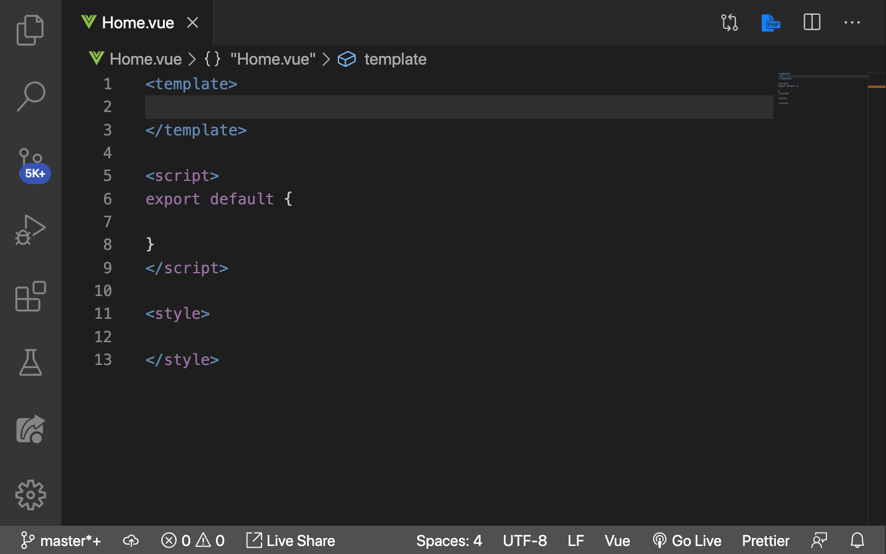

# Single File Components

Kita akan membahas tentang bagaimana **Vue membantu kita dalam membuat Single File Components (SFC) yang bertanggung jawab terhadap segala sesuatu yang berkaitan dengan component**. SFC membuat semua configurasi component kita terpusat, baik itu konfigurasi tampilan ataupun tingkah laku component. SFC hanya bisa digunakan di dalam project Vue yang dibuat menggunakan Vue CLI. **Dalam project Vue semua component di letakkan di dalam folder `components`**.

> ***Tips & trick:*** Jika ingin membuat component baru, buatlah di dalam folder `components`. Jalankan Vue project dengan cara buka terminal yang ada di bagian menu vscode: `terminal > new terminal`. Untuk menjalankan project ketikkan: `npm run serve` tunggu dan project akan muncul di browser dengan url localhost:8080.

Jika teman-teman menggunakan Vetur extension, teman-teman tinggal mengetikkan `<` + `tab`, lalu save file dengan extension `.vue`, contohnya `Home.vue`.

Sintaknya akan menjadi seperti berikut:

```html
<template>
  
</template>

<script>
    export default {

    }
</script>

<style>

</style>
```



Yang harus kita perhatikan di sini adalah:

1. Semua yang dibungkus `<template>` fungsinya sama seperti `template:` yang kita gunakan ketika mendefinisikan `Vue.component()`:

    ```js
    Vue.component("NamaCompoent",{
        template: "<p>Fauzan</p>"
    })
    ```

    Template di sini bisa berisi HTML dan sintaks Vue untuk membuat suatu component. Jika menggunakan `<template>` contoh di atas akan berubah menjadi seperti berikut:

    ```html
    <template>
        <p>Fauzan</p>
    </template>
    ```

2. Semua yang dibungkus `<script>` adalah sintaks Javascript. Kita bisa menuliskan properti di dalam `export default`, contoh membuat properti data `alamat`:

    ```js
    export default {
        data(){
            return {
                alamat: "South Jakarta"
            }
        }
    }
    ```

    Ada beberapa cara untuk menggunakan data properti di dalam component, cara pertama seperti di atas. Cara ke dua:

    ```js
    export default {
        data: function(){
            return {
                alamat: "South Jakarta"
            }
        }
    }
    ```

    > ***Tips & trick:*** **Jangan menggunakan arrow function ES6 pada saat pembuatan properti data.** Karena, kita tidak bisa mengakses property di dalamnya. Dari contoh di atas, jika kita ganti function menjadi arrow function, maka `alamat` tidak bisa digunakan.

    Untuk menggunakan `alamat` di dalam properti yang lain seperti `methods`, kita tambahkan `this.` di depannya sehingga menjadi:

    ```js
    export default {
        data: function(){
            return {
                alamat: "South Jakarta"
            }
        },
        methods: {
            biodata() {
                this.alamat // South Jakarta
            }
        }
    }
    ```

    Kita juga bisa mengimport lokal compoent yang kita punya di dalam tag `<script>`. Misalkan kita punya component dengan nama `Navbar.vue` dan kita ingin memasukkan component tersebut ke dalam component `Home.vue`, **jika ke dua component berada pada folder yang sama, yaitu `components`**, kita tinggal melakukan ini di `Home.vue`:

    > ***Tips & trick:*** Semua component yang ada di dalam folder componets memiliki root component, yaitu `App.vue`. Jika kita ingin menjalankan component yang baru kita buat, jangan lupa daftarkan dulu component baru tersebut ke dalam `App.vue` dengan cara yang sama seperti ini

    ```js
    import Navbar from './components/Navbar.vue'

    export default {
        components: {
            Navbar
        }
    }
    ```

    Lalu gunakan `<Navbar />` di `<template>`:

    ```html
    <template>
        <div>
            <Navbar />
        </div>
    </template>
    ```

    > ***Tips & trick:*** `./` menandakan kita berada di folder `src`. Di dalam `<template>` **hanya boleh mempunyai satu element pembungkus saja**

3. Semua yang dibungkus `<style>` adalah styling yang kita gunakan pada component. Jika kita ingin menerapkan styling pada component ini saja, kita bisa gunakan `scoped`, contohnya seperti berikut:

    ```html
    <style scoped>
        /* Some CSS here .. */
    </style>
    ```

## Separate File

Bisa jadi Javascript atau CSS kita terlalu banyak jika dimasukkan di dalam satu file `.vue` saja, karena itu kita bisa memecah file Javascript ataupun CSS ke dalam file yang berbeda.

Kita bisa menggunakan atribut `src`. Contoh memasukkan file `main.js` dan `main.css` yang **terdapat pada folder yang sama, yaitu components**:

```html
<template>

</template>

<script src="./components/main.js"></script>

<style src="./components/main.css"></style>
```
