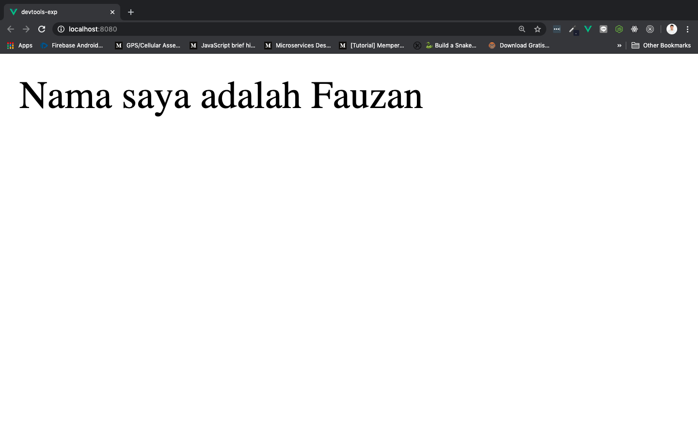
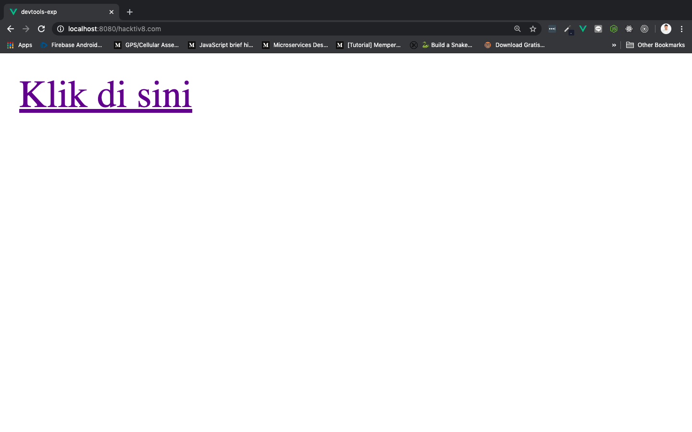
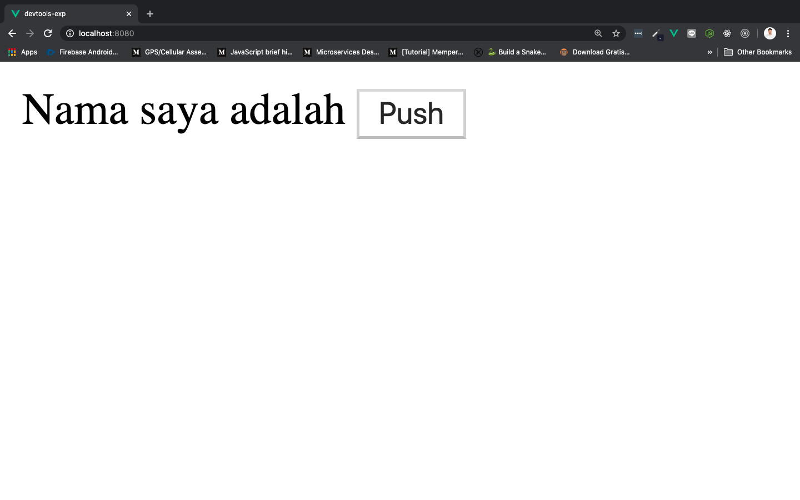
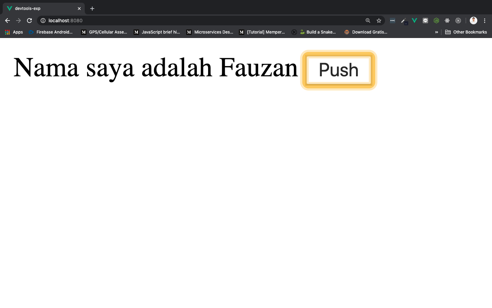

# Templates

Vue menyediakan `<template>` yang bisa kita isikan dengan HTML. Selain itu, HTML yang terdapat di dalam `<template>` juga bisa dimanipulasi dengan 3 hal:

1. ***Interpolation***
2. ***Directives***
3. ***Shorthands***

Kita akan bahas satu persatu. ***Let's go to the first one!***

## ***Interpolation***

Di dalam `<template>`, kita akan sering sekali melihat sintak seperti ini:

```js
{{ /* something */ }}
```

`{{ }}` ini dinamakan ***Mustache*** atau ***Handlebars.***

Selanjutnya perhatikan sintaks component berikut ini:

```html
<template>
  <span>Nama saya adalah {{ name }}</span>
</template>

<script>
    export default {
        data(){
            return {
                name: "Fauzan"
            }
        }
    }
</script>

<style>

</style>
```

Pada sintaks di atas kita melakukan sesuatu yang dinamakan ***binding***, di mana `name` yang berada di dalam `<template>` diapit Handlebars menjadi `{{ name }}`. `name` ini akan berubah isinya sesuai dengan apa yang kita masukkan di dalam name properti, yaitu `Fauzan`. Ketika dijalankan nanti yang muncul di browser adalah `Nama saya adalah fauzan`.

> ***Tips & trick:*** Jangan lupa daftarkan dulu component yang baru di buat ke dalam `App.vue` supaya bisa tampil di browser



Kesimpulannya, ***interpoletion*** adalah **semua *binding* yang dilakukan dengan menggunakan Mustache atau Handlebar (`{{  }}`) di dalam `<template>`**

Ada beberapa fakta ketika kita menggunakan Mustache atau Handlebars:

* Tidak bisa membinding **sintaks HTML**
* Tidak bisa membinding **atribut HTML**
* Bisa membinding 1 [**javascript expressions**](https://developer.mozilla.org/en-US/docs/Web/JavaScript/Guide/Expressions_and_Operators) di dalamnya

## ***Directives***

Sederhananya, **semua atribut yang diwali `v-` di dalam `<template>` adalah directives.** Contohnya seperti berikut ini:

```html
<p v-if="seen">Now you see me</p>
```

Sintak di atas akan menampilkan tulisan `Now you see me` hanya jika `seen` membuat kondisi if menjadi `true`. Sebenarnya sintaks di atas sama seperti ketika kita menggunakan `if()` di bahasa pemrograman. Bedanya, hanya menggunakan `v-` kalau di Vue.

Kita juga bisa melakukan ***binding*** terhadap ***atribut***, ataupun ***event***:

* Atribut dibinding menggunakan `v-bind:[NamaAtribut]="DataProperti"`

    Atribut biasanya berisi `data` properti, misalkan kita ingin membinding atribut `href` yang terdapat pada element `<a>` dengan data `url` yang berisi `hacktiv8.com`, maka:

    ```html
    <a v-bind:href="url" >Klik di sini</a>
    ```

    Jangan lupa tambahkan data `url` yang berisi `hacktiv8.com`:

    ```js
    export default {
        data(){
            return {
                url: "hacktiv8.com"
            }
        }
    }
    ```

    Run dan klik link, maka website akan men-redirect ke localhost:8080/hacktiv8.com. Di sini kita tidak bisa langsung mengarahkan ke website [hacktiv8.com](hacktiv8.com) karena kita belum menggunakan Vue Router. Kita akan bahas Vue Router pada chapter berbeda.

    

* Event dibinding menggunakan `v-on:[NamaEvent]="Method"`

    Event biasanya akan mentrigger suatu `methods`, misalnya kita ingin membinding event dari sebuah `<button>` dan menampilkan name `Fauzan` ke dalam `<template>`. Ini bisa dilakukan menggunakan `v-on`. Buat component seperti berikut:

    ```html
    <template>
        <div>
            Nama saya adalah {{ name }}
            <button v-on:click="dosomething">Push</button>
        </div>
    </template>

    <script>
        export default {
            data(){
                return {
                    name: ""
                }
            },
            methods: {
                dosomething(){
                    this.name = "Fauzan"
                }
            }
        }
    </script>

    <style>

    </style>
    ```

    Pada sintaks di atas, kita mimbinding event `click` menggunakan `v-on` yang akan memanggil methods `dosomething` ketika `Push` diklik. Jalankan dan klik button `Push`, maka akan keluar `Fauzan`.

    Sebelum diklik:

    

    Setelah diklik:

    

## ***Shorthand***

Kita bisa menyingkat `v-bind` dan `v-on` caranya seperti berikut:

* `v-bind`

    Kita bisa mengganti `v-bind` menjadi `:`, caranya seperti berikut:

    ```html
    <!-- full sintaks -->
    <a v-bind:href="url"> ... </a>

    <!-- shorthand -->
    <a :href="url"> ... </a>
    ```

* `v-on`

    Kita bisa mengganti `v-on` menjadi `@`, caranya seperti berikut:

    ```html
    <!-- full sintaks -->
    <a v-on:click="doSomething"> ... </a>

    <!-- shorthand -->
    <a @click="doSomething"> ... </a>
    ```
