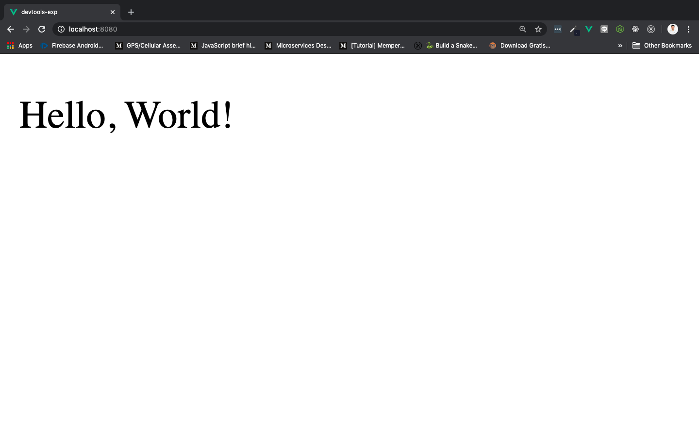
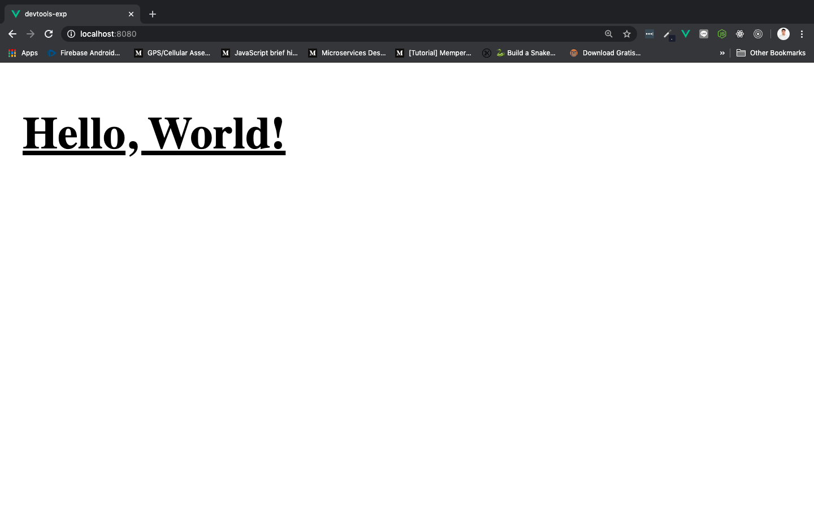

# Styling Components

Untuk menjadi seorang frontend developer yang canggih, kita harus menguasai penggunaan CSS secara mendalam. CSS digunakan untuk memberi ***makeup*** website yang sedang kita kerjakan. Ada banyak sekali cara menggunakan CSS di Vue. Jika teman-teman ingin mengotak-atik tampilan website menggunakan CSS, walupun kita belum membahas tentang `computed` atau `methods` secara mendalam, tetapi saya sangat menyarankan selalu buatlah sebuah `computed` atau `methods` yang memfasilitasi apa yang ingin kita buat menggunakan CSS, supaya kita bisa menggunakan style tersebut berulang kali dan mudah untuk dikembangan.

> ***Tips & trick:*** Jika teman-teman penasaran tentang CSS, silahkan mengunjungi ekstrakulikuler **HTML & CSS Dasar** dan juga ekstrakulikuler **Lebih Dalam Tentang CSS**

Berikut ini kita akan membuat styling menggunakan sebuah **atribut class yang kita *binding***, isi dari atribut class tersbeut adalah sebuah `computed` yang akan memberikan style CSS kepada element `<p>`. Perhatikan sintaks berikut:

```html
<template>
    <div>
        <p :class="styleMethod">Hello, World!</p>
    </div>
</template>

<script>
    export default {
        data(){
            return {
                underline: true,
                bold: true
            }
        },
        computed: {
            styleMethod(){
                return {
                    underline: this.underline,
                    bold: this.bold,
                }
            }
        }
    }
</script>

<style scoped>
.underline {text-decoration: underline;}
.bold {font-weight: bold;}
</style>
```

Penjelasan dan langkah dari sintaks di atas adalah:

1. Buat CSS di dalam `<style>` terlebih dahulu:

    ```css
    .underline {text-decoration: underline;}
    .bold {font-weight: bold;}
    ```

    * `.underline {text-decoration: underline;}` artinya membuat class `underline` mempunyai style berupa garis bawah menggunakan CSS
    * `.bold {font-weight: bold;}` artinya mmebuat class `bold` mempunyai style berupa huruf tebal menggunakan CSS

2. Buat binding pada atribut `class` di element `<p>`, dan masukkan `computed` sebagai valuenya

    ```html
    <p :class="styleMethod">Hello, World!</p>
    ```

    * `styleMethod` adalah nama `computed` yang akan kita buat

3. Buat data yang berisi `boolean` untuk mengaktifkan class yang nanti akan dilakukan lewat `computed`. `true` artinya aktif dan `false` artinya tidak aktif

    > ***tips & trick:*** Jikan teman-teman belum familiar dengan tipe data, seperti *boolean* silahkan tonton ekstrakulikuler **Perkenalan Javascript Modern**

    ```js
    data(){
        return {
            underline: true,
            bold: true
        }
    },
    ```

    * `underline: true` yaitu properti data dengan nama `underline` yang berisi nilai boolean `true`
    * `bold: true` yaitu properti data dengan nama `bold` yang berisi nilai boolean `true`

4. Buat `computed` dengan nama `styleMethod` yang akan mengembalikan nilai berupa class di element `<p>`. Ini disebut juga dengan ***dynamic binding**,* kita bisa mengisikan class yang ada di `<p>` dengan cara seperti ini.

    ```js
    computed: {
        styleMethod(){
            return {
                underline: this.underline,
                bold: this.bold,
            }
        }
    }
    ```

    * `return` diperlukan untuk mengembalikan data `underline` & `bold` ke dalam class di `<p>` jika nilainya `true`
    * `underline: this.underline` berisi true dan akan mengembalikan `underline`
    * `bold: this.bold` berisi true dan akan mengembalikan `bold`

Save dan coba jalankan, hasilnya akan seperti berikut:

Ketika `underline` & `bold` bernilai `false`:



Ketika `underline` & `bold` bernilai `true`:


