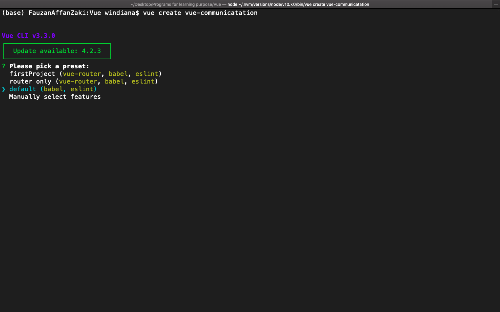
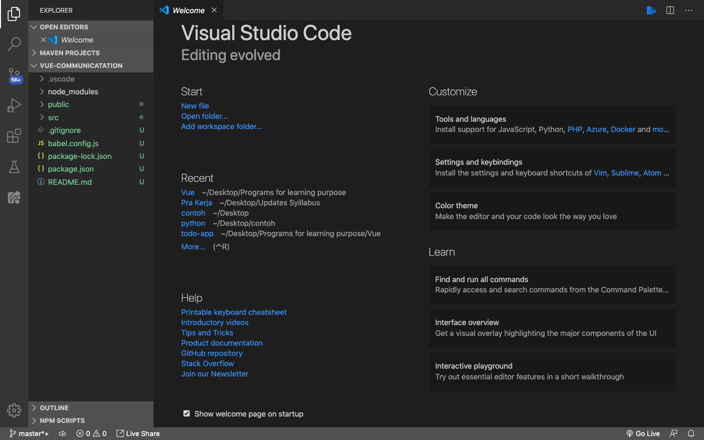
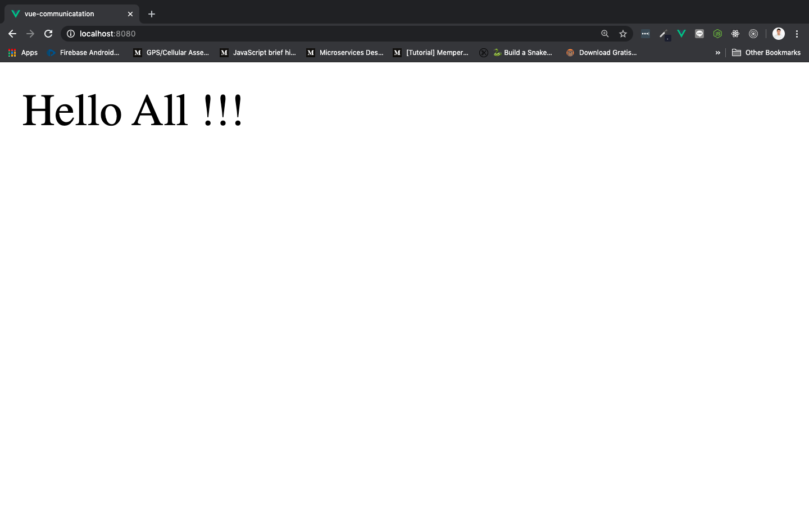

# Parent to Children Components

Untuk **mengirimkan data dari parent component ke children component**, kita bisa mengggunakan `props`.

Sebelum kita masuk lebih dalam tentang pengggunaan `props`, kita buat dulu satu project Vue baru yang nantinya akan kita gunakan sepanjang tutorial *communication among component* ini. Silahkan buka terminal di lokasi tempat kita mau menyimpan project Vue. Saya akan membuat project Vue baru menggunakan CLI dengan nama `vue-communication` menggunakan `default` configuration:



Jika sudah selesai, masuk ke project menggunakan `cd vue-communication`, dan buka menggunakan vscode:



`props` penggunaanya seperti menggunakan atribut di `<template>`, sintaknya kurang lebih seperti berikut di **parent component**:

```html
<NamaChildComponent namaProps="value" />
```

Selanjutnya, pada **children component**, gunakan `props` properti sesuai dengan nama `props` yang kita gunakan di parent component, dan `namaProps` sudah bisa digunakan di `<template>` ataupun properti yang lain menggunakan `.this`:

```js
export default {
    props: ['namaProps']
}
```

Penggunaan di `<template>`:

```html
<template>
    {{ namaProps }}
</template>
```

Penggunaan di properti `methods`:

```js
export default{
    methods: {
        isProps(){
            this.namaProps
        }
    }
}
```

> ***Tips & trick:*** Kita juga bisa mengirim multiple `props` sekaligus. Di parent `<App satu="nama" dua="saya" tiga="raka" />` ditangkap di children menggunakan `props: ['satu','dua','tiga']`

## Passing Props

Buka root component `App.vue` di dalam folder `src`, rubah isinya menjadi seperti berikut:

```html
<template>
  <div id="app">
    <Home :greetings="greetings"/>
  </div>
</template>

<script>
import Home from './components/Home.vue'

export default {
  name: 'App',
  components: {
    Home
  },
  data(){
    return {
      greetings: "Hello All !!!"
    }
  }
}
</script>
```

* `<Home :greetings="greetings"/>` pada sintak ini kita mengirimkan `props` dengan nama `greetings` yang kita binding dengan data, yang isinnya `Hello All !!!` ke child component yaitu `Home.vue`

* `import Home from './components/Home.vue'` jangan lupa import dan daftarkan `Home` ke dalam `components` properti

* Kebetulan kita memiliki nama `props` dan `data()` yang sama, yaitu `greetings`

Selanjutnya di dalam folder `components`, buat component `Home.vue`, dan isikan seperti ini:

```html
<template>
  <div>{{ greetings }}</div>
</template>

<script>
export default {
    name: 'Home',
    props: ['greetings']
}
</script>

<style>

</style>
```

* `props: ['greetings']` digunakan untuk menangkap `props` yang dioper dari parent component, yaitu `App.vue`

Save dan run di terminal dengan `npm run serve`, di browser akan menjadi muncul tulisan seperti ini:


