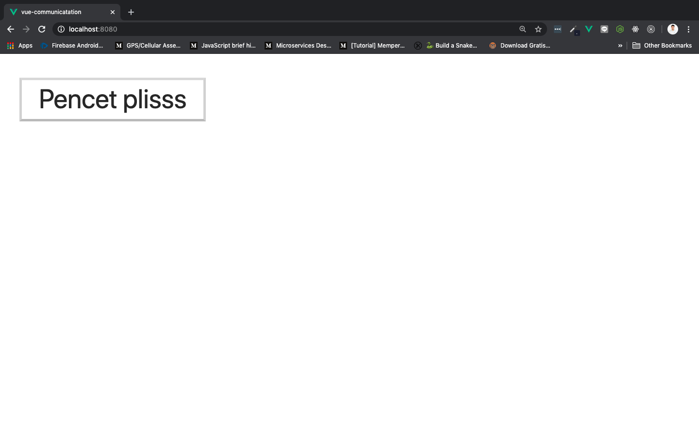
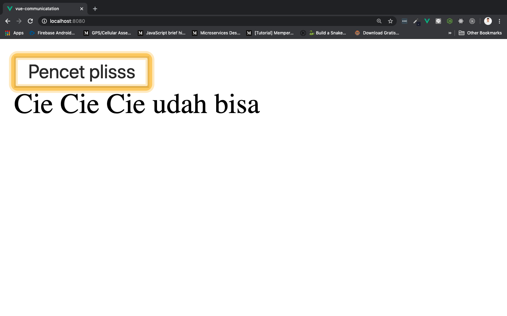

# Children to Parent Components

Untuk **mengirimkan data dari children component ke parent component**, kita bisa mengggunakan sebuah ***event***. Ini sedikit berbeda dengan penggunaan `props`, karena kita harus mengirimkan sebuah `methods` menggunakan perintah `this.$emit()` ke dalam parent component, melalui sebuah `methods` di children. Si `methods` ini juga tentu bisa kita isikan parameter di dalamnya. Kelihatannya ribet banget ya? Tenang kita akan bahas semuanya!

Pada **children component**,  `this.$emit()` penggunaanya kurang lebih seperti berikut:

```js
methods: {
    contohEmit(){
        this.$emit("namaMethods", parameter1, parameter2, dll)
    }
}
```

Selanjutnya, pada **parent component**, buat ***event*** yang sesuai dengan nama `methods` yang kita buat di children, untuk membuat event kita akan menggunakan `v-on:` atau `@` dan buatlah sebuah `methods` untuk mendapatkan parameternya:

```html
<template>
  <ChildrenComponent @namaMethods="handleChildren" />
</template>

<script>
import ChildrenComponent from './components/ChildrenComponent.vue'

export default {
    name: 'Home',
    components: {
        ChildrenComponent
    },
    methods: {
        handleChildren(parameter1, parameter2, dll){
            // do something here
        }
    }
}
</script>
```

## Passing Event

Masih menggunakan project Vue yang sama, yaitu `vue-communication`. Buka children component `Home.vue` di dalam folder `src/compoennts/`, rubah isinya menjadi seperti berikut:

```html
<template>
  <div>
      <button @click="isClicked">Pencet plisss</button>
  </div>
</template>

<script>
export default {
    name: 'Home',
    data(){
        return {
            isi: "Cie Cie Cie udah bisa"
        }
    },
    methods: {
        isClicked(){
            this.$emit("handleButtonChildren", this.isi)
        }
    }
}
</script>

<style>

</style>
```

* `<button @click="isClicked">Pencet plisss</button>` ini kita gunakan untuk memanggil `methods` `isClicked()`

* `isi: "Cie Cie Cie udah bisa"` ini akan kita gunakan sebagai parameter, yang kita passing ke `App.vue`

* `this.$emit("handleButtonChildren", this.isi)` membuat sebuah event baru dengan nama `handleButtonChildren` dan menambahkan 1 buah parameter yang diambil dari data, yaitu `isi`

Selanjutnya buka parent component kita, yaitu `App.vue` dan isikan seperti ini:

```html
<template>
  <div id="app">
    <Home @handleButtonChildren="handleChildren"/>
    {{ bisa }}
  </div>
</template>

<script>
import Home from './components/Home.vue'

export default {
  name: 'App',
  components: {
    Home
  },
  data(){
    return {
      bisa: ""
    }
  },
  methods: {
    handleChildren(isi){
      this.bisa = isi
    }
  }
}
</script>
```

* `<Home @handleButtonChildren="handleChildren"/>` menggunakan event yang tadi kita buat di children, yaitu `handleButtonChildren`, dan memanggil `methods` baru di parent dengan nama `handleChildren`

* `{{ bisa }}` buat membinding data `bisa`

* `import Home from './components/Home.vue'` jangan lupa impor dan daftarkan di `components`

* `bisa: ""` digunakan untuk menyimpan parameter yang dioper dari children, defaultnya masih string kososng

* `handleChildren(isi){` adalah `methods` baru yang digunakan khusus untuk menangani `methods` yang dioper ke parent dari children. Methods ini menggunakan parameter (`isi`) karena di children juga menggunakan parameter yang dibinding dari datanya (`this.isi`)

* `this.bisa = isi` mengisi data `bisa` dengan parameter `isi`

Save dan run di terminal dengan `npm run serve`, di browser akan muncul sebuah button dari children seperti ini:



Ketika diklik:


