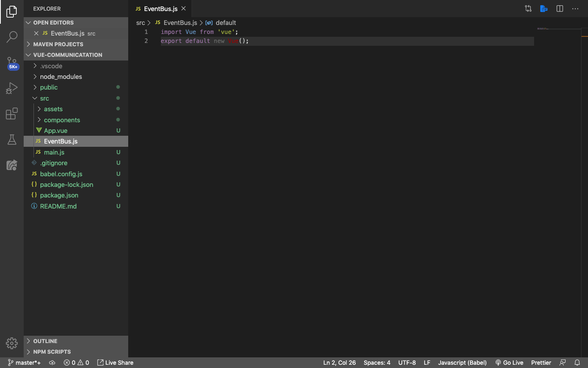
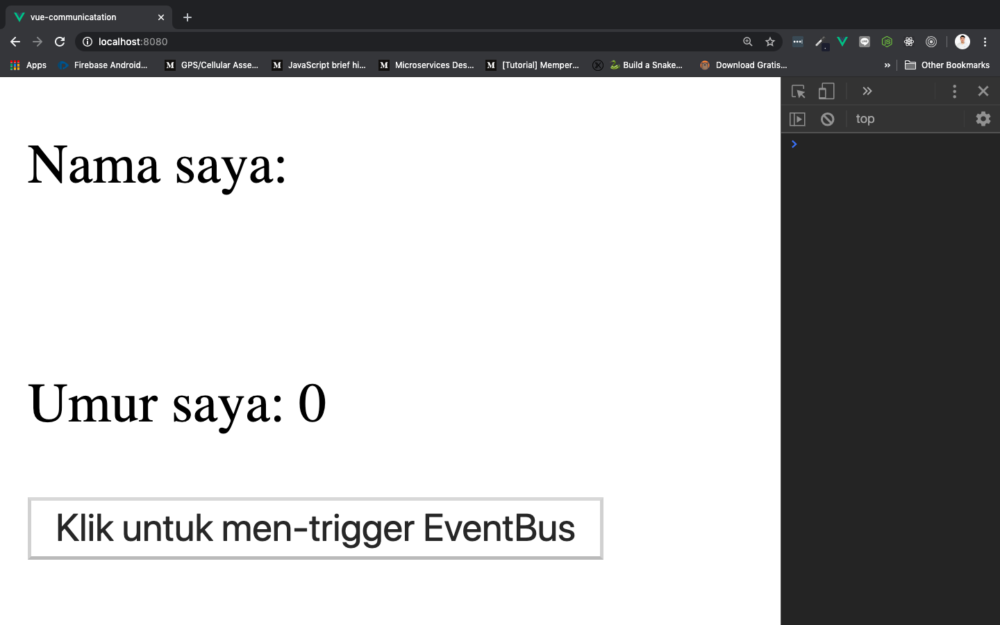
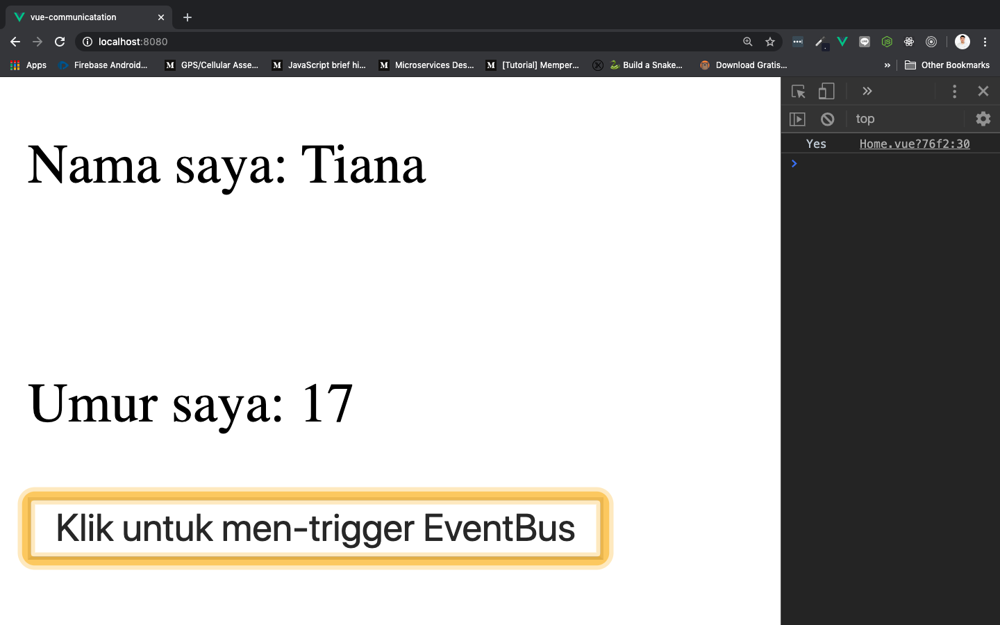

# Communication with All Components

Tentunya, ada banyak cara untuk berkomunikasi antar component di Vue. Dari mulai yang paling sederhana seperti menggunakan `props` untuk parent ke children component dan `this.$emit` untuk children ke parent, sampai yang kompleks dengan menggunakan library seperti [Vuex](https://vuex.vuejs.org/).

> ***Tips & trick:*** Jika teman-teman penasaran tentang penggunaan Vuex, silahkan teman-teman tonton ekstrakulikuler **Merapihkan Data Dengan Vuex**

Nah, biasanya `EventBus` digunakan untuk keperluan interaksi antar component web aplikasi yang tidak terlalu besar dan kompleks. **`EventBus` digunakan untuk berkomunikasi antar component, tanpa mengenal parent component ataupun children component.** Penggunaanya juga cukup berbeda dengan `porps` atau `emit`. Yang dikirimkan `EventBus` adalah sebuah method, kurang lebih sama seperti penggunaan `emit`, hanya saja beda pada saat menerima method tersebut. Dan kita harus mengimport `EventBus` di setiap component yang menggunakannya.

Pertama-tama buat dulu sebuah file Javascript dengan nama bebas (saya rekomendasikan **EvenBus.js**), yang berisi [*instance*](https://www.proweb.co.id/articles/js/instance-object.html) dari Vue:

```js
import Vue from 'vue';
export default new Vue(); // Export instance Vue
```

***Import*** terlebih dahulu EventBus.js pada **component yang mau mengirim method** (*passing method*). Untuk mengirimkan sebuah method ke component tujuan kita menggunakan `EventBus.$emit()`:

```js
import EventBus from '../EventBus.js' // Jika EventBus berada di dalam folder src tetapi di luar folder components

export default {
    methods: {
        kirimEventBus() {
            EventBus.$emit("NamaMethod", parameter1, parameter2, dll)
        }
    }
}
```

***Import*** terlebih dahulu EventBus.js pada **component yang mau menerima method** (*receiving method*). Untuk menerima sebuah method dari component asal kita menggunakan `EventBus.$on()`, dan kita bisa langsung menggunakan arrow function di dalamnya. Nah, di sini kita menggunakan [Vue lifecycle](https://www.youtube.com/watch?v=NBi6mUeInmk) yang bernama `create()`:

> ***Tips & trick:*** Jika teman-teman ingin mengetahui lebih dalam tentang Vue lifecycle, silahkan tonton [video berikut ini](https://www.youtube.com/watch?v=NBi6mUeInmk)

```js
import EventBus from '../EventBus.js' // Jika EventBus berada di dalam folder src tetapi di luar folder components

export default {
    created() {
        EventBus.$on("NamaMethod", (parameter1, parameter2, dll) => {
            // do something here
        })
    }
}
```

## Inisialisasi

Pertama, kita buat dulu EventBus.js di dalam folder `src` (jika ingin lebih rapih boleh buat satu folder lagi untuk menampung file EventBus.js), lalu kita ***export*** supaya setiap component bisa mengenalinya. Cara membuatnya sangat gampang dengan sintaks berikut ini:

```js
import Vue from 'vue';
export default new Vue(); // Export instance Vue
```



## Passing Method

Ke dua, buat satu component baru dengan nama `About.vue`, dan isikan seperti berikut ini:

```html
<template>
  <div>
      <button @click="clicked">Klik untuk men-trigger EventBus</button>
  </div>
</template>

<script>
import EventBus from '../EventBus.js'; // jika disimpan ke dalam folder lain: import EventBus from '../nama-folder/EventBus.js';

export default {
    name: 'About',
    data(){
        return {
            nama: "Tiana",
            umur: 17
        }
    },
    methods: {
        clicked(){
            const about = {
                nama: this.nama,
                umur: this.umur
            }

            EventBus.$emit("aboutComponent", about)
        }
    }
}
</script>
```

> ***Tips & trick:*** `../` digunakan untuk **keluar 1x dari folder file yang saat ini sedang dibuka**

* `<button @click="clicked">Klik untuk men-trigger EventBus</button>` buat button untuk mentrigger method `clicked`

* Membuat data `nama` dengan isi `Tiana` dan `umur`-nya `17`

    ```js
    data(){
        return {
            nama: "Tiana",
            umur: 17
        }
    }
    ```

* Memasukkan data ke dalam objek dengan nama `about`

    ```js
    const about = {
        nama: this.nama,
        umur: this.umur
    }
    ```

* `EventBus.$emit("aboutComponent", about)` mengirimkan method `aboutComponent` dengan parameter `about` yang berisi data `nama` dan `umur`

Jangan lupa daftarkan compoennt baru `About.vue` ini ke dalam root compoennt, `App.vue` seperti berikut:

```html
<template>
  <div id="app">
    <Home />
    <About />
  </div>
</template>

<script>
import Home from './components/Home.vue'
import About from './components/About.vue'

export default {
  name: 'App',
  components: {
    Home,
    About
  }
}
</script>
```

## Receiving Method

Ke tiga, buka component `Home.vue` dan rubah isinya menjadi seperti berikut:

```html
<template>
  <div>
      <p>Nama saya: {{ about.nama }}</p>
      <br>
      <p>Umur saya: {{ about.umur }}</p>
  </div>
</template>

<script>
import EventBus from '../EventBus.js' // jika disimpan ke dalam folder lain: import EventBus from '../nama-folder/EventBus.js';

export default {
    name: 'Home',
    data(){
        return {
            about: {
                nama: "",
                umur: 0
            }
        }
    },
    methods: {
        updateAbout(about){
            this.about = about
        }
    },
    created() {
        EventBus.$on("aboutComponent", about => {
            this.updateAbout(about)
            console.log("Yes")
        })
    }
}
</script>
```

* Menggunakan binding dari data `about` yang di dalamnya terdapat data lagi, yaitu `nama` dan `umur`. Pemanggilannya menggunakan dipisah dengan `.` (titik)

    ```html
    <template>
        <div>
            <p>Nama saya: {{ about.nama }}</p>
            <br>
            <p>Umur saya: {{ about.umur }}</p>
        </div>
    </template>
    ```

* Nested `about` data

    ```js
    data(){
        return {
            about: {
                nama: "",
                umur: 0
            }
        }
    }
    ```

    > ***Tips & trick:*** Data juga sering disebut dengan ***state***

* Method `updateAbout` dengan parameter `about` untuk merubah isi state

    ```js
    methods: {
        updateAbout(about){
            this.about = about
        }
    }
    ```

* `created() {` adalah sebuah lifecycle di Vue, di mana isinya akan dijalankan sebelum component di-render ke dalam DOM

    ```js
    created() {
        EventBus.$on("aboutComponent", about => {
            this.updateAbout(about)
            console.log("Yes")
        })
    }
    ```

    -> `EventBus.$on("aboutComponent", about => {` menggunakan `EventBus.$on` untuk mengambil method `aboutComponent` dan parameter about.

    -> `this.updateAbout(about)` ini dinamakan teknik ***subscribe***, yaitu memanggil `methods` dan mengirimkan parameter `about` untuk melakukan update data di state

    -> `console.log("Yes")` memastikan `EventBus` terpanggil di console ketika button diklik

Save dan jalankan menggunakan `npm run serve`, di browser akan menampilkan seperti berikut:

Sebelum diklik:



Setelah diklik:


