# Router Intro

Kita sudah mengetahui banyak sekali informasi terkait tentang Vue. Kali ini, kita akan berkenalan dengan [Vue Router](https://router.vuejs.org/) yang memfasilitasi developer membuat [Single Page Application (SPA)](https://en.wikipedia.org/wiki/Single-page_application). Router sangat penting bagi SPA, jika tidak menggunakan Router kita tidak bisa membuat SPA.

Di dalam SPA hanya terdapat ***1 halaman*** saja, bisa jadi hanya file `index.html` saja. Halaman tunggal ini kemudian digunakan untuk mensimulasikan perpindahan antar halaman ke pengguna. URL memang berubah di browser, tetapi, Vue sebenarnya hanya merender ulang halaman `index.html` tunggal ini ketika URL berubah. Ini memberikan efek kepada pengguna, seperti mengunjungi halaman HTML yang berbeda, tetapi pada kenyataannya, itu selalu **halaman yang sama yang mendapatkan rendering ulang**. Dengan pendekatan ini, kita tidak lagi memuat halaman baru pada setiap permintaan *http* ke *server* dan kemudian menampilkan component Vue ke bagian halaman yang baru. Sebagai gantinya, seluruh aplikasi ditangani melalui Vue. Untuk membuat SPA seperti ini, kita perlu belajar tentang bagaimana pengaturan navigasi menampilkan component di halaman yang sama menggunakan Vue Router.

## Instalasi

**Dengan router kita akan mengganti komponen yang berbeda dalam website** untuk mencapai komposisi yang diinginkan. **Kita bisa menganggap setiap component sebagai halaman web berbeda**. Sebelum kita bisa melakukan hal seperti itu, kita harus benar-benar mengatur router di project Vue kita terlebih dahulu.

Ada 2 cara untuk melakukan instalasinya:

1. Menggunakan Vue CLI (recommended)
2. Menggunakan `npm install`

### Menggunakan Vue CLI (recommended)

Kenapa recommended? Karena menggunakan cara ini kita sudah otomatis dibuatkan konfigurasi folder & filenya oleh Vue. Jadi tidak usah lagi repot-repot mengimport router, mengatur `routes`, dan lain-lain. Langkahnya seperti berikut:

1. Buka terminal dan seperti biasa kita membuat project baru di Vue, kita membuat project baru menggunakan `vue create nama-project`. Nama project yang saya buat adalah `vue-router-project`. Selanjutnya pilih ***Manually Select Features.***

    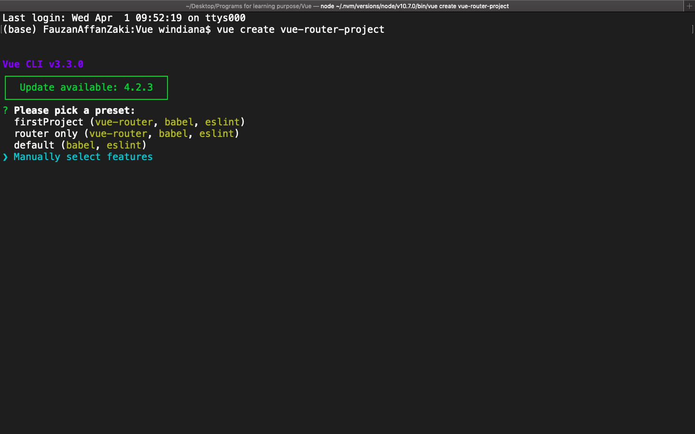

2. Arahkan kursor ke bawah menggunakan keypad, pilih `Router` dan tandai menggunakan keypad `spasi`.

    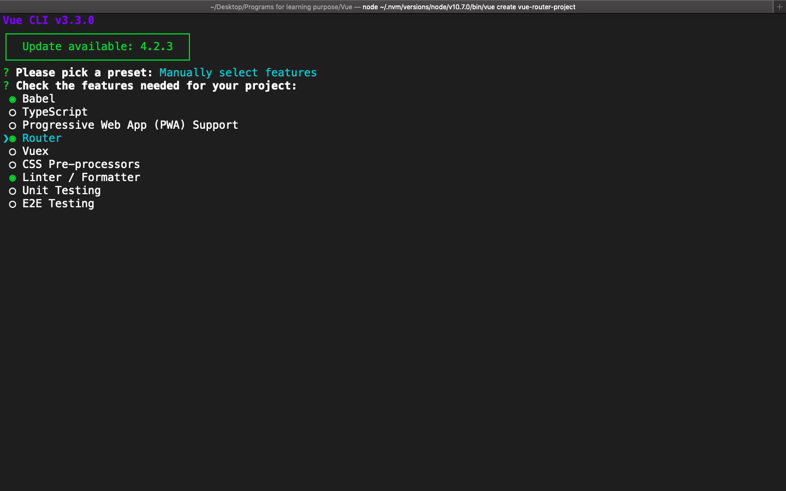

3. *Use history mode for router?* Ketikkan `Y` saja. History mode menghilangkan ***hashtag*** di url. Ketika kita menggunakan router akan ada tambahaan hashtag dibelakang seperti ini **localhost:8080/`#`**, untuk menghilangkan hashtag tersebut, kita harus menggunakan history mode.

    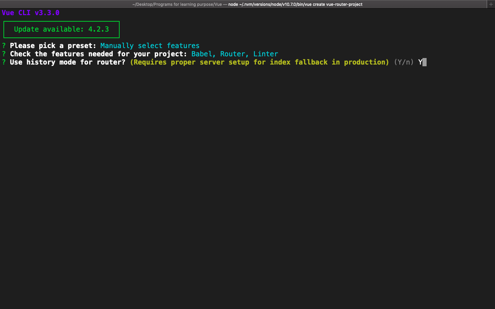

4. *Pick a linter / formatter config:* Karena aplikasi kita kecil, sehingga tidak membutuhkan ESlint yang massive. Pilih saja ***ESLint with error prevention only.***

    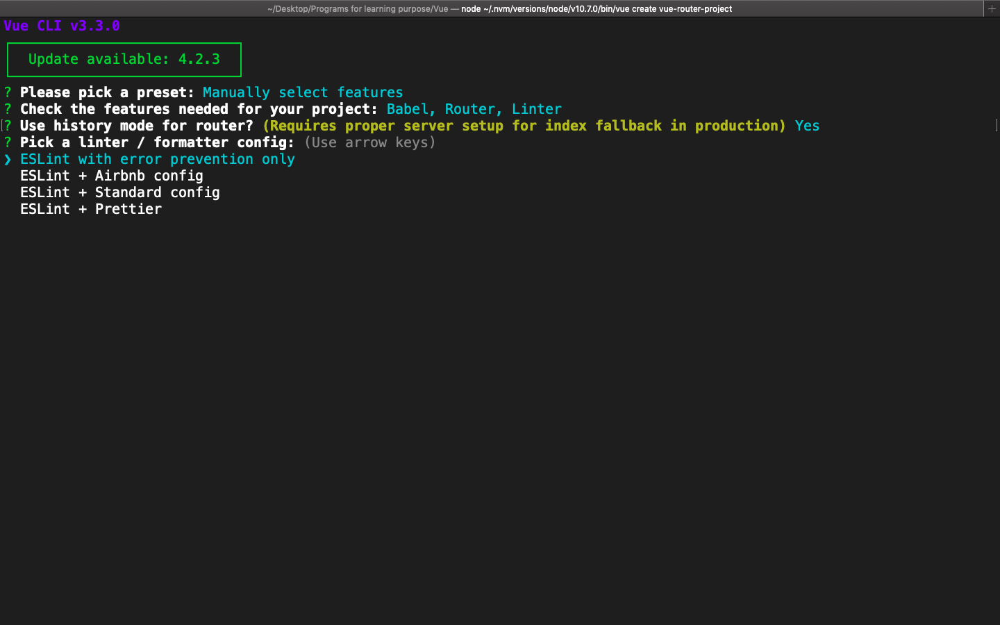

5. *Pick additional lint features:* Kita ingin diperiksa sintaks nya setiap kali kita save, *so yes* ***Lint on save.***

    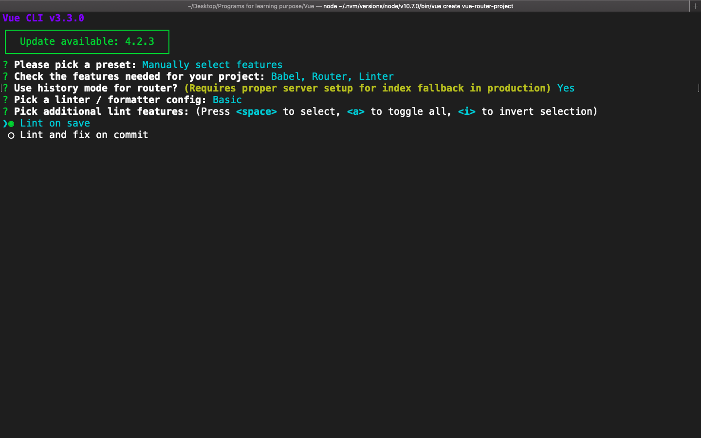

6. *Where do you prefer placing config for Babel, PostCSS, ESLint, etc.?* Kita taruh ***in `package.json`***

7. *Save this as a preset for future projects?* Jika kita ketikan `yes` atau `Y` konfigurasi ini akan dimunculkan setiap kali kita ingin membuat project baru menggunakan Vue Create. Saya tidak ingin menyimpannya, oleh karena itu saya ketikkan `N` saja.

    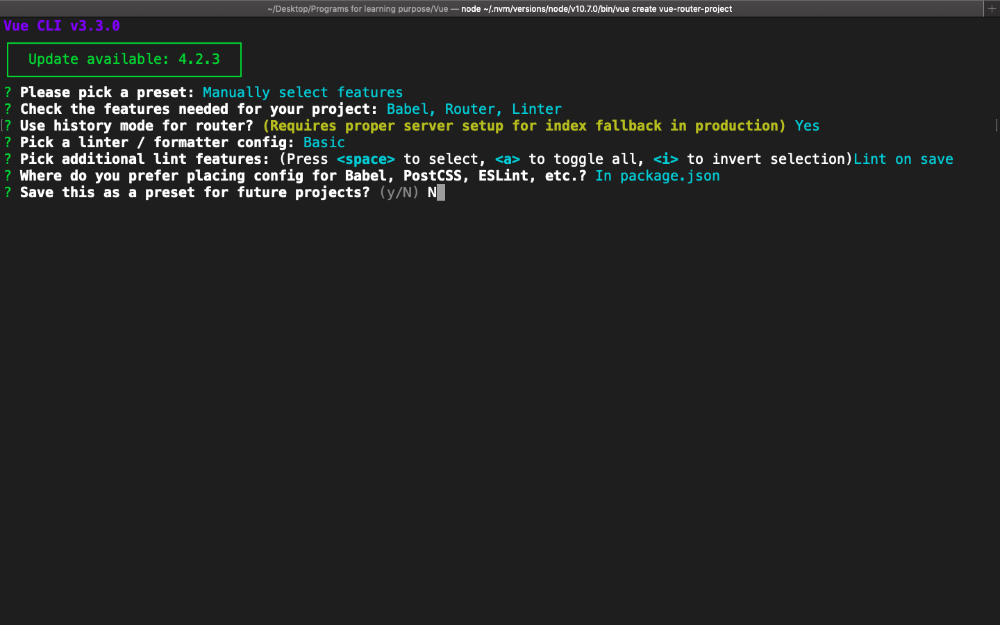

8. Tunggu hingga selesai dan jika sudah selesai, masuk ke folder menggunakan `cd vue-router-project`. Lalu buka di vscode, lihat `package.json` untuk mengetahui router kita sudah terinstal.

    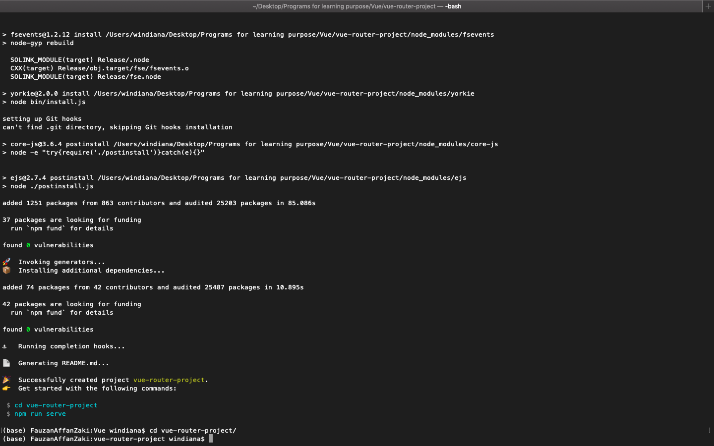

    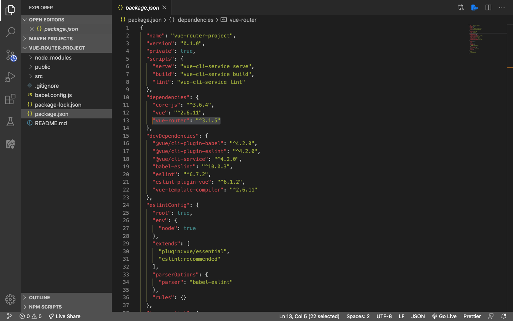

    > ***Tips & trick:*** menggunakan cara ini, router sudah otomatis menyediakan 2 folder, folder `router` yang berisi file `index.js` router yaitu pengaturan routes kita dan folder `views` yang berisi component default dari router (`Home.vue` dan `About.vue`). Router sudah didaftarkan pada `main.js` Vue, dan ada 2 buah `<router-link>` pada `App.vue`

9. Jalankan di terminal menggunakan `npm run serve`, dan tampilannya seperti berikut:

    Component `Home.vue`:

    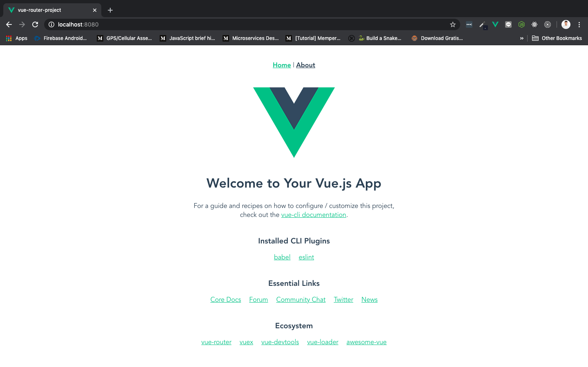

    Component `About.vue`:

    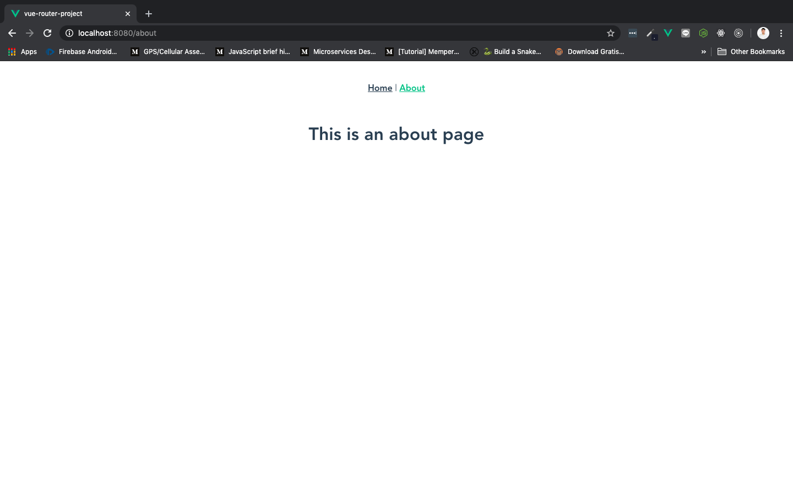

### Menggunakan `npm install`

Misalkan kita sudah mempunyai project Vue tetapi kita belum menambahkan Vue Router di dalamnya. Cara ini bisa digunakan. Buka project vue di terminal dan ketikkan:

```js
npm install --save vue-router
```

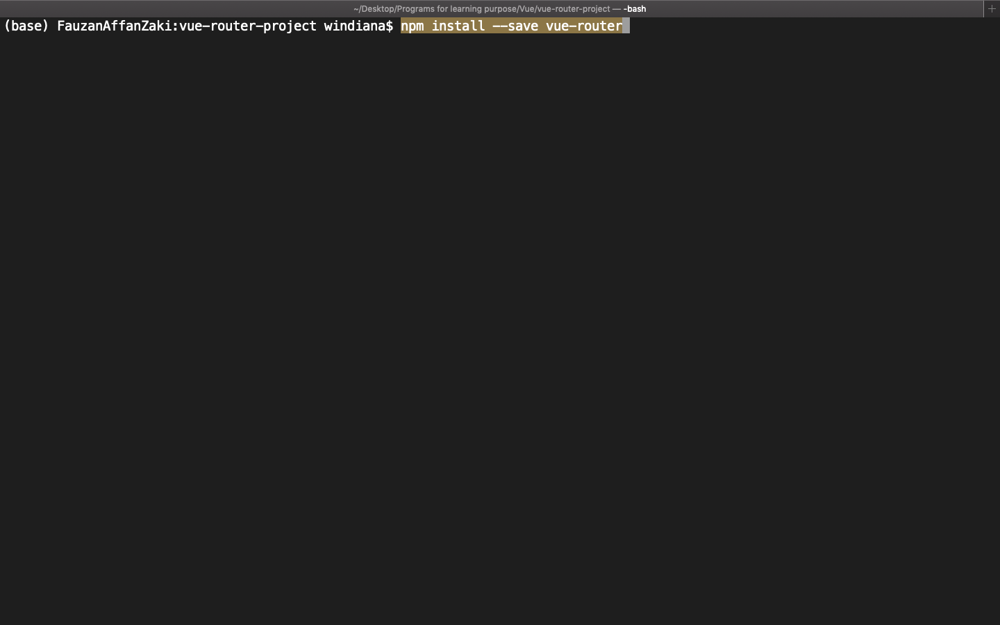

Kita menggunakan bantuan `npm` untuk memasang `vue-router` ke dalam project yang kita punya. `--save` memberitahukan `npm` untuk menginstal `vue-router` di *local dependency* saja (di project ini saja). Buka project di vscode dan cek `package.json` seperti sebelumnya.


Selanjutnya buka file `main.js` dan import router:

```js
import Vue from 'vue'
import VueRouter from 'vue-router'; // import
import App from './App.vue'

Vue.use(VueRouter); // gunakan

new Vue({
    el: '#app',
    render: h => h(App)
});
```

Dengan cara ini, kita masih harus mengatur `routes`, mendaftarkannya ke dalam `main.js`, dll.

## Summary

Okay, sekarang kita sudah mempunyai project Vue dengan router di dalamnya. Pada lesson selanjutnya kita akan membahas bagaimana membuat component dan mengintegrasikannya satu sama lain menggunakan router.
