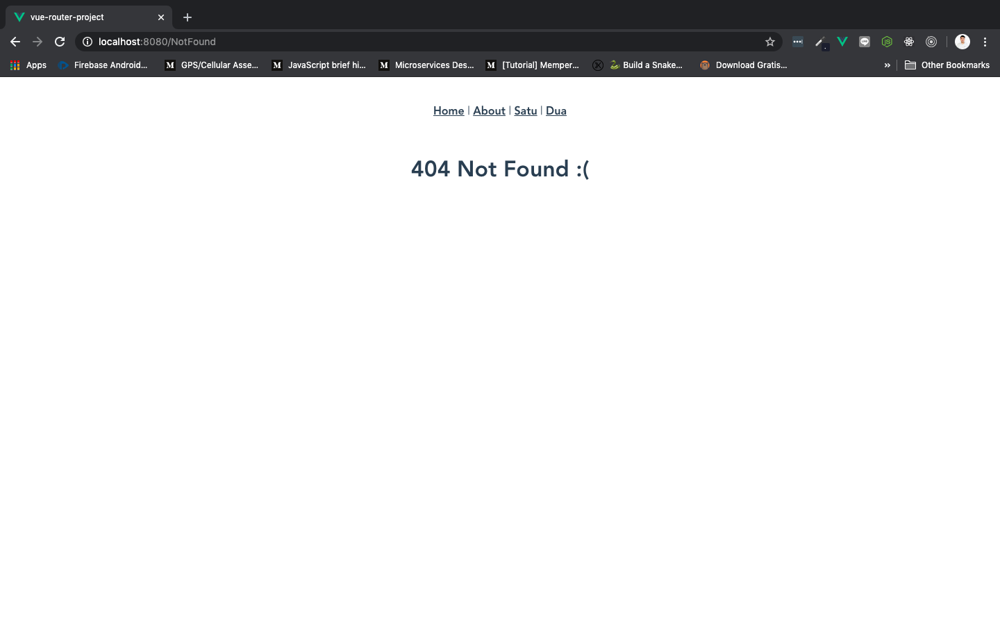

# Redirect

Sama seperti website lainnya, kita mungkin perlu *redirect* user pada saat tertentu. Contoh, **kita dapat mengatur router Vue redirect ke halaman tertentu untuk ditampilkan kepada user**, sehingga jika user mengetik sesuatu ke dalam browser dan halaman yang dituju tidak ada, kita bisa mengirim mereka ke halaman 404 misalnya.

Langsung saja buka `routes` kita di `index.js`, dan tambahkan `route` baru seperti berikut:

```js
{
    path: '/NotFound',
    name: 'NotFound',
    component: () => import('../views/404.vue') // component 404.vue
},
{
    path: '*',
    redirect: '/NotFound'
},
```

* `path: '/NotFound'` digunakan sebagai halaman default jika url tidak ditemukan. Buat juga satu component baru dengan nama `404.vue` di dalam folder `views`, sisikan template saja seperti ini:

    ```html
    <template>
        <div>
            <h1>404 Not Found :(</h1>
        </div>
    </template>
    ```

* `path: '*'` digunakan untuk mengambil semua path, jika ada path yang tidak ditemukan, akan diredirect ke route `redirect: '/NotFound'`

Save dan coba di browser dengan merubah url menjadi `http://localhost:8080/1` lalu enter:


