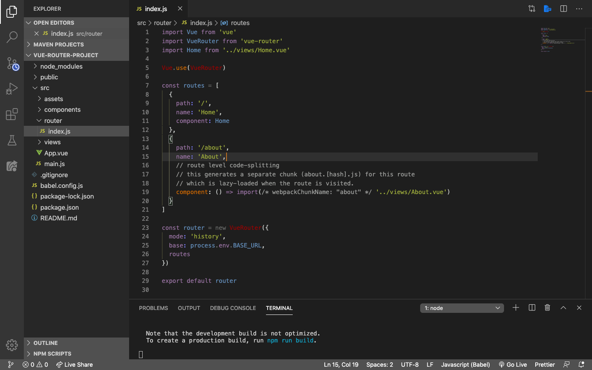
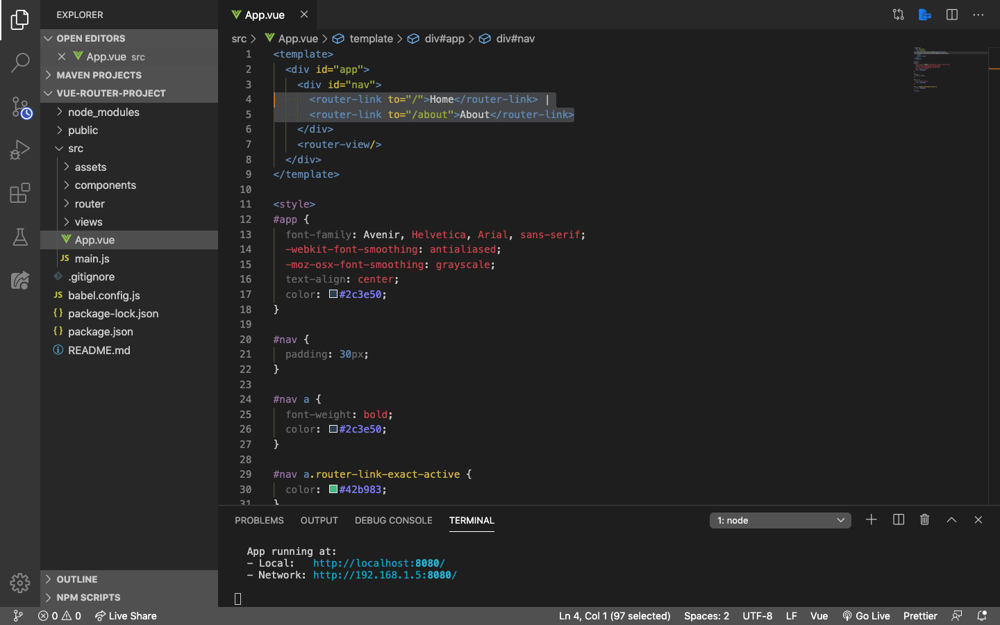

# Router View

Buka file `index.js` yang berada di dalam folder `router`. Dan kita akan melihat 2 buah objek `routes` di sana, yang kita sebut sebagai `route`.



1. Ini adalah `route` pertama:

    ```js
    {
        path: '/',
        name: 'Home',
        component: Home
    }
    ```

    * Route ini menggunakan `path: '/'` yang berarti `root` atau default router

    * Namenya disesuaikan dengan name dari component

    * Component di sini diimport melalui `import Home from '../views/Home.vue'`, yang akan diakses ketika url-nya mengarah ke `root`, yaitu `localhost:8080`

2. Ini adalah `route` ke dua:

    ```js
    {
        path: '/about',
        name: 'About',
        // route level code-splitting
        // this generates a separate chunk (about.[hash].js) for this route
        // which is lazy-loaded when the route is visited.
        component: () => import(/* webpackChunkName: "about" */ '../views/About.vue')
    }
    ```

    * Route ini menggunakan `path: '/about'` kita bisa mengakses url ini dengan mengetikkan `localhost:8080/about` di browser

    * Namenya disesuaikan dengan name dari component

    * Cara pemanggilan component di sini sedikit berbeda dengan `route` pertama. Cara ini kita sebut dengan [lazy-loaded](https://router.vuejs.org/guide/advanced/lazy-loading.html)

3. Hoistory mode yang tadi kita pilih pada saat pembuatan project untuk menghilangkan hashtag, konfigurasinya di sini:

    ```js
    const router = new VueRouter({
    mode: 'history',
    base: process.env.BASE_URL,
    routes
    })
    ```

Selanjutnya, buka file root component `App.vue`. Di sana kita tidak lagi mengimport component home dan about. Kita hanya membungkus Home dan about dengan menggunakan `<router-link>` dan atribut `to` yang sama seperti pada saat kita mendefinisikan `path` pada route kita di folder router, index.js. Ini adalah 2 menu yang ada di bagian atas dari tampilan di browser kita.



* `<router-link>` berfungsi seperti element `<a>` yang bisa kita klik

* `to` berfungsi untuk memberitau Vue, component apa yang akan di tampilkan berdasarkan `route`-nya
