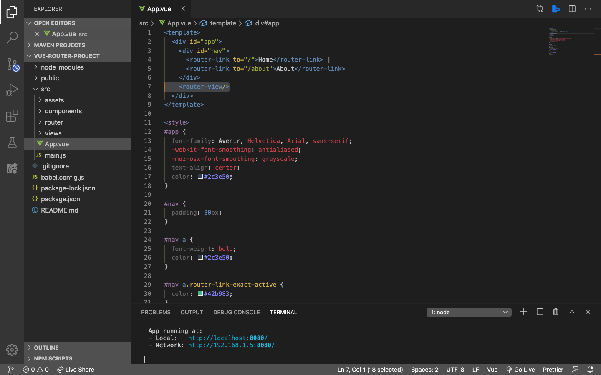
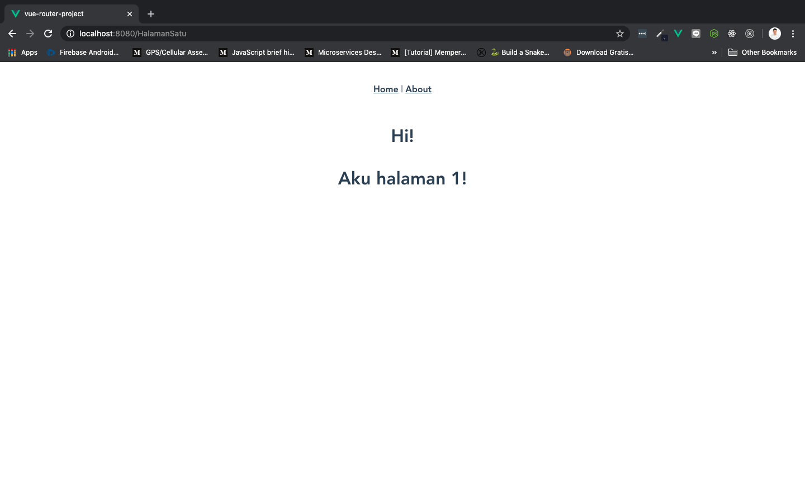
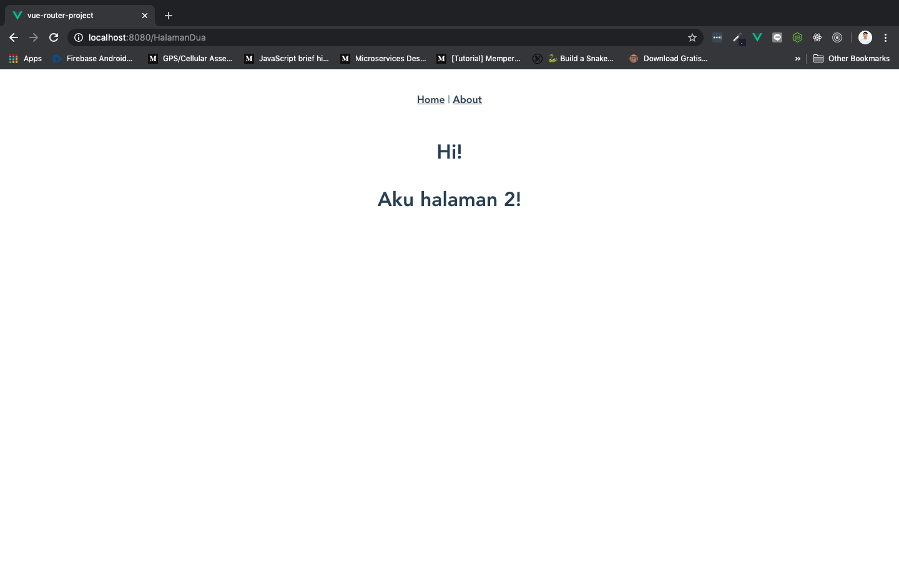

# Router View

Sejauh ini kita memiliki dua `route` yang berbeda, dan setiap `route` akan menampilkan component ketika URL tersebut dikunjungi atau `<router-link>` diklik. Pada titik ini, kita perlu memutuskan di mana components akan di-*render*. Components ini akan dirender dalam root compoennt `App.vue` menggunakan component `<router-view>` bawaan yang otomatis terinstal ketika router diinstal.



## Create New Component

Okay, sekarang kita coba membuat component baru kemudian kita setting `route` nya supaya bisa diakses lewat browser. Di sini saya akan menggunakan folder `views` saja untuk menyimpan semua component.

Pertama, buat compoennt dengan nama `HalamanSatu.vue` di dalam folder `views` dan isikan:

```html
<template>
    <h1>
        Hi!
        <p>Aku halaman 1!</p>
    </h1>
</template>

<script>
    export default {

    }
</script>
```

Buat compoennt dengan nama `HalamanDua.vue` di dalam folder `views` dan isikan:

```html
<template>
    <h1>
        Hi!
        <p>Aku halaman 2!</p>
    </h1>
</template>

<script>
    export default {

    }
</script>
```

Rubah `route` di folder router > index.js menjadi seperti ini:

```js
import Vue from 'vue'
import VueRouter from 'vue-router'

Vue.use(VueRouter)

const routes = [
  {
    path: '/',
    name: 'Home',
    component: () => import('../views/Home.vue')
  },
  {
    path: '/about',
    name: 'About',
    component: () => import('../views/About.vue')
  },
  {
    path: '/HalamanSatu',
    name: 'HalamanSatu',
    component: () => import('../views/HalamanSatu.vue')
  },
  {
    path: '/HalamanDua',
    name: 'HalamanDua',
    component: () => import('../views/HalamanDua.vue')
  },
]

const router = new VueRouter({
  mode: 'history',
  base: process.env.BASE_URL,
  routes
})

export default router
```

Pada sintaks di atas kita menambahkan 2 buah `route` baru, yaitu `HalamanSatu` dan `HalamanDua`, yang masin-masing di target ke component menggunakan `lazy-loaded`. Kita juga merubah pemanggilan component `Home` menggunakan `lazy-loaded`.

Selanjutnya, buka browser dan ketikkan url:

* `localhost:8080/HalamanSatu`

    

* `localhost:8080/HalamanDua`

    