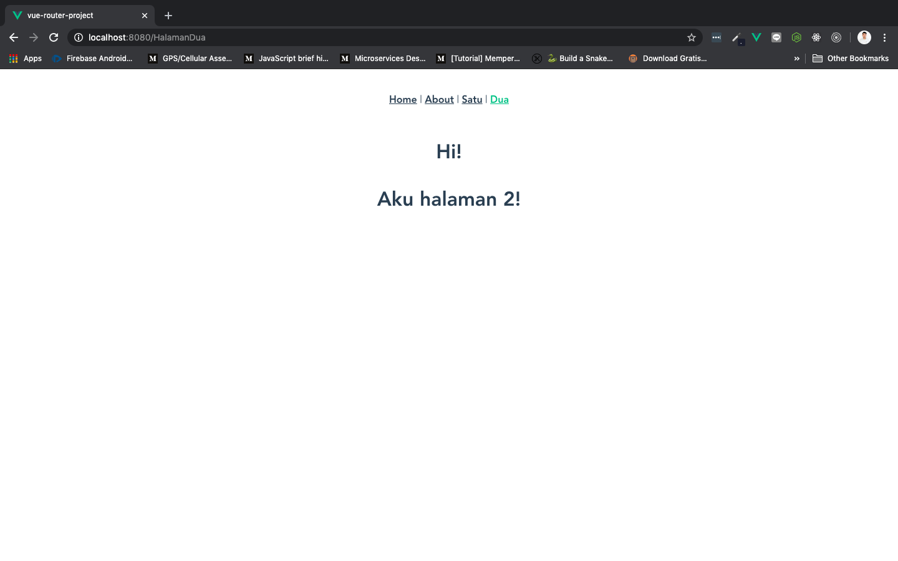

# Router Link

Kalau tadi kita cuma bisa menggunakan url untuk mengakses component `HalamanSatu.vue` dan `HalamanDua.vue`. Sekarang kita akan mengakses mereka menggunakan `<router-link>`. Rencananya, kita akan menambahkan menu `satu` untuk `HalamanSatu.vue` dan `dua` untuk `HalamanDua.vue`, di samping menu Home dan About.

Buka `App.vue` dan rubah isinya menjadi:

```html
<template>
  <div id="app">
    <div id="nav">
      <router-link to="/">Home</router-link> |
      <router-link to="/about">About</router-link> |
      <router-link to="/HalamanSatu">Satu</router-link> |
      <router-link to="/HalamanDua">Dua</router-link>
    </div>
    <router-view/>
  </div>
</template>

<style>
#app {
  font-family: Avenir, Helvetica, Arial, sans-serif;
  -webkit-font-smoothing: antialiased;
  -moz-osx-font-smoothing: grayscale;
  text-align: center;
  color: #2c3e50;
}

#nav {
  padding: 30px;
}

#nav a {
  font-weight: bold;
  color: #2c3e50;
}

#nav a.router-link-exact-active {
  color: #42b983;
}
</style>
```

Pada sintak di atas kita menambahkan:

```html
<router-link to="/HalamanSatu">Satu</router-link> |
<router-link to="/HalamanDua">Dua</router-link>
```

* Ini menambahkan 2 buah menu baru di browser (menu Satu dan Dua)

* `to` diisi seperti mengisikan path di route

Save dan lihat di browser. Akan ada 4 buah menu sekarang, 2 menu Home dan About dengan tambahan menu Satu dan Dua:



