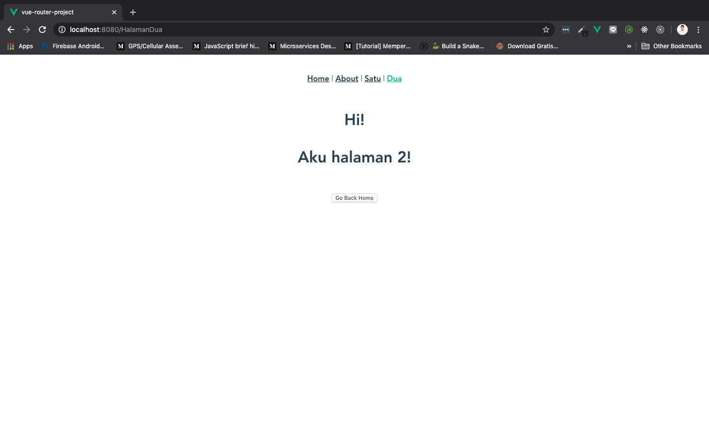

# Router Push

Selain menggunakan `<router-link>` kita juga bisa bernavigasi menggunakan fungsi [this.$router.push()](https://router.vuejs.org/api/#router-push), yaitu salah satu bagian dari [Router Instance Methods](https://router.vuejs.org/api/#router-instance-methods) atau orang-orang juga sering menyebutnya *router object*.

> ***Tips & trick:*** `push()` biasanya digunakan untuk melakukan redirect dengan mengkilk button

Okay, sekarang kita akan coba melakukan redirect dari `HalamanDua.vue` ke root atau `Home.vue`. Pertama buka `HalamanDua.vue` rubah isinya menjadi seperti ini:

```html
<template>
    <h1>
        Hi!
        <p>Aku halaman 2!</p>
        <button @click="redirectHome">Go Back Home</button>
    </h1>
</template>

<script>
    export default {
        name: 'HalamanDua',
        methods: {
            redirectHome() {
                this.$router.push("/")
            }
        }
    }
</script>
```

Save dan coba klik button `Go Back Home` di halaman Dua:



Kita menggunakan `v-on:click` untuk men-trigger method `redirectHome` dan melakukan redirect ke Home menggunakan `this.$router.push("/")`. Jika ingin redirect ke tempat lain tinggal ganti saja `route`-nya. Misalkan ingin ke `HalamanSatu`, tinggal ganti `/` menjadi `/HalamanSatu` sesuai `route`-nya.
