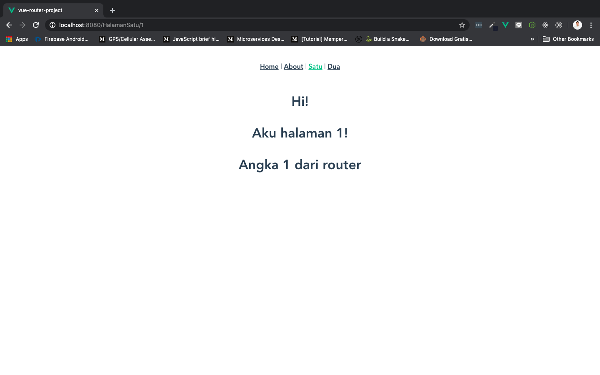
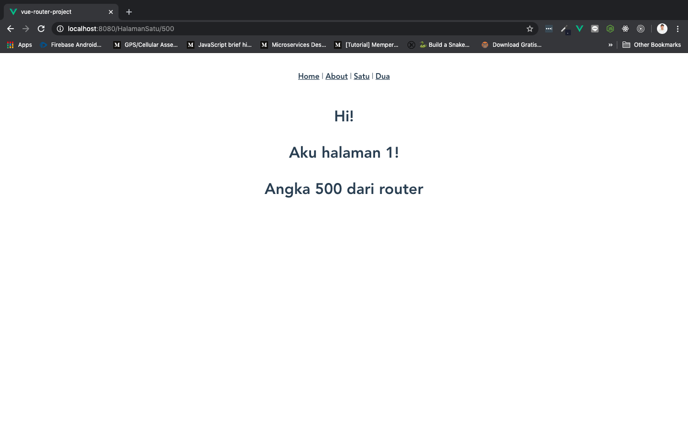

# Router Params

Kita telah mengetahui bagaimana caranya membuat statik `route` di mana tidak ada data yang dimasukkan di dalam componentnya. Selanjutnya, kita akan coba memasukkan data ke component lewat `route`, dengan menjadikanya dinamis. Teknik ini disebut dengan ***router params*** atau **menambahkan parameter di router yang kita punya, supaya bisa menggunakan data yang ada di url di component**.

## Setting Dynamic Params

Sekarang coba buka folder router > index.js, dan rubah `route` `/HalamanSatu` menjadi seperti ini:

```js
{
    path: '/HalamanSatu/:id',
    name: 'HalamanSatu',
    component: () => import('../views/HalamanSatu.vue')
},
```

`:id` merupakan bagian dari `route` `/HalamanSatu` sekarang. Artinya kita bisa memasukkan sebuah data lewat route `localhost:8080/HalamanSatu/:id`. `:id` bisa diganti dengan apa saja. Kita bisa menggunakan `id` di component yang sama, yaitu `HalamanSatu.vue` untuk menerima datanya.

Selanjutnya, buka `App.vue` dan tambahkan angka 1 di akhir bagian `to=/HalamanSatu`. Jangan lupa pisahkan dengan `/` seperti berikut:

```js
<router-link to="/HalamanSatu/1">Satu</router-link>
```

## Retrieving Dynamic Params

Buka component `HalamanSatu.vue`, tambahkan properti data dengan nama `idHalamanSatu` dan binding menggunakan *Mustache.* Untuk menerima `:id` dari `path: '/HalamanSatu/:id'` di index.js, Kita gunakan `this.$route.params.id`, seperti berikut ini:

```html
<template>
    <h1>
        Hi!
        <p>Aku halaman 1!</p>
        <p>Angka {{ idHalamanSatu }} dari router</p>
    </h1>
</template>

<script>
    export default {
        name: 'HalamanSatu',
        data(){
            return {
                idHalamanSatu: this.$route.params.id
            }
        }
    }
</script>
```

Save dan lihat di browser:



Coba rubah url di browser yang belakangnya 1, menjadi apapun, misalkan angka 500 lalu tekan keypad enter:


