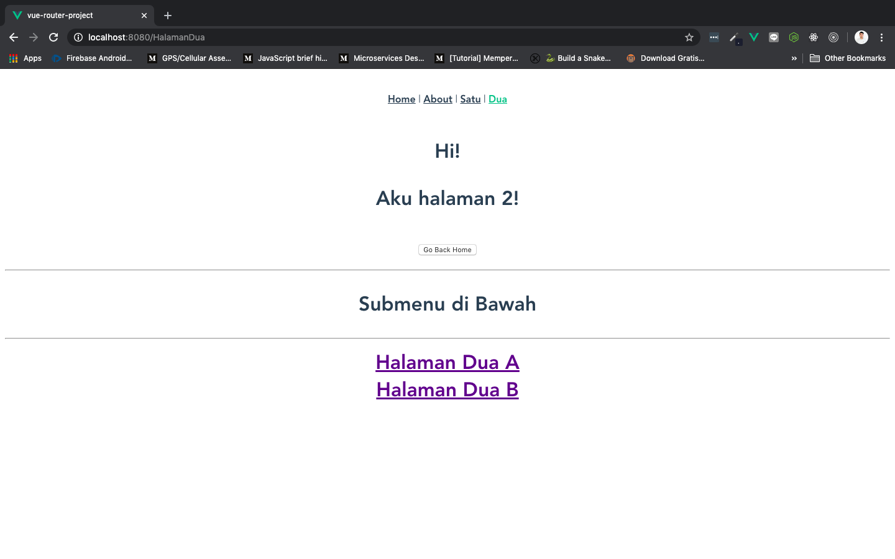
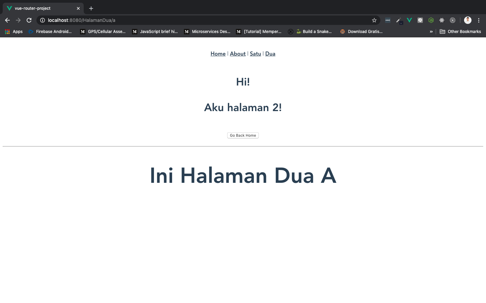
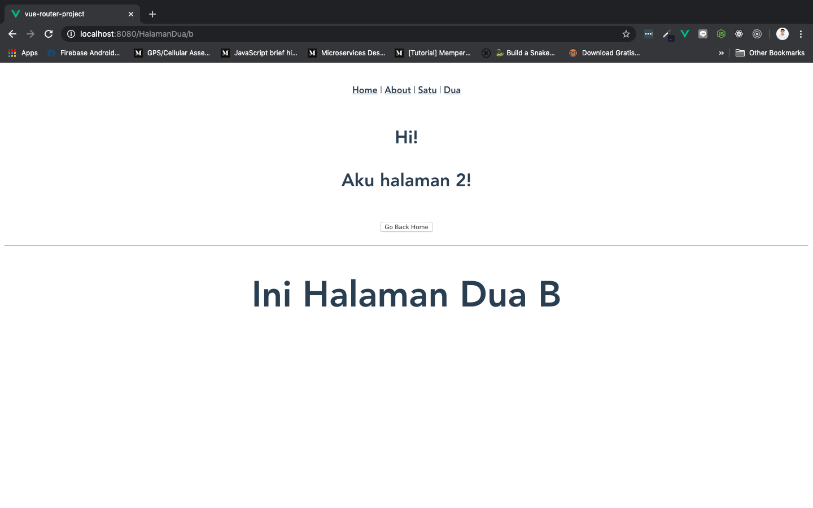

# Nested Routes

Sekarang kita akan melihat bagaimana caranya **membuat `route` di dalam `routes`** yang kita punya, atau istilah kerenya ***nested routes.***

Asumsikan kita **memiliki 2 halaman baru yang juga bisa dikunjungi di dalam `HalamanDua.vue`**, untuk mengatasi ini kita akan buat nested routes, atau sub-component di dalam component yang sudah ada sebelumnya, yaitu `HalamanDua.vue`. Okay, langsung saja kita buka `index.js` yang ada di dalam folder `router`, dan rubah isinya menjadi seperti berikut:

```js
import Vue from 'vue'
import VueRouter from 'vue-router'

Vue.use(VueRouter)

const routes = [
  {
    path: '/',
    name: 'Home',
    component: () => import('../views/Home.vue')
  },
  {
    path: '/about',
    name: 'About',
    component: () => import('../views/About.vue')
  },
  {
    path: '/HalamanSatu/:id',
    name: 'HalamanSatu',
    component: () => import('../views/HalamanSatu.vue')
  },
  {
    path: '/HalamanDua',
    name: 'HalamanDua',
    component: () => import('../views/HalamanDua.vue'),
    children: [
      {
        path: '',
        name: 'HalamanDuaMenu',
        component: () => import('../views/SubMenuHalamanDua/HalamanDuaMenu.vue')
      },
      {
        path: 'a',
        name: 'DuaA',
        component: () => import('../views/SubMenuHalamanDua/DuaA.vue')
      },
      {
        path: 'b',
        name: 'DuaB',
        component: () => import('../views/SubMenuHalamanDua/DuaB.vue')
      },
    ]
  },
]

const router = new VueRouter({
  mode: 'history',
  base: process.env.BASE_URL,
  routes
})

export default router
```

Pada isi `index.js` di atas perhatikan bagian route `/HalamanDua`, di dalamnya terdapat `children`:

```js
{
  path: '/HalamanDua',
  name: 'HalamanDua',
  component: () => import('../views/HalamanDua.vue'),
  children: [
    {
      path: '',
      name: 'HalamanDuaMenu',
      component: () => import('../views/SubMenuHalamanDua/HalamanDuaMenu.vue')
    },
    {
      path: 'a',
      name: 'DuaA',
      component: () => import('../views/SubMenuHalamanDua/DuaA.vue')
    },
    {
      path: 'b',
      name: 'DuaB',
      component: () => import('../views/SubMenuHalamanDua/DuaB.vue')
    },
  ]
},
```

* `path: ''` adalah root dari sub-menu kita, di dalamnya akan berisi `<router-link>` untuk ke path: `a` atau `b`

* Saya membuat folder baru di dalam `views` dengan nama `SubMenuHalamanDua`, dan mengisikannya dengan 3 buah component baru:

  1. Component `HalamanDuaMenu.vue` sebagai root sub-menu
  2. Component `DuaA.vue` sebagai sub-menu
  3. Component `DuaB.vue` sebagai sub-menu

Selanjutnya, kita akan memodifikasi component `HalamanDuaMenu.vue` supaya bisa mengakses `DuaA.vue` dan `DuaB.vue`. Isinya sebagai berikut:

```html
<template>
  <div>
    <hr>
    <p>Submenu di Bawah</p>
    <hr>
    <router-link to="/HalamanDua/a">
      Halaman Dua A
    </router-link>
    <br>
    <router-link to="/HalamanDua/b">
      Halaman Dua B
    </router-link>
  </div>
</template>

<script>
export default {

}
</script>

<style>

</style>
```

* Karena `route` `a` dan `b` adalah sub-menu dari route `/HalamanDua`, maka untuk mengarah ke `a` kita isikan `to="/HalamanDua/a"`. Begitu juga untuk route `b`

Modifikasi isi dari sub-component `DuaA.vue` dan `DuaB.vue` seperti berikut:

Component `DuaA.vue`:

```html
<template>
  <div>
    <hr>
    <h1>Ini Halaman Dua A</h1>
  </div>
</template>
```

Component `DuaB.vue`:

```html
<template>
  <div>
    <hr>
    <h1>Ini Halaman Dua B</h1>  
  </div>
</template>
```

Terakhir, tinggal kita tamabhkan `<router-view>` di component `HalamanDua.vue`, supaya dia bisa menampilkan component `HalamanDuaMenu.vue`. Hasilnya seperti berikut:

```html
<template>
    <h1>
        Hi!
        <p>Aku halaman 2!</p>
        <button @click="redirectHome">Go Back Home</button>
        <router-view></router-view>
    </h1>
</template>

<script>
    export default {
        name: 'HalamanDua',
        methods: {
            redirectHome() {
                this.$router.push("/HalamanSatu")
            }
        }
    }
</script>
```

> ***Tips & trick:*** Button `Go Back Home` sekarang sudah tidak berfungsi karena kita menambahkan `path: '/HalamanSatu'` dengan `:id` supaya dia dinamis

Selanjutnya jangan lupa disave, lalu run, dan lihat di browser:

* Tampilan utama component `HalamanDua.vue` yang terdapat root sub-menu component `HalamanDuaMenu.vue` di bawahnya:

  

* Ketika `<router-link>` **Halaman Dua A** diklik:

  

* Ketika `<router-link>` **Halaman Dua B** diklik:

  
