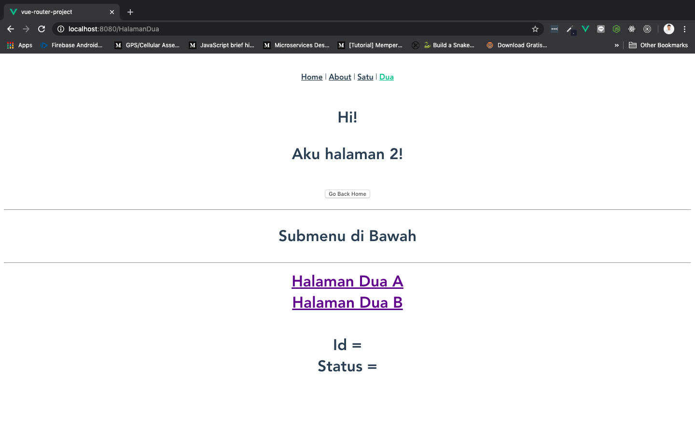
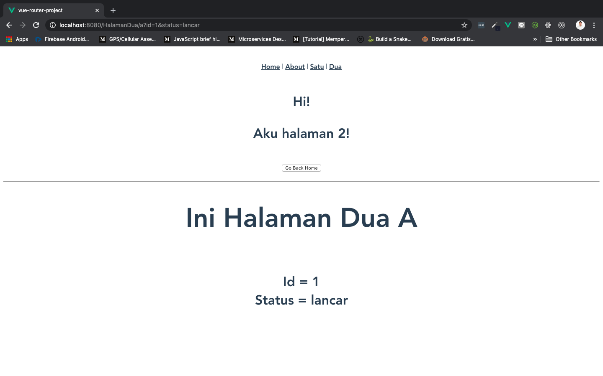
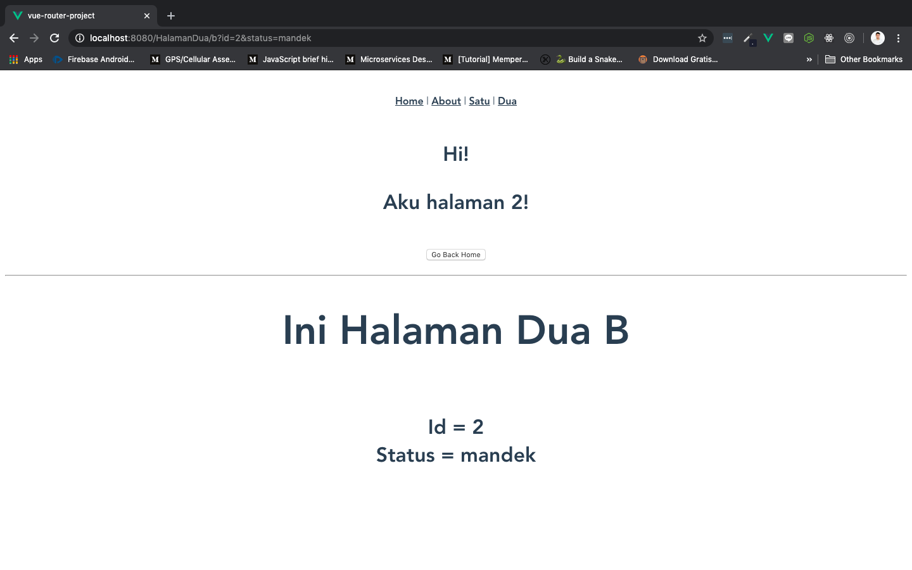
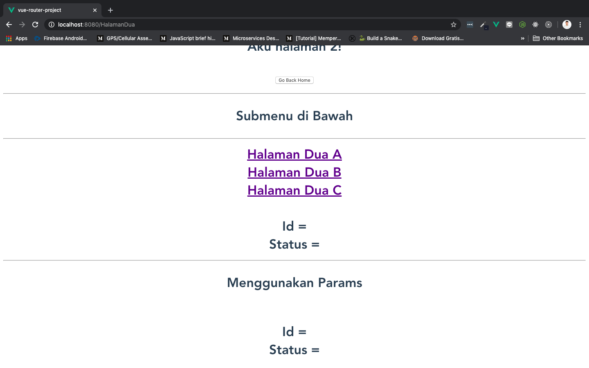
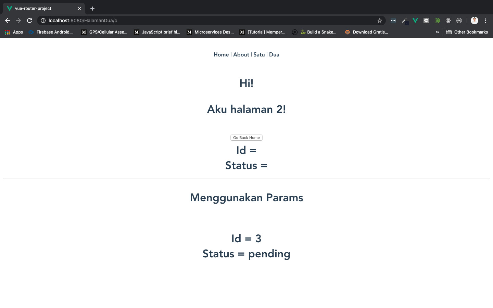

# Query Parameters

Query parameter simplenya adalah **seperangkat parameter yang ditentukan dan dilampirkan pada akhir url**. Itu adalah ekstensi dari URL yang digunakan **untuk membantu menentukan konten atau tindakan spesifik berdasarkan data yang dikirimkan**. Untuk menambahkan query parameter ke bagian akhir URL, valuenya disi setelah tanda `?`.

Untuk menambahkan beberapa parameter, dipisahkan dengan menggunakan `&`. Ini dapat dibuat dengan variasi jenis objek seperti string, array, dan angka. Berikut ini adalah contohnya:

[http://example.com/path?name=Branch&products=[Journeys,Email,Universal%20Ads]](http://example.com/path?name=Branch&products=[Journeys,Email,Universal%20Ads]
)

* Pada contoh di atas kita membuat query parameter untuk `path`
* `name = Branch`
* `products = [Journeys, Email, Universal 20Ads]`

Untuk men-*setting* query parameter di `route`, kita bisa melakukannya hanya dengan menambahkan query parameter di dalam atribut `to` pada `<router-link>`. Penggunaanya ada 2 cara, yaitu cara pertama menggunakan `?` dan `&`. Cara ke dua menggunakan object di `to`.

## Use `?` and `&`

Buka component `HalamanDuaMenu.vue` dan tambahkan query parameter `id` dan `status` di dalam `<router-link>` **Halaman Dua A** seperti berikut:

```html
<template>
  <div>
    <hr>
    <p>Submenu di Bawah</p>
    <hr>
    <router-link to="/HalamanDua/a?id=1&status=lancar">
      Halaman Dua A
    </router-link>
    <br>
    <router-link to="/HalamanDua/b">
      Halaman Dua B
    </router-link>
  </div>
</template>

<script>
export default {
  name: 'HalamanDuaMenu',
}
</script>
```

Sekarang kita ingin menerima informasi dari query parameter tersebut. Kita bisa mengambilnya dengan cara `$route.query.xyz` (`xyz` diganti dengan nama query). Kita akan coba ambil informasi tersebut di component `HalamanDua.vue`:

```html
<template>
    <h1>
        Hi!
        <p>Aku halaman 2!</p>
        <button @click="redirectHome">Go Back Home</button>
        <router-view></router-view>
        <br> Id = {{ $route.query.id }}
        <br> Status = {{ $route.query.status }}
    </h1>
</template>

<script>
    export default {
        name: 'HalamanDua',
        methods: {
            redirectHome() {
                this.$router.push("/HalamanSatu")
            }
        }
    }
</script>
```

> ***Tips & trick:*** `<br>` untuk membuat baris baru

Save dan lihat hasilnya di browser:

* Ketika `Halaman Dua A` **belum diklik**, `Id` dan `Status` masih kosong:

    

* Ketika `Halaman Dua A` **diklik**, `Id` dan `Status` terisi data query parameter:

    

## Use Object in `:to`

Ada dua cara lagi ketika kita menggunakan objek di dalam `:to`:

1. `query:{}` dengan cara ini, query parameter **akan terlihat di url**
2. `params:{}` dengan cara ini, query parameter **tidak akan terlihat di url**

### `query:{}`

Buka component `HalamanDuaMenu.vue` dan tambahkan query parameter menggunakan object `id` dan `status` di dalam `<router-link>` **Halaman Dua B.** Format penggunaan objectnya dimulai dari `query:{}` seperti berikut:

```js
query:{ object1: value, object2: value, object3: value, dll }
```

Maka hasilnya akan menjadi seperti ini:

```html
<router-link :to="{name: 'DuaB', query:{ id: 2, status: 'mandek' }}">
  Halaman Dua B
</router-link>
```

* Karena kita ingin menggunakan object, makanya kita binding `:to` dan rubah menjadi menggunakan `name route`. Yang kita panggil nama sub-menunya yaitu `DuaB`. Ini sama seperti kita memanggil `to="/HalamanDua/b`

* Object1 adalah `id` dengan value `2`, object2 adalah `status` dengan value `'mandek'`

Kita juga bisa melakukan **binding terhadap value** jika menggunakan cara seperti ini, sehingga valuenya menjadi dinamis. Rubah `HalamanDuaMenu.vue` menjadi seperti berikut:

```html
<template>
  <div>
    <hr>
    <p>Submenu di Bawah</p>
    <hr>
    <router-link to="/HalamanDua/a?id=1&status=lancar">
      Halaman Dua A
    </router-link>
    <br>
    <router-link :to="{name: 'DuaB', query:{ id: id, status: status }}">
      Halaman Dua B
    </router-link>
  </div>
</template>

<script>
export default {
  name: 'HalamanDuaMenu',
  data(){
    return {
      id: 2,
      status: "mandek"
    }
  }
}
</script>
```

* `id` berisi `id` yang ada di dalam data

* `status` berisi `status` yang ada di dalam data

Untuk componentn `HalamanDua.vue` kita akan mengambil query parameternya dengan cara yang sama seperti sebelumnya, yaitu menggunakan `$route.query.id` dan `$route.query.id`. Karena nama query parameternya sama, kita tidak usah merubah apa-apa lagi. Save dan lihat hasilnya di browser:

* Ketika `Halaman Dua B` **belum diklik**, `Id` dan `Status` masih kosong:

    

* Ketika `Halaman Dua B` **diklik**, `Id` dan `Status` terisi data query parameter yang berbeda dengan `Halaman Dua A`:

    

Dengan cara ini, **query akan muncul di url, setiap kali kita mengklik `<router-link>`!**

Halaman A:

[http://localhost:8080/HalamanDua/a?id=1&status=lancar](http://localhost:8080/HalamanDua/a?id=1&status=lancar)

Halaman B:

[http://localhost:8080/HalamanDua/b?id=3&status=pending](http://localhost:8080/HalamanDua/b?id=3&status=pending)

### `params:{}`

Kalau tadi kita menggunakan simbol `? &` dan `query: {}` kelihatan query parameter-nya di url, dengan `params: {}` tidak. Kita bisa menggunakan cara ini jika ingin mengirimkan data yang sifatnya rahasia antar component. Tentu, jika ingin lebih aman lagi, kita harus [enkripsi](https://irpantips4u.blogspot.com/2012/11/enkripsi-pengertian-manfaat-kerugian-macam.html) data-data tersebut.

Pertama, tamabahkan satu sub-menu baru di routes pada file `index.js`. Kita beri nama `DuaC`:

```js
{
  path: 'c',
  name: 'DuaC',
  component: () => import('../views/SubMenuHalamanDua/DuaC.vue')
},
```

Selanjutnya, buat component baru dengan nama `DuaC.vue`, isikan template saja:

```html
<template>
  <div></div>
</template>

<script>
export default {

}
</script>

<style>

</style>
```

Tambahkan `<router-link>` baru pada `HalamanDuaMenu.vue`. Arahkan ke `DuaC`, dan ganti `query` dengan `params`. Tambahkan data baru untuk binding `id` dan `status`:

```html
<template>
  <div>
    <hr>
    <p>Submenu di Bawah</p>
    <hr>
    <router-link to="/HalamanDua/a?id=1&status=lancar">
      Halaman Dua A
    </router-link>
    <br>
    <router-link :to="{name: 'DuaB', query:{ id: id, status: status }}">
      Halaman Dua B
    </router-link>
    <br>
    <router-link :to="{name: 'DuaC', params:{ id: id_params, status: status_params }}">
      Halaman Dua C
    </router-link>
  </div>
</template>

<script>
export default {
  name: 'HalamanDuaMenu',
  data(){
    return {
      id: 2,
      status: "mandek",
      id_params: 3,
      status_params: "pending"
    }
  }
}
</script>
```

Untuk menerima `params` kita gunakan `$route.params.xyz`. `xyz` bisa diganti dengan nama `params` yang dioper. Selanjutnya tambahkan sedikit di bagian `HalamanDua.vue`:

```html
<template>
    <h1>
        Hi!
        <p>Aku halaman 2!</p>
        <button @click="redirectHome">Go Back Home</button>
        <router-view></router-view>
        <br> Id = {{ $route.query.id }}
        <br> Status = {{ $route.query.status }}
        <hr>
            <p>Menggunakan Params</p>
        <br> Id = {{ $route.params.id }}
        <br> Status = {{ $route.params.status }}
    </h1>
</template>

<script>
    export default {
        name: 'HalamanDua',
        methods: {
            redirectHome() {
                this.$router.push("/HalamanSatu")
            }
        }
    }
</script>
```

Save dan coba di browser:

* Ketika `Halaman Dua C` **belum diklik**, `Id` dan `Status` masih kosong:

    

* Ketika `Halaman Dua c` **diklik**, `Id` dan `Status` terisi `params`:

    

Dengan cara ini, **tidak akan muncul query di url**

[http://localhost:8080/HalamanDua/c](http://localhost:8080/HalamanDua/c)
