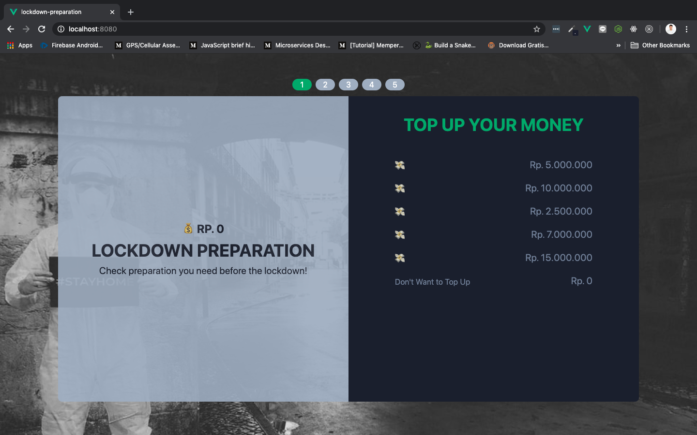
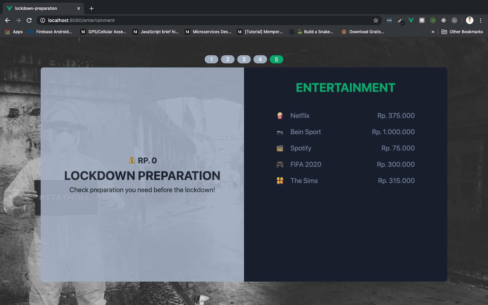
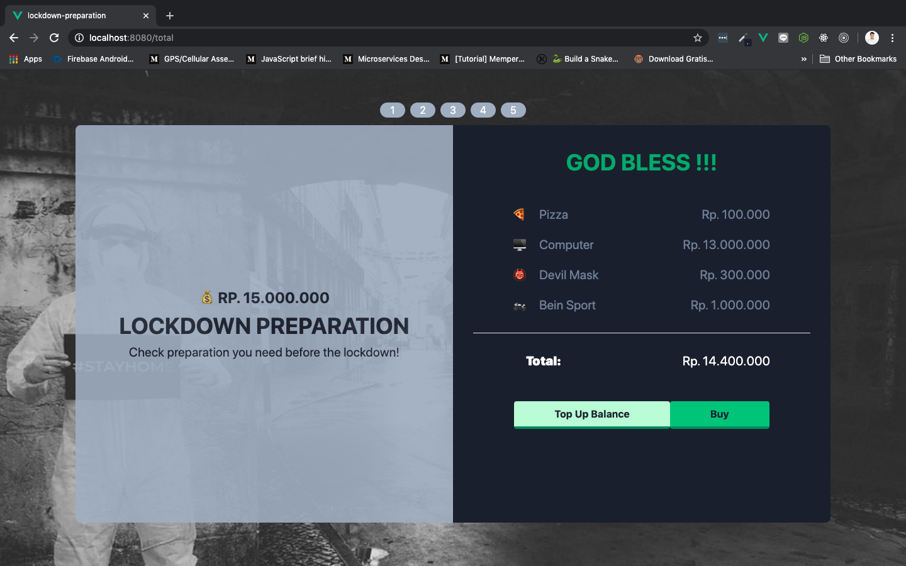
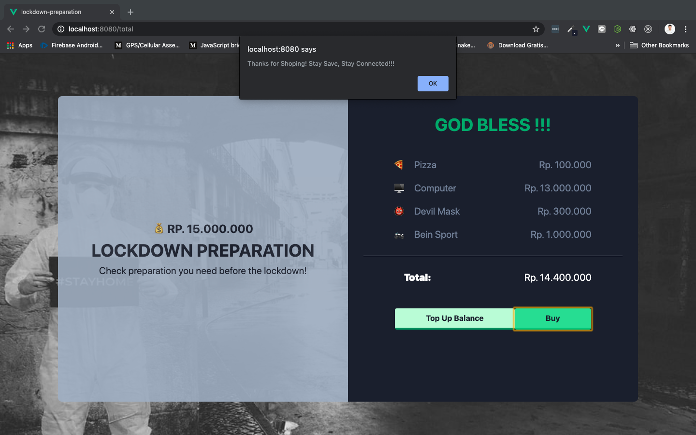

# Lockdown Preparation Website Assignment - COURSE 2

Baru-baru ini semua orang takut keluar rumah. Pemerintah menghimbau untuk semua kalangan masyarakat supaya **#DiRumahAja** untuk menghindari penyebarluasan virus Covid-19 yang memakan banyak korban jiwa. Tak jarang masyarakat juga tidak memiliki bahan pangan untuk mempersiapkan keadaan seperti ini.

Bahan pangan, masker, dan sanitizer menjadi langka. Banyak orang kesulitan untuk mendapatkanya. Sebagai seorang frontend developer, kita bisa memberikan kontribusi untuk memperkecil gap antara si penjual bahan pangan, masker, dll dan masyarakat di luar sana, dengan berupaya untuk mempertemukan mereka lewat website yang bernama lockdown preparation. Selain mempertemukan, lockdown preparation website juga bisa melakukan checklist bahan-bahan yang dibutuhkan selama masa masa lockdown diberlakukan.

Buatlah sebuah website menggunakan Vue & Vue Router, yang menampilkan **persediaan selama masa lockdown diberlakukukan**. Persediaan ini bisa dibeli oleh siapapun. Tentu persediaan-persediaan dan fitur-fitur di dalamnya sifatnya masih statis kerena kita tidak membuat bagian backendnya. Sebagai gantinya, kita bisa menggunakan data yang sudah disediakan. Data yang digunakan untuk lockdown preparation adalah sebagai berikut:

```js
export const data = [
    {
        "topup" : [
            { "icon" : "💸", "price" : 5000000},
            { "icon" : "💸", "price" : 10000000},
            { "icon" : "💸", "price" : 2500000},
            { "icon" : "💸", "price" : 7000000},
            { "icon" : "💸", "price" : 15000000},
            { "icon" : "Don't Want to Top Up", "price" : 0},
        ]
    },
    {
        "food" : [
            { "icon" : "🎁", "name" : "Indomie", "price" : 50000 },
            { "icon" : "🍕", "name" : "Pizza", "price" : 100000 },
            { "icon" : "🍔", "name" : "Hamburger", "price" : 75000 },
            { "icon" : "🥣", "name" : "Cereal", "price" : 75000 },
            { "icon" : "🍗", "name" : "Fried Chicken", "price" : 100000 },
            { "icon" : "🍣", "name" : "Sushi", "price" : 125000 },
        ]
    },
    {
        "essential" : [
            { "icon" : "💊", "name" : "Medicine", "price" : 200000 },
            { "icon" : "💾", "name" : "Data", "price" : 100000 },
            { "icon" : "👘", "name" : "Cloth", "price" : 300000 },
            { "icon" : "🖥️", "name" : "Computer", "price" : 13000000 },
        ]
    },
    {
        "maskandsanitizer" : [
            { "icon" : "😷", "name" : "Mask", "price" : 150000 },
            { "icon" : "👹", "name" : "Devil Mask", "price" : 300000 },
            { "icon" : "🧴", "name" : "Sanitizer", "price" : 150000 },
        ]
    },
    {
        "entertainment" : [
            { "icon" : "🍿", "name" : "Netflix", "price" : 375000 },
            { "icon" : "🏍️", "name" : "Bein Sport", "price" : 1000000 },
            { "icon" : "📻", "name" : "Spotify", "price" : 75000 },
            { "icon" : "🎮", "name" : "FIFA 2020", "price" : 300000 },
            { "icon" : "👨‍👩‍👧‍👦", "name" : "The Sims", "price" : 315000 },
        ]
    },
]
```

Lockdown preparation website boleh menggunakan CSS framework atau vanila CSS biasa saja. Ada beberapa fitur yang harus kita buat di dalamnya, diantaranya:

1. Fitur Top Up

    Fitur ini digunakan untuk menambahkan saldo atau balance di dalam lockdown preparation website.

    

2. Fitur Food

    Fitur ini digunakan untuk membeli makanan yang disedikan di lockdown preparation website.

    

3. Fitur Eseentials Thing

    Fitur ini digunakan untuk membeli alat-alat penting yang bisa digunakan saat lockdown.

    

4. Fitur Mask & Sanitizer

    Fitur ini digunakan untuk membeli masker atau sanitizer yang semakin langka dari hari ke hari pada saat lockdown diberlakukan.

    

5. Fitur Entertainment

    Fitur ini digunakan untuk membeli hiburan pada saat lockdown. Tentu akan sangat boring jika kita tidak mempunyai apa-apa di rumah, pada saat lockdown diberlakukan.

    

6. Fitur Summary

    Fitur ini berisi ringkasan dari barang-barang yang dipilih, dan menampilkan total harga dari semuanya. Di fitur ini juga terdapat dua buah button yang digunakan untuk melakukan top up jika saldo balance tidak mencukupi. Dan button buy untuk membeli semua barang, selama totalnya sama dengan atau kurang dari saldo balance.

    

    

    Saldo balance juga akan berkurang ketika button buy diklik:

    

Nah, itu semua fitur-fitur yang terdapat pada lockdown preparation website. Jika teman-teman ingin melihat live demonya, silahkan kunjungin link berikut: [https://vue-lockdown-preparation.firebaseapp.com/](https://vue-lockdown-preparation.firebaseapp.com/)
