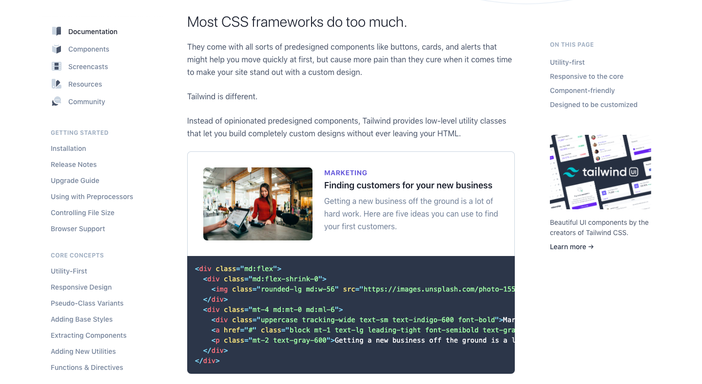

# Prerequisite

Ada banyak sekali CSS framework yang bisa digunakan untuk Vue. Tapi kita hanya akan menggunakan [Tailwindcss](https://tailwindcss.com/) saja untuk saat ini. Kenapa Tailwindcss? Seperti di *website*nya bilang, ***cause most CSS framework to do much*** 🙅‍♂️.

Kebanyakan CSS framework di luar sana terlalu banyak memasukkan component-component yang tidak kita perlukan yang otomatis dimasukkan ke dalam website kita. Sehingga effect-nya, website yang kita buat akan menjadi tidak secepat ketika kita menggunakan Tailwindcss. Dengan menggunakan Tailwindcss, kita bahkan bisa membuat custom component yang ingin kita gunakan sendiri. Styling-nya pun bisa menggunakan ***css-in-js***, yang nantinya akan di-*translite* menjadi sebuah CSS, menggunakan postcss.
