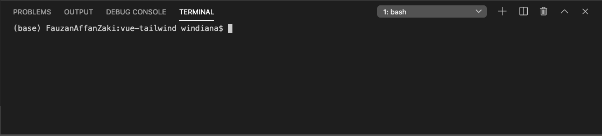
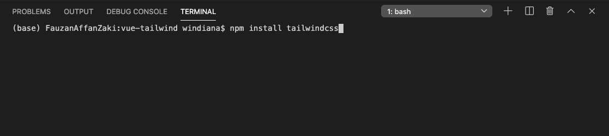
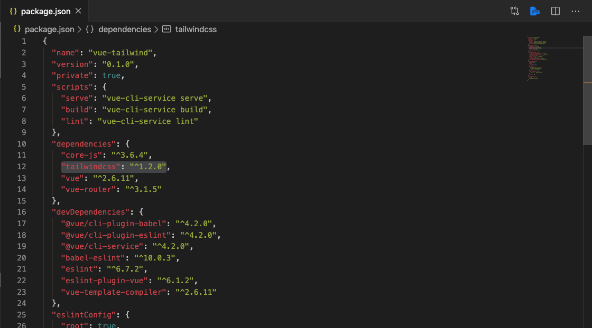
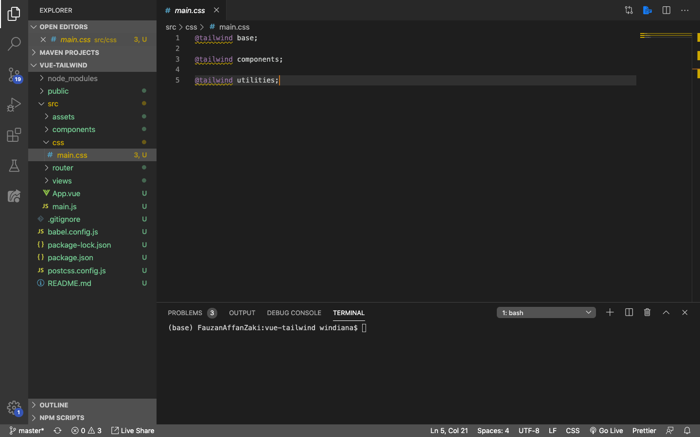
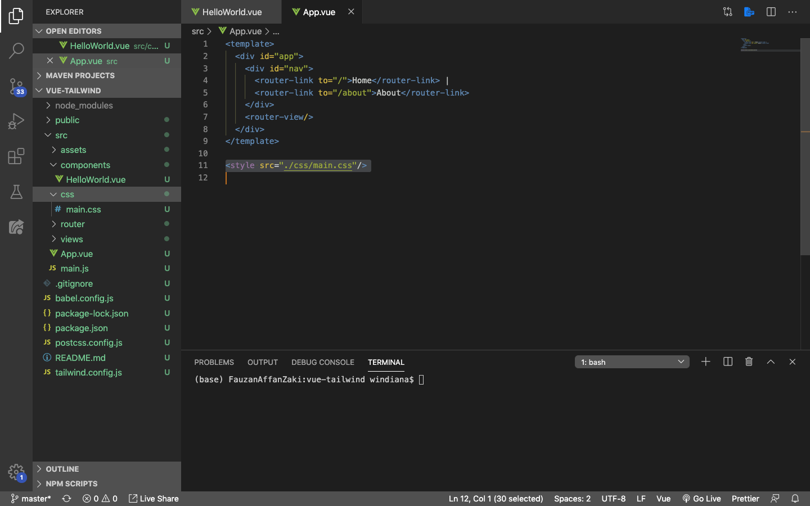
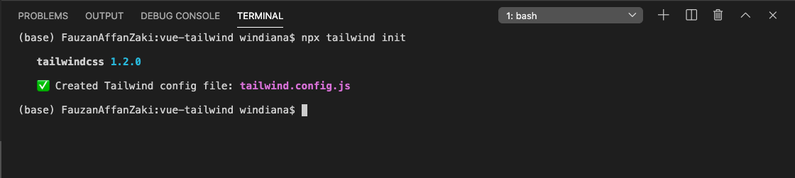
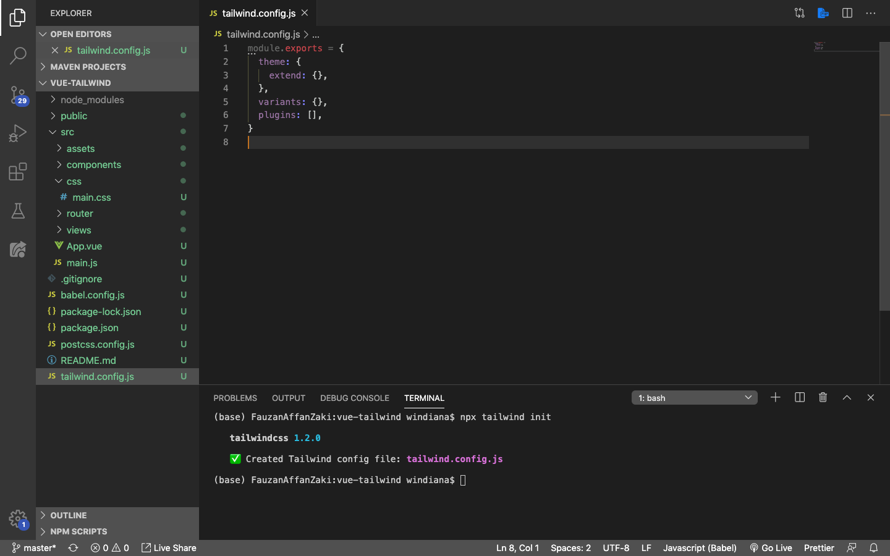
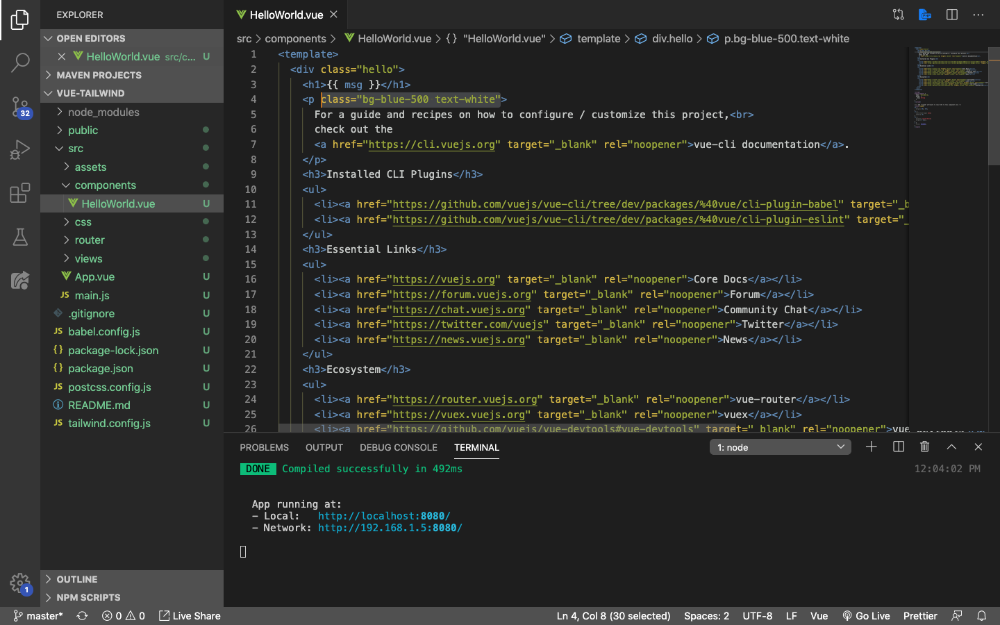
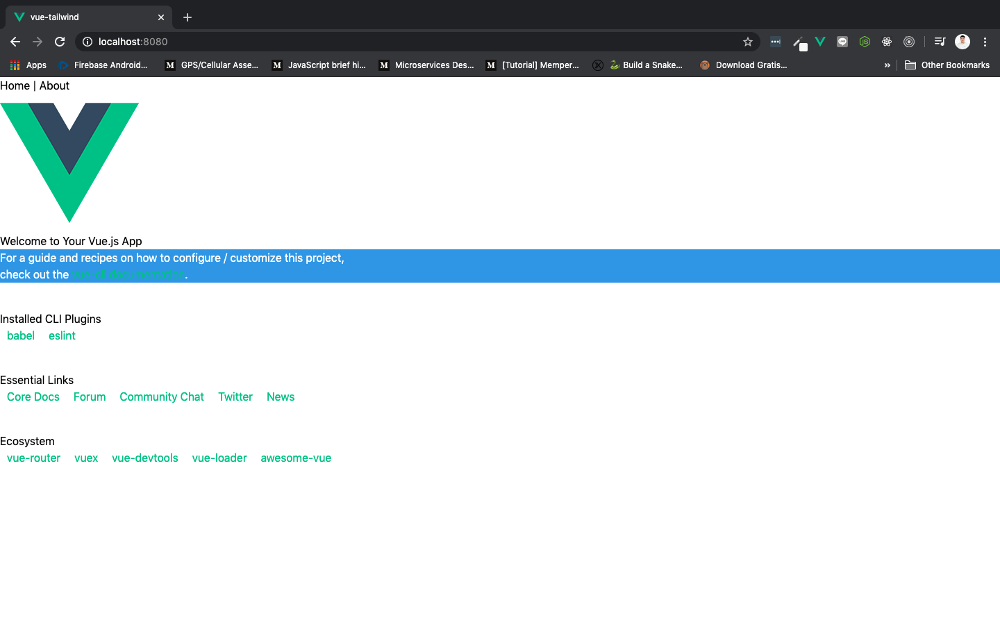

# Instalasi Tailwindcss

Pada Vue, kita bisa menggunakan command prompt atau terminal untuk menginstalasi project Vue yang sudah kita buat terlebih dahulu menggunakan Vue CLI. Selanjutnya, project tersebut akan kita tambahkan Tailwindcss di dalamnya.

Ini adalah tampilan awal ketika menjalankan project Vue yang sudah saya buat dengan nama `vue-tailwind`:


> ***Tips & trick:*** Buat project Vue yang mau digunakan terlelbih dahulu, baru setelah itu tambahkan Tailwindcss ke dalamnya.

## Instal Tailwindcss

Buka project yang teman-teman gunakan di terminal. Pastikan folder project sudah benar. Pada demo kali ini, saya menggunakan project Vue dengan nama `vue-tailwind`.



Selanjutnya, buka website tutorial instalasi Tailwindcss [di sini](https://tailwindcss.com/docs/installation/). Disana ada beberapa bagian saja yang akan kita terapkan ke dalam project Vue kita, bagian-bagiannya dimulai dari:

1. *Install Tailwind via npm*

    Kita akan menginstal Tailwind via npm. Pastikan komputer teman-teman sudah terinstal dengan Node.js supaya bisa menggunakan npm.

    Jalankan sintaks berikut di dalam terminal:

    ```py
    # Using npm
    npm install tailwindcss
    ```

    

    Buka file `package.json`, dan pastikan sudah terdapat Tailwindcss:

    

2. *Add Tailwind to your CSS*

    Selanjutnya buka folder `src`, dan buat satu folder baru dengan nama `css`. Di dalam folder `css`, buat file dengan nama `main.css`, dan isikan sintak berikut, lalu save:

    ```js
    @tailwind base;

    @tailwind components;

    @tailwind utilities;
    ```

    

    Selanjutnya, jangan lupa kita import `main.css` yang tadi sudah kita buat ke dalam root component kita, yaitu `App.vue`. Hapus seluruh isi style dan buat element style menjadi seperti ini:

    ```html
    <style src="./css/main.css" />
    ```

    

3. *Process your CSS with Tailwind*

    Pada bagian ini kita akan menambahkan Tailwind di dalam [postcss](https://github.com/postcss/postcss#usage). Postcss berguna untuk menerjemahkan style yang dibuat menggunakan Javascript, menjadi CSS di website.

    Buat satu file baru di tempat yang sejajar dengan `package.json`, dengan nama `postcss.config.js`. Selanjutnya tambahkan sintak berikut, lalu save:

    ```js
    module.exports = {
        plugins: [
            // ...
            require('tailwindcss'),
            require('autoprefixer'),
            // ...
        ]
    }
    ```

4. *Generate Tailwind*

    Selanjutnya kita coba men-*generate* Tailwind configuration. Karena Tailwind memperbolehkan kita membuat custom CSS, maka ini akan berguna untuk menerjemahkan custom CSS yang sudah kita buat menjadi satu bundle Tailwindcss nanti, dengan menggunakan sintak:

    ```js
    npx tailwind init
    ```

    Jika berhasil tampilannya akan mirip seperti ini:

    

    Dan akan membuat satu file baru yang lokasinya sejajar dengan `package.json`, dengan nama `tailwind.config.js`. Isinya seperti berikut:

    

5. *Make Sure It Works!*

    Kita coba tambahkan class yang ada di Tailwindcss pada tag `<p>` di component `HelloWorld.vue`, lalu jalankan:

    

    * `bg-bluee-500` digunakan untuk membuat background menjadi warna biru, dengan tingkat transparansinya 500
    * `text-white` digunakan untuk merubah warna text menjadi putih

    Jika berhasil, hasilnya adalah sebagai berikut:

    
