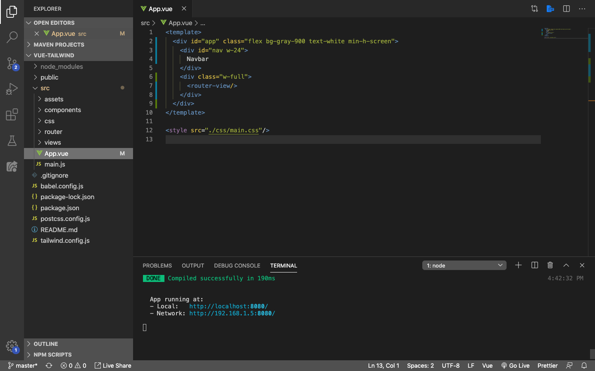
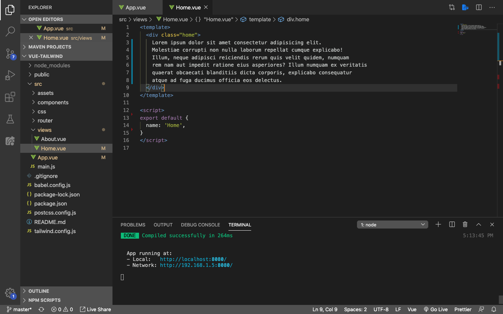
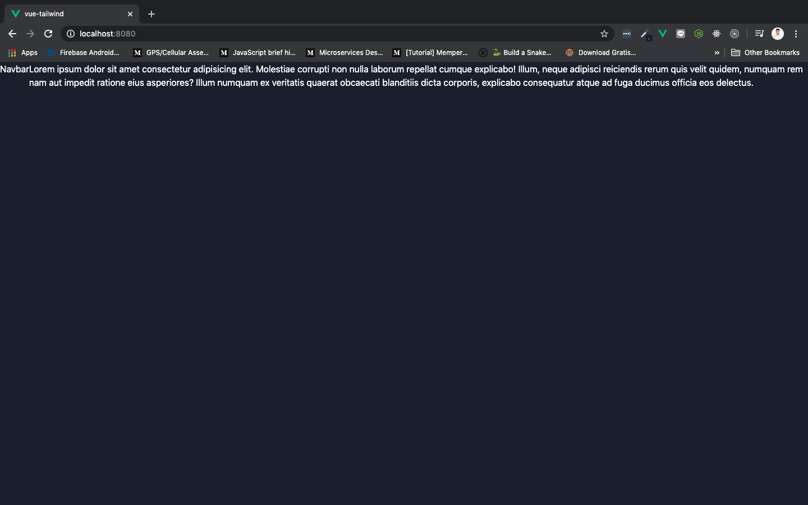

# Sidebar Menu Navigation

Rasanya boring ga sih kalau melihat navbar menu yang selalu ada di atas website terus? Nah, sekarang kita akan coba membuat yang *little bit different* dari website-website protofolio kebanyakan.

Kita akan langsung saja membuat menu yang berada di sebelah kiri layar komputer kita. Pertama-tama silahkan teman-teman buka file root component, yaitu `App.vue`.

Selanjutnya rubah tampilan `App.vue` menjadi seperti ini:

Setelah itu jalankan menggunakan `npm run serve`, lalu tampilan di browser akan berubah menjadi seperti ini:

Di sini kita melakukan beberapa hal:

1. Memisahkan tampilan component kita menggunakan `flex` (flexbox) dan `w` (width)
    * `w-24` sama seperti `width: 24px`
    * `w-full` sama seperti `width: 100%`
2. Mengatur default background component kita menjadi `grey` dengan transparansi `900`
3. Mensetting semua text yang ada di dalam component menjadi warna putih, menggunakan `text-with`
4. Merubah minimal tinggi tampilan screen seukuran layar komputer, menggunakan `min-h-screen`

> ***Tips & trick:*** Jika ada class Tailwind yang tidak teman-teman ketahui, silahkan buka [Tailwindcss.com](https://tailwindcss.com/), dan copy-kan class yang ingin teman-teman ketahui lebih lanjut di search box. Dengan cara seperti ini, Tailwindcss akan menampilkan keterangan lebih detail terkait class tersebut dan teman-teman bisa mengetahui lebih banyak tentang Tailwindcss.

Selanjutnya buka folder `views` yang di dalamnya terdapat component `Home.vue`, dan rubah isinya menjadi seperti berikut:

> ***Tips & trick:*** Jika kamu menggunakan vscode, ketika membuat *lorem ip sum*, kamu tinggal mengetikkan `lorem50` lalu tekan `tab`. Hasilnya akan sama seperti gambar di bawah.

Jika sudah tampilan di browser akan berubah menjadi seperti ini:

