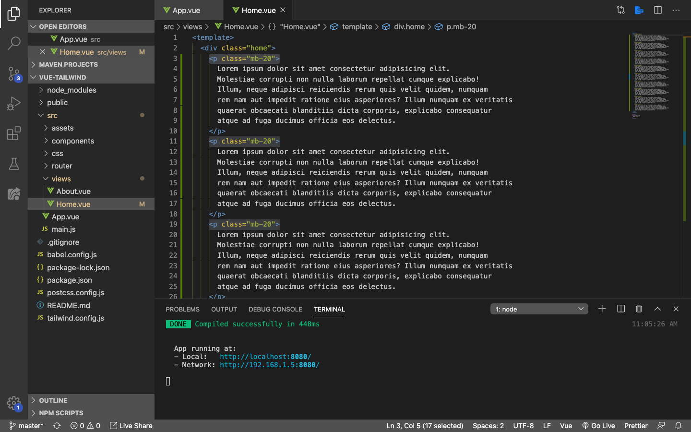
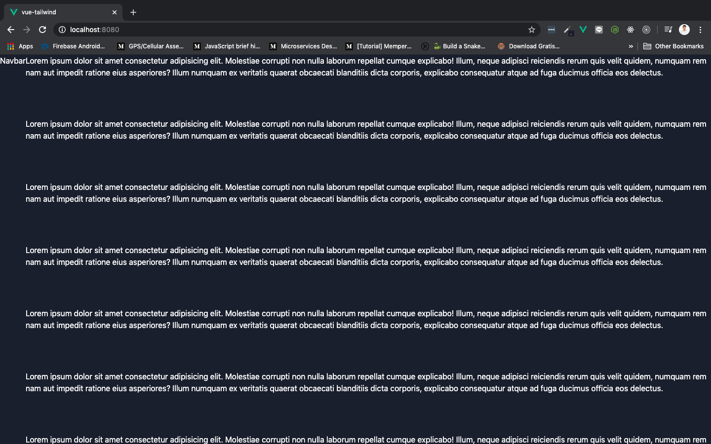
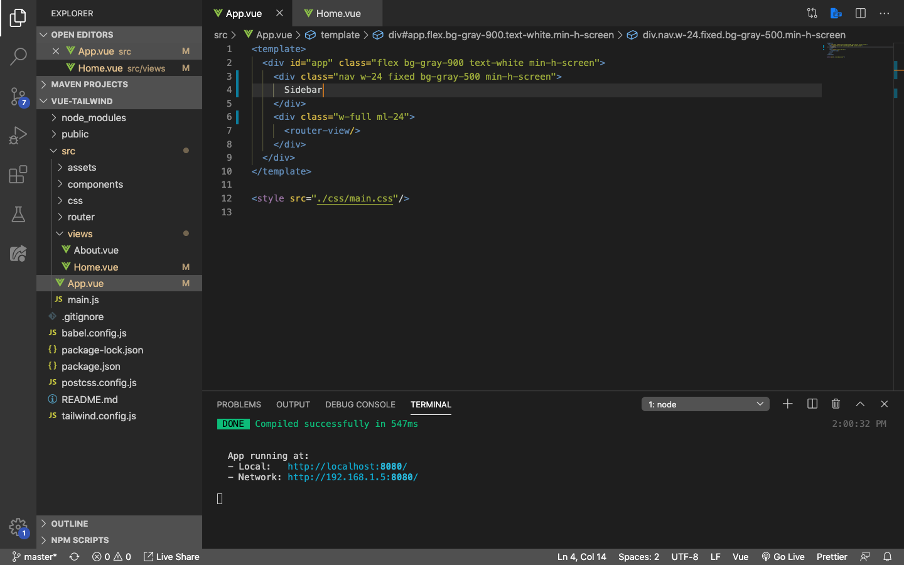

# Fixed Sidebar

Kita akan membuat sidebar yang behaviornya ***fixed***, artinya ketika kita *scrolldown the page*, sidebar akan tetap pada posisinya menggunakan Tailwindcss.

Masih di file yang sama seperti file terakhir pada lesson sebelumnya, silahkan buka file `Home.vue` yang terdapat di dalam folder `views`.

## Fake Content

Sebelum kita buat sidebarnya fixed, kita perlu banyak content dulu di dalam `class="home"` supaya kita bisa scrolldown page yang kita sedang buat, dan melihat sidebar kita tetap pada posisi yang sama (fixed).

Yang perlu kita lakukan adalah, rubah component `Home.vue` menjadi seperti ini:

Save dan tampilan di browser akan berubah menjadi seperti ini:

Di sini kita melakukan beberapa hal:

> ***Tips & trick:*** Lorem ipsum biasa digunakan pada tahap developemnt sebagai **fake content sementara** yang menggantikan isi content sesunggunya

1. Menambahkan element `
` dengan class `mb` (margin bottom) sebanyak 20
    * `mb-20` sama seperti `margin-bottom: 20px`
2. Kira-kira ada 20 element `
` yang berisikan lorem ipsum di dalamnya

Sekarang kita sudah bisa menscrolldown page yang isinya adalah teks lorem ipsom, tetapi sidebarnya masih belum fixed.

## Fixed Sidebar Goes Here

Selanjutnya kita akan membuat sidebarnya fixed pada root component kita `App.vue`. Rubah isinya menjadi seperti ini:

Yang kita lakukan adalah:

1. Rubah id pada `nav` menjadi class, karena kita akan menggunakan class seterusnya bukan id
2. Ganti isi class nav menjadi Sidebar, bukan Navbar
3. Tambahkan class `fixed`, `bg-gray-500`, dan `min-h-screen` di dalam class nav
    * `fixed` digunakan untuk membuat sidebarnya tetap pada posisi saat page discrolldown
    * `bg-gray-500` merubah warna background sidebar menjadi abu-abu dengan tarnsparansi 500
    * `min-h-screen` merubah minimal tinggi tampilan sidebar seukuran layar komputer
4. Tambahkan class `ml-24` pada class `w-full`
    * `ml-24` sama seperti `margin-left: 24px`

> Pastikan sekarang kita sudah bisa menscrolldown page yang isinya adalah teks lorem ipsom, **dengan sidebar yang sudah fixed**.
