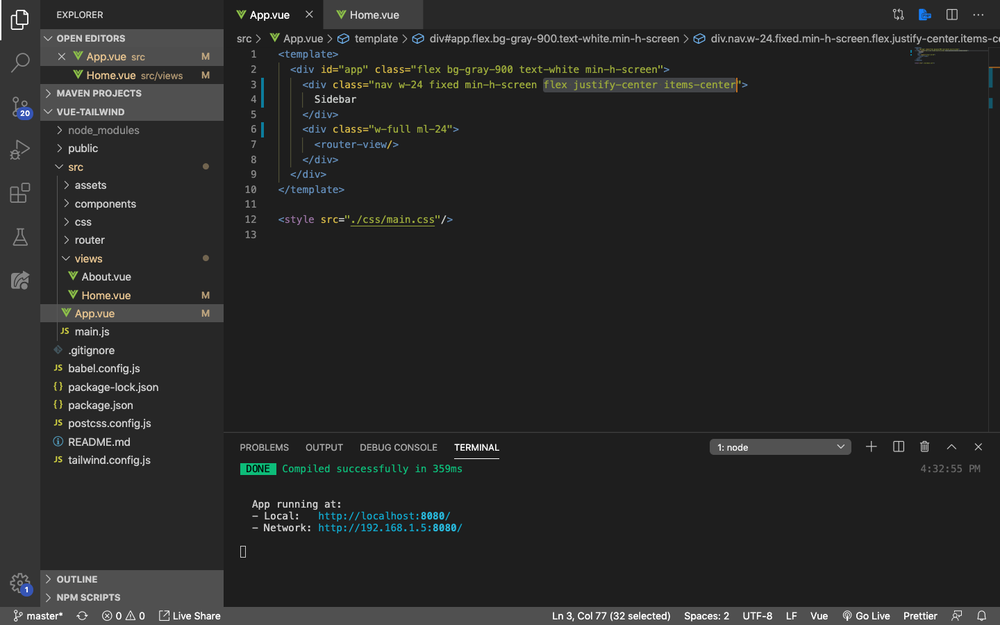
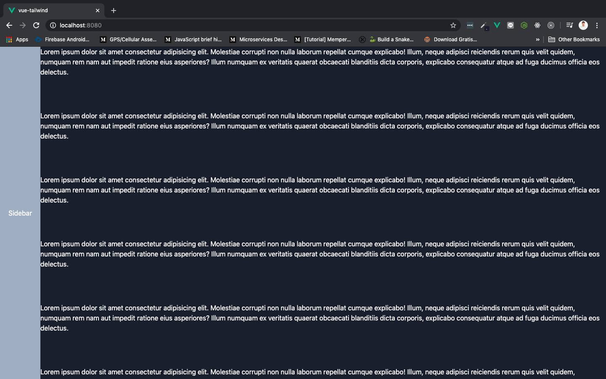
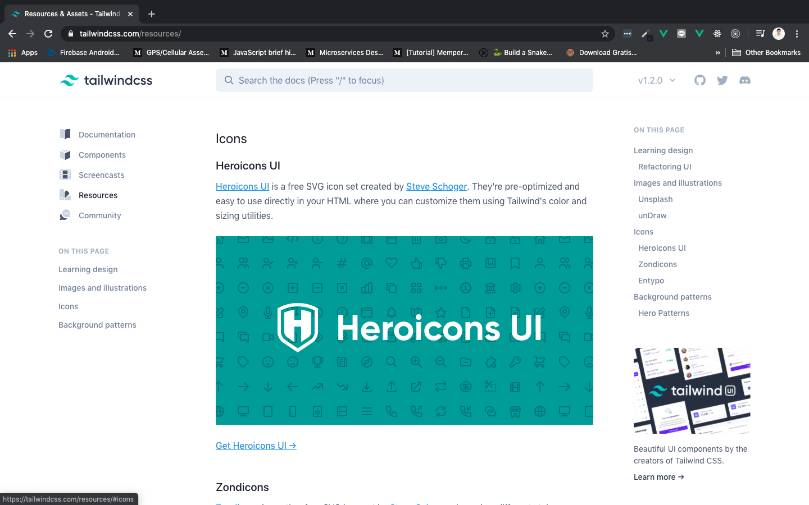
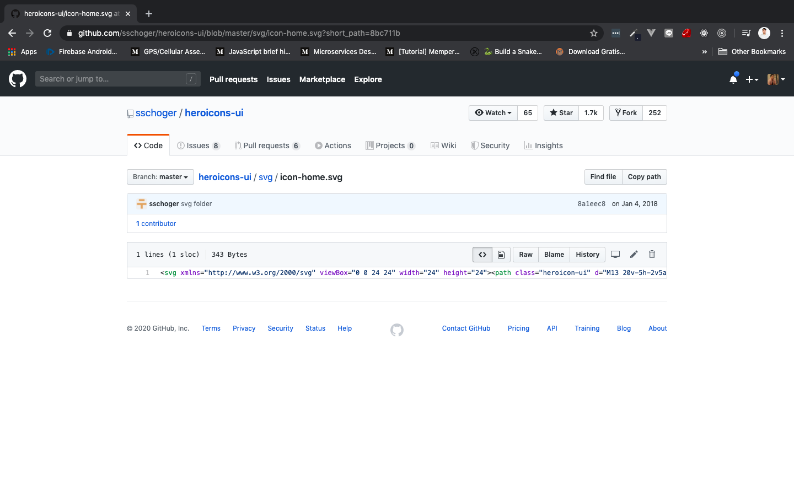
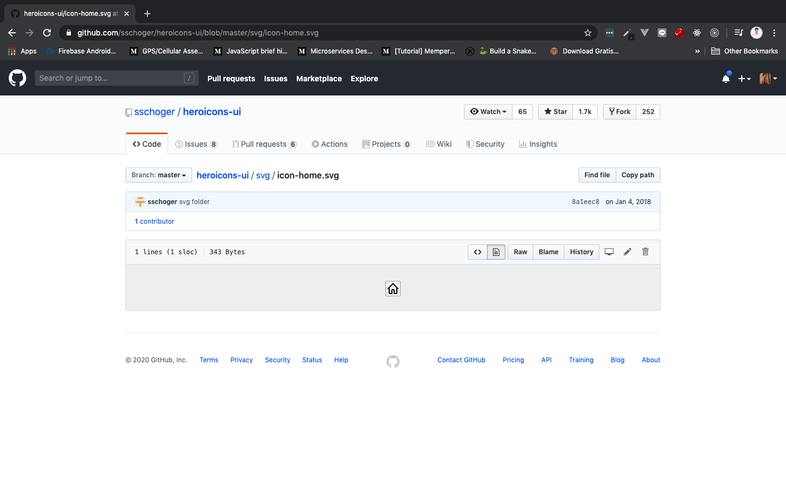
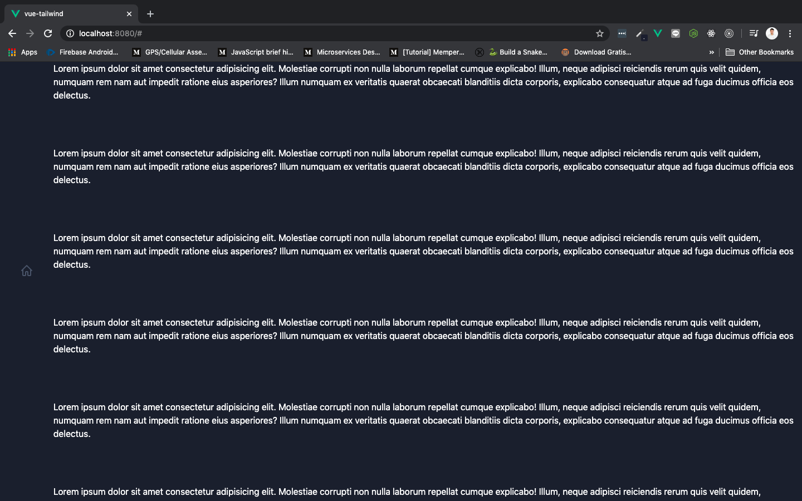
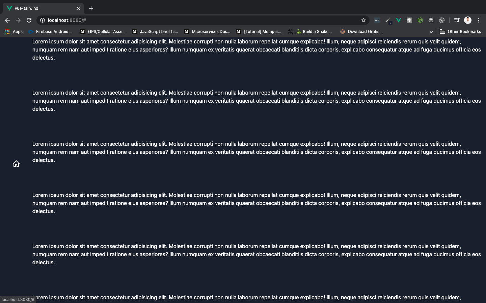
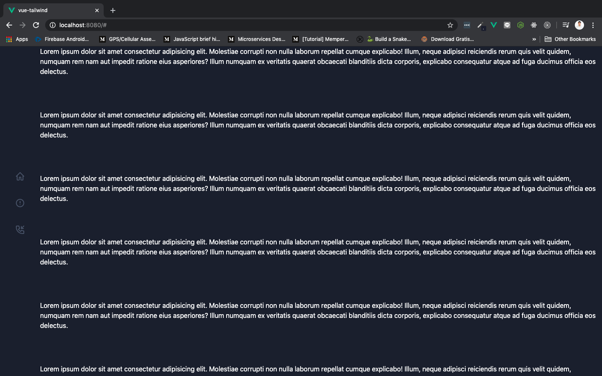
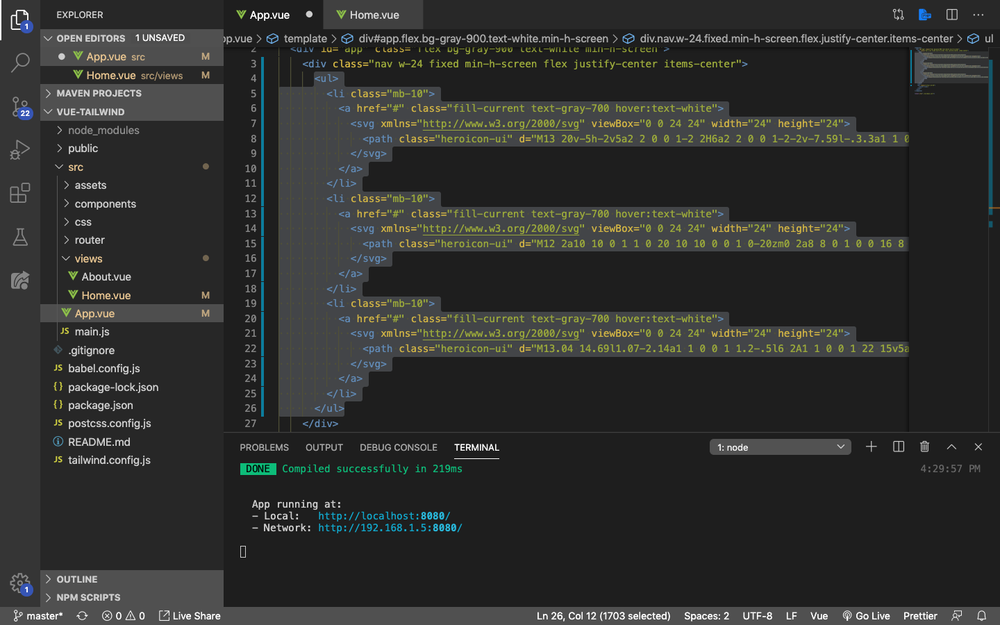

# Menu Navigation

Kita akan membuat beberapa menu di sidebar, diantaranya **menu home, about, dan contact me**. Masing-masing menu akan diwakili dengan sebuah icon. Tentunya masih menggunakan Tailwindcss.

## Centered Menu

Masih pada file root component yang sama yaitu `App.vue`. Rubah isinya menjadi seperti ini:



Save dan tampilan di browser akan berubah menjadi seperti ini:



Sekarang kita sudah membuat tulisan sidebar berada pas di tengah-tengah dari sidebar yang kita punya. Ada beberapa hal yang kita lakukan barusan:

> ***Tips & trick:*** Jika teman-teman belum mengetahui tentang flexbox, silahkan kunjungi [website ini](https://www.w3schools.com/css/css3_flexbox.asp) atau [ini](https://tailwindcss.com/docs/flex-direction)

1. Menambahkan pada class `nav` tambahkan `flex`, `justify-center`, dan `items-center`
    * `flex` digunakan untuk merubah sidebar kita menjadi display flex (flexbox)
    * `justify-center` digunakan untuk membuat content di dalamnya berada di tengah-tengah container
    * `items-center` digunakan untuk membuat posisi semua item di dalam container berada di tengah

## Creating Menu

Kita akan membuat menunya menggunakan element `<ul>` & `<li>` (list), element `<a>` (link), serta svg icon.

### Work With SVG Icon

Sebelum kita masuk pada tahap pembuatan menu, teman-teman harus tau bagaimana cara mengambil SVG icon terlebih dahulu. Silahkan kunjungi link [resources pada Tailwindcss](https://tailwindcss.com/resources).



Scrolldown, dan di bagian icons akan ada 3 icon gratis yang bisa teman-teman gunakan. Di sini kita akan menggunakan yang paling atas yaitu [Heroicons UI](https://github.com/sschoger/heroicons-ui/tree/master/svg).

> ***Tips & trick:*** Jika teman-teman ingin menggunakan icon selain dari [Heroicons UI](https://github.com/sschoger/heroicons-ui/tree/master/svg), teman-teman bisa download iconnya lalu open with vscode. Copykan semua yang dibungkus element `<svg>` ke dalam HTML. Atau teman-teman bisa melihat lebih detailnya di [video ini](https://www.youtube.com/watch?v=MbUyHQRq2go)

Pilih icon yang teman-teman suka dan masukan ke dalam icon menu di HTML. Contoh **icon home** dari [Heroicons](https://github.com/sschoger/heroicons-ui/tree/master/svg) adalah seperti berikut:





### Home, About, dan Contact me Menu

Untuk **home** menu iconnya adalah:

```html
<svg xmlns="http://www.w3.org/2000/svg" viewBox="0 0 24 24" width="24" height="24">
    <path class="heroicon-ui" d="M13 20v-5h-2v5a2 2 0 0 1-2 2H6a2 2 0 0 1-2-2v-7.59l-.3.3a1 1 0 1 1-1.4-1.42l9-9a1 1 0 0 1 1.4 0l9 9a1 1 0 0 1-1.4 1.42l-.3-.3V20a2 2 0 0 1-2 2h-3a2 2 0 0 1-2-2zm5 0v-9.59l-6-6-6 6V20h3v-5c0-1.1.9-2 2-2h2a2 2 0 0 1 2 2v5h3z"/>
</svg>
```

Selanjutnya masih di `App.vue`, rubah isinya menjadi seperti ini:


Save dan tampilan di browser akan berubah menjadi seperti ini:


Ada beberapa hal yang kita lakukan:

1. Menghapus `bg-gray-500` dari class `nav`
2. Menambahkan `<ul>` dan `<li>` yang di dalamnya berisi element `<a>` di dalam sidebar
3. Menambahkan icon home berupa `<svg>` ke dalam element `<a>`
4. menambahkan `class="fill-current text-gray-700 hover:text-white"` di dalam element `<a>`
    * `fill-current` untuk memberi warna icon svg
    * `text-gray-700` merubah icon menjadi warna abu-abu dengan transparansi 700
    * `hover:text-white` merubah icon menjadi warna putih ketika kursor diarahkan ke icon

Save dan tampilan icon home akan berubah menjadi putih ketika dihover seperti ini:



Ketika di-hover:



Untuk **about** menu iconnya adalah:

```html
<svg xmlns="http://www.w3.org/2000/svg" viewBox="0 0 24 24" width="24" height="24">
<path class="heroicon-ui" d="M12 2a10 10 0 1 1 0 20 10 10 0 0 1 0-20zm0 2a8 8 0 1 0 0 16 8 8 0 0 0 0-16zm0 9a1 1 0 0 1-1-1V8a1 1 0 0 1 2 0v4a1 1 0 0 1-1 1zm0 4a1 1 0 1 1 0-2 1 1 0 0 1 0 2z"/>
</svg>
```

Untuk **contact me** menu iconnya adalah:

```html
<svg xmlns="http://www.w3.org/2000/svg" viewBox="0 0 24 24" width="24" height="24">
<path class="heroicon-ui" d="M13.04 14.69l1.07-2.14a1 1 0 0 1 1.2-.5l6 2A1 1 0 0 1 22 15v5a2 2 0 0 1-2 2h-2A16 16 0 0 1 2 6V4c0-1.1.9-2 2-2h5a1 1 0 0 1 .95.68l2 6a1 1 0 0 1-.5 1.21L9.3 10.96a10.05 10.05 0 0 0 3.73 3.73zM8.28 4H4v2a14 14 0 0 0 14 14h2v-4.28l-4.5-1.5-1.12 2.26a1 1 0 0 1-1.3.46 12.04 12.04 0 0 1-6.02-6.01 1 1 0 0 1 .46-1.3l2.26-1.14L8.28 4zm12.01-1.7a1 1 0 0 1 1.42 1.4L17.4 8H20a1 1 0 0 1 0 2h-5a1 1 0 0 1-1-1V4a1 1 0 0 1 2 0v2.59l4.3-4.3z"/>
</svg>
```

Lakukan hal yang sama seperti home menu icon, jangan lupa buat iconnya berubah menjadi warna putih ketika dihover. Jika sudah tampilan dari component `App.vue` akan berubah menjadi seperti ini di browser:



Ketika home di-hover


Sintaknya menjadi seperti ini:


