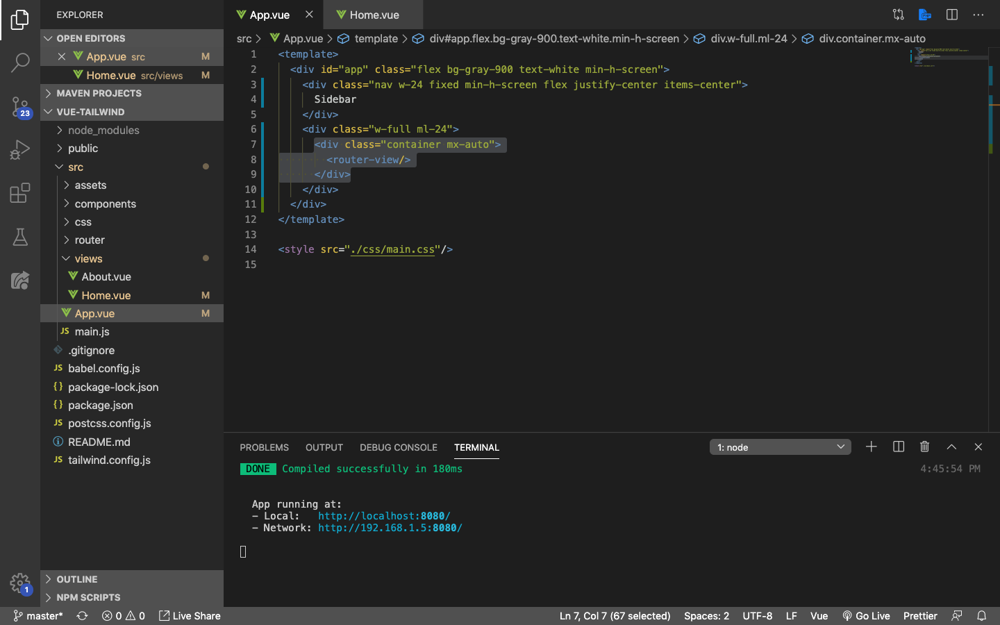
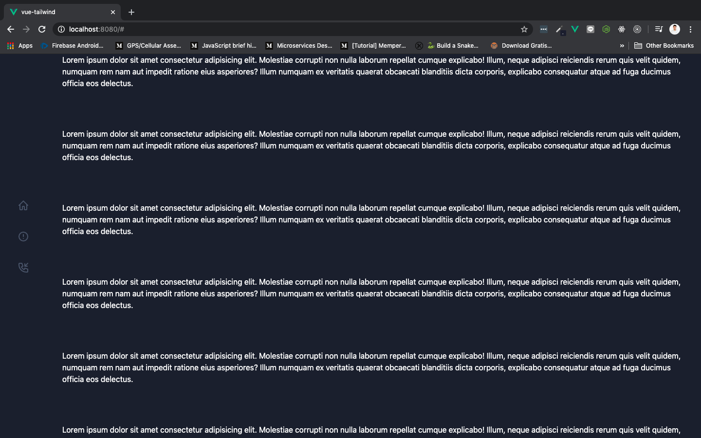
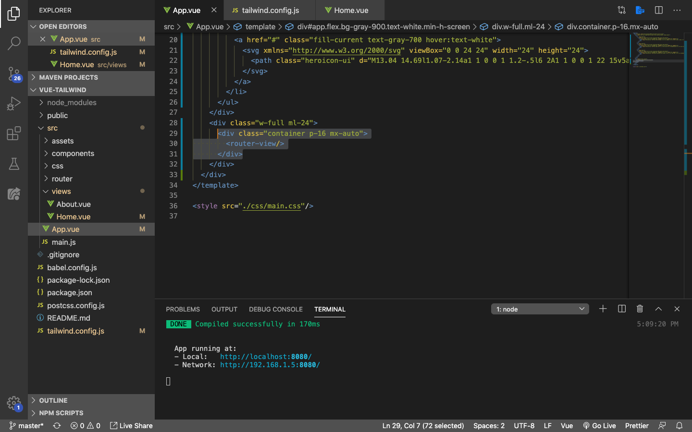
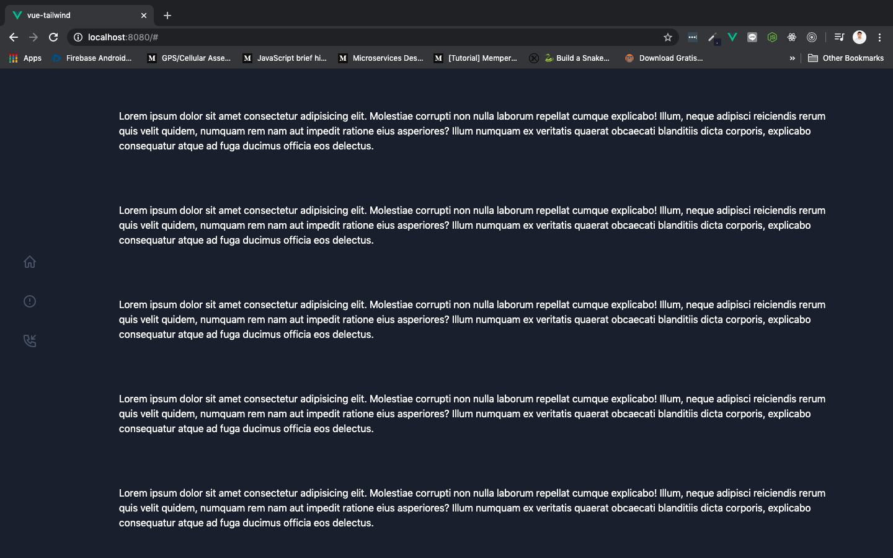

# Home Content

Sekarang kita akan membuat bagian utama dari website kita, dan mengisikan content yang letaknya di sebelah kanan dari sidebar.

## Centralizing Content

Kita akan coba membuat content yang berada di sisi kanan dari layar komputer letaknya menjadi center dengan cara membungkus `<router-link>` menggunakan div dengan class `container` dan `mx-auto`. Masih di component yang sama yaitu `App.vue`, rubah isinya menjadi seperti berikut:

Save dan tampilan di browser akan berubah menjadi seperti ini:

Perhatikan, sekarang teks lorem ipsum kita sudah memiliki `<margin-left>` dan `<margin-right>` yang diatur oleh class `mx-auto`. Container digunakan untuk membungkus semua isi dari content yang akan kita buat. Karena kita menggunakan Vue Router, maka yang dibungkus adalah `<router-link>` nya saja.

Selanjutnya, tambahkan `padding` sebanyak `1rem` atau `16px` di dalam class container, supaya tidak terlalu mepet dengan pinggir dari container kita. `App.vue` isinya menjadi:

Save dan tampilan di browser akan berubah menjadi seperti ini:

