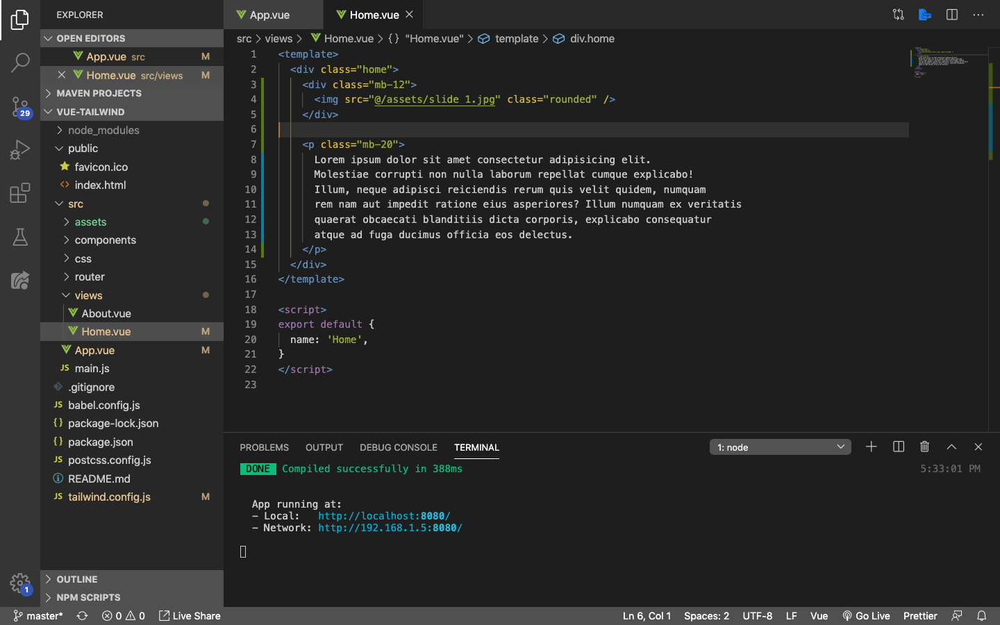
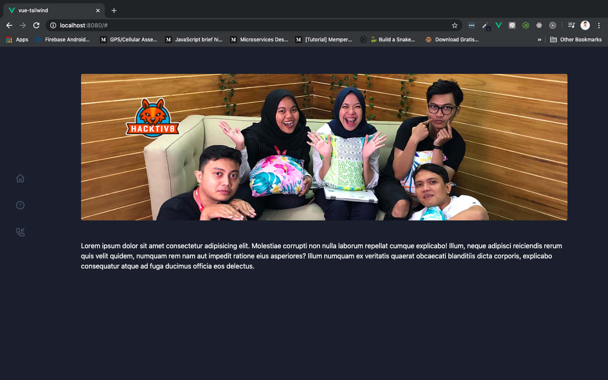

# Adding Hero

Hero adalah bagian yang biasanya di taruh di bagian atas website, isinya pun bisa gambar, carousel atau slider, dll. Tidak jarang juga digunakan sebagai media promosi dari website tersebut. Kali ini kita akan coba memasukkan image saja ke bagian hero tersebut.

Siapkan image, dan letakkan di dalam folder `assets`. Buka component `Home.vue` yang terdapat pada folder views, dan rubah isinya menjadi seperti ini:

Save dan hasilnya akan menjadi seperti ini di browser:

Ada beberapa hal yang kita lakukan:

1. Menghapus element `
` yang isinya lorem ipsum, dan menyisakan hanya 1 element saja
2. Menambahkan element `
` dengan class `mb-12`, yang fungsinya untuk menampung element ``
3. Membuat element `` dengan `src` yang berisi gambar yang terletak pada folder assets. Serta menambahkan class `rounded` supaya image tidak lancip di setiap ujungnya