# Adding Job Specialization

Selanjutnya kita akan masukkan beberapa spesialisai kategori pekerjaan yang kita punya. Di sini saya punya 5 spesialiasi kategori yang terdiri dari:

1. ***Front End Basic Specialization (FEBS)***
2. ***Front End Framework Specialization (FEFS)***
3. ***Back End Specialization (BESN)***
4. ***Data Analytics Specialization (DASN)***
5. ***Machine Learning Specialization (MLSN)***

Masih di file yang sama yaitu `Home.vue`, karena kita sudah tidak menggunakannya lagi, kita hapus bagian element `<p>` beserta seluruh isi lorem ipsumnya.

## Creating Box

Selanjutnya, kita akan membuat simple box dengan shadow, yang nantinya akan diisikan dengan masing-masing spesialisai yang saya punya. Tapi, kita isikan lorem ipsum, supaya kebayang sebesar apa box yang mau kita buat. Tambahkan beberpa baris kode seperti berikut:

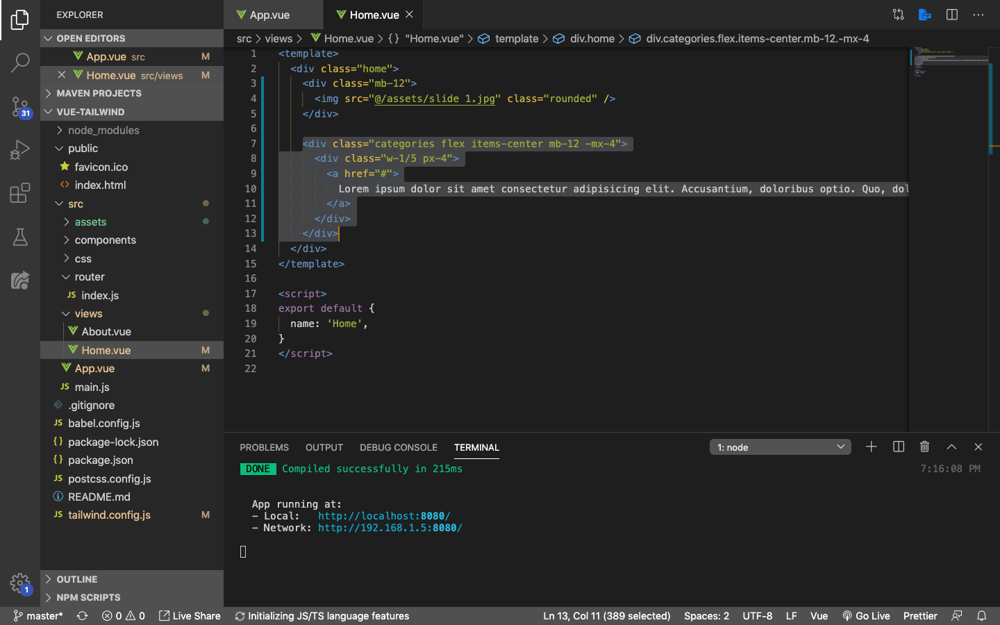

Save dan hasilnya tampilan browser akan berubah menjadi seperti ini:

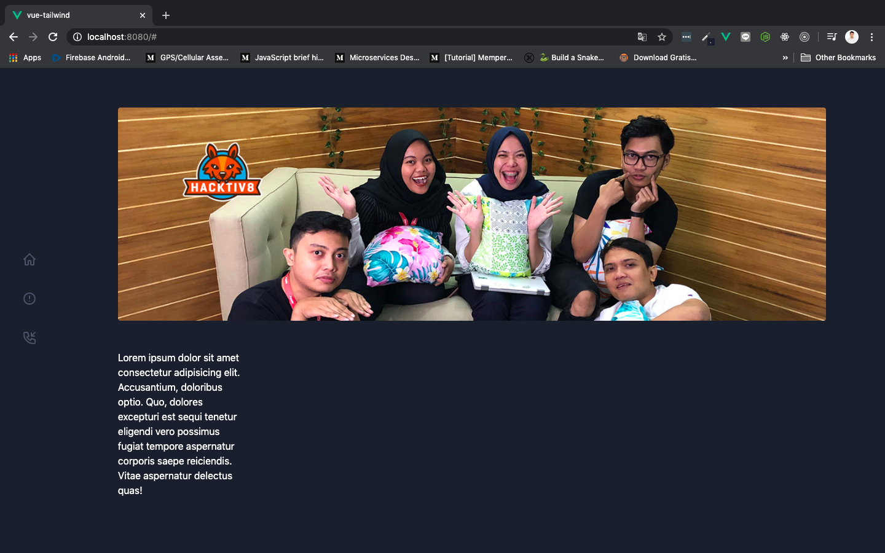

Ada beberapa hal yang kita tambahkan di sini:

1. Membuat element `<div>` baru dengan class `categories`, `flex`, `items-center`, `mb-12`, dan `-mx-4`
    * `categories` adalah class penanda saja, bukan termasuk bagian dari Tailwindcss
    * `-mx-4` digunakan untuk membuat `margin-left` dan `margin-right` minus, ini sama seperti `margin-right: -1rem;` & `margin-left: -1rem;`
2. Membuat sebuah `<div>` di dalam class `categories`, yang berisi class `w-1/5` dan `px-4`
    * `w-1/5` sama seperti `width: 20%;`
    * `px-4` sama seperti menambahkan `padding-right: 1rem;` dan `padding-left: 1rem;`

> ***Tips & trick:*** `1rem` = `16px`

Buat 4x lagi supaya jumlahnya menjadi 5, karena specialization categori kita berjumlah 5 semuanya. Jika sudah, tampilannya akan berubah menjadi seperti ini:

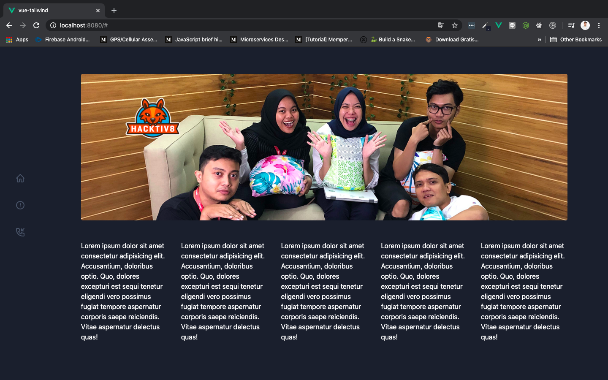

Dan sintak fullnya seperti ini:

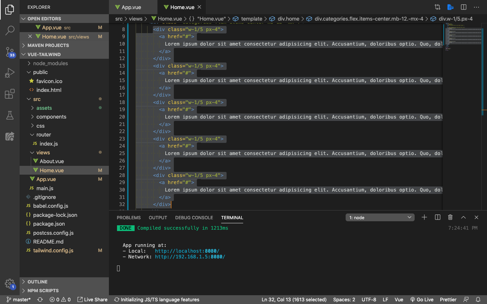

Dari sini kita bisa melihat apakah calon box kita terlihat bagus atau tidak. Selanjutnya **kembalikan menjadi 1 box lagi** untuk kita tambahkan beberapa class supaya tampilannya menjadi lebih menarik.

> ***Tips & trick:*** Jika teman-teman memiliki kenalan seorang designer yang menurut teman-teman design mereka bagus-bagus, mintalah pendapat mereka terhadap tampilan website yang teman-teman sedang buat. **Karena tata letak, jenis font, dll sebgaianya akan mempengaruhi User Experience (UX) dari pengguna webste kita** nantinya. Semakin simple semakin bagus.

Sebelum masuk ke tahapan selanjutnya, siapkan 5 buah .png atau .svg image untuk merepresentasikan masing-masing kategori yang ada. Seperti biasa, image dikumpulkan di dalam folder `assets`.

Tamabhkan beberapa class ke dalam element `<a>` seperti di bawah ini:

```html
<a href="#" class="bg-gray-800 h-32 flex justify-center items-center rounded-lg border border-gray-700 p-4 hover:bg-gray-900">
```

Sintak di component `Home.vue` seperti ini:

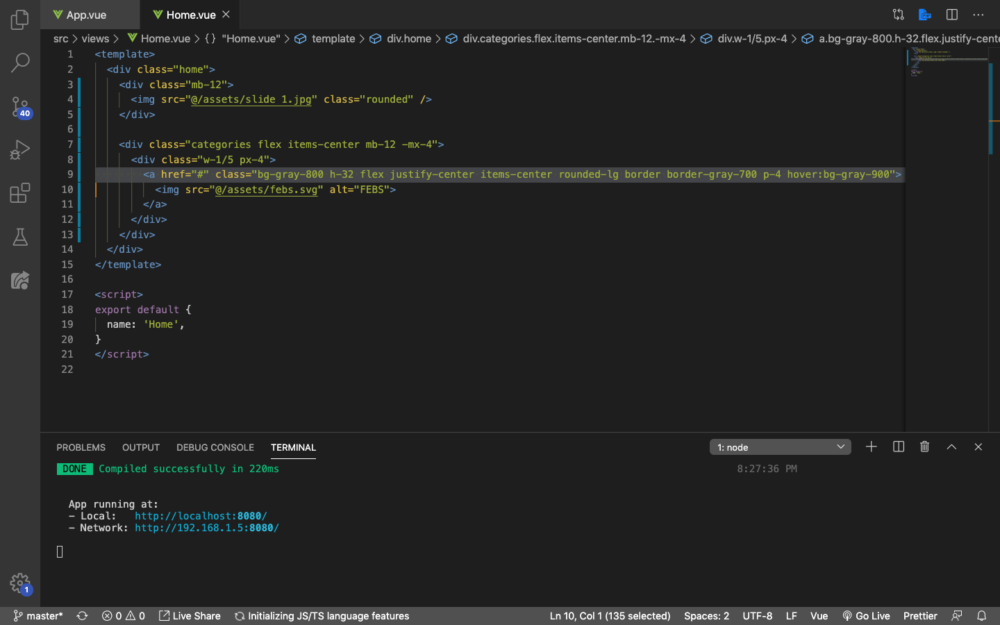

1. `h-32` sama seperti menambahkan `height: 8rem`
2. `rounded-lg` membuat box tidak lancip disudut-sudutnya, `lg` singkatan dari *large*
3. `border` `border-gray-700` membuat border berwarna abu-abu dengan tingkat transparansi 700
4. `hover:bg-gray-900` box akan kembali ke warna aslinya yaitu `bg-gray-900` ketika kursor diarahkan ke box tersebut

Save dan tampilannya di browser akan berubah seperti berikut:

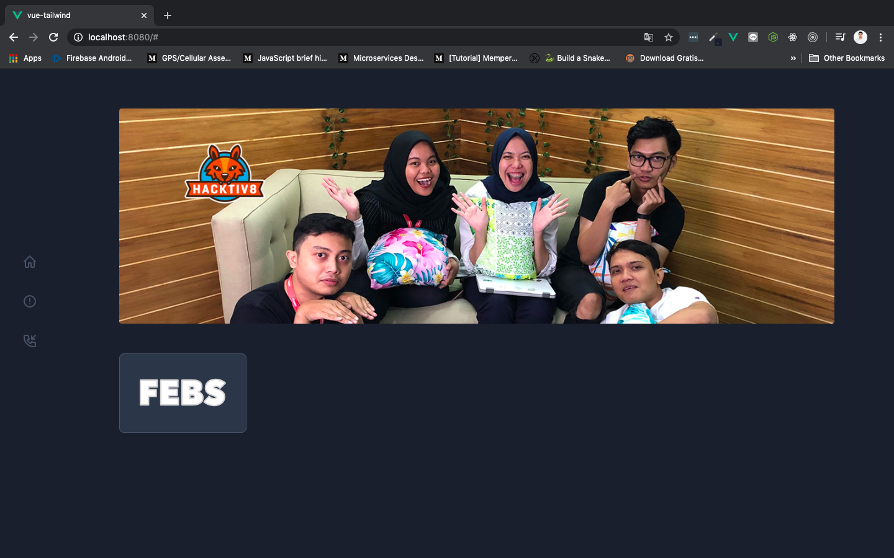

## Adding Shadow

Box kita sudah lumayan keren, tapi butuh shadow lagi biar makin keren. Kita akan membuat custom shading, supaya boxnya lebih terlihat seperti mengambang. Masih di componnet `Home.vue`, tambahkan sintaks berikut di bagian class dari element `<a>`:

```html
shadow-custom
```

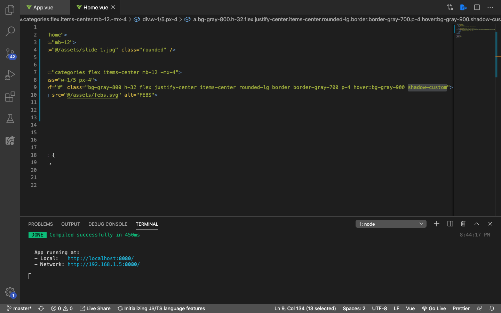

Selanjutnya, buka folder `node_modules` dan cari folder `tailwindcss`, selanjutnya cari folder `stubs` dan buka file `defaultConfig.stub`.

> ***Tips & trick:*** `defaultConfig.stub` berisi default configuration dari Tailwindcss

Cari dengan cara menekan `command` + `f` pada macOs, atau `ctrl` + `f` pada windows, dan masukkan keyword `boxShadow`. Copy bagian di bawah ini:

```js
xl: '0 20px 25px -5px rgba(0, 0, 0, 0.1), 0 10px 10px -5px rgba(0, 0, 0, 0.04)',
```

Selanjutnya, buka file `tailwind.config.js` dan rubah isinya menjadi seperti berikut:

```js
module.exports = {
  theme: {
    extend: {
      boxShadow: {
        custom: '0 20px 25px -5px rgba(0, 0, 0, .8), 0 10px 10px -5px rgba(0, 0, 0, 0.04)',
      }
    }
  },
  variants: {},
  plugins: [],
}
```

Ya, kita membuat satu custom attribut baru untuk `boxShadow`, dengan nama `custom`. Perhatikan bagian `rgba(0, 0, 0, 0.1)`, sewaktu kita copy dari `node_modules` angka terakhirnya masih `0.1`. Pada saat kita buat di dalam `tailwind.config.js`, rubah menjadi `.8`.

> ***Tips & trick:*** Untuk mengetahui lebih jauh tentang RGBA color, silahkan kunjungi [artikel berikut ini](https://www.duniailkom.com/artikel-css-pengertian-dan-cara-penulisan-kode-warna-rgba-hsl-dan-hsla/)

Save dan tampilan pada browser kita sudah menjadi semakin keren:

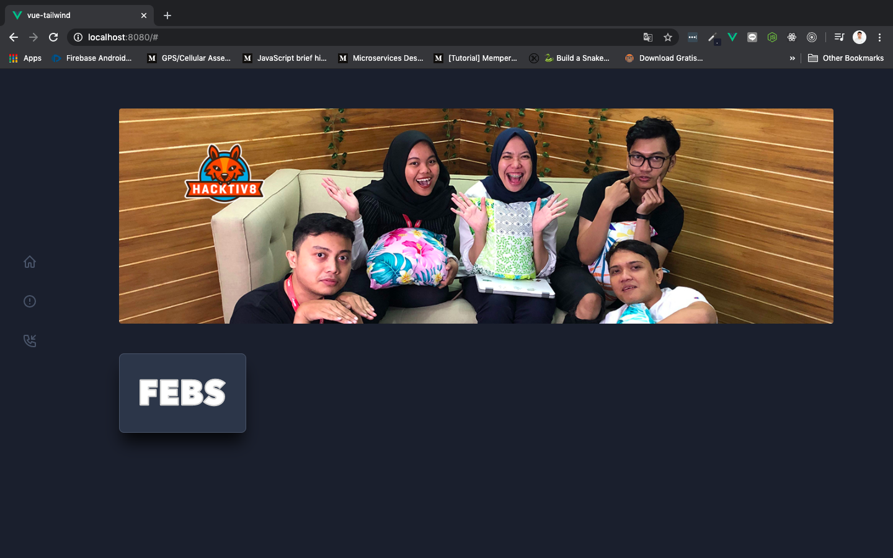

Sekarang buat 4x lagi supaya pas menjadi 5, dan sesuaikan imagenya, sesuai dengan jumlah kategori specilization yang kita punya. Jika sudah, tampilannya akan berubah menjadi seperti ini:

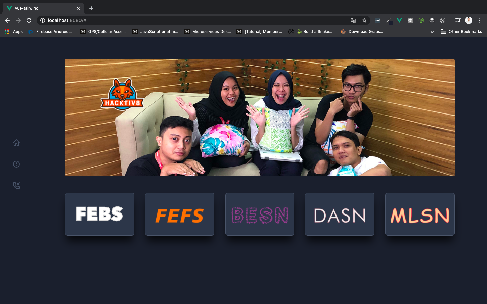

Sintaknya juga menjadi seperti berikut:

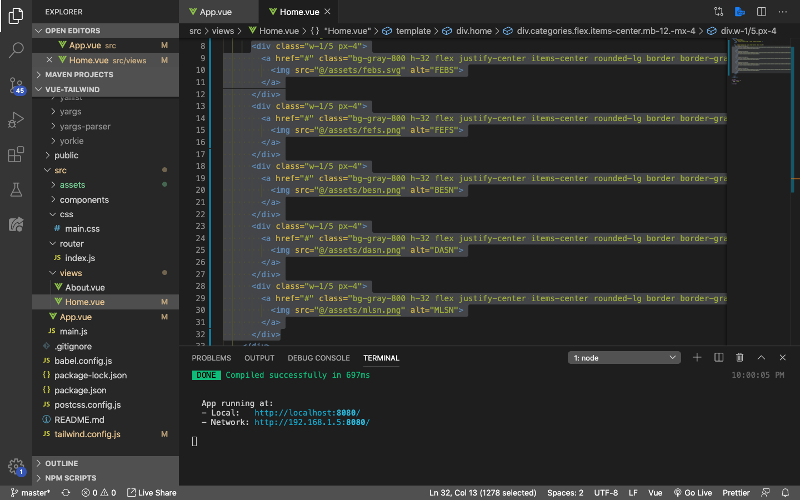

Selanjutnya tambahkan sedikit keterangan di bawah box kategori yang kita punya sperti berikut:

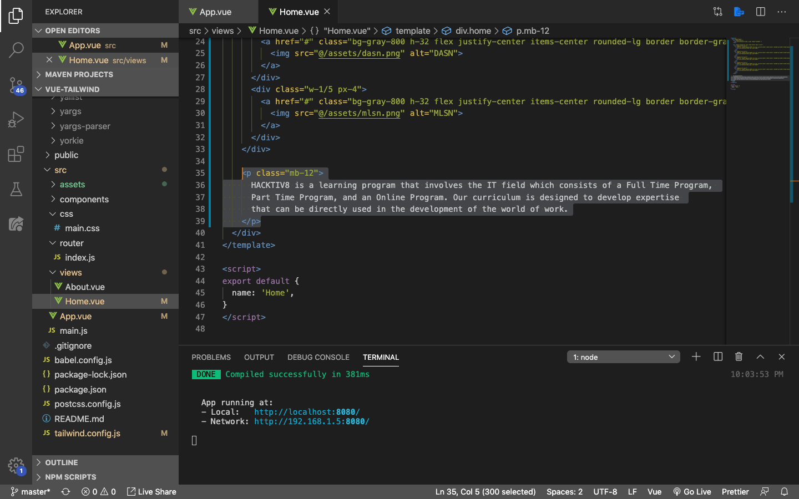

Save dan tampilannya pun berubah:

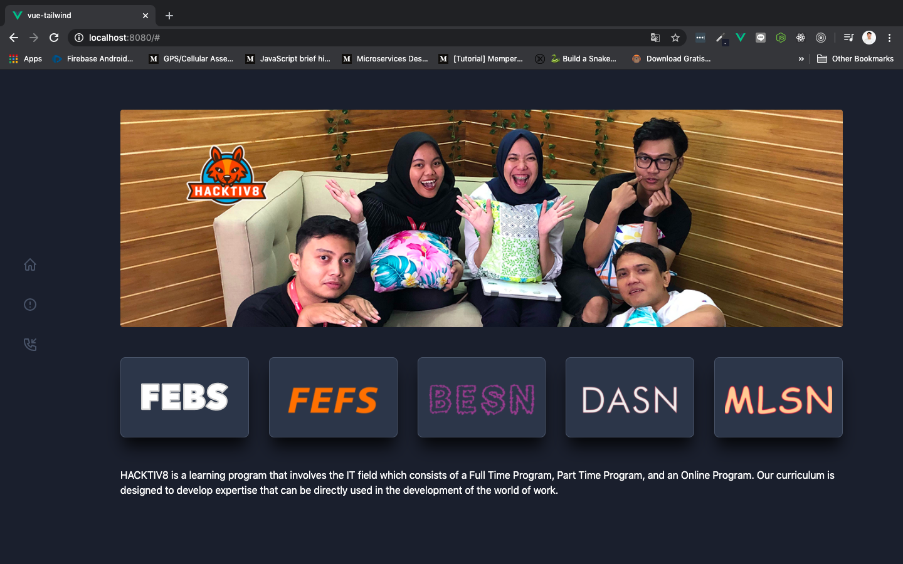