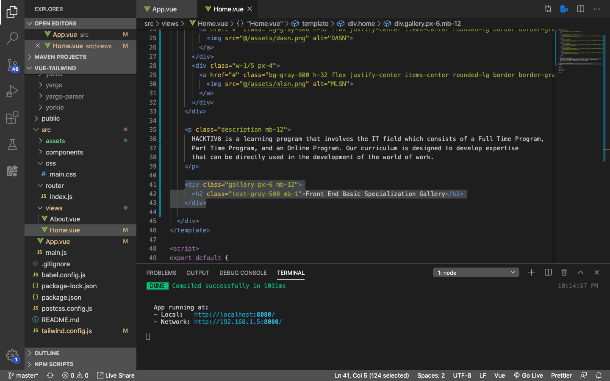
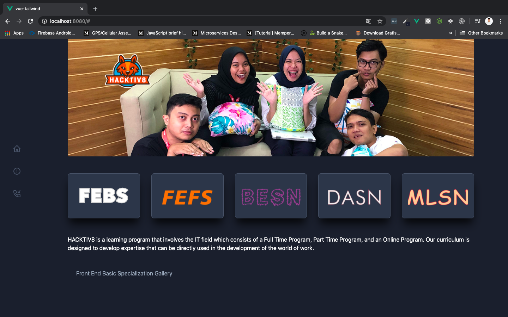
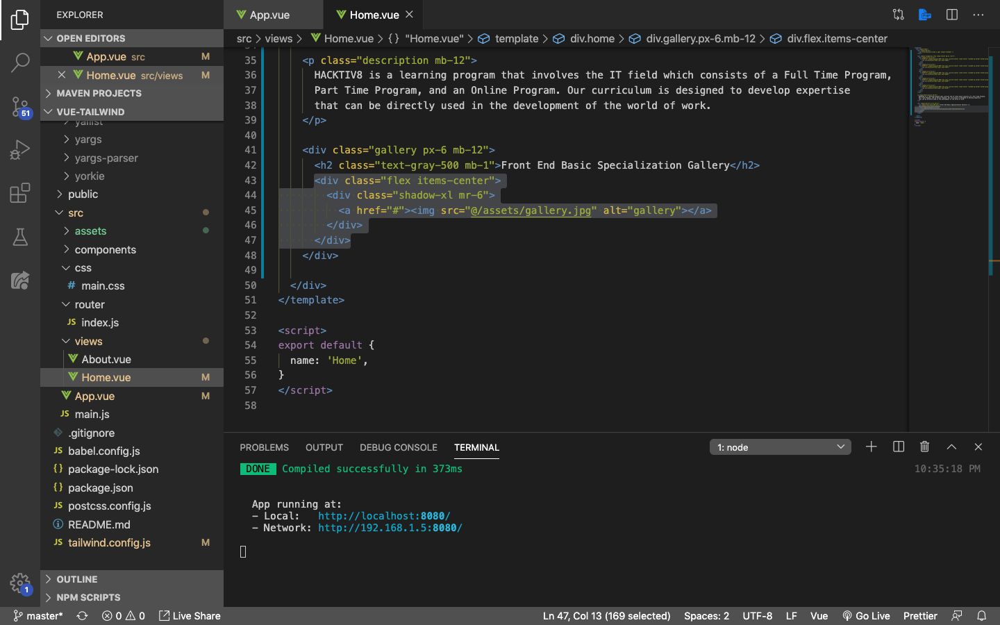
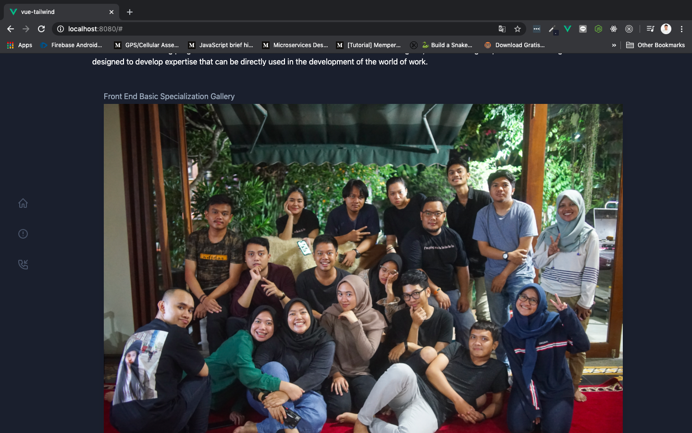
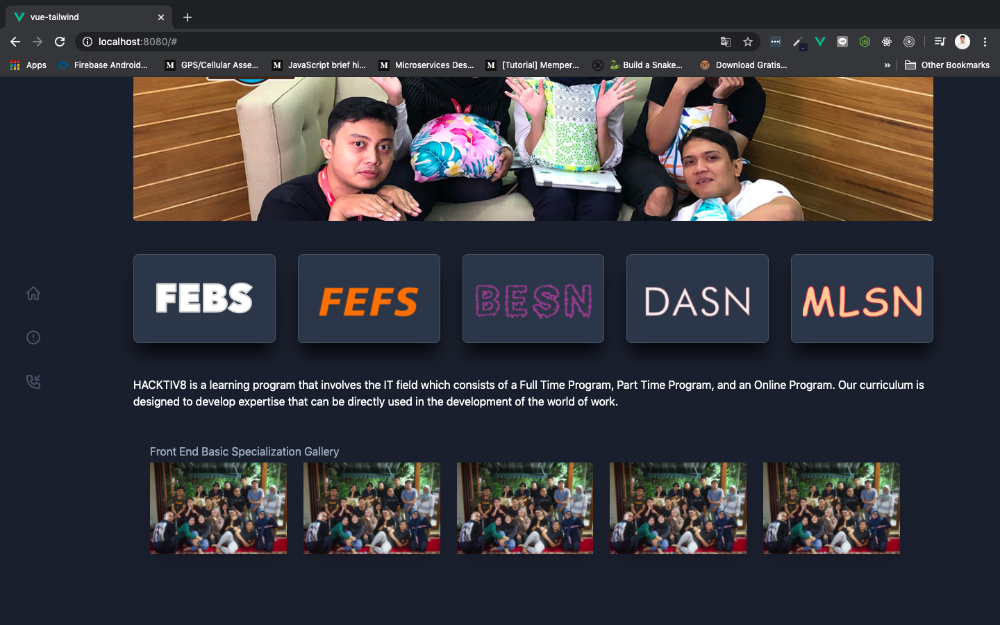
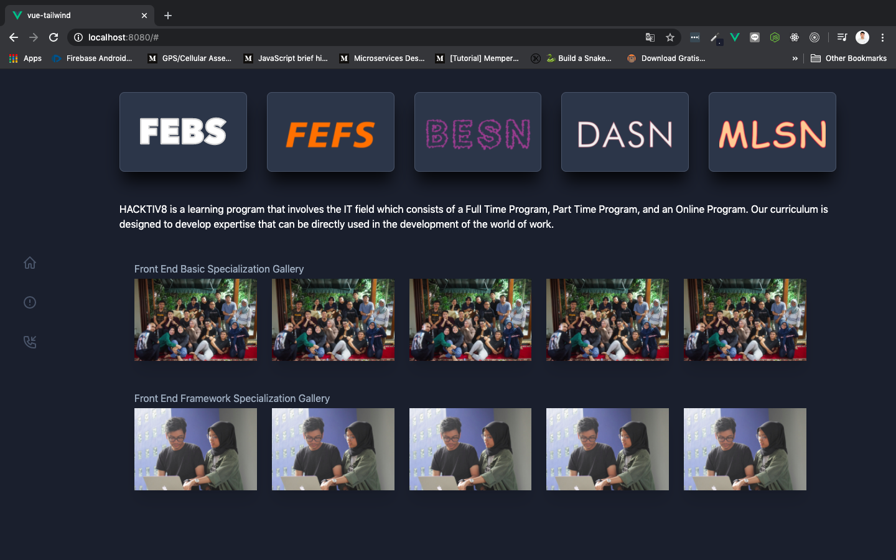

# Adding Gallery

Kita juga bisa menambahkan gallery di dalam portofolio kita. Caranya pun cukup mudah, masih di file yang sama yaitu `Home.vue`, tambahkan sintak berikut:



Hasilnya akan ada sedikit `padding` di left dan right content karena kita menggunakan `px-6`:



Sebelum lanjut ke tahap selanjutnya, siapkan kira-kira 6 images untuk setiap kategori. **Berarti total ada 30 images yang akan kita sematkan pada bagian categori.** Seperti biasa kumpulkan semua image di dalam folder `assets`. Selanjutnya tambahkan sintak berikut:



Save dan tampilannya akan berubah menjadi seperti ini:



Buat 4x lagi supaya pas menjadi 5. Lalu sesuaikan masing-masing foto dengan foto yang teman-teman sukai. COntoh sintak yang sudah dicopy menjadi 5 adalah seperti berikut:

```html
<div class="flex items-center">
    <div class="shadow-xl mr-6">
        <a href="#"></a>
    </div>
    <div class="shadow-xl mr-6">
        <a href="#"></a>
    </div>
    <div class="shadow-xl mr-6">
        <a href="#"></a>
    </div>
    <div class="shadow-xl mr-6">
        <a href="#"></a>
    </div>
    <div class="shadow-xl mr-6">
        <a href="#"></a>
    </div>
</div>
```

Save dan tampilannya pun ikut berubah menjadi seperti di abwah ini:



Jika sudah berhasil sampai tahap ini, silahkan copy dan paste sintaknya menjadi 5 categori specialization, yang masing-masing diisikan dengan 5 buah images seperti di bawah ini:

```html
<div class="gallery px-6 mb-12">
    <h2 class="text-gray-500 mb-1">Front End Basic Specialization Gallery</h2>
    <div class="flex items-center">
    <div class="shadow-xl mr-6">
        <a href="#"></a>
    </div>
    <div class="shadow-xl mr-6">
        <a href="#"></a>
    </div>
    <div class="shadow-xl mr-6">
        <a href="#"></a>
    </div>
    <div class="shadow-xl mr-6">
        <a href="#"></a>
    </div>
    <div class="shadow-xl mr-6">
        <a href="#"></a>
    </div>
    </div>
</div>
<div class="gallery px-6 mb-12">
    <h2 class="text-gray-500 mb-1">Front End Framework Specialization Gallery</h2>
    <div class="flex items-center">
    <div class="shadow-xl mr-6">
        <a href="#"></a>
    </div>
    <div class="shadow-xl mr-6">
        <a href="#"></a>
    </div>
    <div class="shadow-xl mr-6">
        <a href="#"></a>
    </div>
    <div class="shadow-xl mr-6">
        <a href="#"></a>
    </div>
    <div class="shadow-xl mr-6">
        <a href="#"></a>
    </div>
    </div>
</div>
```

Tampilannya akan berubah menjadi seperti ini:



Teruskan hingga menjadi 5, dan hasilnya menjadi seperti berikut:

