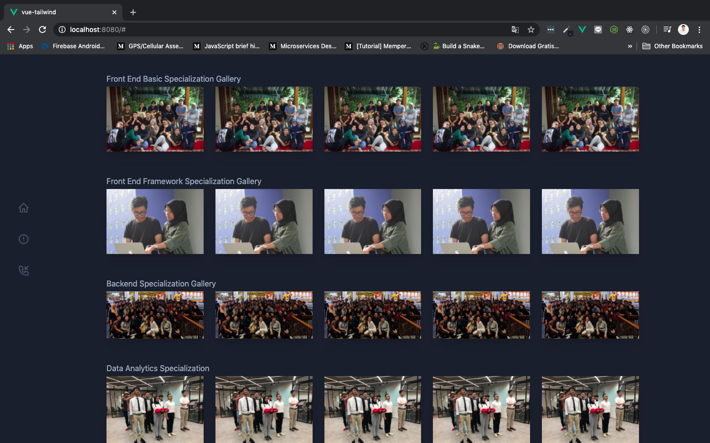
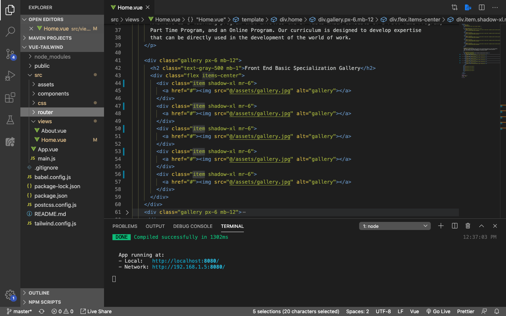
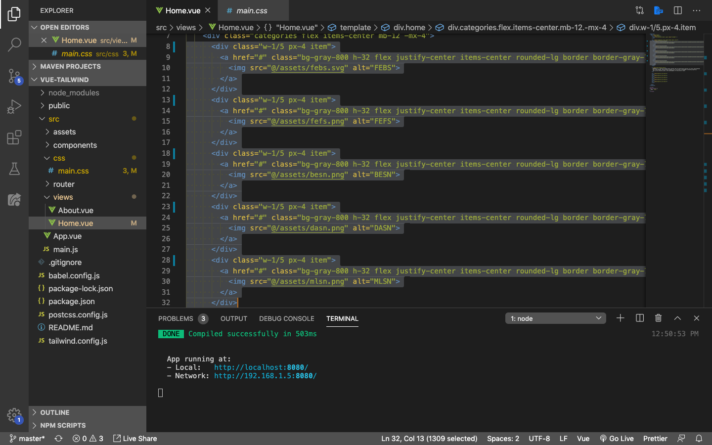
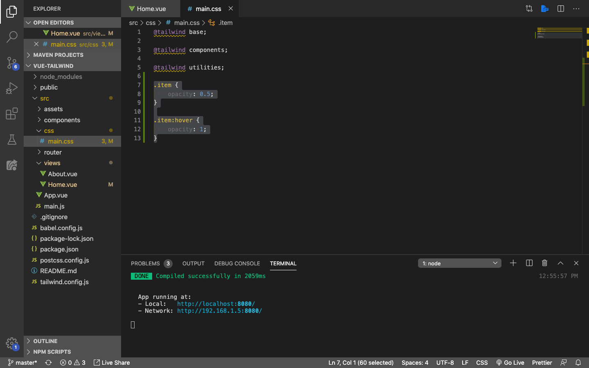
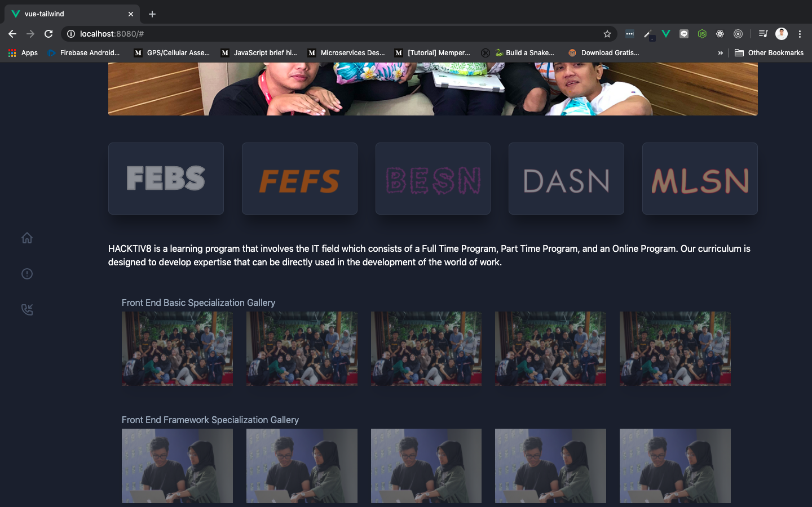
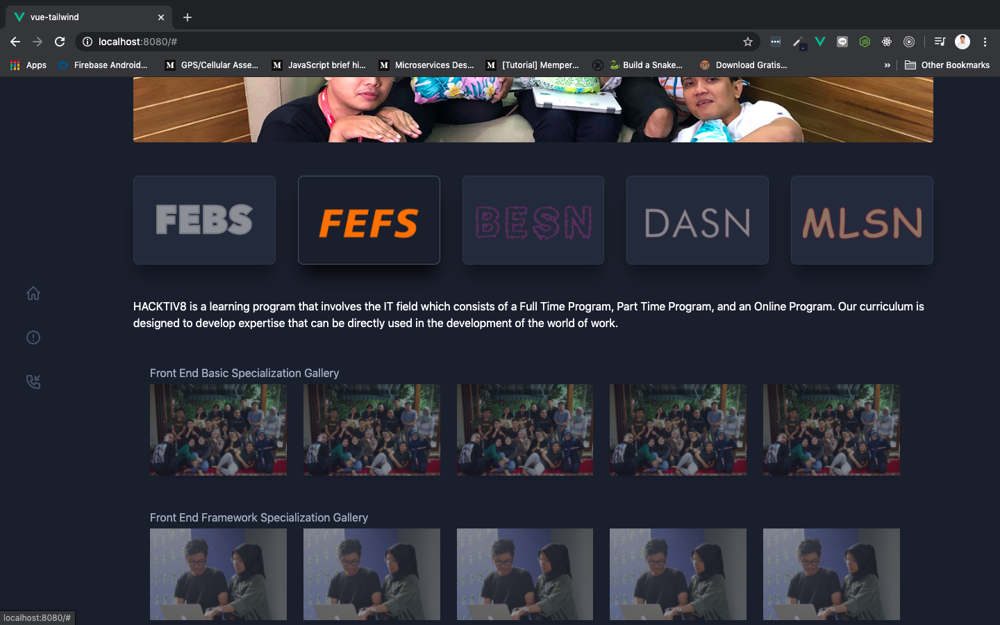

# Adding Opacity Effect

Pada pembahasan kali ini, kita akan mencoba menambahkan sebuah efek-efek keren menggunakan CSS menggunakan `opacity`. Rencananya kita akan membuat semua image yang ada menjadi agak gelap sebelum `hover`, dan menjadi lebih terang ketika di-`hover`. Sebelum kita masuk ke pembahasan, pastikan teman-teman sudah merubah isi dari masing-masing images, dengan image yang berbeda. Pada contoh kali ini saya hanya menggunakan beberapa image yang sama supaya menghemat waktu pengerjaan reading ini, jadinya seperti ini:



## Adding New Class for Opacity

Okay, sekarang kita butuh menambahkan custom class untuk mentarget masing-masing foto yang ada, supaya bisa kita tambahkan `opacity` di dalamnya. Class ini teman-teman bebas mau kasih nama apa. Di sini saya menggunakan class dengan nama `item` saja. Selanjutnya, kita tambahkan di setiap `<div>` pembungukus element `<a>` kita. contohnya seperti berikut:



Contoh sintak untuk Front End Basic Specialization gallery:

```html
<div class="gallery px-6 mb-12">
    <h2 class="text-gray-500 mb-1">Front End Basic Specialization Gallery</h2>
    <div class="flex items-center">
        <div class="item shadow-xl mr-6">
            <a href="#"></a>
        </div>
        <div class="item shadow-xl mr-6">
            <a href="#"></a>
        </div>
        <div class="item shadow-xl mr-6">
            <a href="#"></a>
        </div>
        <div class="item shadow-xl mr-6">
            <a href="#"></a>
        </div>
        <div class="item shadow-xl mr-6">
            <a href="#"></a>
        </div>
    </div>
</div>
```

Lakukan hal yang sama pada bagian sisanya, yaitu **Front End Framework Specialization Gallery, Backend Specialization Gallery, Data Analytics Specialization, dan Machine Learning Specialization**.

> ***Tips & trick:*** Kamu bisa melakukan masive selection di vscode dengan cara: 1. Block satu kalimat yang mau kamu select 2. Tekan `command` + `d` pada macOs, atau `ctr` + `d` pada windows

Oya, biar lebih oke, kita tambahkan juga class `item` di bagian categori ya! Sama seperti sebelumnya kita akan tambahkan di setiap pembungkus element `<a>` untuk setiap kategori yang kita punya. Contohnya seperti ini:



```html
<div class="w-1/5 px-4 item">
    <a href="#" class="bg-gray-800 h-32 flex justify-center items-center rounded-lg border border-gray-700 p-4 hover:bg-gray-900 shadow-custom">
        
    </a>
</div>
<div class="w-1/5 px-4 item">
    <a href="#" class="bg-gray-800 h-32 flex justify-center items-center rounded-lg border border-gray-700 p-4 hover:bg-gray-900 shadow-custom">
        
    </a>
</div>
<div class="w-1/5 px-4 item">
    <a href="#" class="bg-gray-800 h-32 flex justify-center items-center rounded-lg border border-gray-700 p-4 hover:bg-gray-900 shadow-custom">
        
    </a>
</div>
<div class="w-1/5 px-4 item">
    <a href="#" class="bg-gray-800 h-32 flex justify-center items-center rounded-lg border border-gray-700 p-4 hover:bg-gray-900 shadow-custom">
        
    </a>
</div>
<div class="w-1/5 px-4 item">
    <a href="#" class="bg-gray-800 h-32 flex justify-center items-center rounded-lg border border-gray-700 p-4 hover:bg-gray-900 shadow-custom">
        
    </a>
</div>
```

## Adding Opacity

Selanjutnya, buka file `main.css` yang terdapat pada folder `css`, dan tambahkan:

```css
.item {
    opacity: 0.5;
}

.item:hover {
    opacity: 1;
}
```

Setelah bagian terakhir dari `@tailwind utilities;`:



Save dan run, lalu coba lihat di browser:

Sebelum di-hover:



Ketika FEFS kategori di-hover:


