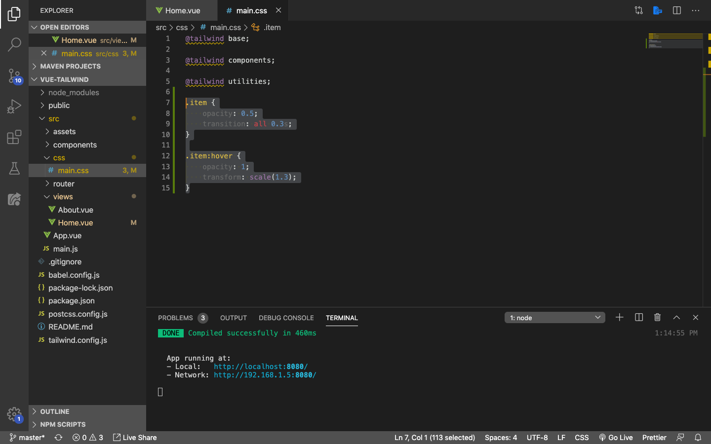
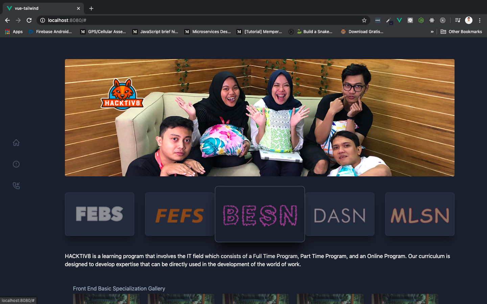
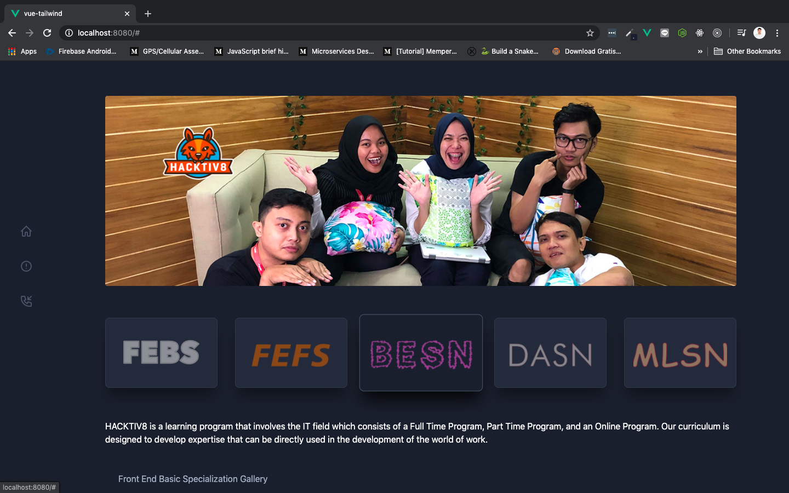
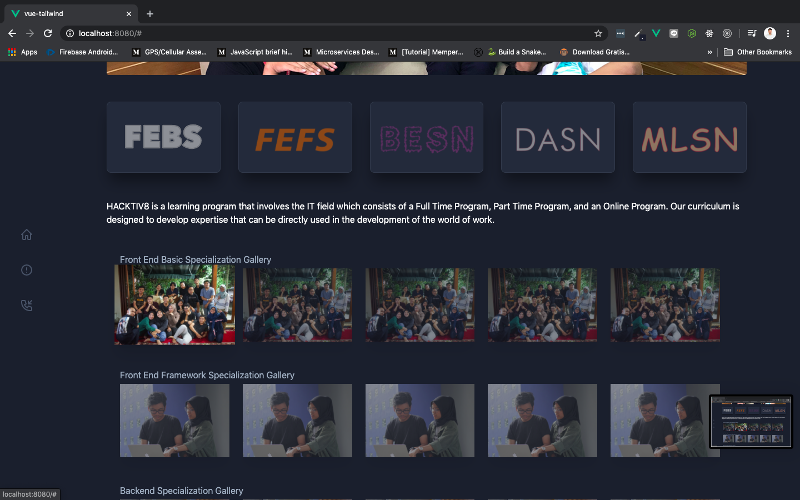
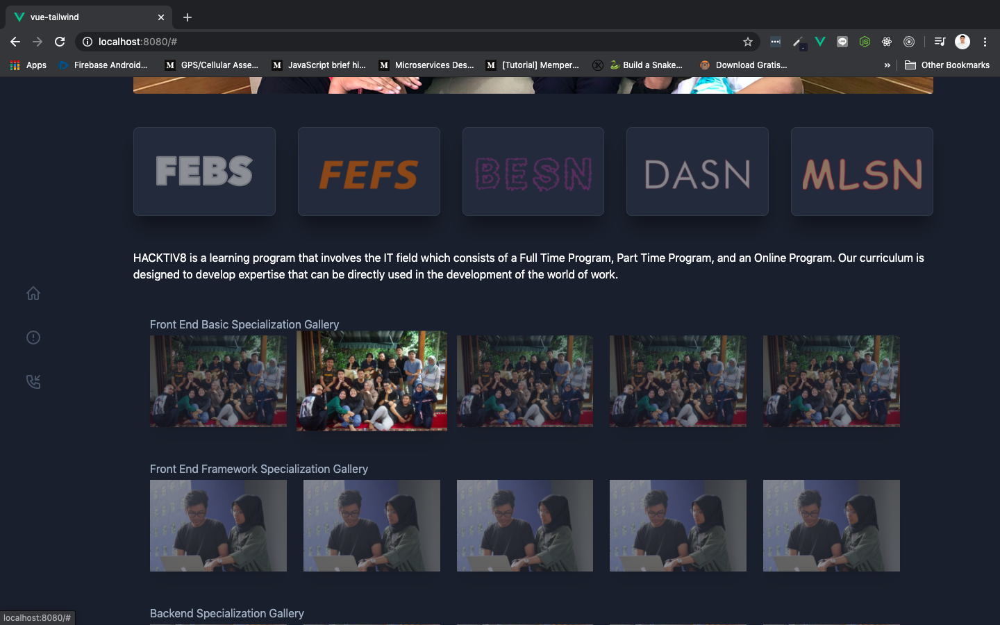
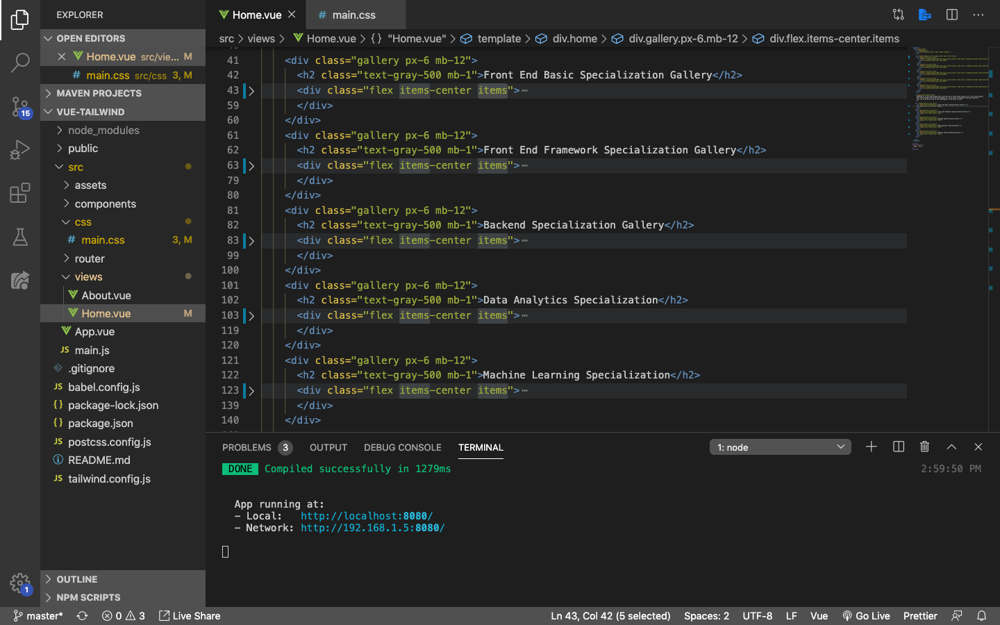
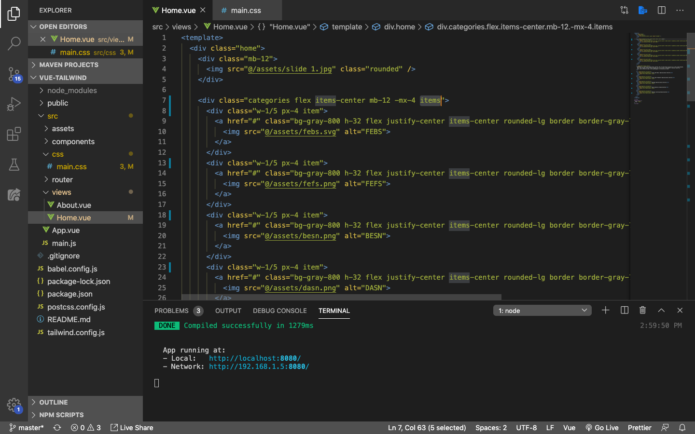
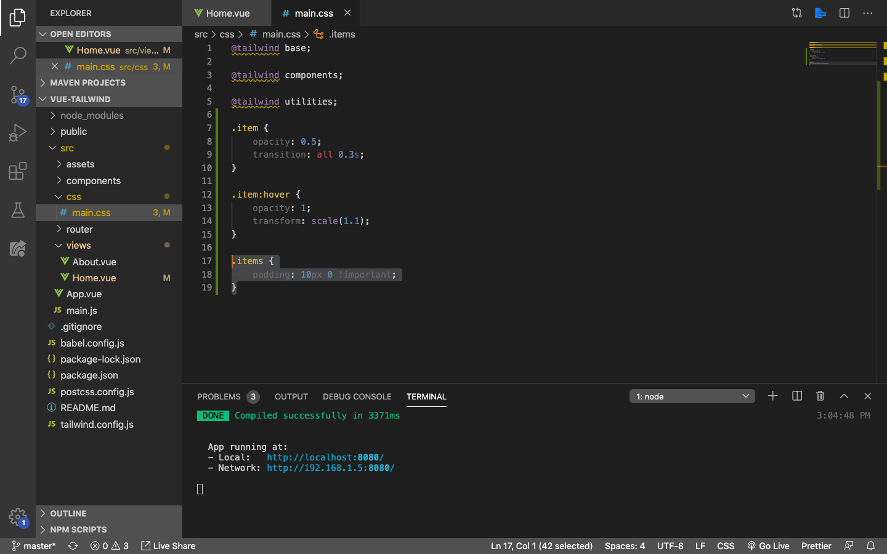
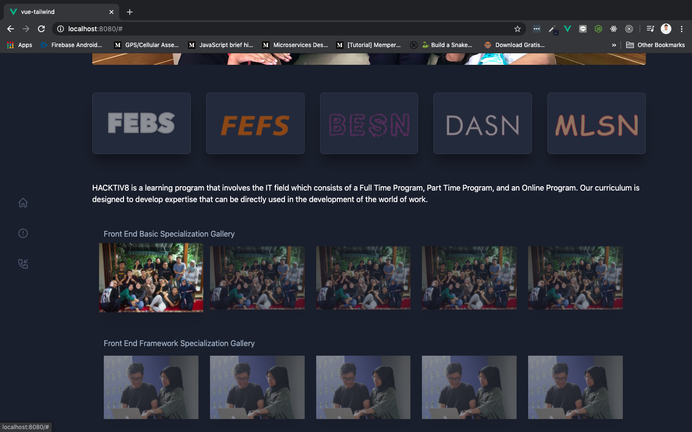

# Adding Transform Effect

Selanjutnya, kita ingin membuat semua class `item` menerapkan CSS `transition` & `transform`, supaya ketika kita `hover` boxes kategori dan images gallery terlihat seperti sedikit efek popup dengan property `scale` pada `transform`. Okay, langsung saja masih di file `main.css` pada folder `css`, kita akan menambahkan `transform` dengan property `scale` dan lainnya seperti berikut ini:

> ***Tips & trick:*** Jika teman-teman ingin lebih tau banyak tentang CSS `transition`, silahkan mengunjungi [link berikut ini](https://www.w3schools.com/cssref/css3_pr_transition.asp). CSS `transform` silahkan mengunjungi [link berikut ini](https://www.w3schools.com/cssref/css3_pr_transform.asp)

```css
.item {
    opacity: 0.5;
    transition: all 0.3s;
}

.item:hover {
    opacity: 1;
    transform: scale(1.3);
}
```



Save dan lihat di browser. Ini adalah tampilan ketika BESN di-`hover` oleh kursor:



## Adjusting Popup

Hmm di sini boxes kategori dan images kita sudah lumayan bagus, tetapi kalau teman-teman perhatikan dia terlalu mepet antara item satu dengan item lainnya ketika di-`hover`. Untuk mengatasi itu, kita akan rubah `transform: scale(1.3)` menjadi `transform: scale(1.1)` supaya popup tidak terlalu menonjol ke luar. Di bagian `item:hover` rubah `scale`-nya menjadi seperti berikut:

```css
.item:hover {
    opacity: 1;
    transform: scale(1.1);
}
```

Save dan lihat di browser ketika BESN katagori di-`hover` kembali:



Sekarang sudah tidak terlalu menonjol popupnya dan lebih enak dilihat. Selanjutnya ketika kita `hover` bagian gallery, dia akan menabrak bagian judul dari gallery yang ada:





Untuk mengatasinya kita bisa tambahkan `padding` dibagian `top` dan `bottom` dari pembungkus iamges, dalam hal ini kita harus menambahkan satu class lagi ke masing-masing pembungkus images kita. Classnya bebas, di sini saya akan menggunakan `items` jamak dari `item` di bagian pembungkusnya, seperti berikut:

```html
<div class="flex items-center items">
    <div class="item shadow-xl mr-6">
        <a href="#"></a>
    </div>
    <div class="item shadow-xl mr-6">
        <a href="#"></a>
    </div>
    <div class="item shadow-xl mr-6">
        <a href="#"></a>
    </div>
    <div class="item shadow-xl mr-6">
        <a href="#"></a>
    </div>
    <div class="item shadow-xl mr-6">
        <a href="#"></a>
    </div>
</div>
```

`items` juga akan saya terapkan pada pembungkus images di gallery yang lainnya, seperti di bawah ini:



Jangan lupa kita tambahkan juga `items` di class `categories` atau pembungkus dari box kategorinya seperti berikut:

```html
<div class="categories flex items-center mb-12 -mx-4 items">
    ...
    ...
    ...
    ...
    ...
</div>
```



Selanjutnya, tambahkan `padding` di bagian CSS, dan jangan lupa `!important` untuk meng-*override* style yang lama:

```css
.items {
    padding: 10px 0 !important;
}
```



Save dan lihat di browser:


