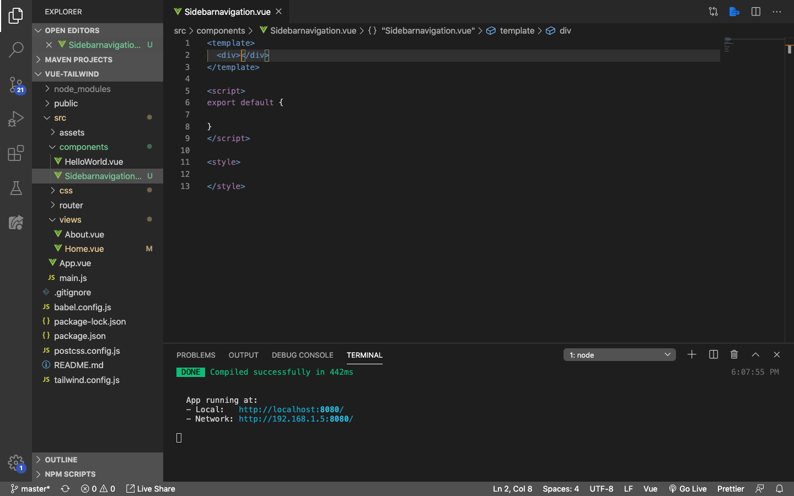
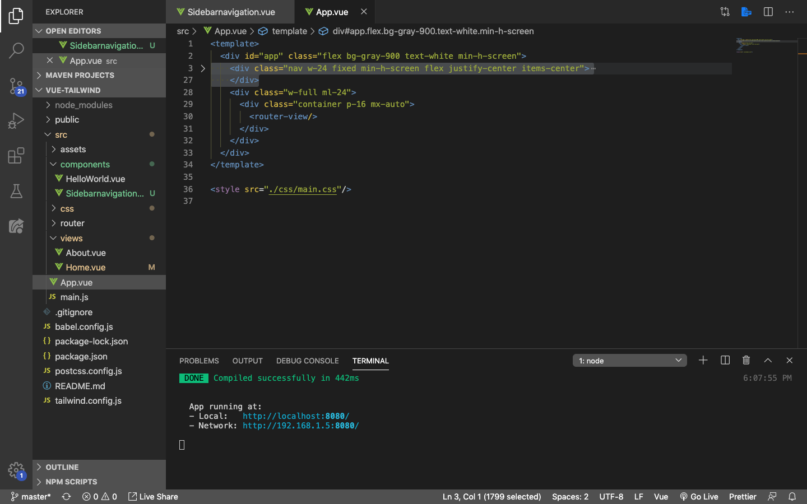
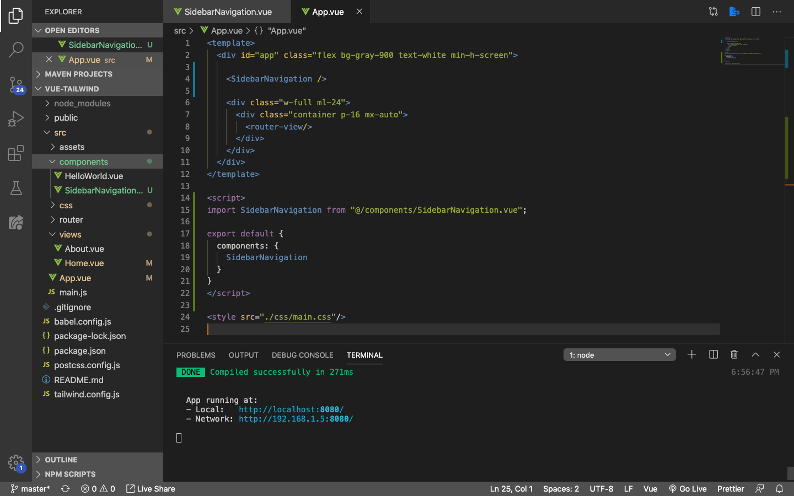
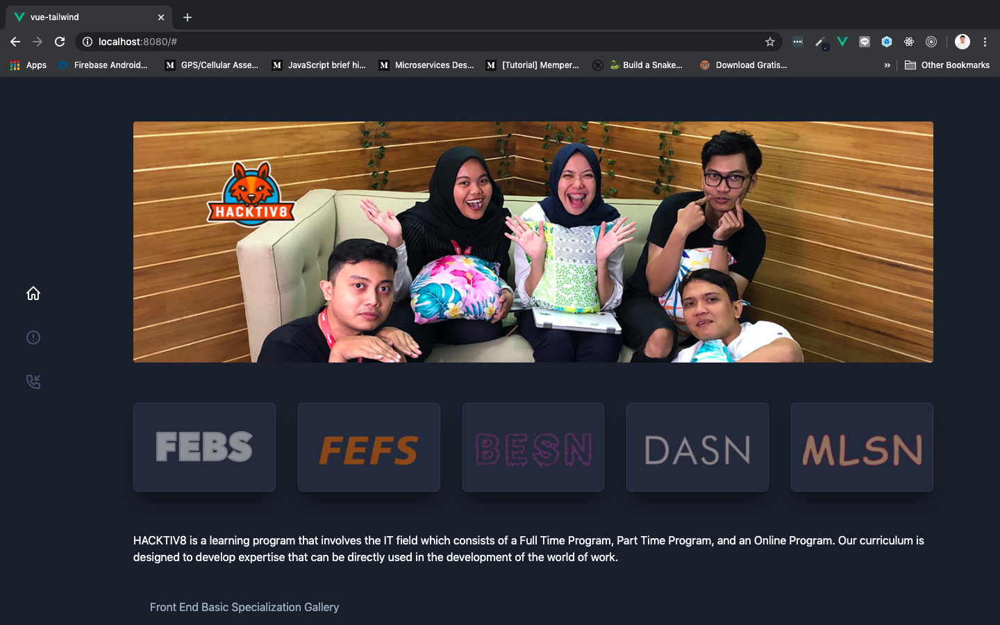
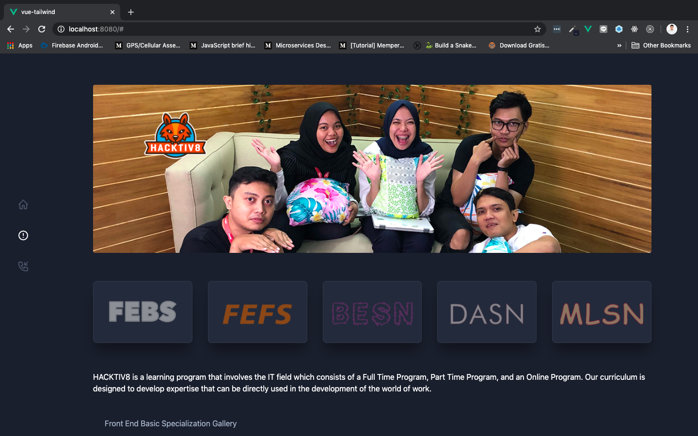
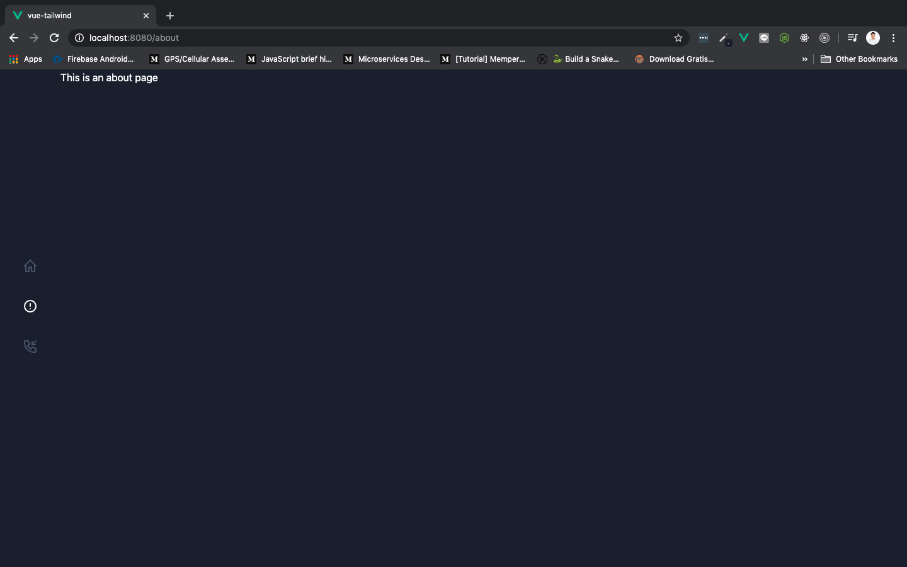
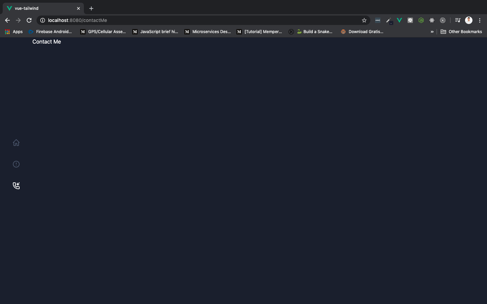

# Sidebar Navigation Component

Sekarang kita akan memisahkan sidebar yang berisi menu navigation ke dalam sebuah component terpisah supaya lebih mudah dikembangkan nantinya.

## Splitting Sidebar

Cara sangatlah mudah:

1. Buatlah satu buah component baru di folder `components`. Namanya bebas, tetapi pastikan teman-teman mudah mengenalinya sebagi sidebar. Di sini saya menggunakan nama `SidebarNavigation.vue` saja. Lalu, isikan kerangka standard single page component di Vue seperti `<tamplate></template>`.

    

2. Buka file root component kita, yaitu `App.vue`, lalu select `<div>` yang berisi semua menu navigation.

    

    ```html
    <div class="nav w-24 fixed min-h-screen flex justify-center items-center">
        <ul>
            <li class="mb-10">
                <a href="#" class="fill-current text-gray-700 hover:text-white">
                <svg xmlns="http://www.w3.org/2000/svg" viewBox="0 0 24 24" width="24" height="24">
                    <path class="heroicon-ui" d="M13 20v-5h-2v5a2 2 0 0 1-2 2H6a2 2 0 0 1-2-2v-7.59l-.3.3a1 1 0 1 1-1.4-1.42l9-9a1 1 0 0 1 1.4 0l9 9a1 1 0 0 1-1.4 1.42l-.3-.3V20a2 2 0 0 1-2 2h-3a2 2 0 0 1-2-2zm5 0v-9.59l-6-6-6 6V20h3v-5c0-1.1.9-2 2-2h2a2 2 0 0 1 2 2v5h3z"/>
                </svg>
                </a>
            </li>
            <li class="mb-10">
                <a href="#" class="fill-current text-gray-700 hover:text-white">
                <svg xmlns="http://www.w3.org/2000/svg" viewBox="0 0 24 24" width="24" height="24">
                    <path class="heroicon-ui" d="M12 2a10 10 0 1 1 0 20 10 10 0 0 1 0-20zm0 2a8 8 0 1 0 0 16 8 8 0 0 0 0-16zm0 9a1 1 0 0 1-1-1V8a1 1 0 0 1 2 0v4a1 1 0 0 1-1 1zm0 4a1 1 0 1 1 0-2 1 1 0 0 1 0 2z"/>
                </svg>
                </a>
            </li>
            <li class="mb-10">
                <a href="#" class="fill-current text-gray-700 hover:text-white">
                <svg xmlns="http://www.w3.org/2000/svg" viewBox="0 0 24 24" width="24" height="24">
                    <path class="heroicon-ui" d="M13.04 14.69l1.07-2.14a1 1 0 0 1 1.2-.5l6 2A1 1 0 0 1 22 15v5a2 2 0 0 1-2 2h-2A16 16 0 0 1 2 6V4c0-1.1.9-2 2-2h5a1 1 0 0 1 .95.68l2 6a1 1 0 0 1-.5 1.21L9.3 10.96a10.05 10.05 0 0 0 3.73 3.73zM8.28 4H4v2a14 14 0 0 0 14 14h2v-4.28l-4.5-1.5-1.12 2.26a1 1 0 0 1-1.3.46 12.04 12.04 0 0 1-6.02-6.01 1 1 0 0 1 .46-1.3l2.26-1.14L8.28 4zm12.01-1.7a1 1 0 0 1 1.42 1.4L17.4 8H20a1 1 0 0 1 0 2h-5a1 1 0 0 1-1-1V4a1 1 0 0 1 2 0v2.59l4.3-4.3z"/>
                </svg>
                </a>
            </li>
        </ul>
    </div>
    ```

    > ***Tips & trick:*** Jika teman-teman menggunakan extension `Vetur` di vscode, teman-teman cukup menekan `<` + `enter`, lalu default single page component di Vue akan secara otomatis ter-*generate*.

3. Pindahkan ke dalam component yang sudah kita buat tadi, yaitu `SidebarNavigation.vue`, tentunya di dalam element `<template>`. Tambahkan `name: 'SidebarNavigation'` di dalam `export default`, dan hapus element `<style>` karena kita tidak membutuhkannya. Sehingga berubah menjadi seperti ini:

    ```html
    <template>
        <div class="nav w-24 fixed min-h-screen flex justify-center items-center">
        <ul>
            <li class="mb-10">
            <a href="#" class="fill-current text-gray-700 hover:text-white">
                <svg xmlns="http://www.w3.org/2000/svg" viewBox="0 0 24 24" width="24" height="24">
                <path class="heroicon-ui" d="M13 20v-5h-2v5a2 2 0 0 1-2 2H6a2 2 0 0 1-2-2v-7.59l-.3.3a1 1 0 1 1-1.4-1.42l9-9a1 1 0 0 1 1.4 0l9 9a1 1 0 0 1-1.4 1.42l-.3-.3V20a2 2 0 0 1-2 2h-3a2 2 0 0 1-2-2zm5 0v-9.59l-6-6-6 6V20h3v-5c0-1.1.9-2 2-2h2a2 2 0 0 1 2 2v5h3z"/>
                </svg>
            </a>
            </li>
            <li class="mb-10">
            <a href="#" class="fill-current text-gray-700 hover:text-white">
                <svg xmlns="http://www.w3.org/2000/svg" viewBox="0 0 24 24" width="24" height="24">
                <path class="heroicon-ui" d="M12 2a10 10 0 1 1 0 20 10 10 0 0 1 0-20zm0 2a8 8 0 1 0 0 16 8 8 0 0 0 0-16zm0 9a1 1 0 0 1-1-1V8a1 1 0 0 1 2 0v4a1 1 0 0 1-1 1zm0 4a1 1 0 1 1 0-2 1 1 0 0 1 0 2z"/>
                </svg>
            </a>
            </li>
            <li class="mb-10">
            <a href="#" class="fill-current text-gray-700 hover:text-white">
                <svg xmlns="http://www.w3.org/2000/svg" viewBox="0 0 24 24" width="24" height="24">
                <path class="heroicon-ui" d="M13.04 14.69l1.07-2.14a1 1 0 0 1 1.2-.5l6 2A1 1 0 0 1 22 15v5a2 2 0 0 1-2 2h-2A16 16 0 0 1 2 6V4c0-1.1.9-2 2-2h5a1 1 0 0 1 .95.68l2 6a1 1 0 0 1-.5 1.21L9.3 10.96a10.05 10.05 0 0 0 3.73 3.73zM8.28 4H4v2a14 14 0 0 0 14 14h2v-4.28l-4.5-1.5-1.12 2.26a1 1 0 0 1-1.3.46 12.04 12.04 0 0 1-6.02-6.01 1 1 0 0 1 .46-1.3l2.26-1.14L8.28 4zm12.01-1.7a1 1 0 0 1 1.42 1.4L17.4 8H20a1 1 0 0 1 0 2h-5a1 1 0 0 1-1-1V4a1 1 0 0 1 2 0v2.59l4.3-4.3z"/>
                </svg>
            </a>
            </li>
        </ul>
        </div>
    </template>

    <script>
    export default {
        name: 'SidebarNavigation'
    }
    </script>
    ```

4. Import component `SidebarNavigation.vue` ke dalam root component, yaitu `App.vue`:

    

    Tahapannya adalah:

    1. Import component `SidebarNavigation.vue`

        ```js
        import SidebarNavigation from "@/components/SidebarNavigation.vue";
        ```

    2. Daftarkan di dalam `components`

        ```js
        export default {
            components: {
                SidebarNavigation
            }
        }
        ```

    3. Tambahkan di dalam `<template>`

        ```html
        <SidebarNavigation />
        ```

5. Pastikan tampilan di browser tidak ada yang berubah

    

## Active Navigation

Sekarang kita akan menandakan menu navigation yang sedang active. Secara default, ketika kita pertama kali membuka website, menu `home` yang muncul. Karena itu, kita akan men-*setting* `home` sebagai default menu, dan merubah warnanya menjadi warna menu nevigation ketika sedang active, yaitu **putih** dengan merubah classnya menjadi:

```html
<a href="#" class="fill-current text-white"></a>
```

Selain `home` (about & contact me) masih menggunakan class yang sama, yaitu:

```html
<a href="#" class="fill-current text-gray-700 hover:text-white"></a>
```

Okay, langsung saja kita mulai! Pertama-tama kita akan melakukan ***binding*** pada attribute class dari masing-masing `<a>` pembungkus icon. Class binding tersebut akan berisi data yang merepresentasikan masing-masing menu yang ada. Rubah class menjadi seperti berikut di masing-masing element `<a>`:

```html
<a href="#" :class="home">
```

Jika menu home, isikan data `home`, jika about isikan `about`, dan contact me isikan `contactMe`. Setelah itu buatlah data dari masing-masing menu di bagian `<script>` dan isikan value awal seperti ini:

```js
home: 'fill-current text-white',
about: 'fill-current text-gray-700 hover:text-white',
contactMe: 'fill-current text-gray-700 hover:text-white'
```

Value dari masing-masing data di atas nantinya akan kita rubah menggunkan `methods`. Caranya, ketika user mengklik salah satu dari 3 menu, dia akan memamnggil method yang namanya `isActive` dengan isian parameter sesuai menu yang diklik. Contoh, ketika user mengklik menu `about`, isian parameternya menjadi `isActive('about')`. Sehingga method `isActive` akan bisa mengenali menu mana yang diklik.

Tambahkan method `isActive` di setiap element `<a>`, contoh di element `<a>` menu `home`:

```html
<a href="#" :class="home" @click="isActive('home')">
```

Lakukan hal yang sama pada 2 menu sisanya (about & contact me).

> ***Tips & trick:*** `Methods` hanya akan terpanggil **jika ada event yang memanggilnya**. Sedangkan `computed` **bisa dipanggil kapan saja tanpa harus ada event yang memanggilnya**.

Selanjutnya buat `methods` dan isikan methods `isActive` seperti berikut:

```js
methods: {
    isActive(menu){
        // console.log(menu)
        if (menu === 'home') {
            this.home = this.active
            this.about = this.unActive
            this.contactMe = this.unActive
        } else if (menu === 'about') {
            this.home = this.unActive
            this.about = this.active
            this.contactMe = this.unActive
        } else if (menu === 'contact') {
            this.home = this.unActive
            this.about = this.unActive
            this.contactMe = this.active
        }
    }
}
```

> ***Tips & trick:*** Pastikan parameter `menu` berisi menu yang diklik user, dengan mengeprintnya terlebih dahulu di console menggunakan `console.log(menu)`

Jika sudah, pada methods `isActive` terdapat 2 data yang belum kita buat, yaitu `active` dan `unActive`. Buatlah data tersebut dengan isian seperti berikut:

```js
active: 'fill-current text-white',
unActive: 'fill-current text-gray-700 hover:text-white',
```

Berikut adalah sintaks lengkap dari component `SidebarNavigation.vue`:

```html
<template>
    <div class="nav w-24 fixed min-h-screen flex justify-center items-center">
      <ul>
        <li class="mb-10">
          <a href="#" :class="home" @click="isActive('home')">
            <svg xmlns="http://www.w3.org/2000/svg" viewBox="0 0 24 24" width="24" height="24">
              <path class="heroicon-ui" d="M13 20v-5h-2v5a2 2 0 0 1-2 2H6a2 2 0 0 1-2-2v-7.59l-.3.3a1 1 0 1 1-1.4-1.42l9-9a1 1 0 0 1 1.4 0l9 9a1 1 0 0 1-1.4 1.42l-.3-.3V20a2 2 0 0 1-2 2h-3a2 2 0 0 1-2-2zm5 0v-9.59l-6-6-6 6V20h3v-5c0-1.1.9-2 2-2h2a2 2 0 0 1 2 2v5h3z"/>
            </svg>
          </a>
        </li>
        <li class="mb-10">
          <a href="#" :class="about" @click="isActive('about')">
            <svg xmlns="http://www.w3.org/2000/svg" viewBox="0 0 24 24" width="24" height="24">
              <path class="heroicon-ui" d="M12 2a10 10 0 1 1 0 20 10 10 0 0 1 0-20zm0 2a8 8 0 1 0 0 16 8 8 0 0 0 0-16zm0 9a1 1 0 0 1-1-1V8a1 1 0 0 1 2 0v4a1 1 0 0 1-1 1zm0 4a1 1 0 1 1 0-2 1 1 0 0 1 0 2z"/>
            </svg>
          </a>
        </li>
        <li class="mb-10">
          <a href="#" :class="contactMe" @click="isActive('contact')">
            <svg xmlns="http://www.w3.org/2000/svg" viewBox="0 0 24 24" width="24" height="24">
              <path class="heroicon-ui" d="M13.04 14.69l1.07-2.14a1 1 0 0 1 1.2-.5l6 2A1 1 0 0 1 22 15v5a2 2 0 0 1-2 2h-2A16 16 0 0 1 2 6V4c0-1.1.9-2 2-2h5a1 1 0 0 1 .95.68l2 6a1 1 0 0 1-.5 1.21L9.3 10.96a10.05 10.05 0 0 0 3.73 3.73zM8.28 4H4v2a14 14 0 0 0 14 14h2v-4.28l-4.5-1.5-1.12 2.26a1 1 0 0 1-1.3.46 12.04 12.04 0 0 1-6.02-6.01 1 1 0 0 1 .46-1.3l2.26-1.14L8.28 4zm12.01-1.7a1 1 0 0 1 1.42 1.4L17.4 8H20a1 1 0 0 1 0 2h-5a1 1 0 0 1-1-1V4a1 1 0 0 1 2 0v2.59l4.3-4.3z"/>
            </svg>
          </a>
        </li>
      </ul>
    </div>
</template>

<script>
export default {
  name: 'SidebarNavigation',
  data(){
    return {
      active: 'fill-current text-white',
      unActive: 'fill-current text-gray-700 hover:text-white',
      home: 'fill-current text-white',
      about: 'fill-current text-gray-700 hover:text-white',
      contactMe: 'fill-current text-gray-700 hover:text-white'
    }
  },
  methods: {
    isActive(menu){
      // console.log(menu)
      if (menu === 'home') {
        this.home = this.active
        this.about = this.unActive
        this.contactMe = this.unActive
      } else if (menu === 'about') {
        this.home = this.unActive
        this.about = this.active
        this.contactMe = this.unActive
      } else if (menu === 'contact') {
        this.home = this.unActive
        this.about = this.unActive
        this.contactMe = this.active
      }
    }
  }
}
</script>
```

Save dan lihat di browser, pastikan menu sudah berjalan seperti yang kita harapkan.

Tampilan awal (***home***) website:



Ketika ***about*** diklik:



Ketika ***contact me*** diklik:


## Adding Router-link

Eits, masih ada satu tahapan lagi nih supaya website kita menjadi SPA. Kita harus membungkus semua element `<a>` dari ke tiga menu yang ada menggunakan `<router-link>`. Lalu, setting `to` ke masing-masing component yang ada di folder `views`. Contoh, menu `home` akan di link ke component `Home.vue` ketika kita set `to` berisi `/`:

```html
<li class="mb-10">
  <router-link to="/">
    <a href="#" :class="home" @click="isActive('home')">
      <svg xmlns="http://www.w3.org/2000/svg" viewBox="0 0 24 24" width="24" height="24">
        <path class="heroicon-ui" d="M13 20v-5h-2v5a2 2 0 0 1-2 2H6a2 2 0 0 1-2-2v-7.59l-.3.3a1 1 0 1 1-1.4-1.42l9-9a1 1 0 0 1 1.4 0l9 9a1 1 0 0 1-1.4 1.42l-.3-.3V20a2 2 0 0 1-2 2h-3a2 2 0 0 1-2-2zm5 0v-9.59l-6-6-6 6V20h3v-5c0-1.1.9-2 2-2h2a2 2 0 0 1 2 2v5h3z"/>
      </svg>
    </a>
  </router-link>
</li>
```

Untuk **about** isikan `to` dengan `/about`. Lalu untuk **contact me** kita harus daftarkan dulu routernya di file `index.js` yang terdapat pada folder `router`. Caranya seperti ini:

```js
{
  path: '/contactMe',
  name: 'contact me',
  component: () => import('../views/ContactMe.vue')
}
```

Selanjutnya jangan lupa buat component baru dengan nama `contactMe.vue` di dalam folder `views` dan isikan simple saja seperti ini:

```html
<template>
  <div class="contact-me">
    <p>Contact Me</p>
  </div>
</template>

<script>
export default {
  name: 'contact me'
}
</script>

<style>

</style>
```

Save dan lihat di browser, pastikan setiap menu merepresentasikan component yang tepat sperti berikut ini:

Tampilan awal (***home***) website:


Ketika ***about*** diklik:



Ketika ***contact me*** diklik:


