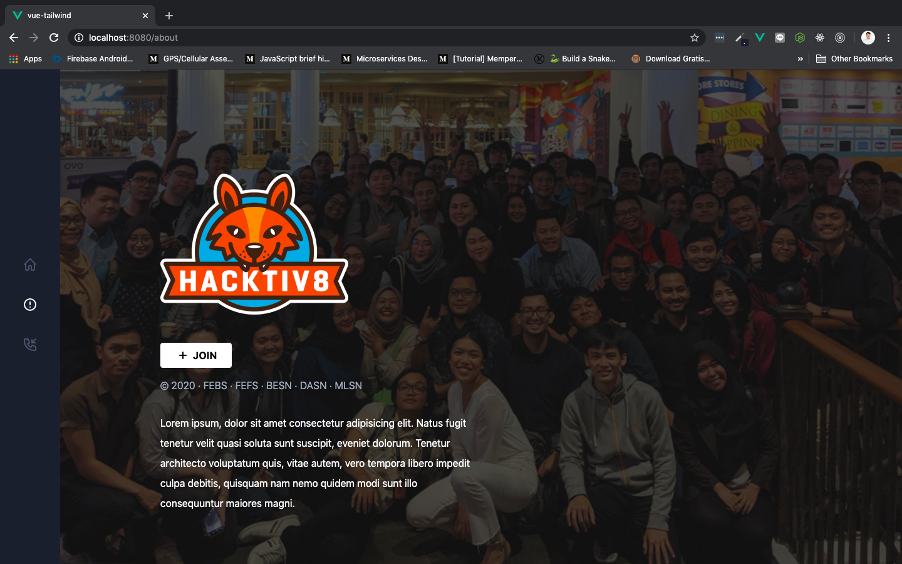

# About Component

Baiklah, sekarang kita akan mulai membuat component baru. Component yang pertama adalah `About.vue`. Kalau tema-teman masih ingat, kita akan membuat 3 pages, yang artinya akan ada 3 buat component untuk masing-masing pagenya. Karena kita menggunkan ***Vue Router***, secara otomatis dia sudah menyedikan 2 components default untuk kita yaitu `Home.vue` dan `About.vue` yang terdapat pada folder `Views`. **We okay with this about component,** langsung saja kita gunakan si `About.vue` dan kita rubah isinya sesuai dengan prototype yang sudah kita buat.

Sebelum kita mulai ngoding, teman-teman **siapkan terlebih dahulu satu buah image** yang akan kita gunakan sebagai background dari `About.vue` component kita. Seperti biasa, letakkan di dalam folder `assets`. Saya sarankan menggunakan image yang lumayan bagus resolusinya, supaya tidak pecah ketika kita jadikan background.

## Move Container

Okey, sebelum kita masuk ke `About.vue`, kita buka dulu `App.vue`. Kita akan memindahkan `<div>` dengan `container` ke spesifik component saja, sehingga tidak mengganggu component yang lainnya, perhatikan gambar berikut:


Pada gambar di atas, kita hilangkan `<div>` dengan class `container` yang membungkus `<router-view />`. Lalu kita pindahkan di dalam component `Home.vue` dan bungkus semua isinya dengan container yang tadi, seperti berikut:


Save dan pastikan tidak ada yang berubah di browser.

## About Content

Pada component `About.vue` kita akan membuat content yang terdiri dari **logo (hacktiv8 logo yang terdapat di `assets` folder), button join dengan icon svg tentunya, dan description singkat**.

* Untuk logo, boleh diganti dengan logo yang teman-teman punya

* Kita akan menggunakan icon `<svg>` di dalam `button` nanti, dan akan kita berikan value `join` disamping icon `<svg>` tersebut. Di bawah button terdapat copyright dan kategori specialization. Ini adalah svg yang kita gunakan:

    ```html
    <svg xmlns="http://www.w3.org/2000/svg" viewBox="0 0 24 24" width="24" height="24"><path class="heroicon-ui" d="M17 11a1 1 0 0 1 0 2h-4v4a1 1 0 0 1-2 0v-4H7a1 1 0 0 1 0-2h4V7a1 1 0 0 1 2 0v4h4z"/></svg>
    ```

* Dan terakhir deskripsi singkat. Di sini saya menggunakan lorem ipsum saja, tetapi jika teman-teman ingin mengubahnya tidak masalah

Kita akan menggunakan image untuk membuat background dari component `About.vue` kita. Jangan lupa tambahkan class `bg-cover` juga di `<div>` pembungkus component kita, supaya kita bisa menggunakan image sebagai background. Lalu bisa gunakan inline `style` yang sudah dibinding menjadi:

```html
<div class="about min-h-screen bg-cover" :style="{backgroundImage: `url('${image}')`}">
```

`image` di sini berasal dari data yang sudah ditarget ke lokasi penyimpanan image yang mau kita gunakan sebagai backgroundnya.

Isi dari component `About.vue` kurang lebih seperti ini:

```html
<template>
  <div class="about min-h-screen bg-cover" :style="{backgroundImage: `url('${image}')`}">
    <div class="pt-32 pl-40 mb-2">
      
    </div>

    <div class="pl-40 mb-4">
      <button class="px-6 py-2 bg-white text-black font-bold uppercase rounded flex items-center hover:bg-gray-300">
        <svg xmlns="http://www.w3.org/2000/svg" viewBox="0 0 24 24" width="24" height="24"><path class="heroicon-ui" d="M17 11a1 1 0 0 1 0 2h-4v4a1 1 0 0 1-2 0v-4H7a1 1 0 0 1 0-2h4V7a1 1 0 0 1 2 0v4h4z"/></svg>
        <span class="pl-1">Join</span>
      </button>
    </div>

    <div class="pl-40 text-gray-500 mb-8">
      &copy; 2020 &middot; FEBS &middot; FEFS &middot; BESN &middot; DASN &middot; MLSN
    </div>

    <div class="w-96 xl:w-1/2 pl-40 leading-loose">
      Lorem ipsum, dolor sit amet consectetur adipisicing elit. Natus fugit tenetur velit quasi soluta sunt suscipit, eveniet dolorum. Tenetur architecto voluptatum quis, vitae autem, vero tempora libero impedit culpa debitis, quisquam nam nemo quidem modi sunt illo consequuntur maiores magni.
    </div>
  </div>
</template>

<script>

export default {
  name: 'About',
  data(){
    return {
      image: require('@/assets/background-copy.jpg')
    }
  }
}

</script>
```

Save dan lihat tampilan di browser dengan url `localhost:8080/about` atau ketika kita mengklik menu about sekarang akan berubah menjadi seperti ini:


