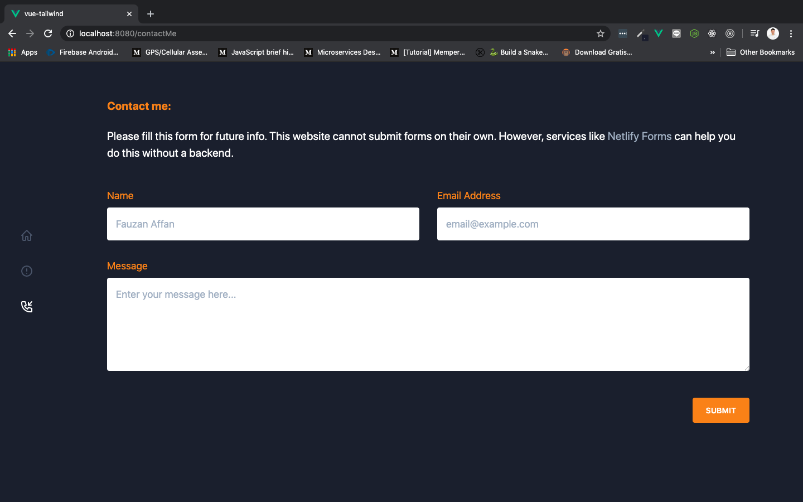

# Contact Me Component

Pada component contact me, kita akan membuat sedikit deskripsi singkat tentang contact me, dan meminta user untuk memasukkan **nama, email, dan message** yang mau mereka sampaikan kepada owner. Kita akan menggunakan form yang berisi element input untuk nama dan email, element textarea untuk message, dan element button yang berisi text submit.

> ***Tips & trick:*** Jika teman-teman ingin mengetahui lebih dalam tentang form di dalam Tailwindcss, silahkan kunjungi [halaman berikut ini](https://tailwindcss.com/components/forms/#app)

Selanjutnya silahkan buka component `ContactMe.vue` di dalam folder `views` dan rubah isinya menjadi seperti berikut:

```html
<template>
  <div class="contact-me container p-16 mx-auto">
    <div class="text-xl pb-4 relative">
      <h2 class="font-bold mb-6 text-orange-500">Contact me:</h2>

      <p class="mb-12">Please fill this form for future info. This website cannot submit forms on their own. However, services like <a class="text-gray-500 hover:text-white" href="https://www.netlify.com/docs/form-handling">Netlify Forms</a> can help you do this without a backend.</p>

      <div class="text-lg sm:text-lg mb-16">
        <form action="#" class="mb-12">
          <div class="flex flex-wrap mb-6 -mx-4">
              <div class="w-full md:w-1/2 mb-6 md:mb-0 px-4">
                  <label class="block mb-2 text-orange-500" for="name">
                      Name
                  </label>

                  <input type="text" placeholder="Fauzan Affan" class="block w-full rounded mb-2 p-4 text-gray-900" required>
              </div>

              <div class="w-full px-4 md:w-1/2">
                  <label class="block text-orange-500 mb-2" for="email">
                      Email Address
                  </label>

                  <input type="email" placeholder="email@example.com"  class="block w-full rounded mb-2 p-4 text-gray-900" required>
              </div>
          </div>

          <div class="w-full mb-12">
              <label class="block text-orange-500 mb-2" for="message">
                  Message
              </label>

              <textarea id="message" rows="5" name="message" class="block w-full rounded mb-2 p-4 text-gray-900" placeholder="Enter your message here..." required></textarea>
          </div>

          <div class="flex justify-end w-full">
              <input type="submit" value="Submit" class="block bg-orange-500 hover:bg-orange-600 text-white text-sm font-semibold uppercase rounded cursor-pointer px-6 py-3">
          </div>
        </form>
      </div>
    </div>
  </div>
</template>

<script>
export default {
  name: 'contactMe'
}
</script>
```

Save dan lihat di browser, tampilannya akan menjadi seperti di bawah ini:



Perlu diketahui, form ini sifatnya masih template dan **data yang dimasukkan oleh user belum bisa diproses**. Sehingga ketika user sudah mengisikan semua kolom dengan benar dan menekan submit, akan terjadi reload dan datanya hilang.
