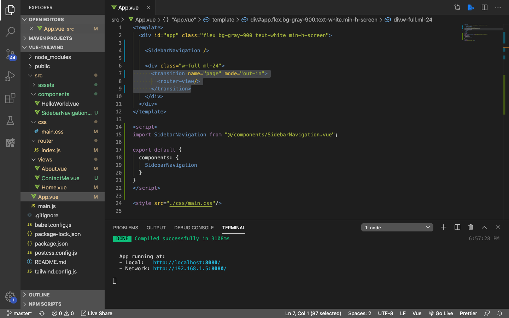
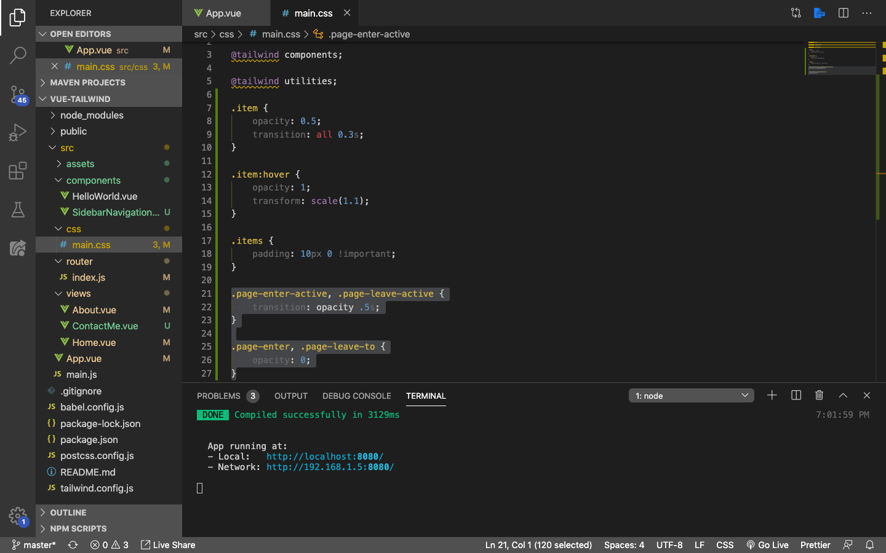

# Adding Vue transition

Biar lebih keren, kita akan coba tambahkan ***transition*** bawaan dari Vue. DI sini kita cukup membalut `router-view` dengan component yang namanya `<transition>` kemudian kita setting sedikit bagian CSS-nya. Walupun jadinya tidak terlalu *smooth*, tetapi Vue transition ini sudah cukup untuk memberikan effect fade in dan fade out setiap kali component berganti.

> ***Tips & trick:*** Jika teman-teman belum begitu familiar dengan Vue transition, silahkan kunjungi [halaman berikut ini](https://vuejs.org/v2/guide/transitions.html#Transitioning-Between-Components)

Silahkan buka root component kita, yaitu `App.vue`. Dan rubah isinya menjadi seprti berikut:

```html
<template>
  <div id="app" class="flex bg-gray-900 text-white min-h-screen">

    <SidebarNavigation />

    <div class="w-full ml-24">
      <transition name="page">
        <router-view/>
      </transition>
    </div>
  </div>
</template>

<script>
import SidebarNavigation from "@/components/SidebarNavigation.vue";

export default {
  components: {
    SidebarNavigation
  }
}
</script>

<style src="./css/main.css"/>
```

Perhatikan bagian ini:



* Kita sudah memungkus `<router-view>` dengan `<transition>`. `name` di bagian transition bebas, tetapi **`name` akan berkaitan dengan CSS yang nantinya akan kita buat**. Kita beri nama attribute `name` kita dengan `page`

Selanjutnya buka `main.css` di folder `css`, dan tambahkan ini:

```css
.page-enter-active, .page-leave-active {
    transition: opacity .5s;
}

.page-enter, .page-leave-to {
    opacity: 0;
}
```



Save dan **reload browser**, lalu coba berpindah dari satu page ke page lainnya menggunakan menu navigation. Keren kan? :)

Oya, jika teman-teman ingin melihat semua *source coude*-nya, silahkan kunjungi Github saya di [https://github.com/Fauzan-affan/vue-tailwind.git](https://github.com/Fauzan-affan/vue-tailwind.git)

Sampai jumpa pada chapter berikutnya!!!
