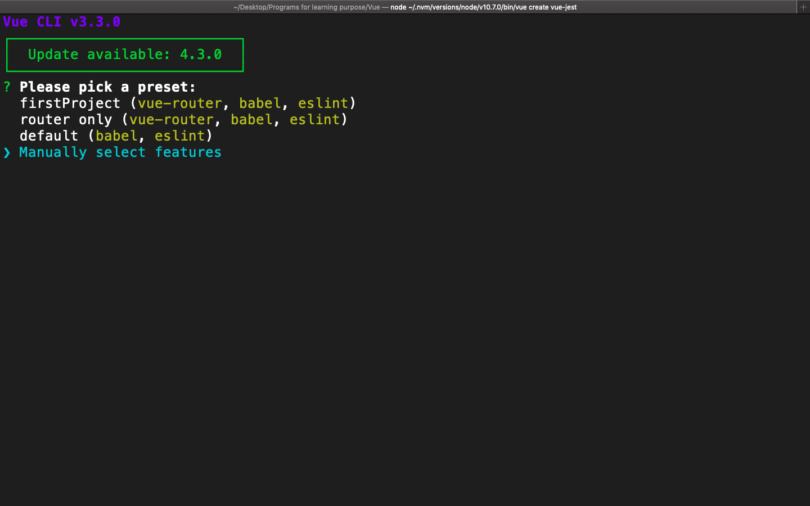
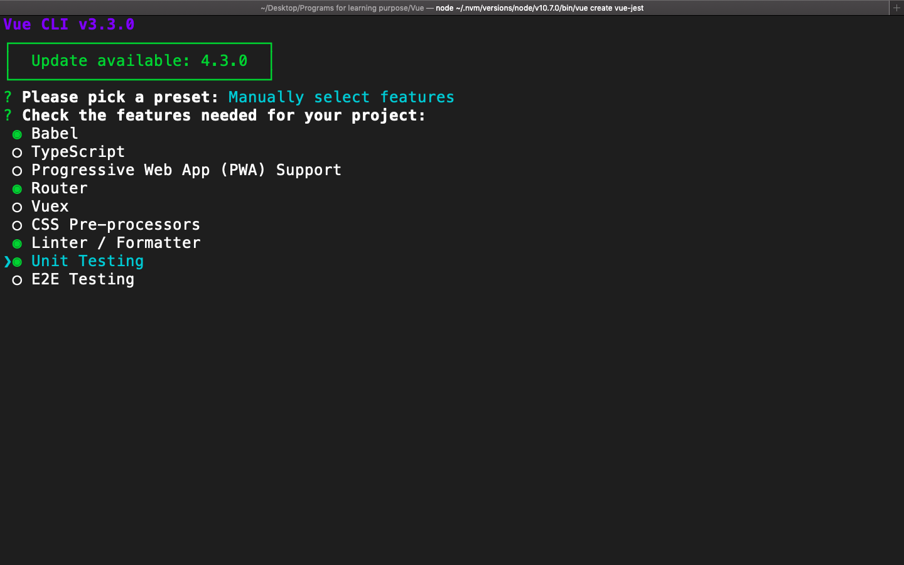
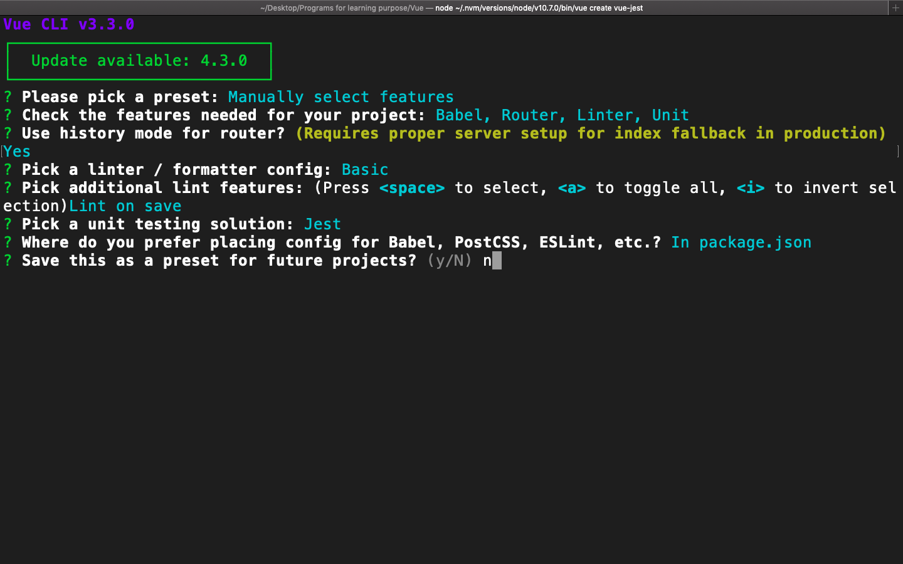
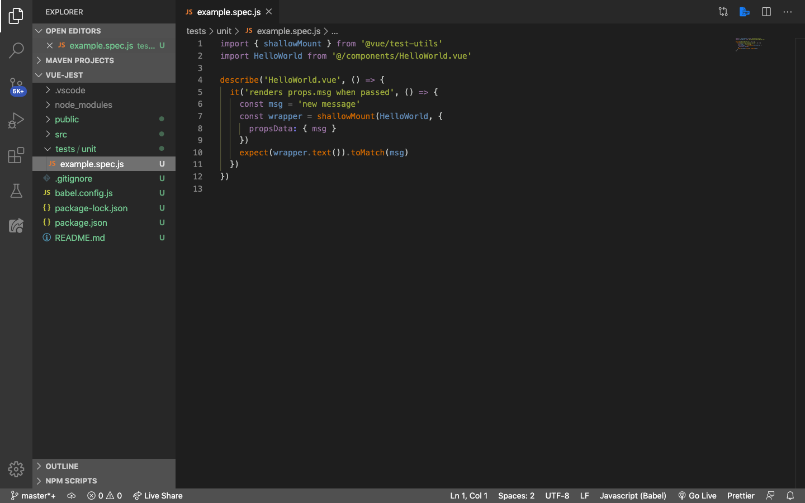
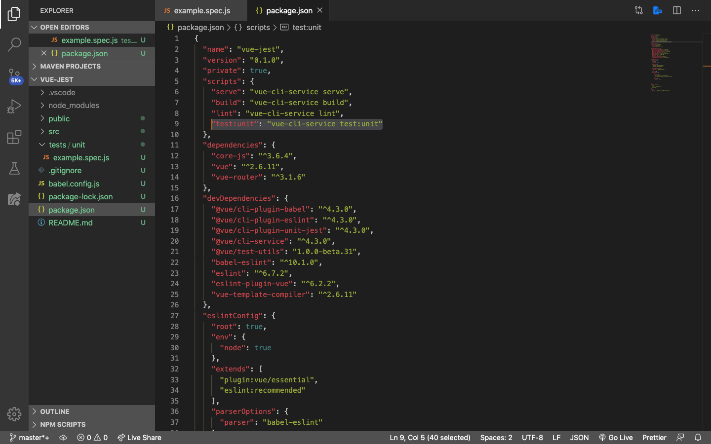
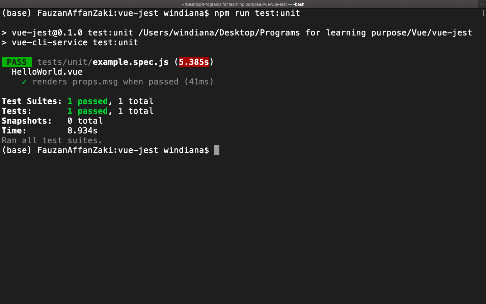

# Instalasi Jest

Di Vue, yang kita testing adalah component-component yang sudah kita buat. Ada banyak sekali yang bisa kita test di dalam component. Dari mulai mengetest apakah DOM berhasil di render, mengetest apakah fungsi berjalan dengan semestinya, mengetest apakah router-link bekerja, dll. Untuk mengetahui lebih lengkap tentang testing di Vue, silahkan teman-teman baca panduan testing di situs resminya, yaitu [https://vue-test-utils.vuejs.org/](https://vue-test-utils.vuejs.org/). Sebelum testing kita harus punya dulu project Vue yang akan kita buat menggunakan CLI seperti berikut ini.

## Jest: Vue CLI

Setiap kali kita mau membuat project Vue baru menggunakan CLI. Pastikan tambahkan juga testing yang mau digunakan. Nah, kita akan coba membuat satu project Vue baru dengan nama `vue-jest` menggunakan Vue CLI yang akan kita tambahkan testing juga di dalam project tersebut. Langkah-langkahnya sebagai berikut:

1. Buka terminal, buat project Vue baru menggunakan `vue create vue-jest`, lalu pilih `manually select features`

    

2. Tandai `router` dan `Unit Testing`

    

3. Selanjutnya ikuti langkah dibawah ini hingga project Vue dibuat:

    * ***Use history mode for router?*** Yes
    * **Pick a linter / formatter config:** Basic (yang paling atas)
    * **Pick additional lint features: (Press `<space>` to select, `<a>` to toggle all, `<i>` to invert selection)** Lint on Save
    * **Pick a unit testing solution:** Jest
    * **Where do you prefer placing config for Babel, PostCSS, ESLint, etc.?** in Package.json
    * **Save this as a preset for future projects? (y/N)** N

        

4. Masuk ke project Vue menggunakan `cd vue-jest/` lalu buka di vscode. Buka folder test > unit dan di dalamnya akan terdapat satu file testing dengan nama `example.spec.js`.

    

5. Buka `package.json`

    

6. Untuk menjalankan testing-testing yang ada pada folder tests > unit, kita tinggal mengetikkan di terminal `npm run test:unit`. Jest akan membaca semua nama file yang mengandung `spec` atau `test` di tengahnya. Karena kita baru punya file `example.spec.js`, maka file tersebut yang akan dijalankan. Hasilnya `PASS` seperti di bawah ini:

    

    > ***Tips & trick:*** Jika kita tidak ingin selalu me-*running* `npm run test:unit` untuk mengetahui hasil test case kita, kita bisa mengotomatisasi `npm run test:unit` dengan menambahkan `--watch` di bagian belakang dari `script "test:unit"` menjadi `"test:unit": "vue-cli-service test:unit --watch"`. Dengan cara ini kita cukup melakukan `npm run test:unit` sekali saja.
