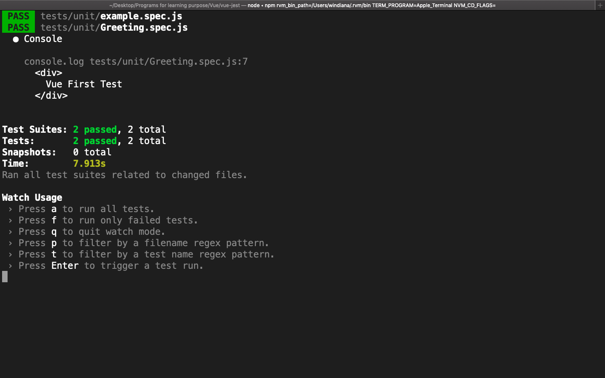
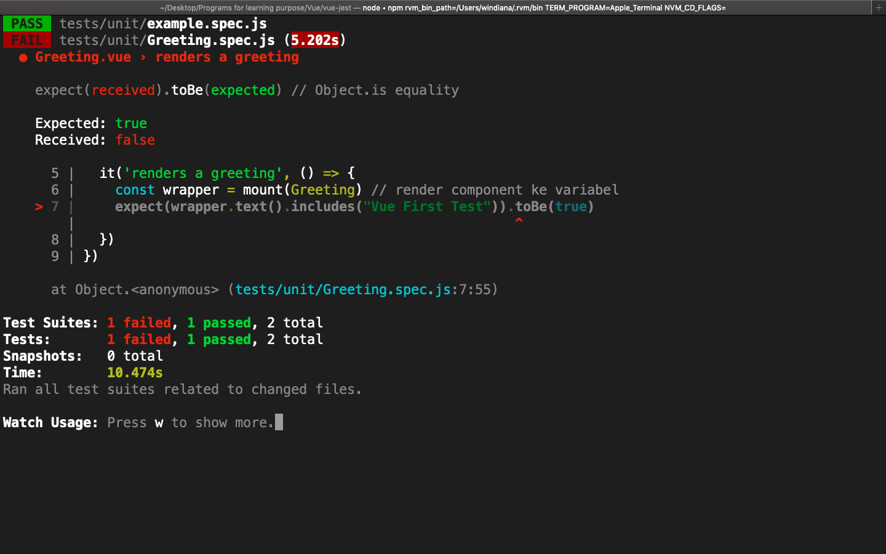

# Vue First Testing

Buka folder components dan buatlah satu component baru dengan nama `Greeting.vue` dan isikan:

```html
<template>
  <div>
    {{ greeting }}
  </div>
</template>

<script>
export default {
  name: "Greeting",

  data() {
    return {
      greeting: "Vue First Test"
    }
  }
}
</script>
```

## Writing The Test

Component `Greeting.vue` hanya mempunyai satu tugas, yaitu merender data `greeting` dengan value `Vue First Test` di dalamnya. Skenario test yang akan kita lakukan pada `Greeting.vue` adalah:

1. Bungkus component dengan menggunakan `mount`, atau bahasa kerennya render component menggunkan `mount`
2. Memastikan component `greeting` berisi teks `Vue First Test`

> ***Tips & trick:*** Rendering component bisa menggunakan `mount` ataupun `shallowMount`. Jika kita menggunakan `shallowMount`, semua component lain yang ada di dalam component, akan berubah menjadi `<vuecomponent-stub />`. Ini adalah alias buat menggantikan component lain di dalamnya. Gunanya untuk mempercepat proses eksekusi testing, supaya hanya membaca element yang mau ditesting saja, dan tidak membaca satu persatu seluruh element yang ada. Well, ini mempercepat waktu eksekusi testing yang dibuat

Selanjutnya buat satu file testing baru di dalam folder test > unit dengan nama `Greeting.spec.js`, `Greeting` pada nama test file, kita bisa sesuaikan dengan nama component yang mau kita test. Isikan sebagai berikut:

```js
import { mount } from '@vue/test-utils' // import fungsi mount dari Jest
import Greeting from '@/components/Greeting.vue' // import component yang mau ditest

describe('Greeting.vue', () => {
  it('renders a greeting', () => {

  })
})
```

Kita akan sering menggunakan `describe` dan `it` pada saat testing, ke duanya merupakan bawaan dari Jest.

* `sescribe` umumnya digunakan untuk mendefinisikan component mana yang akan kita test. Pada kasus kali ini kita ingin mengetest component `Greeting.vue`
* `it` umumnya merepresentasikan deskripsi singkat untuk satu tanggung jawab yang harus dipenuhi oleh satu subjek tes (semua yang dibungkus `it`). Jika kita menambahkan lebih dari satu fitur Vue (props, render DOM, computed, dll) yang mau kita test, maka harus ada lebih dari satu `it` untuk mewakili masing-masing fitur

Selanjutnya, kita harus merender component menggunakan `mount`:

```js
const wrapper = mount(Greeting) // render component ke variabel

console.log(wrapper.html()) // print output
```

* Biasanya component yang dirender, dimasukkan ke dalam variabel dengan nama `wrapper`
* Kita juga bisa *print* outputnya, untuk memastikan semuanya berjalan sesuai dengan yang kita inginkan

Isi dari `Greeting.spec.js` menjadi seperti berikut:

```js
import { mount } from '@vue/test-utils' // import fungsi mount dari Jest
import Greeting from '@/components/Greeting.vue' // import component yang mau ditest

describe('Greeting.vue', () => {
  it('renders a greeting', () => {
    const wrapper = mount(Greeting) // render component ke variabel
    console.log(wrapper.html()) // print output
  })
})
```

Jika sudah, jalankan test menggunakan `npm run test:unit`, atau jika kita sudah menambahkan `--watch` pada package.json `test:unit`, test akan otomatis diproses. hasilnya seperti berikut:



Testnya `PASS`! Testnya `PASS` karena tidak ada yang salah pada testing sintaknya. Dan test di atas akan selalu bernilai `PASS`. Tapi tidak cukup sampai di sini saja untuk melakukan testing. Kita perlu menguji bagaimana jika data `greeting` isinya berubah? *Okay, lets check the next section to do it!*

## Making Assertions

Assertions atau pernyataan dalam bahasa indonesia, adalah sebuah cara (yang diimplementasikan dengan sintak-sintak) yang digunakan untuk memastikan ***behavior*** atau tingkah laku dari project Vue berjalan sesuai dengan yang diinginkan. Sintaknysa kurang lebih seperti berikut:

```js
expect(result).to [matcher] (actual)
```

Sintak di atas hanya contoh saja, maksudnya seperti ini:

* `expect` adalah fungsi bawaan Jest, yang isinya adalah *result*. *Result* di sini bisa kita ganti dengan apapun yang mau kita coba test
* `to` masih ada lanjutannya yang kita sebut *matcher*. *Matcher* bisa jadi `toBe()`, `toHaveBeenCalled()`, dan masih banyak lagi, untuk sintak yang lebih banyak silahkan kunjungi [Dokumentasi Jest](https://jestjs.io/docs/en/expect)
* ***actual*** biasanya menjadi parameter di *matcher*. *Actual* berisi hasil yang diharapkan dari `expect`

Contoh, misalkan kita mau memastikan 1 adalah 1:

```js
expect(1).toBe(1)
```

Nah, jika kita ingin memastikan isi dari data `greeting` adalah `Vue First Test`, caranya sebagai berikut:

```js
expect(wrapper.html().includes("Vue First Test")).toBe(true)
```

* `wrapper` berisi component `Greeting.vue` yang kita render
* `html()` mengembalikan string markup HTML yang ada di dalam `wrapper` saat ini. bisa juga menggunakan `text()`
* `includes()` adalah fungsi Javascript untuk memeriksa ada atau tidak `Vue First Test` di dalam `wrapper`
* `toBe(true)` adalah matcher yang menghasilkan nilai `true`, artinya kita ingin isi dari `wrapper` mengandung `Vue First Test`

Ganti `console.log()` di dalam `Greeting.spec.js` sebelumnya menjadi matcher seperti berikut:

```js
import { mount } from '@vue/test-utils' // import fungsi mount dari Jest
import Greeting from '@/components/Greeting.vue' // import component yang mau ditest

describe('Greeting.vue', () => {
  it('renders a greeting', () => {
    const wrapper = mount(Greeting) // render component ke variabel
    expect(wrapper.text().includes("Vue First Test")).toBe(true)
  })
})
```

Hasilnya masih tetap `PASS`? ***Good***. Tetapi kita juga perlu melihat test yang hasilnya `fail`, lalu `PASS` untuk melatih kemampuan kita mengatasi error. Ganti isi data `greeting` di component `Greeting.vue` menjadi seperti berikut:

```html
<template>
  <div>
    {{ greeting }}
  </div>
</template>

<script>
export default {
  name: "Greeting",

  data() {
    return {
      greeting: "Vue not First Test :("
    }
  }
}
</script>
```

Hasil testingnya tentu akan gagal menjadi seperti ini:



***Jest gives us a good feedback.*** Kita bisa melihat `Expected: true`, tetapi `Received: false` di bagian `toBe()`. Ini menandakan ada yang salah dengan hasil yang diharapkan, yaitu `true`. Silahkan perbaiki component `Greeting.vue` dan pastikan hasilnya `PASS` kembali :)
