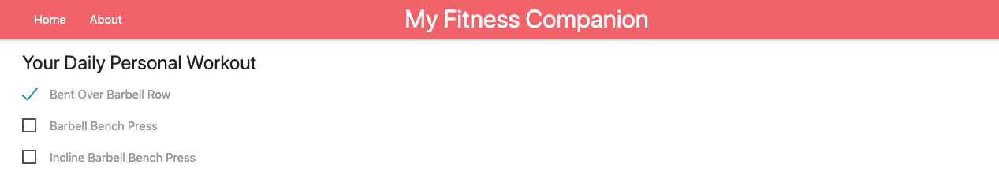
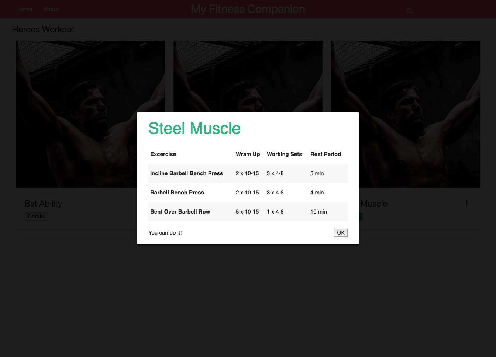
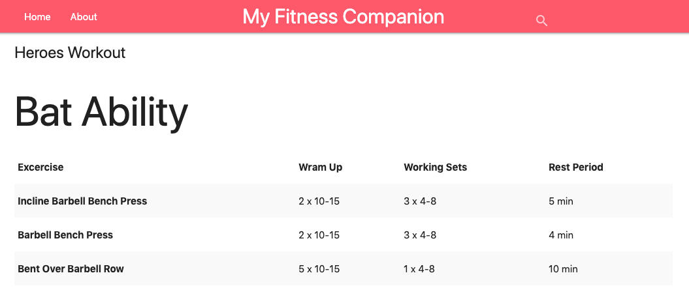
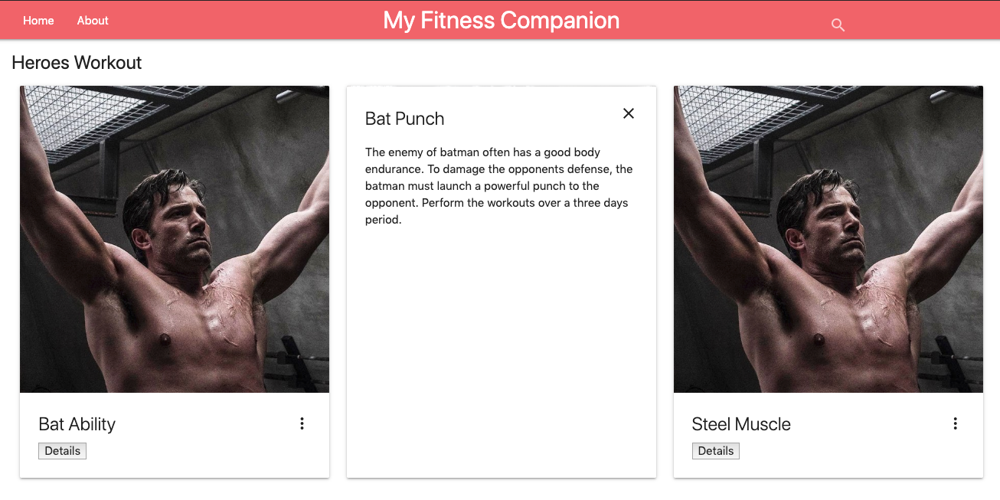
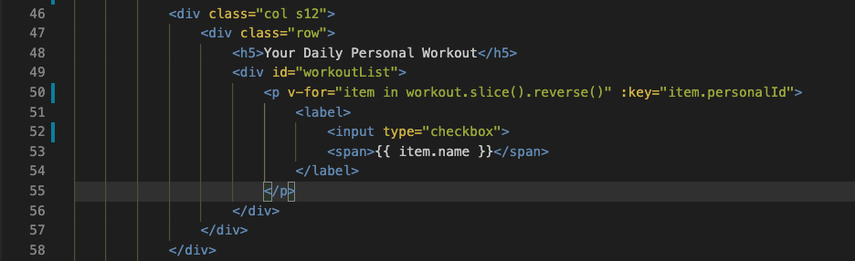
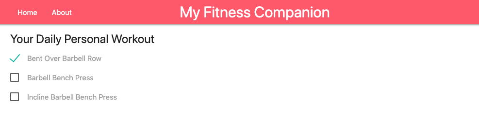

# Final Project: Fitnes Companion Website

## Final Project Overview

Pada Final Project: Fitnes Companion Website.

1. Kamu akan membuat sebuah **tampilan menggunakan Vue yang dapat mengatur workout harian**

2. **Menampilkan detail workout berdasarkan card yang tersedia**

3. Semua data yang diambil menggunakan **JSON yang sudah disediakan (static data)**

4. Final Project ini menitikberatkan **penggunaan Vue untuk memaintain aspek frontend** nya

## Starting from Scratch

**Kerjakan semuanya dari 0, kamu bisa mulai dengan membuat project vue menggunakan vue CLI (recomended), serta menambahkan CSS dan JavaScript yang dibutuhkan.**

Kamu juga bisa menggunakan CSS framework seperti [Tailwindcss](https://vue-tailwind.com/) untuk mempercantik tampilannya.

## App Functionality

Dalam aplikasi ini, main page akan:

1. Menampilkan 2 card atau button untuk menuju ke Personal Workout dan Heroes Workout.

   Contohnya bisa dilihat seperti gambar di bawah ini:

   

    * **Personal Workout** adalah list workout yang diperuntukkan untuk user personal.

    * Sedangkan **Heroes Workout** adalah rangkaian workout yang tersedia dengan nama-nama superhero \(seperti Batman Workout yang berisikan: 20 squats, 40 punches, etc\).

2. Saat user mengakses **Personal Workout**, user mendapatkan tampilan seperti berikut:

    

    * User mendapatkan **daftar personal workout** yang datanya diambil dari static JSON dan **checkbox pada setiap workout yang dapat di-checklist ketika workout sudah dikerjakan**.

3. Ketika user mengakses **Heroes Workout (Hero Workout)**, user mendapatkan tampilan seperti berikut yang datanya diambil dari static JSON:

    

    * **Melihat daftar workouts yang sudah diatur (Heroes)**.

    * Setiap workout **berisikan gambar, judul workout, dan button "details"**.

    * Workout boleh berbentuk **modal** atau **page** **(pilih salah satu)**

    Ketika button details diklik, dan memunculkan **modal:**

    

    Ketika button details diklik, dan memunculkan **page:**

    

4. Halaman Heroes Workout juga memiliki **search form**, di mana search form ini berguna untuk mencari Heroes Workout tertentu, seperti gambar di bawah ini:

    

    * Search form tersebut memiliki **text input yang dapat digunakan untuk langsung mem-filter workout**. Saat value yang ada pada text input berubah, workout yang cocok dengan inputan tersebut akan muncul.

## User Story

*User story* adalah deskripsi yang menjelaskan fungsionalitas aplikasi. Untuk melengkapi proyek ini, kamu harus membangun sebuah aplikasi yang meliputi semua fungsionalitas dari *user story* di bawah ini:

✨ **Vue User Story**\
**User Story \# 1** - My Fitness Companion setidaknya memiliki sebuah komponen `Header.vue`, komponen `Body.vue`, komponen `PersonalWorkout.vue`, komponen `HeroWorkout.vue`, dan vue-router yang bertugas untuk mengatur komponen mana yang akan ditampilkan ketika suatu button diklik & menampilkan detail Heroes Workout mana sesuai card yang diklik.

**User Story \# 2** - Komponen `Header.vue` tersebut harus berada di bagian atas website. Komponen `Header.vue` juga berisi menu home dan about.

**User Story \# 3** - Komponen `Body.vue` **harus memiliki 2 card** yang masing-masing memiliki `<button>` untuk menuju ke Personal atau Hero Workout. **Button ini harus memiliki route yang dibuat menggunakan vue-router, untuk bernavigasi ke komponen `PersonalWorkout.vue` (jika personal yang diklik) maupun `HeroWorkout.vue` (jika heroes yang diklik).**

Contoh tampilan gabungan komponen `Header.vue` dan `Body.vue` nya adalah sebagai berikut:


**User Story \# 4** - Jika kamu ingin membuat isi dari menu about juga. Kamu bisa membuat komponen `About.vue`, komponen ini bisa berisi keterangan tentang website yang dibuat. **Tapi ini tidak wajib**.

**User Story \# 5** - Di dalam komponen `HeroWorkout.vue` buatlah *container* (bisa berupa elemen `<div>` yang diberikan class atau container bawaan dari css framework yang digunakan) untuk menampung semua card yang berisi heroes workout. Selanjutnya:

1. **Container nantinya akan digunakan untuk menampung semua card Heroes Workout** yang terdapat pada JSON. Contoh container yang sudah diisikan semua card tampilannya akan seperti ini:

    

2. Kamu harus menggunakan data JSON Heroes Workout yang telah disediakan. Kemudian tampilkan seluruh isinya di container yang telah dibuat, menggunakan perulangan `v-for`. Sehingga semua card akan otomatis tampil sebanyak data workout yang ada di dalam JSON. Contoh card yang ditembak ke dalam **container > row > `class="col s4"`** menggunakan `v-for` dapat dilihat pada gambar di bawah ini:

    

    > Pada contoh di atas `v-for` menampilkan semua item yang tersimpan di dalam `workout` data. Pastikan di dalam data Vue sudah terdapat property dengan nama workout seperti `data: {workout: [],}` yang sudah diisikan data dari JSON. Data `workout` di sini berada di component `HeroWorkout.vue`.

3. **Setiap data Heroes Workout ditampilkan dengan card** yang berisikan:

    * Nama workout
    * Deskripsi workout (muncul jika hamburger button diclick)
    * Button **Details**

    Contoh tampilan gabungan komponen `Header.vue` dan `HeroWorkout.vue` (jika data hero workoutnya hanya ada 3, dengan title: Bat Ability, Bat Punch, dan Steel Muscle) adalah sebagai berikut:

    

    Jika hamburger button **Bat Punch** workout diklik, memunculkan detail workout seperti ini:

    

    > Hamburger button untuk menampilkan detail sifatnya **opsional**, boleh juga ditampilkan langsung di cardnya masing-masing.

4. Saat mengklik button **"Details"**, My Fitness Companion menampilkan ***popup modal box*** atau **page baru** yang berisikan **Workout Title**, **deskripsi singkat workout**, dan **exercise**, yang disaring menggunakan `methods` di Vue.

    > ***Tips and trick:*** Kamu harus menggunakan `vue-router` untuk menampilkan detail dari masing-masng card. Untuk melihat *step by step* penggunaannya silahkan tonton [video ini](https://www.youtube.com/watch?v=nnVVOe7qdeQ) atau di Platform bagian Vue Router.

    Jika ingin menggunakan `<router-link>` untuk membungkus button details dan mengoper id berdasarkan details yang diklik, kamu bisa melakukannya dengan menambahkan *binding* pada `to` menjadi `:to`, contohnya sebagai berikut:

    ```html
    <div class="container" v-for="hero in filteredHeroes" :key="hero.heroId">
        <div class="card">
            <div class="card-image">
                
            </div>
            <div class="card-content">
                <span>{{hero.name}}</span>
                <span>{{hero.detail}}</span>
            </div>
            <button>
                <router-link :to="{name: 'HeroDetail', params: {id: hero.heroId}}">
                    Details
                </router-link>
            </button>
        </div>
    </div>
    ```

    Keterangan:

    * `filteredHeroes` adalah ***computed function*** yang menyaring hero, berdasarkan apa yang diketikkan user pada search box
    * `name` di dalam `:to` adalah **component tujuan** yang nantinya menerima `params`
    * `params` di dalam `:to` adalah parameter yang mau dioper (dalam hal ini adalah `id`)

    * Pada component tujuan (dalam hal ini `HeroDetail.vue`) kita bisa menangkap `id` yang dioper dengan menggunakan `this.$route.params.id` di dalam methods yang kita buat

    Contoh tampilan salah satu **modal** dari card ketika user mengklik details:

    

    Contoh tampilan salah satu **page** dari card ketika user mengklik details:

    

    JSON atau data yang digunakan untuk `HeroWorkout.vue` component adalah sebagai berikut:

    ```js
    Heroes: [
        {
            "heroId": 1,
            "name": "Bat Ability",
            "detail": "Batman often performs the action at night. Because of that, batman must have additional strength at night. Perform the workouts over a seven days period.",
            "training":
            [{
                "exerciseName": "Incline Barbell Bench Press",
                "wramUp": "2 x 10-15",
                "workingSet": "3 x 4-8",
                "restPeriod": "5 min"
            },
            {
                "exerciseName": "Barbell Bench Press",
                "wramUp": "2 x 10-15",
                "workingSet": "3 x 4-8",
                "restPeriod": "4 min"
            },
            {
                "exerciseName": "Bent Over Barbell Row",
                "wramUp": "5 x 10-15",
                "workingSet": "1 x 4-8",
                "restPeriod": "10 min"
            }]
        },
        {
            "heroId": 2,
            "name": "Bat Punch",
            "detail": "The enemy of batman often has a good body endurance. To damage the opponents defense, the batman must launch a powerful punch to the opponent. Perform the workouts over a three days period.",
            "training":
            [{
                "exerciseName": "Incline Barbell Bench Press",
                "wramUp": "2 x 10-15",
                "workingSet": "3 x 4-8",
                "restPeriod": "5 min"
            },
            {
                "exerciseName": "Barbell Bench Press",
                "wramUp": "2 x 10-15",
                "workingSet": "3 x 4-8",
                "restPeriod": "4 min"
            },
            {
                "exerciseName": "Bent Over Barbell Row",
                "wramUp": "5 x 10-15",
                "workingSet": "1 x 4-8",
                "restPeriod": "10 min"
            }]
        },
        {
            "heroId": 3,
            "name": "Steel Muscle",
            "detail": "Get ready to ramp up the intensity and really blow out the muscle.",
            "training":
            [{
                "exerciseName": "Incline Barbell Bench Press",
                "wramUp": "2 x 10-15",
                "workingSet": "3 x 4-8",
                "restPeriod": "5 min"
            },
            {
                "exerciseName": "Barbell Bench Press",
                "wramUp": "2 x 10-15",
                "workingSet": "3 x 4-8",
                "restPeriod": "4 min"
            },
            {
                "exerciseName": "Bent Over Barbell Row",
                "wramUp": "5 x 10-15",
                "workingSet": "1 x 4-8",
                "restPeriod": "10 min"
            }]
        }
    ]
    ```

    > Jangan lupa buatlah data di `HeroWorkout.vue` component untuk menampung semua JSON di atas.

5. **Menampilkan workout card yang sesuai, pada saat user mengetikkan sesuatu pada search form** di bagian pojok kanan atas dari komponen `HeroWorkout.vue`.

    > ***Tips and trick:*** Ada banyak sekali cara untuk membuat search. Biasanya yang paling umum search menggunakan `filter` method, dan membandingkan semua data dengan apa yang diketikkan user bisa menggunakan `indexOf(this.namaAttributPenampungValueSearchbox) != -1`, `includes(this.namaAttributPenampungValueSearchbox)`, `match(this.namaAttributPenampungValueSearchbox)`, dll. Untuk melihat *step by step* pembuatannya silahkan tonton [video ini](https://www.youtube.com/watch?v=nnVVOe7qdeQ) atau mengunjungi [codepen.io ini](https://codepen.io/AndrewThian/pen/QdeOVa?__cf_chl_captcha_tk__=342dc8c04833f128793b928f273ab69ad27bff8e-1585028966-0-AfsaQrlRhU9VNT8-7Qp405UdV_pbGxmmtG4HK6EEtP9U2xG8VwKVExAezc_QiqX-Z_3F8pmRaBF78ilZr82dFCVIbwoJhueivpjjelAK0Emd7S5RZk85AGDwcUh3ly7vbAfceAVWjLdaohhHsBJA4YtI_P3pj49q4iL3xaDjvQt6gTJ4xgchx41EkEcTkj9qGJgyggQGzbUhQj4JbU4KAazoDyptYZLPf_AVzIpCdyC9aOb2twsInaHxkop67qYL_y7fq52SYJ8jaygvfCSGIfbcF4T9Y6hzmnPFoVgt6Y6M14Tv3CAX8EfziJfs6NIgMqWQzPzuQw5Sc_kPhyMYGz7Ub2CW7zw8-lZTfedEHhZa80KLOym-SKrzp3sT7CAl1cjSejEwyjc5kudWWMPnejL8oFs7EO74KExvjY07yEGFspjnAWNm7PsSQ1cTn129Xw).

**User Story \# 6** - Di dalam komponen `PersonalWorkout.vue` buatlah *container* (bisa berupa elemen `<div>` yang diberikan class atau container bawaan dari css framework yang digunakan) untuk menampung semua list yang berisi personal workout. Selanjutnya:

1. JSON atau data yang digunakan untuk `PersonalWorkout.vue` component adalah sebagai berikut:

    ```js
    Personals: [
        {
            "personalId": 1,
            "name": "Incline Barbell Bench Press"
        },
        {
            "personalId": 2,
            "name": "Barbell Bench Press"
        },
        {
            "personalId": 3,
            "name": "Bent Over Barbell Row"
        }
    ]
    ```

    > Jangan lupa buatlah data di `PersonalWorkout.vue` component untuk menampung semua JSON di atas.

2. Kamu harus menggunakan data JSON Heroes Workout yang telah disediakan. Kemudian tampilkan seluruh isinya di container yang telah dibuat, menggunakan perulangan `v-for`. Sehingga semua list akan otomatis tampil sebanyak data workout yang ada di dalam JSON. Contoh list yang ditembak ke dalam `div` dengan `id="workoutlist"` sebagai container, menggunakan `v-for` dapat dilihat pada gambar di bawah ini:

    

    > Pada contoh di atas `v-for` menampilkan semua item yang tersimpan di dalam `workout` data. Pastikan di dalam data Vue sudah terdapat property dengan nama workout seperti `data: {workout: [],}` yang sudah diisikan data dari JSON. Data `workout` di sini berada di component `PersonalWorkout.vue`.

    * Fungsi `.slice().reverse()` digunakan untuk membalik urutan workout dari *ascending* menjadi *descending*. Artinya, workout ditampilkan dengan urutan terbalik, dari urutan terbawah hingga teratas.

    Di bawah ini adalah contoh tampilan dari gabungan komponen `Header.vue` dan `PersonalWorkout.vue`:

    

3. Data pada list yang sudah ada, harus memiliki `key` yang sesuai dengan `Id` di JSON, yaitu `personalId`.

4. Workout baru yang ditambahkan harus diposisikan di atas workout lama, dengan increment ID baru berdasarkan ID terakhir. Ini bisa dilakukan dengan mengatur urutan ID berdasarkan ID terakhir (descanding). Salah satunya bisa menggunakan fungsi `.slice().reverse()`.

5. Setiap workout yang ditampilkan di workout list **harus memiliki checkbox**.

## Final Project Submission

Sebelum mengumpulkan Final Project ini ada beberapa hal yang perlu diperhatikan, yaitu:

* Saya yakin semua user story yang ada telah sesuai dan Final Project saya akan lolos untuk di-review \(Jika tidak, saya akan berdiskusi dengan mentor via live chat sebelum men-submit.\)
* Final Project dibuat dengan benar tanpa error.
* Semua kebutuhan fungsional terpenuhi dan Final Project saya mampu berjalan sesuai dengan kebutuhan.

Jika semua hal di atas terpenuhi, Final Project kamu sudah bisa **di-submit ke: Platform**

### Project Rubric

| Application Setup |  |
| :--- | :--- |
| CRITERIA | SPECIFICATIONS |
| Apakah aplikasi ini mudah diatur? | Aplikasi ini dibuat dengan CSS dan JS terpisah di setiap folder. Index.html adalah entry point menuju website. Lebih baik lagi jika website ini berbebntuk SPA |
| Apakah aplikasi memiliki README dengan panduan instalasi dan penggunaan yang jelas? | README yang ter-update sudah termasuk pada aplikasi ini, di mana README ini menjelaskan proyek, serta memberikan instruksi untuk me-maintain dan memodifikasi proyek. |
| Apakah aplikasi menggunakan vue-router? | Vue-router digunakan untuk menampilkan detail dari card yang ada di Heroes Workout. |
| Apakah aplikasi menerapkan konsep SPA (Single Page Aplication) pada vue? | SPA menggunakan component base dalam pembangunan user interfacenya, di mana semua component akan ditampilkan ke dalam single file yaitu index.html, sesuai kebutuhan. |

| Personal Workout Page |  |
| :--- | :--- |
| CRITERIA | SPECIFICATIONS |
| Apakah halaman Personal Workout menampilkan checkbox dengan semua data Personal Workout nya? | Halaman Personal Workout menampilkan list semua data Personal Workout, di mana list tersebut berbentuk checkbox yang isinya semua data Personal Workout, dan bisa diklik. |

| Heroes Workout Page |  |
| :--- | :--- |
| CRITERIA | SPECIFICATIONS |
| Apakah halaman Heroes menunjukkan daftar Heroes Workout? | The Heroes Page menunjukkan daftar semua workout. Setiap workout menunjukkan konten yang benar, title, dan button detail. |
| Apakah Heroes Page memiliki search bar? | Ya, Heroes Work harus mempunyai search bar. |

| Code Functionality |  |
| :--- | :--- |
| CRITERIA | SPECIFICATIONS |
| Apakah search berfungsi? | Fungsi search pada search bar bekerja saat user mengetik karakter apapun pada search bar. Di saat yang sama, workout yang muncul akan ter-filter sesuai dengan input tadi. |
| Apakah button detail pada Heroes Workout bekerja? | Button tersebut akan bekerja ketika ada interaksi yang menampilkan modal ataupun page baru, di mana modal dan page tersebut berisikan detail dari Heroes Workout. |
| Apakah halaman navigasi bekerja? | User dapat bernavigasi dari main page ke Personal ataupun Heroes Workout tanpa halangan. Begitu juga sebaliknya. |
| Apakah kode yang ada berjalan tanpa error? | Ya, kode yang ada dapat berjalan tanpa error. Tidak ada peringatan yang menunjukkan tanda error, karena daftar yang ada pada dokumentasi sudah termasuk best practice. Semua kode bersifat fungsional dan terformat dengan baik. |
